---

### How to Avoid Dangling Pointers

**Principle:**
A dangling pointer is a pointer that references memory that has been freed or is otherwise invalid. Its dangers cannot be underestimated—in C++, dangling pointers are one of the primary causes of program crashes, data corruption, and security vulnerabilities. Common scenarios that produce dangling pointers include: pointers not set to `nullptr` after `delete`, returning addresses of local stack variables, pointers not updated after memory migration, etc. Since pointers only store addresses without the ability to sense memory validity, accessing a dangling pointer leads to undefined behavior.

Core strategies to prevent dangling pointers: First, initialize pointers to `nullptr` immediately upon declaration to establish a clear "empty" state. Second, prefer using smart pointers (`std::unique_ptr`, `std::shared_ptr`) for dynamic memory management—they automatically release resources through RAII. Third, immediately set pointers to `nullptr` after deleting objects, making subsequent dereferences predictably crash rather than access garbage data. Fourth, strictly prohibit returning addresses of local stack variables. Fifth, use AddressSanitizer (ASan) and similar tools during development to detect memory issues.

Best practice in modern C++ is to replace raw pointers with **value semantics** and **smart pointers**, making memory ownership explicit and fundamentally eliminating dangling pointer problems.

**PlantUML Diagram:**

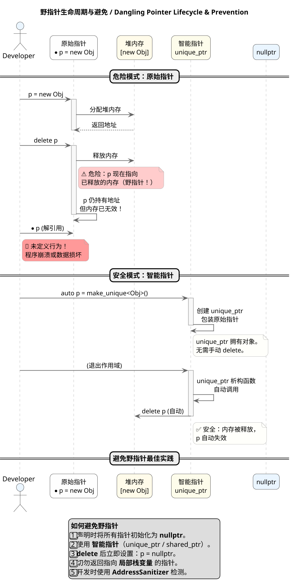

---

### Difference Between malloc/free and new/delete

**Principle:**
In C++, `malloc`/`free` and `new`/`delete` represent two fundamentally different memory management paradigms. `malloc` is a C standard library function that only allocates raw bytes of a specified size without involving object construction; while `new` is a C++ expression that not only allocates memory but also calls the constructor to complete object initialization. Similarly, `delete` calls the destructor before releasing memory, while `free` only returns the raw memory block. This essential difference causes their behaviors in object-oriented programming to be completely different.

From technical details: `malloc(size)` returns `void*`, requiring manual byte calculation and being type-unsafe; `new Type` automatically calculates size and returns a typed pointer (`Type*`), being type-safe. If you construct C++ objects with `malloc`, constructors are not called and objects remain uninitialized. Upon allocation failure, `malloc` returns `nullptr`, while `new` throws `std::bad_alloc` exception by default (can be changed via `nothrow`). Additionally, `new` can be overloaded to implement custom memory allocation strategies, while `malloc`/`free` cannot be replaced.

Core principle: **Never mix C and C++ memory management APIs**. C++ objects use `new`/`delete`, C-style memory uses `malloc`/`free`. Modern C++ prefers smart pointers and containers to completely avoid raw memory operations.

**PlantUML Diagram:**

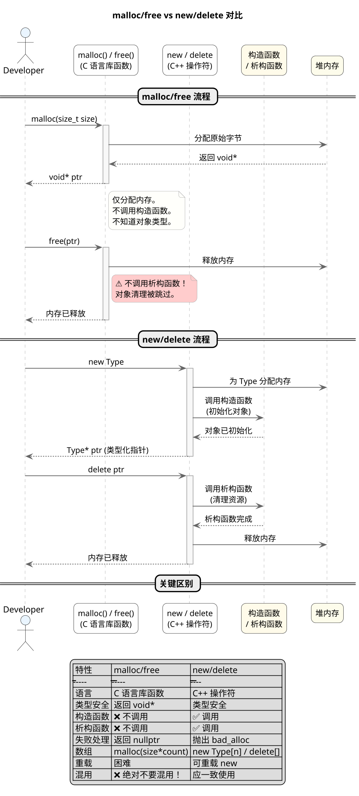

---

### extern Keyword的作用

**Principle:**
The `extern` keyword in C/C++ is used to declare external linkage and modify linkage behavior. It does not allocate storage space itself but tells the compiler that this variable or function exists elsewhere. There are three main application scenarios for `extern`: First, declaring global variables or functions to share them across multiple source files; Second, restoring external linkage for `const` global variables (otherwise `const` variables have internal linkage by default); Third, declaring functions written in other languages (such as C functions) in C++ or functions to be called by other languages.

When calling C language functions from C++ files, since C++ supports function overloading while C does not, their symbol naming rules differ. At this point, `extern "C"` needs to be used to tell the compiler to handle function names in C style, avoiding linking errors. Conversely, if you want C++ functions to be called by C code, you also need to declare them with `extern "C"` on the C++ side. The `extern` keyword enables programs to establish correct symbol reference relationships between compilation units, forming the foundation for modular programming and mixed-language programming.

**PlantUML Diagram:**

```plantuml
@startuml
' =================== 全局样式 ===================
skinparam dpi 160
skinparam shadowing false
skinparam roundcorner 15
skinparam sequenceArrowThickness 1.3
skinparam sequenceMessageAlign center
skinparam ParticipantPadding 15
skinparam BoxPadding 15
skinparam ArrowColor #666
skinparam ArrowThickness 1.2
skinparam SequenceLifeLineBorderColor #AAAAAA
skinparam SequenceLifeLineBackgroundColor #F8F8F8
skinparam NoteBackgroundColor #FFFFFB
skinparam NoteBorderColor #AAA
skinparam ParticipantFontSize 13
skinparam ActorFontSize 14
skinparam SequenceDividerFontSize 14

title **extern 关键字作用 / extern Keyword Mechanism**

package "多文件共享 / Multi-file Sharing" <<Frame>> {
  file "file1.cpp" as F1 #FEFEFE
  file "file2.cpp" as F2 #FEFEFE
  
  F1 -> F2 : extern int global_var;
  note right of F1
    extern 声明：
    "global_var 定义在别处"
    不分配空间，只声明存在
  end note
  
  F1 -> F2 : extern void func();
  note right of F1
    声明函数存在于其他文件
  end note
}

package "extern const 链接性 / extern const Linkage" <<Frame>> {
  file "module.cpp" as M #E8F5E9
  file "main.cpp" as MAIN #E3F2FD
  
  M -> MAIN : extern const int BUFFER_SIZE;
  note right of M
    const 默认内部链接性
    extern 恢复外部链接性
    使其可被其他文件访问
  end note
}

package "C/C++ 混合编程 / C/C++ Interop" <<Frame>> {
  class "C++ 代码" as CPP #FEFEFE
  class "C 函数库" as CLIB #FFFBEA
  
  CPP -> CLIB : extern "C" void c_func();
  note bottom of CPP
    extern "C" 告诉编译器：
    • 按 C 风格命名（无名字修饰）
    • 不进行函数重载处理
    • 产生纯 C 符号
  end note
  
  note bottom of CLIB
    常见场景：
    • 调用 C 标准库
    • 调用第三方 C 库
    • 被 C 代码调用
  end note
}

legend center
**extern 核心用法**
| 用法 | 作用 |
|-----|------|
| extern int x; | 声明外部全局变量 |
| extern void f(); | 声明外部函数 |
| extern const int y; | 恢复 const 外部链接性 |
| extern "C" f(); | C 风格链接声明 |

**注意：** extern 仅是声明，不定义，不分配空间
endlegend
@enduml
```

---

### Difference Between strcpy, sprintf and memcpy

**Principle:**
`strcpy`, `sprintf`, and `memcpy` are three commonly used memory/string manipulation functions in C/C++, but despite their similar names, they differ significantly in functionality, usage, and safety. Understanding these differences is crucial for writing secure and efficient code.

`strcpy(dest, src)` is a string copy function that copies the complete string from `src` until encountering the null character `\0` to `dest`. This function assumes `dest` has sufficient space and `src` is a valid `\0`-terminated string. The major problem with `strcpy` is that it **does not check destination buffer size**—if the `src` string length exceeds `dest` capacity, buffer overflow occurs, which is a major source of security vulnerabilities. `strcpy_s` is its safe version that checks size and returns an error code.

`sprintf`/`snprintf` are formatted output functions that write formatted data to strings. `sprintf(formatted_str, "value is %d, name is %s", num, str)` is similar to `printf` but outputs to a buffer instead of the terminal. `snprintf` is the safe version, specifying the maximum number of characters to write to avoid buffer overflow. `sprintf` conveniently performs type conversion and formatting but has lower performance and security issues.

`memcpy(dest, src, n)` is a raw memory copy function that copies exactly `n` bytes from `src` to `dest`, **not caring whether the data content is a string or checking for `\0`**. It copies byte-by-byte, suitable for copying arbitrary data types including structures and arrays. `memcpy` is the highest performance among the three, especially in scenarios requiring precise control over copied bytes.

**PlantUML Diagram:**

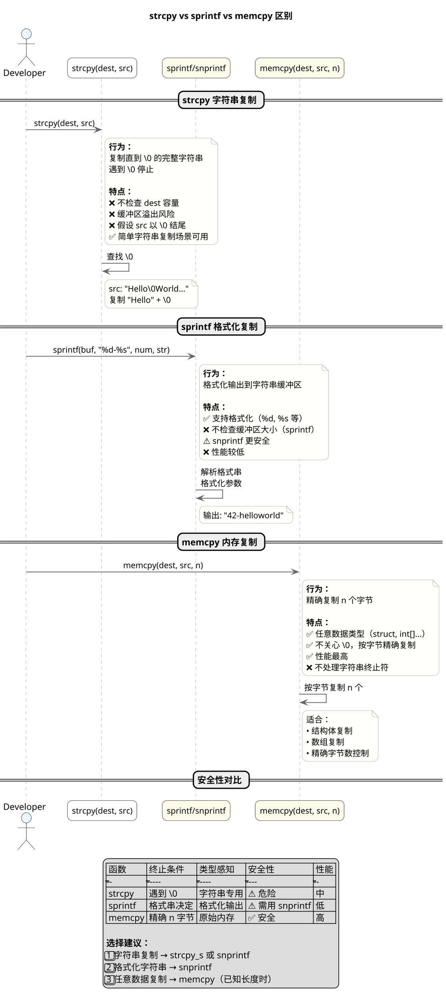

---

### c/c++ 中强制类型转换使用场景 / Type Casting Scenarios in C/C++

**Principle:**
In C/C++, type casting is an essential part of program design. C++ provides four type casting operators: `static_cast`, `dynamic_cast`, `const_cast`, and `reinterpret_cast`, each with specific use cases and behavioral characteristics. Understanding the underlying principles of these casts is crucial for writing safe and efficient code.

`static_cast` is primarily used for conversions between basic types and for up/down casting in class hierarchies with inheritance relationships. It performs type checking at compile time and is suitable for scenarios with clearly defined conversion rules, such as `int` to `double` conversions or base class pointer to derived class pointer conversions. `dynamic_cast` is mainly used for safe downcasting, performing type checking at runtime through RTTI (Run-Time Type Information). If the conversion is unsafe, it returns `nullptr` (for pointers) or throws a `bad_cast` exception (for references). `const_cast` is used to remove or add `const` qualifiers, and it is the only cast that can modify the value of a `const` variable. `reinterpret_cast` is the most dangerous cast, reinterpreting the bit pattern of one type as another type, typically used for low-level operations such as conversions between pointers and integers.

**PlantUML Diagram:**

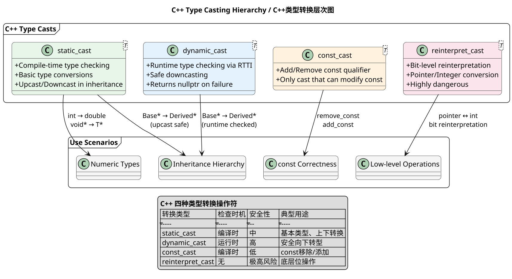

---

### When Default Constructor is Generated

**Principle:**
A default constructor is a constructor automatically generated by the C++ compiler when a class does not explicitly declare any constructors. More precisely, the compiler generates a default constructor **when the class has no user-declared constructors**. This auto-generated default constructor performs default initialization on fundamental type members (built-in types are not initialized, class types call their default constructors).

Five important situations to note: First, if a class contains reference members, `const` members, or class members with parameterized constructors, the compiler will not generate a default constructor. Second, classes with virtual functions generate vtable pointers, and classes with virtual inheritance generate virtual base class pointers. Third, the generation of default constructors is also affected by `= default` and `= delete`—explicitly declaring `= default` generates a default implementation, while explicitly declaring `= delete` prohibits generation. Fourth, if a class is derived from a base class without a default constructor, and the derived class needs to initialize the base class, the default constructor will not be auto-generated. Fifth, template classes also do not auto-generate default constructors in certain situations.

**PlantUML Diagram:**

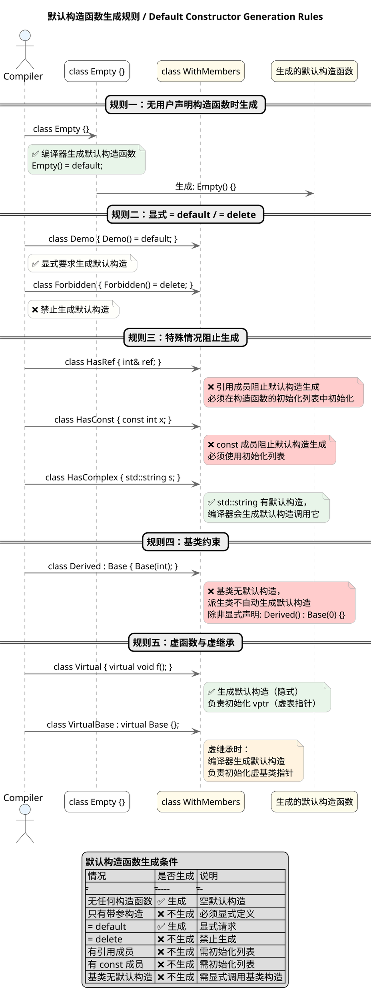

---

### When Default Copy Constructor is Generated

**Principle:**
A default copy constructor is a copy constructor automatically generated by the compiler to create a new object following copy semantics. **When a class does not explicitly declare a copy constructor**, the compiler generates a default copy constructor. This auto-generated copy constructor performs memberwise copy on data members: for built-in types, bytes are directly copied; for class types, their copy constructors are recursively called.

Five important situations to note: First, if a class contains reference members, because references must be bound at initialization and cannot be rebound, the compiler will not generate a default copy constructor. Second, if a class contains `const` members or types with `const` qualification, the generated copy constructor cannot directly modify these members and needs to use `const` qualification in parameters. Third, classes with virtual functions involve copying vtable pointers, which is safe—the new object's vptr will point to the same vtable as the original object. Fourth, if a class declares move constructors or move assignment operators, the copy constructor may not be automatically generated (depending on context). Fifth, when a class involves virtual inheritance, copy constructor generation is more complex and requires proper handling of virtual base subobjects.

**PlantUML Diagram:**

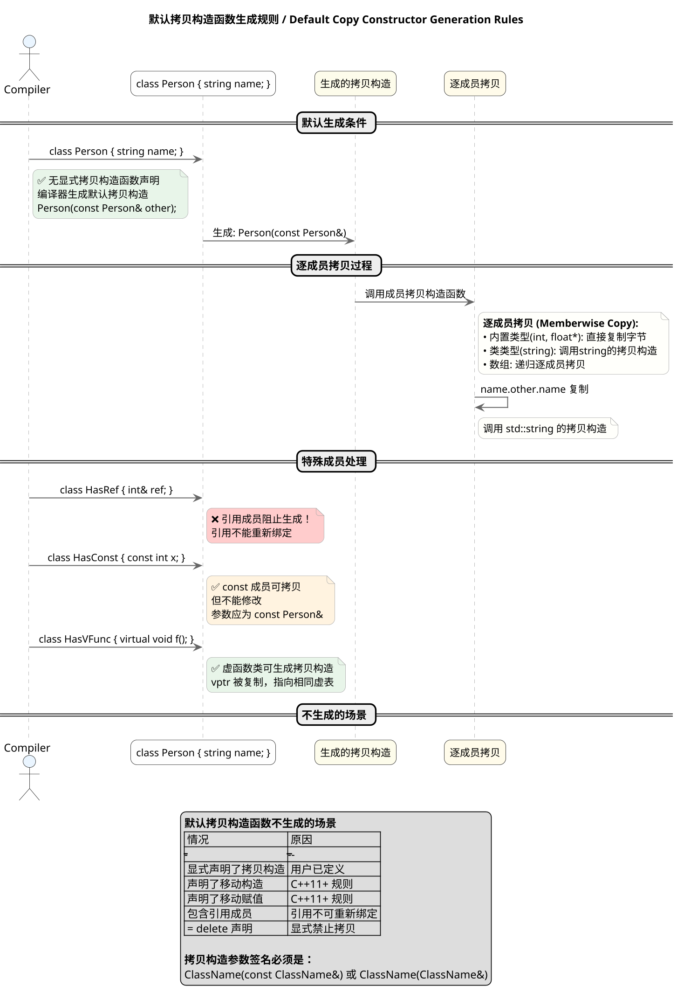

---

### Deep Copy vs Shallow Copy

**Principle:**
Deep copy and shallow copy are two different strategies for handling object copying in object-oriented programming. Their core difference lies in how they treat pointer-type data members. In shallow copy, when performing memberwise copy, pointer-type members only copy the address value—that is, both objects' pointer members point to the same heap memory. In deep copy, new memory is allocated for the new object, and data content is copied over, ensuring the new object and original object are completely independent.

Suppose a class contains a pointer member `int* p`. After shallow copy, both objects share the same memory; modifying one object's data affects the other, which leads to potential memory management issues (such as double-free). Deep copy creates an independent copy; modifying one object does not affect the other at all. In C++, if a class contains pointer members and requires correct copy semantics, you should explicitly define copy constructors and copy assignment operators to implement deep copy. If not explicitly defined, the compiler-generated default copy constructor and default copy assignment operator only perform shallow copy.

For modern C++, the better approach is to avoid using raw pointers and instead use RAII containers like `std::vector`, `std::string`, or smart pointers to manage memory. These containers themselves implement correct copy semantics (deep copy) without manual management.

**PlantUML Diagram:**

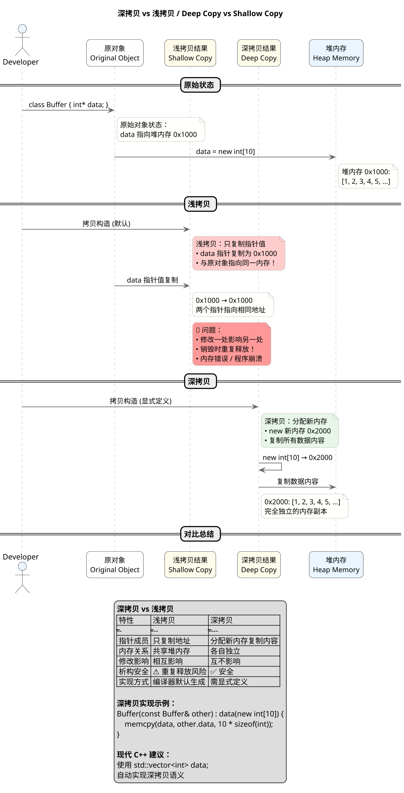

---

## C/C++ Standard Library, Common Interview Questions
*   **vector 底层实现原理**


1. **连续内存模型**
   `std::vector` 内部维护一个指向堆内存的指针 `_data`，以及 `_size`（当前元素数）和 `_capacity`（已分配容量）。所有元素存储在连续内存中，保证随机访问的常数时间复杂度。

2. **动态扩容机制**
   当 `push_back()` 插入新元素时：

   * 若 `_size < _capacity`，直接在现有内存中构造新元素；

3. **内存管理与 RAII**
   元素的构造、析构由 `vector` 自动管理。离开作用域时，析构函数会依次销毁所有元素并释放堆内存，符合 RAII 原则。

4. **容量与大小控制**

   * `reserve(n)`：仅修改容量，预留空间以避免频繁扩容。
   * `resize(n)`：调整逻辑大小，大于当前 size 则构造新元素，小于则析构多余部分。
   * `shrink_to_fit()`：尝试收缩容量以减少内存占用。

5. **元素访问与边界检查**

   * `operator[]` 直接访问元素，**无边界检查**；
   * `at()` 提供检查，越界时抛出 `std::out_of_range` 异常。

6. **清空与回收策略**

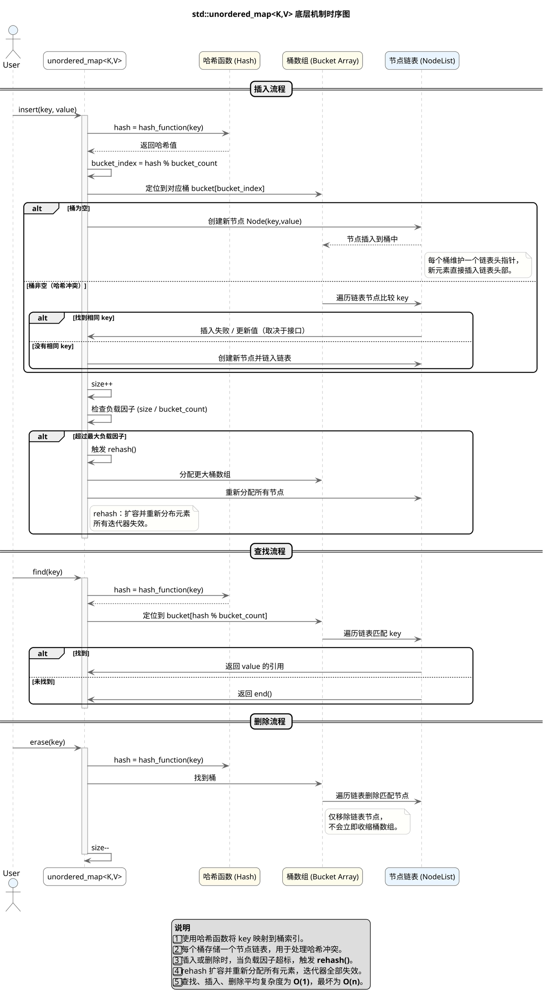

## C++ Object-Oriented Programming, Common Interview Questions

---

### Three Pillars of OOP

**Principle:**
Encapsulation organizes data and operations into an independent unit (class) and uses access specifiers to restrict direct access to internal members. Inheritance creates hierarchical class relationships, allowing subclasses to reuse data and behavior from parent classes. Polymorphism allows the same operation to produce different results on different objects through static or dynamic binding.

**PlantUML Diagram:**

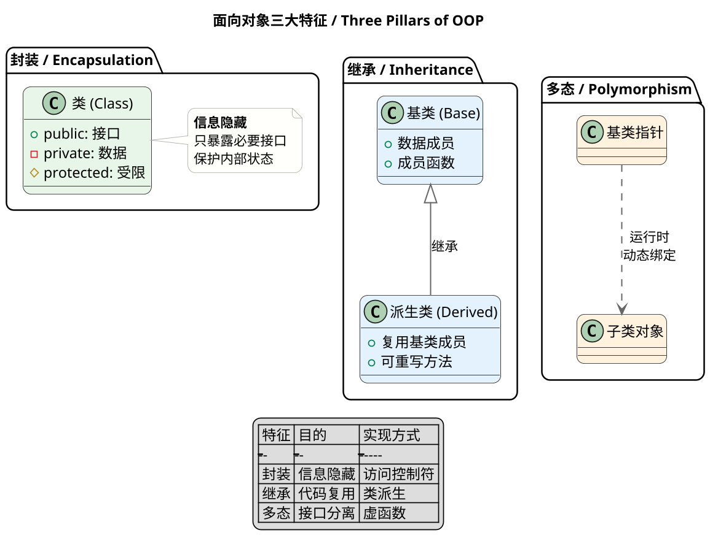

---

### Polymorphism Implementation Principle

**Principle:**
C++ polymorphism relies on **vtables (virtual function tables)** and **vptrs (virtual function table pointers)**. When a class contains at least one virtual function, the compiler creates a vtable for that class. Each object contains a hidden vptr at the start of its memory layout, pointing to the class's vtable.

**PlantUML Diagram:**

```plantuml
@startuml
skinparam dpi 160
skinparam shadowing false
skinparam roundcorner 15
skinparam sequenceArrowThickness 1.3
skinparam sequenceMessageAlign center
skinparam ParticipantPadding 15
skinparam BoxPadding 15
skinparam ArrowColor #666
skinparam ArrowThickness 1.2
skinparam SequenceLifeLineBorderColor #AAAAAA
skinparam SequenceLifeLineBackgroundColor #F8F8F8
skinparam NoteBackgroundColor #FFFFFB
skinparam NoteBorderColor #AAA
skinparam ParticipantFontSize 13
skinparam ActorFontSize 14
skinparam SequenceDividerFontSize 14

title **多态实现原理 / Polymorphism Implementation**

package "对象内存布局 / Object Memory Layout" {
  object "对象 obj" as OBJ #E8F5E9 {
    {field} vptr (隐藏) → 指向 vtable
    {field} 成员变量1
    {field} 成员变量2
  }
}

package "虚函数表 / vtable" {
  class "Base vtable" as BASE_VTBL #E3F2FD {
    + slot[0]: Base::func1()
    + slot[1]: Base::func2()
  }
  
  class "Derived vtable" as DERIVED_VTBL #E3F2FD {
    + slot[0]: Derived::func1() ← 重写
    + slot[1]: Base::func2()
  }
}

package "动态绑定过程 / Dynamic Binding" {
  actor "调用者" as CALLER #FFF3E0
  participant "Base* ptr" as PTR #FCE4EC
  participant "vptr 查找" as VLOOKUP #EAF5FF
  participant "vtable 派发" as VDISPATCH #EAF5FF
  participant "实际函数" as FUNC #F8F8F8
}

== 动态绑定流程 ==

CALLER -> PTR : ptr->virtualFunc()
PTR -> VLOOKUP : 通过 vptr 找到 vtable
VLOOKUP -> VDISPATCH : 查找 slot[index]
VDISPATCH -> FUNC : 跳转到函数地址
FUNC --> CALLER : 执行实际函数

legend center
| 概念 | 说明 |
|------|------|
| vptr | 对象中的隐藏指针，指向 vtable |
| vtable | 类级别的函数指针数组 |
| slot | vtable 中每个虚函数的索引 |
| 动态绑定 | 运行时通过 vptr 查找实际函数 |
endlegend

@enduml
```

---

### Diamond Inheritance Problem

**Principle:**
Diamond inheritance occurs when class A is base, B and C inherit from A, and D inherits from both B and C, creating two copies of A's members. **Virtual inheritance** using the `virtual` keyword ensures the common base class has only **one shared instance**.

**PlantUML Diagram:**

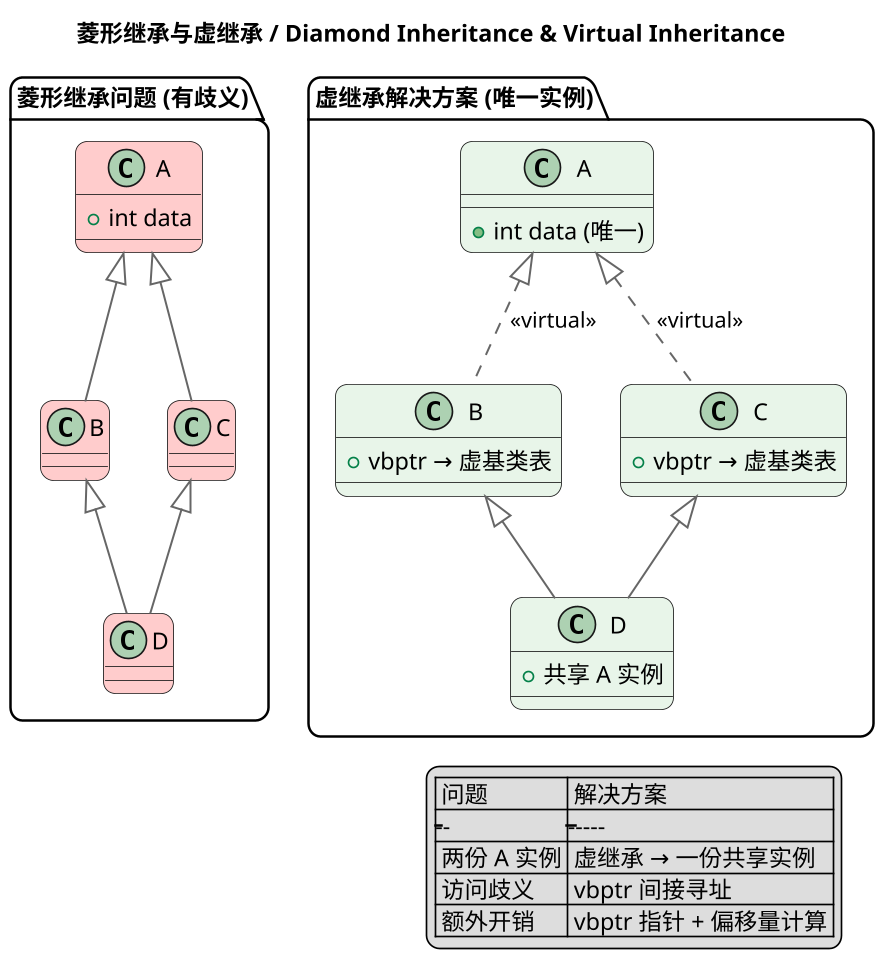

---

### override and final Keywords

**Principle:**
**override** (C++11) explicitly marks a derived class function as overriding a base class virtual function. The compiler checks if the function actually overrides; if not, it produces an error. **final** (C++11) restricts inheritance or overriding.

**PlantUML Diagram:**

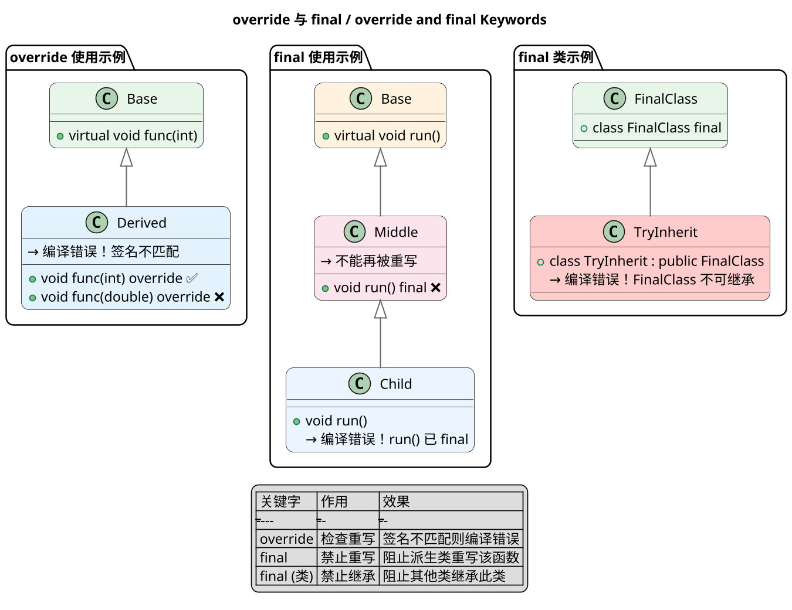

---

### C++ Type Deduction

**Principle:**
**auto** (C++11) deduces variable type from initializer, ignoring references and cv-qualifiers. **decltype** (C++11) deduces type from expressions, preserving references and cv-qualifiers. **decltype(auto)** (C++14) combines both.

**PlantUML Diagram:**

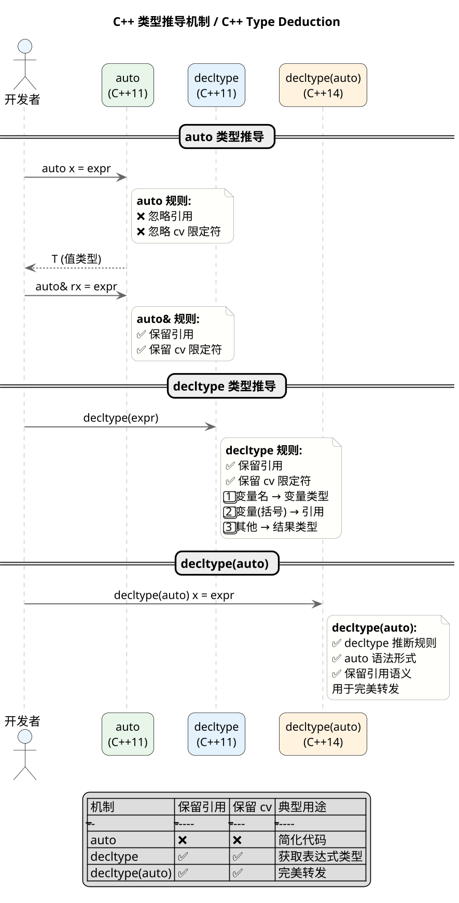

---

### Relationship Between function, lambda, bind

**Principle:**
**std::function** is a type-erased wrapper storing any callable matching a signature. **Lambda** (C++11) creates anonymous callables at compile time with zero-cost abstraction for uncaptured lambdas. **std::bind** (C++11) creates function objects with pre-bound arguments.

**PlantUML Diagram:**

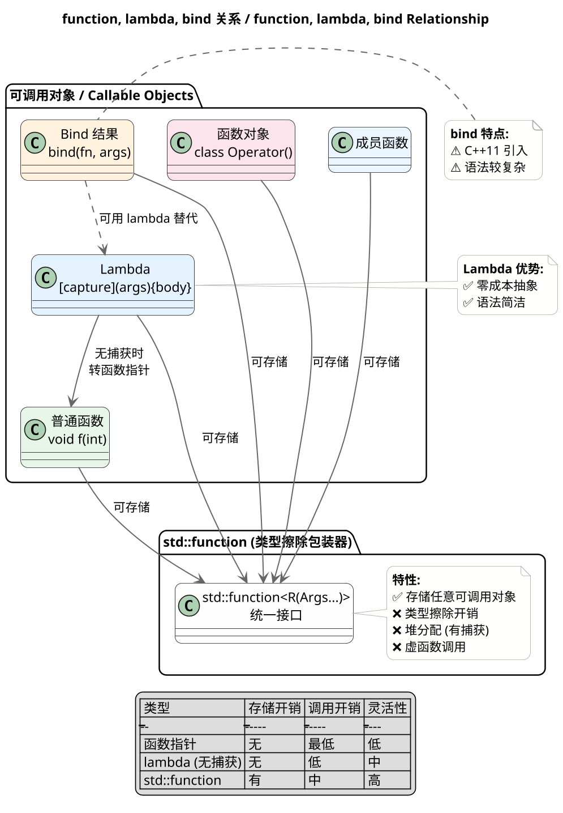

---

### Constructor and Destructor Execution Order

**Principle:**
**Constructor order**: Base → Member objects → Derived. **Destructor order**: Derived → Member objects → Base (reverse of construction). During base construction, virtual function calls don't reach derived overrides.

**PlantUML Diagram:**

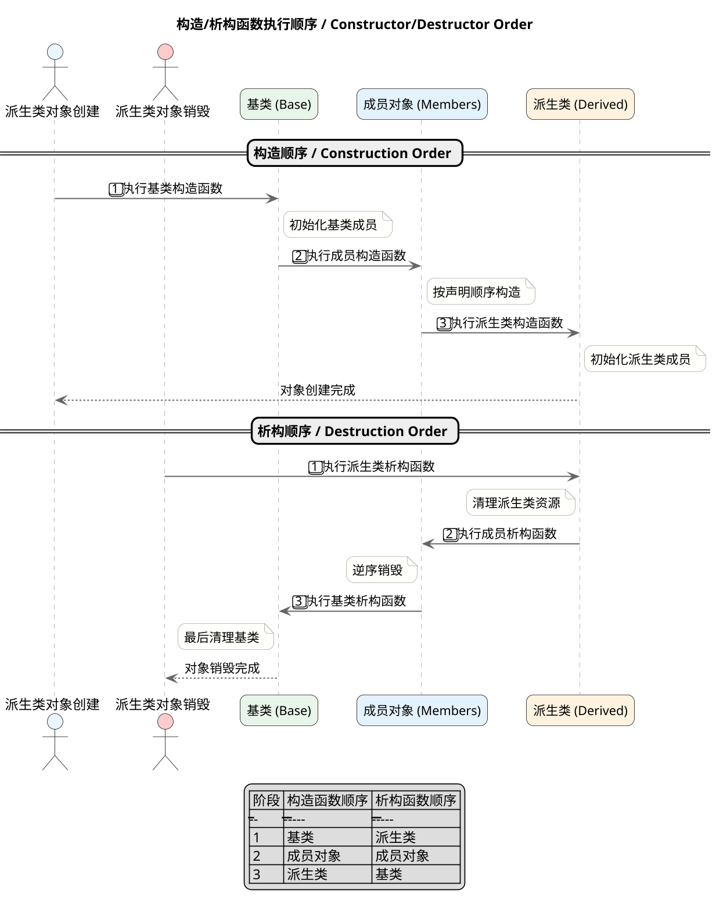

---

### vtable and vptr Creation Timing

**Principle:**
**vtable creation**: At **compile time**, per-class, storing virtual function addresses. **vptr initialization**: During **object construction**, set to point to current class's vtable. In multiple inheritance, multiple vptrs exist—one per direct base class.

**PlantUML Diagram:**

```plantuml
@startuml
skinparam dpi 160
skinparam shadowing false
skinparam roundcorner 15
skinparam sequenceArrowThickness 1.3
skinparam sequenceMessageAlign center
skinparam ParticipantPadding 15
skinparam BoxPadding 15
skinparam ArrowColor #666
skinparam ArrowThickness 1.2
skinparam SequenceLifeLineBorderColor #AAAAAA
skinparam SequenceLifeLineBackgroundColor #F8F8F8
skinparam NoteBackgroundColor #FFFFFB
skinparam NoteBorderColor #AAA
skinparam ParticipantFontSize 13
skinparam ActorFontSize 14
skinparam SequenceDividerFontSize 14

title **vtable 与 vptr 创建时机 / vtable & vptr Creation Timing**

package "编译时 / Compile Time" {
  class "Base 类" as BASE_CLASS #E8F5E9 {
    + virtual void func1()
    + virtual void func2()
  }
  
  class "Derived 类" as DERIVED_CLASS #E3F2FD {
    + virtual void func1() ← 重写
    + virtual void func2()
    + virtual void func3() ← 新增
  }
  
  note right of BASE_CLASS
    **Base vtable:**
    slot[0] → Base::func1
    slot[1] → Base::func2
  end note
  
  note right of DERIVED_CLASS
    **Derived vtable:**
    slot[0] → Derived::func1
    slot[1] → Base::func2
    slot[2] → Derived::func3
  end note
}

package "运行时 - 构造过程中 / Runtime - During Construction" {
  actor "派生类对象构造" as CTOR #FFF3E0
  participant "vptr (初始)" as VPTR1 #FCE4EC
  participant "vptr (更新后)" as VPTR2 #FCE4EC
  
  CTOR -> VPTR1 : 基类构造阶段
  note left of VPTR1
    vptr → Base vtable
    调用虚函数 → Base 版本
  end note
  
  CTOR -> VPTR2 : 派生类构造阶段
  note left of VPTR2
    vptr → Derived vtable
    调用虚函数 → Derived 版本
  end note
}

package "多重继承情况" {
  class "Derived 多继承" as MULTI #EAF5FF {
    + vptr_A → A vtable
    + vptr_B → B vtable
  }
  
  note bottom of MULTI
    **每个直接基类一个 vptr**
    指向各自的 vtable
  end note
}

legend center
| 阶段 | vptr 状态 | 虚函数调用目标 |
|------|----------|--------------|
| 编译时 | 不存在 | vtable 生成 |
| 基类构造 | → Base vtable | Base 版本 |
| 派生类构造 | → Derived vtable | Derived 版本 |
| 析构函数 | → 当前类 vtable | 当前类版本 |
endlegend

@enduml
```

---

### Virtual Destructor Purpose

**Principle:**
**Virtual destructors** ensure proper cleanup when deleting derived objects through base pointers. If ~Base() is non-virtual, only ~Base() executes, leaking derived resources. Making the destructor virtual enables the full destruction chain through vtable dispatch.

**PlantUML Diagram:**

```plantuml
@startuml
skinparam dpi 160
skinparam shadowing false
skinparam roundcorner 15
skinparam sequenceArrowThickness 1.3
skinparam sequenceMessageAlign center
skinparam ParticipantPadding 15
skinparam BoxPadding 15
skinparam ArrowColor #666
skinparam ArrowThickness 1.2
skinparam SequenceLifeLineBorderColor #AAAAAA
skinparam SequenceLifeLineBackgroundColor #F8F8F8
skinparam NoteBackgroundColor #FFFFFB
skinparam NoteBorderColor #AAA
skinparam ParticipantFontSize 13
skinparam ActorFontSize 14
skinparam SequenceDividerFontSize 14

title **虚析构函数作用 / Virtual Destructor Purpose**

package "非虚析构函数问题" {
  class "Base (非虚析构)" as BASE_NONVIRT #FFCCCC {
    + ~Base() ❌ 非虚
  }
  
  class "Derived" as DERIVED_NONVIRT #FFCCCC {
    + ~Derived()
    + 分配了资源
  }
  
  note bottom of BASE_NONVIRT
    **问题:**
    Base* p = new Derived();
    delete p; // 只调用 ~Base()
    // ~Derived() 不会被调用！
    // 内存泄漏
  end note
}

package "虚析构函数解决方案" {
  class "Base (虚析构)" as BASE_VIRT #E8F5E9 {
    + virtual ~Base() ✅
  }
  
  class "Derived" as DERIVED_VIRT #E8F5E9 {
    + ~Derived()
    + 释放资源
  }
  
  note bottom of BASE_VIRT
    **解决方案:**
    Base* p = new Derived();
    delete p; // 通过 vptr 调用
    // ~Derived() → ~Base()
    // 完整析构链！
  end note
}

package "删除对象时" {
  actor "delete p" as DELETE #FFF3E0
  participant "~Derived()" as DTOR_D #FCE4EC
  participant "~Base()" as DTOR_B #FCE4EC
  
  DELETE -> DTOR_D : 通过 vptr 找到
  DTOR_D -> DTOR_B : 自动调用
  DTOR_B --> DELETE : 资源全部释放
}

legend center
| 析构函数类型 | delete 基类指针 | 析构链 |
|-------------|-----------------|-------|
| 非虚 | 只调用基类析构 | ❌ 不完整 |
| 虚 | 先派生后基类 | ✅ 完整 |
endlegend

@enduml
```

---

### Smart Pointer Types and Use Cases

**Principle:**
**std::unique_ptr** - exclusive ownership, auto-deletes on destruction, non-copyable but movable. **std::shared_ptr** - shared ownership via reference counting. **std::weak_ptr** - non-owning observer of shared_ptr, solves circular reference problems.

**PlantUML Diagram:**

```plantuml
@startuml
skinparam dpi 160
skinparam shadowing false
skinparam roundcorner 15
skinparam sequenceArrowThickness 1.3
skinparam sequenceMessageAlign center
skinparam ParticipantPadding 15
skinparam BoxPadding 15
skinparam ArrowColor #666
skinparam ArrowThickness 1.2
skinparam SequenceLifeLineBorderColor #AAAAAA
skinparam SequenceLifeLineBackgroundColor #F8F8F8
skinparam NoteBackgroundColor #FFFFFB
skinparam NoteBorderColor #AAA
skinparam ParticipantFontSize 13
skinparam ActorFontSize 14
skinparam SequenceDividerFontSize 14

title **智能指针种类 / Smart Pointer Types**

package "unique_ptr (独占所有权)" {
  class "unique_ptr<T>" as UNIQUE #E8F5E9 {
    + T* ptr
    + 独占对象
  }
  
  note bottom of UNIQUE
    **特点:**
    ✅ 独占所有权
    ✅ 自动释放
    ✅ 无引用计数开销
    ❌ 不可复制
    ✅ 可移动
  end note
  
  UNIQUE -> [T] : 拥有
}

package "shared_ptr (共享所有权)" {
  class "shared_ptr<T>" as SHARED1 #E3F2FD {
    + T* ptr
    + 控制块 (ref count)
  }
  
  class "shared_ptr<T>" as SHARED2 #E3F2FD {
    + T* ptr
    + 控制块 (ref count)
  }
  
  class "T 对象" as TOK #FFF3E0
  
  SHARED1 -> TOK : 共享所有权
  SHARED2 -> TOK : 共享所有权
  
  note bottom of SHARED1
    **特点:**
    ✅ 共享所有权
    ✅ 引用计数
    ❌ 引用计数开销
    ✅ 可复制
  end note
}

package "weak_ptr (观察者)" {
  class "weak_ptr<T>" as WEAK #FCE4EC {
    + 不参与引用计数
    + 观察 shared_ptr
  }
  
  class "shared_ptr<T>" as SHARED3 #E3F2FD
  class "T 对象" as TOBJ #FFF3E0
  
  WEAK --> SHARED3 : 观察
  SHARED3 --> TOBJ : 拥有
  
  note bottom of WEAK
    **特点:**
    ✅ 不参与引用计数
    ✅ 打破循环引用
    ⚠️ 需 lock() 转换为 shared_ptr
  end note
}

package "使用场景" {
  object "单独拥有对象" as USE1 #F8F8F8
  object "多个所有者" as USE2 #F8F8F8
  object "打破循环引用" as USE3 #F8F8F8
  
  USE1 ..> UNIQUE : unique_ptr
  USE2 ..> SHARED1 : shared_ptr
  USE3 ..> WEAK : weak_ptr
}

legend center
| 类型 | 所有权 | 复制 | 移动 | 引用计数 | 典型场景 |
|------|-------|------|------|---------|---------|
| unique_ptr | 独占 | ❌ | ✅ | 无 | 单所有者 |
| shared_ptr | 共享 | ✅ | ✅ | 有 | 多所有者 |
| weak_ptr | 无 | ✅ | ✅ | 无 | 观察者 |
endlegend

@enduml
```

---

### C++11 Features

**Principle:**
**Key C++11 features**: Rvalue references and move semantics enable resource stealing from temporaries. auto and decltype provide type deduction. Lambda expressions create anonymous function objects. Smart pointers automate memory management. nullptr solves NULL ambiguity.

**PlantUML Diagram:**

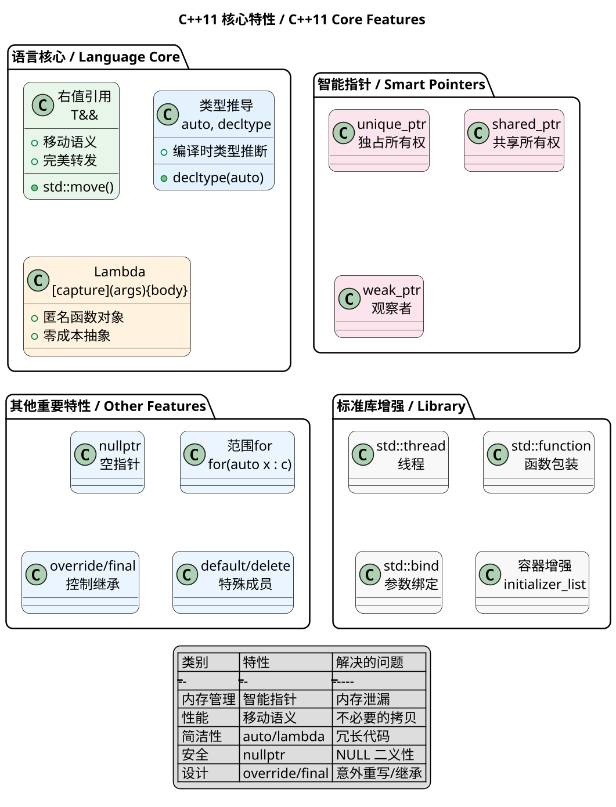

---

### Dynamic vs Static Libraries

**Principle:**
**Static libraries** are linked at compile time—object code is copied into the executable. **Dynamic libraries** are loaded at runtime—only references are stored. Static libraries offer simpler deployment but less flexibility; dynamic libraries save memory through sharing.

**PlantUML Diagram:**

```plantuml
@startuml
skinparam dpi 160
skinparam shadowing false
skinparam roundcorner 15
skinparam sequenceArrowThickness 1.3
skinparam sequenceMessageAlign center
skinparam ParticipantPadding 15
skinparam BoxPadding 15
skinparam ArrowColor #666
skinparam ArrowThickness 1.2
skinparam SequenceLifeLineBorderColor #AAAAAA
skinparam SequenceLifeLineBackgroundColor #F8F8F8
skinparam NoteBackgroundColor #FFFFFB
skinparam NoteBorderColor #AAA
skinparam ParticipantFontSize 13
skinparam ActorFontSize 14
skinparam SequenceDividerFontSize 14

title **静态库 vs 动态库 / Static vs Dynamic Libraries**

package "静态链接 / Static Linking" {
  file "libxxx.a" as STATIC_LIB #E8F5E9
  file "main.o" as OBJ #E8F5E9
  file "program (可执行文件)" as EXEC_STATIC #E8F5E9
  
  STATIC_LIB --> EXEC_STATIC : 链接器复制
  OBJ --> EXEC_STATIC : 链接器合并
}

package "动态链接 / Dynamic Linking" {
  file "libxxx.so" as DYN_LIB #E3F2FD
  file "main.o" as OBJ_DYN #E3F2FD
  file "program" as EXEC_DYN #E3F2FD
  
  DYN_LIB ..> EXEC_DYN : 运行时加载\n(引用关系)
  OBJ_DYN --> EXEC_DYN : 链接器记录
}

package "运行时对比" {
  object "程序A" as PROG_A #FFF3E0
  object "程序B" as PROG_B #FFF3E0
  object "libxxx.so (共享)" as SHARED_LIB #FCE4EC
  
  PROG_A --> SHARED_LIB : 共享
  PROG_B --> SHARED_LIB : 共享
  
  note bottom of SHARED_LIB
    **动态库优点:**
    ✅ 内存共享
    ✅ 独立更新
    ❌ 需部署 .so 文件
  end note
}

legend center
| 特性 | 静态库 | 动态库 |
|------|-------|-------|
| 链接时机 | 编译时 | 运行时 |
| 代码存储 | 复制到可执行文件 | 独立文件 |
| 内存占用 | 多程序多副本 | 共享一份 |
| 更新维护 | 需重新编译 | 可独立更新 |
| 部署 | 简单 (自包含) | 需带库文件 |
endlegend

@enduml
```

---

### Lvalue vs Rvalue References

**Principle:**
**Lvalue references** (`T&`) bind to persistent objects. **Rvalue references** (`T&&`, C++11) bind to temporaries, enabling move semantics—transferring resources instead of copying, significantly improving performance.

**PlantUML Diagram:**

```plantuml
@startuml
skinparam dpi 160
skinparam shadowing false
skinparam roundcorner 15
skinparam sequenceArrowThickness 1.3
skinparam sequenceMessageAlign center
skinparam ParticipantPadding 15
skinparam BoxPadding 15
skinparam ArrowColor #666
skinparam ArrowThickness 1.2
skinparam SequenceLifeLineBorderColor #AAAAAA
skinparam SequenceLifeLineBackgroundColor #F8F8F8
skinparam NoteBackgroundColor #FFFFFB
skinparam NoteBorderColor #AAA
skinparam ParticipantFontSize 13
skinparam ActorFontSize 14
skinparam SequenceDividerFontSize 14

title **左值引用 vs 右值引用 / Lvalue vs Rvalue References**

package "左值引用 / Lvalue Reference" {
  class "T&" as LREF #E8F5E9 {
    + 必须绑定左值
    + 持久存在的对象
    + 可读可写 (非const)
  }
  
  note bottom of LREF
    **左值特点:**
    ✅ 有持久地址
    ✅ 表达式结束后仍存在
    ✅ 可取地址 (&)
    示例: 变量、返回左值引用的函数
  end note
}

package "右值引用 / Rvalue Reference" {
  class "T&&" as RREF #E3F2FD {
    + 必须绑定右值
    + 临时对象 / 将销毁的对象
    + 可"窃取"其资源
  }
  
  note bottom of RREF
    **右值特点:**
    ✅ 无持久地址
    ✅ 表达式结束即销毁
    ❌ 不可取地址
    示例: 函数返回值、表达式结果
  end note
}

package "移动语义 / Move Semantics" {
  class "拷贝构造\nCopy Constructor" as COPY #FFF3E0 {
    + 深拷贝数据
    + 分配新内存
    + 开销大
  }
  
  class "移动构造\nMove Constructor" as MOVE #FCE4EC {
    + 转移指针所有权
    + 不分配新内存
    + 开销小
  }
  
  note bottom of MOVE
    **移动语义优势:**
    ✅ 零拷贝转移大数据
    ✅ 源对象置于可析构状态
    ✅ 对 unique_ptr 尤为重要
  end note
}

package "std::move vs std::forward" {
  object "std::move(x)\n无条件转右值" as MOVE_FUNC #EAF5FF
  object "std::forward<T>()\n保持属性转发" as FWD_FUNC #EAF5FF
}

legend center
| 引用类型 | 语法 | 绑定对象 | 典型用途 |
|---------|------|---------|---------|
| 左值引用 | T& | 左值 | 修改对象、避免拷贝 |
| 右值引用 | T&& | 右值 | 移动语义、窃取资源 |
| const T& | const T& | 左值或右值 | 泛型参数、只读访问 |
endlegend

@enduml
```

---

## Design Patterns, Common Interview Questions
**English Translation**: The five SOLID principles are: Single Responsibility (one class, one purpose), Open/Closed (open for extension, closed for modification), Liskov Substitution (subclasses replaceable for base classes), Interface Segregation (many specific interfaces vs one general), and Dependency Inversion (depend on abstractions, not concretions).

**PlantUML Diagram:**

```plantuml
@startuml
skinparam dpi 160
skinparam shadowing false
skinparam roundcorner 15

package "SOLID Principles" {
  class "SRP\n单一职责" as SRP #E8F5E9
  class "OCP\n开闭原则" as OCP #E3F2FD
  class "LSP\n里氏替换" as LSP #FFF3E0
  class "ISP\n接口隔离" as ISP #FCE4EC
  class "DIP\n依赖倒置" as DIP #F3E5F5

  SRP -[hidden]down-> OCP
  LSP -[hidden]down-> ISP
  OCP -[hidden]right-> LSP
  ISP -[hidden]right-> DIP
}

note right of SRP
  一个类只做一件事
  提高内聚、降低耦合
end note

note right of OCP
  扩展优于修改
  抽象化是关键
end note

note right of LSP
  子类is-a父类
  可替换性保证正确性
end note

note right of ISP
  专用接口优于通用
  减少不必要的依赖
end note

note right of DIP
  依赖抽象层
  高层不依赖低层
end note
@enduml
```
**English Translation**: Open/Closed Principle states that software entities should be open for extension but closed for modification. OCP is the ultimate goal of OO design. LSP enables OCP by ensuring proper inheritance hierarchies. ISP supports OCP by providing fine-grained interfaces. DIP is the key means to achieve OCP by depending on abstractions.

**PlantUML Diagram:**

```plantuml
@startuml
skinparam dpi 160
skinparam shadowing false
skinparam roundcorner 15

title **开闭原则(OCP) 与相关原则关系**

rectangle "开闭原则 OCP\n目标：扩展优于修改" as OCP #E3F2FD

rectangle "里氏替换 LSP\n使能器：继承体系正确性" as LSP #FFF3E0
rectangle "接口隔离 ISP\n支持：细粒度接口解耦" as ISP #FCE4EC
rectangle "依赖倒置 DIP\n手段：依赖抽象" as DIP #F3E5F5

OCP <-[dashed]-> LSP : 基础关系
OCP <-[dashed]-> ISP : 支撑关系
OCP <-[dashed]-> DIP : 实现手段

note bottom of OCP
  OCP是目标
  LSP/ISP/DIP是实现OCP的途径
end note
@enduml
```
**English Translation**: Liskov Substitution Principle states that objects of a superclass should be replaceable with objects of its subclasses without breaking the application. Subtypes must be substitutable for their base types. The key is proper "is-a" relationship.

**PlantUML Diagram:**

```plantuml
@startuml
skinparam dpi 160
skinparam shadowing false
skinparam roundcorner 15

class "Bird (基类)" as Bird #E3F2FD
class "Penguin (企鹅)" as Penguin #FFECB3
class "Sparrow (麻雀)" as Sparrow #C8E6C9

Bird <|-- Penguin
Bird <|-- Sparrow

Bird : +fly() // 父类方法
Sparrow : +fly() // 正常扩展

note right of Penguin
  企鹅继承Bird
  但不能飞（行为改变）
  违反LSP！
end note

note right of Sparrow
  麻雀会飞
  正常继承fly()
end note

note right of Bird
  LSP: 所有使用Bird的地方
  必须能用Penguin/Sparrow替换
end note
@enduml
```
**English Translation**: Law of Demeter (Principle of Least Knowledge) states that an object should only interact with its direct friends - objects that are members, parameters, or created locally. It reduces coupling between components.

**PlantUML Diagram:**

```plantuml
@startuml
skinparam dpi 160
skinparam shadowing false
skinparam roundcorner 15

class "Client" as Client #E3F2FD
class "Teacher" as Teacher #C8E6C9
class "Student" as Student #FFF3E0
class "Printer" as Printer #FCE4EC

Client -> Teacher
Teacher -> Student
Student -> Printer

note right of Client
  Client只认识Teacher
  不需要知道Printer存在
end note

note right of Teacher
  Teacher只调用Student方法
  不直接操作Printer
end note

note as N1
  **迪米特原则示例**
  Teacher调用Student.printHomework()
  而非Teacher.getStudent().getPrinter().print()
  只与直接朋友Student通信
end note
@enduml
```
**English Translation**: Dependency Inversion Principle states that high-level modules should not depend on low-level modules; both should depend on abstractions. Abstractions should not depend on details; details should depend on abstractions.

**PlantUML Diagram:**

```plantuml
@startuml
skinparam dpi 160
skinparam shadowing false
skinparam roundcorner 15

interface "ICar (抽象)" as ICar #E3F2FD
class "BMW (具体)" as BMW #C8E6C9
class "Benz (具体)" as Benz #FFF3E0
class "Driver (高层)" as Driver #FCE4EC

Driver --> ICar
ICar <|.. BMW
ICar <|.. Benz

note right of Driver
  Driver依赖ICar抽象
  不依赖BMW或Benz
end note

note right of ICar
  抽象不依赖细节
  细节(BMW/Benz)依赖抽象
end note

note as N1
  **依赖倒置示例**
  Driver.drive(ICar* car)
  传入任何ICar实现都可以
end note
@enduml
```
    static Singleton* getInstance() {
        if (instance == nullptr) {  // 第一次检查
            lock();
            if (instance == nullptr) {  // 第二次检查
                instance = new Singleton();
            }
            unlock();
        }
        return instance;
    }
private:
    static volatile Singleton* instance;
};

// Meyers单例（最推荐）
class Singleton {
public:
    static Singleton& getInstance() {
        static Singleton instance;  // C++11线程安全
        return instance;
    }
};
```

**English Translation**: Singleton pattern ensures a class has only one instance with global access. Thread safety is critical. Double-checked locking uses volatile and double checking. Meyers singleton leverages static local variable thread safety (C++11+).

**PlantUML Diagram:**

```plantuml
@startuml
skinparam dpi 160
skinparam shadowing false
skinparam roundcorner 15

class "Singleton" as S #E3F2FD
class "双重检查锁定" as DCL #C8E6C9
class "Meyers单例" as Meyers #FFF3E0

S <|-- DCL
S <|-- Meyers

note right of DCL
  第一次检查：无锁快速判断
  加锁：保证创建过程原子
  第二次检查：防止重复创建
end note

note right of Meyers
  静态局部变量
  C++11后线程安全
  局部变量初始化线程安全
end note
@enduml
```
**English Translation**: Factory Method defines an interface for creating objects, letting subclasses decide. Abstract Factory provides an interface for creating families of related objects without specifying concrete classes.

**PlantUML Diagram:**

```plantuml
@startuml
skinparam dpi 160
skinparam shadowing false
skinparam roundcorner 15

interface "Factory" as F #E3F2FD
interface "Product" as P #C8E6C9
class "ConcreteFactory" as CF #FFF3E0
class "ConcreteProduct" as CP #C8E6C9

F <|-- CF
P <|.. CP
CF --> P : creates

note right of F
  Factory Method
  创建单一产品
end note

package "Abstract Factory" {
  interface "AbstractFactory" as AF #FCE4EC
  interface "ProductA" as PA #E8F5E9
  interface "ProductB" as PB #E3F2FD
  class "ConcreteFactory1" as CF1 #FFF3E0
  class "ConcreteFactory2" as CF2 #FFECB3
  
  AF <|-- CF1
  AF <|-- CF2
  CF1 --> PA : creates A1
  CF1 --> PB : creates B1
  CF2 --> PA : creates A2
  CF2 --> PB : creates B2
}

note right of AF
  Abstract Factory
  创建产品族
end note
@enduml
```
**English Translation**: Proxy pattern provides a surrogate to control access to another object. Types include static, dynamic (JDK/CGLib), virtual (lazy loading), protection (access control), and remote proxy.

**PlantUML Diagram:**

```plantuml
@startuml
skinparam dpi 160
skinparam shadowing false
skinparam roundcorner 15

interface "Subject" as S #E3F2FD
class "RealSubject" as Real #C8E6C9
class "Proxy" as Proxy #FFF3E0

S <|.. Real
S <|.. Proxy
Proxy --> Real : 持有引用

note right of Proxy
  代理控制对RealSubject的访问
  可在访问前后做额外处理
end note

package "Proxy Types" {
  class "VirtualProxy\n(虚代理-延迟加载)" as VP #E8F5E9
  class "ProtectionProxy\n(保护代理-权限控制)" as PP #FCE4EC
  class "RemoteProxy\n(远程代理-RPC)" as RP #E3F2FD
}

note bottom of Proxy
  **应用场景**
  - 延迟加载：大图/大文件
  - 权限控制：API访问限制
  - 日志记录：方法调用审计
  - 缓存代理：减少重复计算
end note
@enduml
```
**English Translation**: Decorator pattern dynamically adds responsibilities to objects. Decorators implement the same interface as the wrapped object, providing flexible runtime composition instead of inheritance.

**PlantUML Diagram:**

```plantuml
@startuml
skinparam dpi 160
skinparam shadowing false
skinparam roundcorner 15

interface "Component" as C #E3F2FD
class "ConcreteComponent" as CC #C8E6C9
class "Decorator" as D #FFF3E0
class "ConcreteDecoratorA" as CDA #E8F5E9
class "ConcreteDecoratorB" as CDB #FCE4EC

C <|.. CC
C <|.. D
D <|-- CDA
D <|-- CDB
D --> C : wraps

note right of D
  Decorator持有Component引用
  可在调用前后添加行为
end note

note bottom of C
  **应用场景**
  - Java I/O流：BufferedInputStream包装FileInputStream
  - UI装饰：边框、滚动条
  - 日志增强：加密、压缩
  - 收费系统：满减、折扣、积分叠加
end note
@enduml
```
**English Translation**: Composite pattern composes objects into tree structures to represent part-whole hierarchies. Clients can treat individual objects and compositions uniformly.

**PlantUML Diagram:**

```plantuml
@startuml
skinparam dpi 160
skinparam shadowing false
skinparam roundcorner 15

abstract "Component" as C #E3F2FD
class "Leaf" as L #C8E6C9
class "Composite" as Comp #FFF3E0

C <|-- L
C <|-- Comp
Comp o-> C : children

note right of L
  Leaf: 叶子节点
  没有子节点
end note

note right of Comp
  Composite: 容器节点
  可包含Leaf和其他Composite
end note

note bottom of C
  **应用场景**
  - 文件系统：文件夹/文件
  - UI容器：窗口/面板/控件
  - 组织架构：部门/员工
  - XML/HTML DOM树
end note
@enduml
```
**English Translation**: Chain of Responsibility passes requests along a chain of handlers. Each handler decides to process the request or pass it to the next handler, decoupling sender and receiver.

**PlantUML Diagram:**

```plantuml
@startuml
skinparam dpi 160
skinparam shadowing false
skinparam roundcorner 15

abstract "Handler" as H #E3F2FD
class "HandlerA" as HA #C8E6C9
class "HandlerB" as HB #FFF3E0
class "HandlerC" as HC #E8F5E9

H <|-- HA
H <|-- HB
H <|-- HC
HA --> H : successor
HB --> H : successor
HC --> H : successor

note right of HA
  HandlerA处理请求
  或传递给HandlerB
end note

note bottom of H
  **应用场景**
  - Web中间件：认证→日志→限流→业务
  - Java过滤器链
  - 审批流程：组长→经理→总监
  - 事件捕获：冒泡与捕获
end note
@enduml
```
**English Translation**: Template Method defines the skeleton of an algorithm, deferring some steps to subclasses. The base class provides the algorithm structure, subclasses provide specific implementations.

**PlantUML Diagram:**

```plantuml
@startuml
skinparam dpi 160
skinparam shadowing false
skinparam roundcorner 15

abstract "AbstractClass" as AC #E3F2FD
class "ConcreteClassA" as CA #C8E6C9
class "ConcreteClassB" as CB #FFF3E0

AC <|-- CA
AC <|-- CB

note right of AC
  templateMethod() : final
  —————————————
  step1()
  step2()
  hook() // 可选覆盖
end note

note right of CA
  实现必要步骤
  可覆盖hook()
end note

note bottom of AC
  **应用场景**
  - 框架生命周期：init()→run()→destroy()
  - 排序算法骨架
  - 单元测试框架（setup→test→teardown）
  - 咖啡/茶冲泡流程
end note
@enduml
```
**English Translation**: Strategy pattern defines a family of algorithms, encapsulates each one, and makes them interchangeable. Strategies are independent; clients can select different algorithms.

**PlantUML Diagram:**

```plantuml
@startuml
skinparam dpi 160
skinparam shadowing false
skinparam roundcorner 15

interface "Strategy" as S #E3F2FD
class "ConcreteStrategyA" as CSA #C8E6C9
class "ConcreteStrategyB" as CSB #FFF3E0
class "ConcreteStrategyC" as CSC #E8F5E9
class "Context" as C #FCE4EC

S <|.. CSA
S <|.. CSB
S <|.. CSC
C --> S : strategy

note right of C
  Context持有Strategy引用
  调用strategy.algorithm()
end note

note bottom of S
  **应用场景**
  - 排序算法切换：快排/归并/堆排
  - 支付方式：支付宝/微信/银行卡
  - 出行路线：驾车/公交/步行
  - 压缩算法：ZIP/RAR/7Z
end note
@enduml
```
**English Translation**: Observer pattern defines a one-to-many dependency between objects. When the subject's state changes, all its observers are notified automatically.

**PlantUML Diagram:**

```plantuml
@startuml
skinparam dpi 160
skinparam shadowing false
skinparam roundcorner 15

class "Subject" as S #E3F2FD
interface "Observer" as O #C8E6C9
class "ConcreteSubject" as CS #FFF3E0
class "ConcreteObserverA" as COA #E8F5E9
class "ConcreteObserverB" as COB #FCE4EC

S <|-- CS
S --> O : observers
O <|.. COA
O <|.. COB

note right of S
  attach() / detach()
  notify() : 通知所有观察者
end note

note right of O
  update() : 接收通知
end note

note bottom of S
  **应用场景**
  - MVC架构：Model变化通知View
  - 事件系统：点击/键盘事件
  - 消息推送：新闻订阅
  - GUI更新：数据模型变化刷新界面
end note
@enduml
```

- MVC/MVVM架构（Model变化更新View）
- GUI事件系统（按钮点击监听）
- 消息订阅发布系统
- 股票行情推送
- 邮件/消息订阅通知

## Data Structures & Algorithms, Common Interview Questions

### Implement Queue with Two Stacks

**Principle:**
Use two stacks to simulate queue operations. Stack_in handles enqueue, stack_out handles dequeue. When stack_out is empty, transfer all elements from stack_in to stack_out (reversing order to achieve FIFO).

**PlantUML Diagram:**

```plantuml
@startuml
skinparam dpi 140
skinparam roundcorner 10

title **两个栈实现队列 - 数据流图**

rectangle "入口栈 (stack_in)" as IN #F0F8FF
rectangle "出口栈 (stack_out)" as OUT #FFF0F5

note right of IN
  push(x): 直接压入
  顺序: bottom → top
end note

note left of OUT
  pop(): 弹出栈顶
  若为空则先从IN倒入
end note

== 入队操作 ==
actor Client as C #88CC88
C → IN : push(x)
note right of IN
  stack_in: [1, 2, 3] → push 4
  stack_in: [1, 2, 3, 4]
end note

== 出队操作 ==
alt OUT 不为空
  OUT → C : pop() 直接弹出
else OUT 为空
  IN → OUT : 依次弹出并压入
  note left of OUT
    转移过程:
    pop(3)→push, pop(2)→push, pop(1)→push
    stack_out: [1, 2, 3] (3在栈顶，先出)
  end note
  OUT → C : pop() 返回 1
end

legend center
| 栈 | 特点 |
|---|---|
| stack_in | 顺序入栈，栈底=队列头 |
| stack_out | 逆序存储，栈顶=队列头 |
endlegend
@enduml
```

---

### Stack with Min Function

**Principle:**
Maintain an auxiliary stack that stores the minimum value at each level. When pushing, also push the current minimum to min_stack. When popping, pop from both stacks. The top of min_stack is always the current minimum.

**PlantUML Diagram:**

```plantuml
@startuml
skinparam dpi 140
skinparam roundcorner 10

title **包含min函数的栈 - 示意图**

rectangle "主栈 (data_stack)" as DS #E8F4E8
rectangle "辅助栈 (min_stack)" as MS #FFE4E1

note right of DS
  push(3): DS=[3], MS=[3]
  push(5): DS=[3,5], MS=[3,3]
  push(2): DS=[3,5,2], MS=[3,3,2]
  push(1): DS=[3,5,2,1], MS=[3,3,2,1]
  min() 返回 1 (MS栈顶)
end note

note left of MS
  辅助栈记录每个位置的"历史最小值"
  栈顶永远是当前最小
end note

== 同步操作示意 ==
agent "push(x)" as P
P → DS : 压入主栈
P → MS : 压入 min(x, MS.top)

agent "pop()" as PO
PO → DS : 弹出主栈
PO → MS : 弹出辅助栈

legend center
| 操作 | 主栈 | 辅助栈 |
|---|---|---|
| push(5) | [3,5] | [3,3] |
| push(2) | [3,5,2] | [3,3,2] |
| min() | - | 2 |
| pop() | [3,5] | [3,3] |
| min() | - | 3 |
endlegend
@enduml
```

---

### Queue with Max

**Principle:**
Use a deque to store indices of elements in descending order of their values. The front of deque is always the index of current maximum. When pushing, remove all smaller elements from back. When popping, if the popped index equals deque front, remove it too.

**PlantUML Diagram:**

```plantuml
@startuml
skinparam dpi 140
skinparam roundcorner 10

title **队列的最大值 - 数据流**

queue "主队列 (queue)" as Q #F0F8FF
deque "辅助双端队列 (deque)" as D #FFF0F5

note right of Q
  入队: 1, 3, 2, 5, 4
  队列状态变化
end note

note right of D
  deque 维护可能的最大值:
  [1]→[3]→[3]→[3,5]→[5]
  (存储下标，对应值递减)
end note

== 入队 3 ==
Q → Q : 1, 3
Q → D : 从队尾移除所有 <3 的元素
D → D : [1] 移除，deque=[3]

== 入队 2 ==
Q → Q : 1, 3, 2
Q → D : 2 < 5，不移除
D → D : deque=[3,2] (队尾加入2)

== 获取最大值 ==
Q → D : max_value()
D → Q : 返回 deque[0] 对应值 = 3

== 出队 1 ==
Q → Q : 3, 2, 5, 4
Q → D : 1 == deque[0]? Yes!
D → D : deque=[2] (移除队头)

legend center
| 原理 | 说明 |
|---|---|
| deque队头 | 当前最大值的下标 |
| deque单调递减 | 前面元素永远 >= 后面元素 |
| 每个元素最多进deque一次 | O(n) 总操作 |
endlegend
@enduml
```

---

### Sort Stack Using Single Auxiliary Stack

**Principle:**
Use one auxiliary stack. Pop from input stack, if auxiliary is empty or top <= popped element, push to auxiliary. Otherwise, pop from auxiliary back to input until the condition is met. Auxiliary stack maintains descending order.

**PlantUML Diagram:**

```plantuml
@startuml
skinparam dpi 140
skinparam roundcorner 10

title **栈排序 - 过程示意**

rectangle "原栈 (input)" as IS #F0F8FF
rectangle "辅助栈 (temp,降序)" as TS #FFF0F5

note right of IS
  初始: [6, 3, 5, 1] (1在栈顶)
  目标: 栈顶到栈底升序
end note

== 排序过程 ==
IS → TS : pop(1), temp空 → push(1)
note right of TS
  IS: [6,3,5], TS:[1]
end note

IS → TS : pop(5), 5>1 → push(5)
note right of TS
  IS: [6,3], TS:[5,1]
end note

IS → IS : pop(3), 3<5
IS → TS : 5弹回IS, push(3), 再push(5)
note right of TS
  IS: [6,5], TS:[3,1]
end note

IS → IS : pop(5), 5>3
IS → TS : 3弹回IS, push(5), 再push(3)
note right of TS
  IS: [6,3], TS:[5,1]
end note

legend center
| 步骤 | input栈 | temp栈(升序) |
|---|---|---|
| 初始 | [6,3,5,1] | [] |
| 第1步 | [6,3,5] | [1] |
| 第2步 | [6,3] | [5,1] |
| ... | ... | ... |
| 最终 | [] | [6,5,3,1] |
endlegend
@enduml
```

---

### Reverse Stack Using Recursion Only

**Principle:**
Use recursion to reverse. `getAndRemoveBottom()` recursively pops all elements until stack is empty, then returns the bottom element. `reverseStack()` first reverses the stack recursively, then uses `insertBottom()` to place each element at bottom.

**PlantUML Diagram:**

```plantuml
@startuml
skinparam dpi 140
skinparam roundcorner 10

title **递归逆序栈 - 执行流程**

rectangle "栈状态" as S #F0F8FF

note right of S
  初始: [1,2,3,4] (4在栈顶)
  目标: [4,3,2,1]
end note

== reverseStack() 执行过程 ==

== getAndRemoveBottom 递归展开 ==
S → S : pop() → 4
S → S : pop() → 3  
S → S : pop() → 2
S → S : pop() → 1 (栈空，1是栈底)

== 逐层返回并逆序插入 ==
S ← S : 返回1，递归展开
S ← S : push(1)到栈底
S ← S : push(2)到栈底
S ← S : push(3)到栈底
S ← S : push(4)到栈底

note right of S
  最终: [4,3,2,1]
end note

legend center
| 递归层 | 操作 | 说明 |
|---|---|---|
| 第1层 | pop(4), 递归 | |
| 第2层 | pop(3), 递归 | |
| 第3层 | pop(2), 递归 | |
| 第4层 | pop(1), 栈空返回 | 栈底元素 |
| 第3层 | insertBottom(2) | 2插到1下面 |
| 第2层 | insertBottom(3) | 3插到底部 |
| 第1层 | insertBottom(4) | 4插到底部 |
endlegend
@enduml
```

---

### Kth Node from End

**Principle:**
Use two pointers. Move fast pointer k steps ahead first. Then move both pointers together until fast reaches the end. Slow pointer is now at the kth node from the end.

**PlantUML Diagram:**

```plantuml
@startuml
skinparam dpi 140
skinparam roundcorner 10

title **链表倒数第k个节点 - 双指针**

rectangle "链表" as L #F0F8FF

note right of L
  1 → 2 → 3 → 4 → 5 → NULL
  找倒数第2个节点(k=2)
end note

== 第一步：fast先走k步 ==
L → L : fast = head, 走2步
note right of L
  fast → 节点3
  slow → head(节点1)
end note

== 第二步：同时前进 ==
L → L : fast != NULL
loop 直到 fast到底
  fast → fast.next
  slow → slow.next
end

note right of L
  fast → NULL
  slow → 节点4
end note

L → L : 返回 slow (节点4)

legend center
| 步骤 | fast位置 | slow位置 |
|---|---|---|
| 初始 | 节点1 | 节点1 |
| 快走k步后 | 节点3 | 节点1 |
| 同时走 | ... | ... |
| fast到末尾 | NULL | 节点4 (答案) |
endlegend
@enduml
```

---

### Linked List Cycle Entry

**Principle:**
Floyd's cycle detection. First use slow and fast pointers to detect if cycle exists. If they meet, reset slow to head and move both pointers one step at a time. Meeting point is cycle entry.

**PlantUML Diagram:**

```plantuml
@startuml
skinparam dpi 140
skinparam roundcorner 10

title **链表环入口 - Floyd算法**

rectangle "链表" as L #F0F8FF

note right of L
  head → 1 → 2 → 3 → 4
            ↑_________↓
            (环长b=4, 环前a=2)
end note

== 第一阶段：检测环 ==
L → L : slow每次1步, fast每次2步
note right of L
  相遇条件：fast和slow在环内某点相遇
end note

== 第二阶段：找入口 ==
L → L : slow重新指向head
L → L : slow和fast同时走，每次1步
note right of L
  相遇点即为环入口(节点2)
end note

legend center
| 数学推导 | 说明 |
|---|---|
| 设环前长度 | a |
| 设环长度 | b |
| 相遇时slow走了 | a + x |
| 相遇时fast走了 | a + x + k*b |
| 2(a+x) = a+x+k*b | fast两倍速度 |
| a = (k-1)*b + (b-x) | 入口距离 = 从相遇点走环长度的整数倍 |
endlegend
@enduml
```

---

### Reverse Linked List

**Principle:**
Iterative: Use three pointers to reverse links in place. Save next, point current.next to prev, advance prev and curr. Recursive: Reverse rest of list recursively, then attach current node to the end of reversed list.

**PlantUML Diagram:**

```plantuml
@startuml
skinparam dpi 140
skinparam roundcorner 10

title **反转链表 - 迭代过程**

rectangle "链表" as L #F0F8FF

note right of L
  初始: 1 → 2 → 3 → 4 → NULL
  目标: NULL ← 1 ← 2 ← 3 ← 4
end note

== 迭代过程 ==
L → L : 初始: prev=NULL, curr=1
note right of L
  步骤1: next=2, curr.next=prev(NULL)
end note

L → L : curr=2, prev=1
note right of L
  步骤2: next=3, curr.next=prev(1)
end note

L → L : curr=3, prev=2
note right of L
  步骤3: next=4, curr.next=prev(2)
end note

L → L : curr=4, prev=3
note right of L
  步骤4: next=NULL, curr.next=prev(3)
end note

L → L : curr=NULL, prev=4
note right of L
  完成! prev=4是新的头
  4 → 3 → 2 → 1 → NULL
end note

legend center
| 状态 | prev | curr | next |
|---|---|---|---|
| 初始 | NULL | 1 | 2 |
| 第1步 | 1 | 2 | 3 |
| 第2步 | 2 | 3 | 4 |
| 第3步 | 3 | 4 | NULL |
| 完成 | 4 | NULL | - |
endlegend
@enduml
```

---

### Print List from End

**Principle:**
Use stack: push all nodes, then pop and print. Or use recursion: recursively visit next node first, then print current node (post-order-like behavior using call stack).

**PlantUML Diagram:**

```plantuml
@startuml
skinparam dpi 140
skinparam roundcorner 10

title **从尾到头打印链表**

rectangle "链表" as L #F0F8FF
rectangle "栈 (辅助)" as S #FFF0F5

note right of L
  链表: 1 → 2 → 3 → 4 → NULL
end note

== 入栈阶段 ==
L → S : 遍历节点，全部入栈
note right of S
  栈底: 1,2,3,4 :栈顶
end note

== 出栈打印 ==
S → L : pop(4) → print 4
S → L : pop(3) → print 3
S → L : pop(2) → print 2
S → L : pop(1) → print 1

note right of L
  输出顺序: 4, 3, 2, 1
end note

== 递归法示意 ==
L → L : 递归调用链
note right of L
  printList(node):
    if node.next != NULL:
      printList(node.next)
    print(node.val)
    
  调用顺序: 1→2→3→4→打印4→3→2→1
end note

legend center
| 方法 | 空间 | 特点 |
|---|---|---|
| 栈 | O(n) | 非递归，稳妥 |
| 递归 | O(n) | 代码简洁，深度过深可能栈溢出 |
endlegend
@enduml
```

---

### First Common Node of Two Linked Lists

**Principle:**
Get lengths of both lists, advance the longer list's pointer by the difference. Then traverse both simultaneously; first common node encountered is the answer.

**PlantUML Diagram:**

```plantuml
@startuml
skinparam dpi 140
skinparam roundcorner 10

title **两链表第一个公共节点**

rectangle "链表A" as A #F0F8FF
rectangle "链表B" as B #FFE4E1

note right of A
  A: 1 → 2 → 3
          ↓
  B: 4 → 5 ↗
end note

note right of A
  公共部分: 3 → NULL
end note

== 第一步：求长度 ==
A → A : lenA = 5
B → B : lenB = 6

== 第二步：对齐尾部 ==
A → A : 长链表先走 1 步
note right of A
  A剩余: 2 → 3
  B剩余: 5 → 3
end note

== 第三步：同时遍历 ==
A → B : 同时走
loop 直到相遇
  A → A : next
  B → B : next
end

note right of A
  相遇点: 节点3 (第一个公共节点)
end note

legend center
| 步骤 | 操作 |
|---|---|
| 求长度 | lenA=5, lenB=6 |
| 对齐 | A先走1步 |
| 遍历 | 1→2→3 与 5→3 相遇 |
endlegend
@enduml
```

---

### First Non-Repeating Character

**Principle:**
First pass: count occurrences of each character using array of size 256. Second pass: find first character with count == 1. Or use ordered hash map to maintain insertion order.

**PlantUML Diagram:**

```plantuml
@startuml
skinparam dpi 140
skinparam roundcorner 10

title **第一个只出现一次的字符**

rectangle "字符串" as S #F0F8FF
rectangle "计数数组[256]" as A #FFF0F5

note right of S
  字符串: "abaccdeff"
end note

== 第一遍：计数 ==
S → A : 遍历字符串
note right of A
  'a': 2次
  'b': 1次
  'c': 2次
  'd': 1次
  'e': 1次
  'f': 2次
end note

== 第二遍：查找 ==
A → S : 遍历字符串
note right of S
  'a'(2次) - 跳过
  'b'(1次) - 找到！
  返回 'b'
end note

legend center
| 字符 | 计数 | 结果 |
|---|---|---|
| a | 2 | 跳过 |
| b | 1 | ✓ 返回 |
| c | 2 | 跳过 |
| d | 1 | - |
| e | 1 | - |
endlegend
@enduml
```

---

### Longest Substring Without Repeating

**Principle:**
Sliding window approach. Expand window with right pointer, add character to set. If duplicate found, shrink from left until duplicate removed. Track maximum window size. Optimized version records latest position to skip directly.

**PlantUML Diagram:**

```plantuml
@startuml
skinparam dpi 140
skinparam roundcorner 10

title **最长无重复子串 - 滑动窗口**

rectangle "字符串" as S #F0F8FF
rectangle "哈希集合" as H #FFF0F5

note right of S
  字符串: "abcabcbb"
  目标: 最长无重复子串长度
end note

== 滑动过程 ==
S → H : right=0, 'a'加入, window=[a], max=1
note right of S
  [a]_____
end note

S → H : right=1, 'b'加入, window=[a,b], max=2
note right of S
  [a,b]____
end note

S → H : right=2, 'c'加入, window=[a,b,c], max=3
note right of S
  [a,b,c]___
end note

S → H : right=3, 'a'已存在!
S → H : left右移到'b'(a的下一个), window=[b,c,a], max=3
note right of S
  _[b,c,a]__
end note

S → H : right=6, window=[b,c,a], max=3
note right of S
  __[b,c,a,b] 发现重复'b'
end note

S → H : left右移到'c', window=[a,b,c], max=3
note right of S
  ___[c,a,b]
end note

legend center
| right | 字符 | left调整 | window | max |
|---|---|---|---|---|
| 0 | a | - | [a] | 1 |
| 1 | b | - | [a,b] | 2 |
| 2 | c | - | [a,b,c] | 3 |
| 3 | a | 0→1 | [b,c,a] | 3 |
| 4 | b | 1→2 | [c,a,b] | 3 |
| 5 | c | 2→3 | [a,b,c] | 3 |
| 6 | b | 3→4 | [c,a,b] | 3 |
| 7 | b | 4→5 | [a,b] | 3 |
endlegend
@enduml
```

---

### String Permutation

**Principle:**
Use backtracking. Fix each position and try all possible characters by swapping. Sort string first to group identical characters. Skip duplicates at the same recursion level to avoid duplicate permutations.

**PlantUML Diagram:**

```plantuml
@startuml
skinparam dpi 140
skinparam roundcorner 10

title **字符串排列 - 回溯树**

rectangle "递归树" as T #F0F8FF

note right of T
  s = "abc" (排序后)
end note

== 第一层 ==
T → T : 固定位置0, 尝试 'a','b','c'
note right of T
  'a' + perm("bc")
  'b' + perm("ac")  
  'c' + perm("ab")
end note

== 第二层 ==
T → T : 'a'分支: 固定位置1
note right of T
  'a'+'b' + perm("c")
  'a'+'c' + perm("b")
end note

== 第三层 ==
T → T : 叶子节点: "abc", "acb", "bac", "bca", "cab", "cba"

== 剪枝示例 ==
note right of T
  s = "aab"
  第一层: 'a'(第一次) → 递归
          'a'(第二次) → 跳过! (与前一个相同)
          'b' → 递归
end note

legend center
| 关键 | 说明 |
|---|---|
| 排序 | 相同字符相邻 |
| 剪枝 | 同层跳过重复字符 |
| 交换 | 原地交换，不额外空间 |
endlegend
@enduml
```

---

### Reverse String

**Principle:**
Two-pointer technique. Left pointer at start, right pointer at end. Swap characters at both pointers, then move pointers toward center until they meet.

**PlantUML Diagram:**

```plantuml
@startuml
skinparam dpi 140
skinparam roundcorner 10

title **反转字符串 - 双指针**

rectangle "字符串数组" as S #F0F8FF

note right of S
  初始: ['h','e','l','l','o']
end note

== 交换过程 ==
S → S : left=0, right=4 → 交换 'h'和'o'
note right of S
  ['o','e','l','l','h']
end note

S → S : left=1, right=3 → 交换 'e'和'l'
note right of S
  ['o','l','l','e','h']
end note

S → S : left=2, right=2 → 相遇，结束
note right of S
  结果: ['o','l','l','e','h'] → "olleh"
end note

legend center
| 步骤 | left | right | 交换 | 状态 |
|---|---|---|---|---|
| 初始 | 0 | 4 | - | h e l l o |
| 第1次 | 0 | 4 | h↔o | o e l l h |
| 第2次 | 1 | 3 | e↔l | o l l e h |
| 第3次 | 2 | 2 | - | 相遇完成 |
endlegend
@enduml
```

---

### Number to String Translation

**Principle:**
DP where dp[i] is the number of ways to translate suffix starting at position i. If current digit can be translated alone, add dp[i+1]. If it can combine with next digit to form number in [10,25], add dp[i+2].

**PlantUML Diagram:**

```plantuml
@startuml
skinparam dpi 140
skinparam roundcorner 10

title **数字翻译成字符串 - DP**

rectangle "数字" as N #F0F8FF
rectangle "DP表" as DP #FFF0F5

note right of N
  数字: 12258
  位置: 0 1 2 3 4
end note

== DP计算 ==
DP → DP : dp[4] = 1 (最后一位'8')
note right of DP
  dp[4]: "8" → 1种
end note

DP → DP : dp[3] = dp[4] = 1 (5在[10,25]外)
note right of DP
  dp[3]: "5" → 1种
end note

DP → DP : dp[2]: '2'+'5'=25在范围内
DP → DP : dp[2] = dp[3] + dp[4] = 2
note right of DP
  dp[2]: "25" → 2种 (2|5, 25)
end note

DP → DP : dp[1]: '2'+'2'=22在范围内
DP → DP : dp[1] = dp[2] + dp[3] = 3
note right of DP
  dp[1]: "22..." → 3种
end note

DP → DP : dp[0]: '1'+'2'=12在范围内
DP → DP : dp[0] = dp[1] + dp[2] = 5
note right of DP
  答案: 5种
end note

legend center
| 位置 | 数字 | 组合范围? | dp值 |
|---|---|---|---|
| 4 | 8 | - | 1 |
| 3 | 5 | 25>25 否 | 1 |
| 2 | 2 | 25√ | 2 |
| 1 | 2 | 22√ | 3 |
| 0 | 1 | 12√ | **5** |
endlegend
@enduml
```

---

### Rebuild Binary Tree from Preorder/Inorder

**Principle:**
Preorder's first element is root. Find root in inorder (use hash map). Left inorder elements before root form left subtree, right inorder elements form right subtree. Recursively build both subtrees.

**PlantUML Diagram:**

```plantuml
@startuml
skinparam dpi 140
skinparam roundcorner 10

title **重建二叉树**

rectangle "遍历序列" as T #F0F8FF

note right of T
  前序: [1,2,4,7,3,5,6,8]
  中序: [4,7,2,1,5,3,8,6]
end note

== 递归过程 ==
T → T : 根=1 (前序[0])
note right of T
  中序中1的位置=3
  左子树中序=[4,7,2]
  右子树中序=[5,3,8,6]
end note

T → T : 左子树: pre=[2,4,7], in=[4,7,2]
note right of T
  根=2, 左=[4,7], 右=[]
end note

T → T : 右子树: pre=[3,5,6,8], in=[5,3,8,6]
note right of T
  根=3, 左=[5], 右=[8,6]
end note

T → T : 递归终止: 叶子节点

legend center
| 步骤 | preorder | inorder | 根 |
|---|---|---|---|
| 初始 | [1,2,4,7,3,5,6,8] | [4,7,2,1,5,3,8,6] | 1 |
| 左子树 | [2,4,7] | [4,7,2] | 2 |
| 右子树 | [3,5,6,8] | [5,3,8,6] | 3 |
| 左左 | [4,7] | [4,7] | 4 |
| ... | ... | ... | ... |
endlegend
@enduml
```

---

### Next Node in Binary Tree (Inorder Successor)

**Principle:**
If node has right subtree, successor is the leftmost node in right subtree. If no right subtree, go up to find the first ancestor where node is in its left subtree. That ancestor's parent is the successor.

**PlantUML Diagram:**

```plantuml
@startuml
skinparam dpi 140
skinparam roundcorner 10

title **二叉树中序后继节点**

rectangle "二叉树结构" as T #F0F8FF

note right of T
        d
       / \
      b   e
     / \   \
    a   c   f
  
  中序: a b c d e f
end note

== 情况1: 有右子树 ==
T → T : 节点c有右孩子
note right of T
  后继 = 右子树最左节点 = c的右孩子
end note

== 情况2: 无右子树 ==
T → T : 节点a无右孩子
note right of T
  向上找: a是b的左孩子 → b是a的后继
end note

T → T : 节点b无右孩子
note right of T
  向上找: b是d的左孩子 → d是b的后继
end note

T → T : 节点d有右孩子
note right of T
  后继 = e(右子树最左)
end note

legend center
| 节点 | 情况 | 后继 |
|---|---|---|
| a | 无右子树,父左孩子 | b |
| b | 无右子树,父左孩子 | d |
| c | 有右子树 | c的右孩子 |
| d | 有右子树 | e |
| e | 无右子树 | f |
endlegend
@enduml
```

---

### Subtree Matching

**Principle:**
First find node in tree A that matches tree B's root (traverse A). Then recursively check if subtree rooted at that node is identical to tree B (call isMatch).

**PlantUML Diagram:**

```plantuml
@startuml
skinparam dpi 140
skinparam roundcorner 10

title **树的子结构**

rectangle "原树A" as A #F0F8FF
rectangle "子树B" as B #FFF0F5

note right of A
    A:     8          B:     8
          / \               / \
         8   6             8   6
          \               /
           6             7
end note

== 第一步：查找匹配节点 ==
A → A : 遍历找根节点值相同
note right of A
  A的节点8(根) 与 B的根8 匹配
end note

== 第二步：递归匹配子树 ==
A → B : isMatch(8,8) → true
A → B : isMatch(8的左,8的左) → false (A左为空)
A → B : isMatch(8的右,8的右) → 比较6和7 → false

note right of A
  B不是A的子结构
  
  (若B='8→6', 则匹配成功)
end note

legend center
| isMatch判断 | 结果 |
|---|---|
| 根节点值相同 | 继续 |
| 左子树递归 | 匹配/不匹配 |
| 右子树递归 | 匹配/不匹配 |
| B为空 | true |
| A为空B非空 | false |
endlegend
@enduml
```

---

### Flatten Binary Tree to Linked List

**Principle:**
Recursively flatten left and right subtrees. Connect flattened left subtree to root's right child, then connect flattened right subtree to end of left subtree. Use prev pointer to track tail.

**PlantUML Diagram:**

```plantuml
@startuml
skinparam dpi 140
skinparam roundcorner 10

title **二叉树展开为链表**

rectangle "原二叉树" as T #F0F8FF
rectangle "展开后" as L #FFF0F5

note right of T
      1
     / \
    2   5
   / \   \
  3   4   6
end note

note right of L
  1 → 2 → 3 → 4 → 5 → 6
  (只有右孩子的链表)
end note

== 递归展开过程 ==
T → T : flatten(3) → 返回3
T → T : flatten(4) → 接在3后 → 3→4
T → T : flatten(2) → 左子树接到2右 → 2→3→4
note right of T
  1的右子树: 5→6
end note

T → T : flatten(6) → 返回6
T → T : flatten(5) → 接在5右 → 5→6
T → T : flatten(1) → 左子树接到1右
note right of T
  1的左子树链: 2→3→4
  1的右子树链: 5→6
end note

T → T : 最终: 1→2→3→4→5→6

legend center
| 步骤 | 操作 |
|---|---|
| 递归处理左 | 返回最左节点 |
| 链接 | root.right = 左链表头 |
| 找尾 | 左链表尾部.next = 右链表 |
| 更新 | root = root.right |
endlegend
@enduml
```

---

### Symmetric Binary Tree

**Principle:**
A symmetric tree's left and right subtrees are mirrors. Recursively compare mirrored node pairs: left's left child with right's right child, and left's right child with right's left child.

**PlantUML Diagram:**

```plantuml
@startuml
skinparam dpi 140
skinparam roundcorner 10

title **对称二叉树判断**

rectangle "二叉树" as T #F0F8FF

note right of T
    对称树:
        1
       / \
      2   2
     / \ / \
    3  4 4  3
end note

== 递归比较过程 ==
T → T : isMirror(1左=2, 1右=2)
note right of T
  2 vs 2: 值相同，继续递归
end note

T → T : isMirror(2左=3, 2右=4)
note right of T
  3 vs 4: 值不同，返回false
end note

== 对称示例 ==
note right of T
    非对称树:
        1
       / \
      2   2
       \   \
        3   3
    2的右孩子 vs 2的右孩子
    一个有孩子，一个没有 → false
end note

legend center
| isMirror(a,b) | 结果 |
|---|---|
| a=NULL, b=NULL | true |
| a=NULL 或 b=NULL | false |
| a.val != b.val | false |
| isMirror(a.left,b.right) && isMirror(a.right,b.left) | true |
endlegend
@enduml
```

---

### Level Order Traversal

**Principle:**
BFS using queue. Enqueue root, then loop: dequeue node, visit it, enqueue its children. For level-order with levels, track queue size before each level.

**PlantUML Diagram:**

```plantuml
@startuml
skinparam dpi 140
skinparam roundcorner 10

title **层序遍历二叉树**

rectangle "队列" as Q #F0F8FF
rectangle "输出" as O #FFF0F5

note right of Q
        1
       / \
      2   3
     / \   \
    4   5   6
end note

== 遍历过程 ==
Q → Q : 入队: [1]
note right of Q
  levelSize = 1
end note

Q → O : 出队1 → 输出1, 入队[2,3]
note right of O
  输出: 1
end note

Q → O : levelSize=2
Q → O : 出队2 → 输出2, 入队[3,4]
Q → O : 出队3 → 输出3, 入队[3,4,5]
note right of O
  输出: 1, 2, 3
end note

Q → O : levelSize=3
Q → O : 出队4,5,3 → 输出4,5,3
note right of O
  输出: 1, 2, 3, 4, 5, 3
end note

Q → O : levelSize=1
Q → O : 出队6 → 输出6
note right of O
  输出: 1, 2, 3, 4, 5, 3, 6
end note

Q → Q : 队列空 → 结束

legend center
| 层 | 节点 | 输出 |
|---|---|---|
| 第1层 | 1 | 1 |
| 第2层 | 2,3 | 2,3 |
| 第3层 | 4,5,6 | 4,5,6 |
endlegend
@enduml
```

---

### Serialize and Deserialize Binary Tree

**Principle:**
Serialization: Preorder traversal, use `#` for null nodes, `,` as delimiter. Deserialization: Recreate tree from preorder sequence using same traversal pattern.

**PlantUML Diagram:**

```plantuml
@startuml
skinparam dpi 140
skinparam roundcorner 10

title **二叉树序列化与反序列化**

rectangle "原树" as T #F0F8FF
rectangle "序列化字符串" as S #FFF0F5

note right of T
        1
       / \
      2   3
       \
        4
end note

== 序列化(前序) ==
T → S : 遍历: 1,2,#,4,#,#,3,#,#
note right of S
  "1,2,#,4,#,#,3,#,#"
end note

== 反序列化 ==
S → T : 解析"1,2,#,4,#,#,3#,#"
note right of S
  第一个'1'是根
  递归构建左右子树
end note

note right of S
  重建成功，树结构一致
end note

legend center
| 节点 | 表示 |
|---|---|
| 非空节点 | "值," |
| 空节点 | "#," |
| 序列示例 | 1,2,#,4,#,#,3,#,# |
endlegend
@enduml
```

---

### Maximum Distance Between Nodes (Diameter)

**Principle:**
Maximum distance passing through a node = left height + right height + 1 (edges between). Recursively compute height and update global max distance.

**PlantUML Diagram:**

```plantuml
@startuml
skinparam dpi 140
skinparam roundcorner 10

title **二叉树直径 - 最大距离**

rectangle "二叉树" as T #F0F8FF

note right of T
          1
         / \
        2   3
       / \
      4   5
     /
    6
end note

== 计算过程 ==
T → T : 节点6: depth=0, 经过=0
T → T : 节点4: left=0, right=0, depth=1, max=1
note right of T
  经过4的最大距离: 0+0+1=1
end note

T → T : 节点2: left=1, right=1, depth=2, max=2
note right of T
  经过2的最大距离: 1+1+1=3 (6→2→4或6→2→5)
end note

T → T : 节点3: depth=1, max=3
T → T : 节点1: left=2, right=1, max=4
note right of T
  经过1的最大距离: 2+1+1=4 (6→2→1→3)
end note

legend center
| 节点 | 左深 | 右深 | 经过此点最大距离 | 此点深度 |
|---|---|---|---|---|
| 6 | 0 | 0 | 0 | 0 |
| 4 | 0 | 0 | 1 | 1 |
| 5 | 0 | 0 | 1 | 1 |
| 2 | 1 | 1 | 3 | 2 |
| 3 | 0 | 0 | 1 | 1 |
| 1 | 2 | 1 | 4(答案) | 3 |
endlegend
@enduml
```

---

### Path Sum in Binary Tree

**Principle:**
DFS from root, accumulate sum along path. When reaching leaf with sum == target, record path. Backtrack by subtracting current node value before trying other branches.

**PlantUML Diagram:**

```plantuml
@startuml
skinparam dpi 140
skinparam roundcorner 10

title **二叉树路径和等于目标值**

rectangle "二叉树" as T #F0F8FF
rectangle "路径记录" as P #FFF0F5

note right of T
        5
       / \
      4   8
     /   / \
    11  13   4
   / \     / \
  7   2   5   1
  目标: 22
end note

== DFS搜索 ==
T → P : 5 → 5+4=9 → 9+11=20
note right of P
  路径: [5,4,11]
end note

T → P : 20+7=27 (非叶子) → 回溯
T → P : 20+2=22 ✓ 找到![5,4,11,2]
note right of P
  叶子且和=22 → 记录路径
end note

T → P : 回溯到11 → 回溯到4
T → P : 继续搜索右子树...

legend center
| 路径 | 累加和 | 结果 |
|---|---|---|
| 5→4→11→7 | 27 | 否 |
| 5→4→11→2 | 22 | ✓ |
| 5→8→13 | 26 | 否 |
| 5→8→4→5 | 22 | ✓ |
| 5→8→4→1 | 18 | 否 |
endlegend
@enduml
```

---

### Lowest Common Ancestor

**Principle:**
Post-order traversal. Return node when found p or q. If both left and right recursive results are non-null, current node is LCA. Otherwise return the non-null result.

**PlantUML Diagram:**

```plantuml
@startuml
skinparam dpi 140
skinparam roundcorner 10

title **二叉树最近公共祖先**

rectangle "二叉树" as T #F0F8FF

note right of T
        3
       / \
      5   1
     / \ / \
    6  2 8  7
      / \
     4   9
  
  p=5, q=4 → LCA=5
  p=5, q=1 → LCA=3
end note

== 查找 p=5, q=4 ==
T → T : 递归到节点5
note right of T
  left: 找到6返回
  right: 找到2，继续递归...
  right子树找到4返回
  5的左右都非空 → 5是LCA
end note

== 查找 p=5, q=1 ==
T → T : 递归到节点3
note right of T
  left: 找到5返回 (含p)
  right: 找到1返回 (含q)
  3的左右都非空 → 3是LCA
end note

legend center
| 情况 | left结果 | right结果 | 返回值 |
|---|---|---|---|
| 找到p和q | 非空 | 非空 | 当前节点(LCA) |
| 只找到p/q | 非空 | 空 | 非空那个 |
|都没找到 | 空 | 空 | 空 |
endlegend
@enduml
```

---

### Cut Rope for Maximum Product

**Principle:**
DP: dp[i] = max product for length i. For each j, try cutting j and (i-j). Greedy: optimal segments are mostly 3s. Mathematically prove that 3^k * 4 is optimal strategy.

**PlantUML Diagram:**

```plantuml
@startuml
skinparam dpi 140
skinparam roundcorner 10

title **剪绳子求最大乘积**

rectangle "DP表" as DP #F0F8FF
rectangle "贪心" as G #FFF0F5

note right of DP
  n=10, 求最大乘积
end note

== DP递推 ==
DP → DP : dp[2]=1, dp[3]=2
DP → DP : dp[4]: max(1*3,1*dp[3])=2, 2*2=4 → dp[4]=4
DP → DP : dp[5]: 3*2=6 → dp[5]=6
DP → DP : dp[10]: 遍历j → dp[10]=36

note right of DP
  dp[10]=36 = 3+3+4
end note

== 贪心策略 ==
G → G : n=10
note right of G
  切3: 10=3+3+4
  4不继续切
  乘积: 3*3*4=36
end note

G → G : n=8
note right of G
  8=3+3+2
  乘积: 3*3*2=18
end note

G → G : n=4
note right of G
  4=2+2 或 4不切
  乘积: 4
end note

legend center
| n | 最优切法 | 乘积 |
|---|---|---|
| 2 | 不切 | 1 |
| 3 | 不切 | 2 |
| 4 | 2+2 | 4 |
| 5 | 2+3 | 6 |
| 10 | 3+3+4 | 36 |
endlegend
@enduml
```

---

### Count Ones in Binary

**Principle:**
Brian Kernighan's algorithm: `n & (n-1)` clears the lowest set bit. Count how many times until n becomes 0. Each iteration removes one bit 1.

**PlantUML Diagram:**

```plantuml
@startuml
skinparam dpi 140
skinparam roundcorner 10

title **二进制1的个数 - Brian Kernighan**

rectangle "操作过程" as O #F0F8FF

note right of O
  n = 11 = 1011 (二进制)
end note

== 迭代过程 ==
O → O : n & (n-1) = 1011 & 1010 = 1010
note right of O
  消除最右1, count=1
end note

O → O : n & (n-1) = 1010 & 1001 = 1000
note right of O
  count=2
end note

O → O : n & (n-1) = 1000 & 0111 = 0000
note right of O
  count=3, n=0, 结束
end note

O → O : 返回 count = 3

legend center
| 迭代 | n | n-1 | n&(n-1) | count |
|---|---|---|---|---|
| 1 | 1011 | 1010 | 1010 | 1 |
| 2 | 1010 | 1001 | 1000 | 2 |
| 3 | 1000 | 0111 | 0000 | 3 |
endlegend
@enduml
```

---

### Minimum Path Sum in Matrix

**Principle:**
DP where dp[i][j] is min path sum to (i,j). Only can come from top or left. dp[i][j] = min(dp[i-1][j], dp[i][j-1]) + grid[i][j].

**PlantUML Diagram:**

```plantuml
@startuml
skinparam dpi 140
skinparam roundcorner 10

title **矩阵最小路径和**

rectangle "矩阵" as M #F0F8FF
rectangle "DP表" as DP #FFF0F5

note right of M
  grid:
  1  3  1
  1  5  1
  4  2  1
end note

== DP计算 ==
DP → DP : dp[0][0] = 1
DP → DP : dp[0][1] = 1+3=4, dp[0][2]=4+1=5
DP → DP : dp[1][0] = 1+1=2
DP → DP : dp[1][1] = min(4,2)+5=7
DP → DP : dp[1][2] = min(5,7)+1=6
DP → DP : dp[2][0] = 2+4=6
DP → DP : dp[2][1] = min(7,6)+2=8
DP → DP : dp[2][2] = min(6,8)+1=7

note right of DP
  答案: dp[2][2] = 7
  路径: 1→3→1→1→1 (沿对角线)
end note

legend center
| 位置 | dp值 | 来源 |
|---|---|---|
| [0,0] | 1 | 起点 |
| [0,1] | 4 | 左 |
| [0,2] | 5 | 左 |
| [1,0] | 2 | 上 |
| [1,1] | 7 | min(4,2)+5 |
| [1,2] | 6 | min(5,7)+1 |
| [2,0] | 6 | 上 |
| [2,1] | 8 | min(7,6)+2 |
| [2,2] | 7 | min(6,8)+1 |
endlegend
@enduml
```

---

### Ways to Exchange Money

**Principle:**
- `dp[i][j] = dp[i-1][j] + dp[i][j-coins[i-1]]`
  - 不使用第 i 种硬币 + 使用第 i 种硬币（可重复）
- 初始化：`dp[0][0] = 1`


- 时间复杂度：O(m×n)
- 空间复杂度：O(n)


DP where dp[j] is number of ways to make amount j. For each coin, add dp[j-coin] (can use same coin multiple times). Classic unbounded knapsack problem.

**PlantUML Diagram:**

```plantuml
@startuml
skinparam dpi 140
skinparam roundcorner 10

title **换钱的方法数**

rectangle "硬币" as C #F0F8FF
rectangle "DP表" as DP #FFF0F5

note right of C
  coins = [1, 5, 10, 25]
  amount = 100
end note

== DP递推 ==
DP → DP : dp[0] = 1
note right of DP
  金额0: 1种方法(什么都不用)
end note

DP → DP : coin=1: dp[j] = dp[j] + dp[j-1]
note right of DP
  所有金额都可以用1分钱组合
end note

DP → DP : coin=5: dp[j] = dp[j] + dp[j-5]
note right of DP
  累加使用5分硬币的方法
end note

DP → DP : coin=10: dp[j] = dp[j] + dp[j-10]
DP → DP : coin=25: dp[j] = dp[j] + dp[j-25]

note right of DP
  最终 dp[100] 即为答案
end note

legend center
| coin=1 | coin=5 | coin=10 | coin=25 |
|---|---|---|---|
| dp更新 | 累加 | 累加 | 累加 |
| 完全背包 | 顺序遍历 | 顺序遍历 | 顺序遍历 |
endlegend
@enduml
```

---

### Minimum Coins for Exchange

**Principle:**
DP where dp[j] is minimum coins needed for amount j. For each coin, try using it and take minimum. Initialize dp[0]=0, others=INF. Classic bounded knapsack/coin change problem.

**PlantUML Diagram:**

```plantuml
@startuml
skinparam dpi 140
skinparam roundcorner 10

title **换钱的最少硬币数**

rectangle "硬币" as C #F0F8FF
rectangle "DP表" as DP #FFF0F5

note right of C
  coins = [1, 3, 5]
  amount = 11
end note

== DP递推 ==
DP → DP : dp[0] = 0, 其他=INF
note right of DP
  INF = amount+1 (足够大)
end note

DP → DP : dp[1] = min(dp[0]+1) = 1
DP → DP : dp[2] = min(dp[1]+1) = 2
DP → DP : dp[3] = min(dp[2]+1, dp[0]+1) = min(3,1) = 1
DP → DP : dp[4] = min(dp[3]+1, dp[1]+1, dp[-1]) = 2
note right of DP
  ...继续递推
end note

DP → DP : dp[11] = 3
note right of DP
  最少3枚硬币: 5+5+1
end note

legend center
| 金额 | dp值(最少硬币) | 选择 |
|---|---|---|
| 0 | 0 | - |
| 1 | 1 | 1 |
| 2 | 2 | 1+1 |
| 3 | 1 | 3 |
| 4 | 2 | 3+1 |
| 5 | 1 | 5 |
| ... | ... | ... |
| 11 | 3 | 5+5+1 |
endlegend
@enduml
```

---

### Longest Common Subsequence (LCS)

**Principle:**
2D DP where dp[i][j] is LCS length of first i chars of text1 and first j chars of text2. If characters match, extend previous LCS. Otherwise, take max of excluding either char.

**PlantUML Diagram:**

```plantuml
@startuml
skinparam dpi 140
skinparam roundcorner 10

title **最长公共子序列 - LCS**

rectangle "字符串" as S #F0F8FF
rectangle "DP矩阵" as DP #FFF0F5

note right of S
  text1 = "abcde"
  text2 = "ace"
end note

== DP矩阵构建 ==
DP → DP : 初始化 dp[0][*] = 0, dp[*][0] = 0
DP → DP : i=1: 'a' vs 'a','c','e' → dp[1][1]=1
DP → DP : i=2: 'b' vs 'a','c','e' → dp[2][1]=1
DP → DP : i=3: 'c' vs 'c' → dp[3][3]=2 (a,c匹配)
note right of DP
  ...继续填表
end note

DP → DP : 最终 dp[5][3] = 3
note right of DP
  LCS = "ace" 或 "ace" (本身就是)
end note

legend center
|  | "" | a | c | e |
|---|---|---|---|---|
| "" | 0 | 0 | 0 | 0 |
| a | 0 | 1 | 1 | 1 |
| b | 0 | 1 | 1 | 1 |
| c | 0 | 1 | 2 | 2 |
| d | 0 | 1 | 2 | 2 |
| e | 0 | 1 | 2 | 3 |
endlegend
@enduml
```

---

### Longest Common Substring

**Principle:**
DP where dp[i][j] is length of common substring ending at str1[i-1] and str2[j-1]. If chars match, extend; otherwise reset to 0. Track global maximum length.

**PlantUML Diagram:**

```plantuml
@startuml
skinparam dpi 140
skinparam roundcorner 10

title **最长公共子串**

rectangle "字符串" as S #F0F8FF
rectangle "DP矩阵" as DP #FFF0F5

note right of S
  str1 = "abcde"
  str2 = "cdef"
end note

== DP矩阵 ==
DP → DP : 构建dp矩阵
note right of DP
  若相等: dp[i][j] = dp[i-1][j-1] + 1
  否则: dp[i][j] = 0
end note

DP → DP : 找到最大值位置
note right of DP
  maxLen = 3
  位置: str1[2..4]="cde", str2[0..2]="cde"
end note

legend center
|  | "" | c | d | e | f |
|---|---|---|---|---|---|---|
| "" | 0 | 0 | 0 | 0 | 0 |
| a | 0 | 0 | 0 | 0 | 0 |
| b | 0 | 0 | 0 | 0 | 0 |
| c | 0 | 1 | 0 | 0 | 0 |
| d | 0 | 0 | 2 | 0 | 0 |
| e | 0 | 0 | 0 | 3 | 0 |
endlegend
@enduml
```

---

### Longest Consecutive Sequence

**Principle:**
Put all numbers in hash set. For each number, only start counting if num-1 doesn't exist (ensures each sequence starts once). Expand both directions using hash set O(1) lookup.

**PlantUML Diagram:**

```plantuml
@startuml
skinparam dpi 140
skinparam roundcorner 10

title **最长连续序列**

rectangle "数组" as A #F0F8FF
rectangle "哈希集合" as H #FFF0F5

note right of A
  nums = [100, 4, 200, 1, 3, 2]
end note

== 构建哈希集合 ==
A → H : 插入所有元素
note right of H
  {100, 4, 200, 1, 3, 2}
end note

== 遍历查找 ==
H → H : 100: 99不存在, 扩展100→100, len=1
H → H : 4: 3存在, 跳过! (不是起点)
note right of H
  1是序列起点!
end note

H → H : 1: 扩展 1→2→3→4, len=4
note right of H
  {1,2,3,4} 连续
end note

H → H : 200: 199不存在, 扩展200→200, len=1

legend center
| 遍历 | num-1存在? | 是否处理 | 序列长度 |
|---|---|---|---|
| 100 | 否 | ✓ | 1 |
| 4 | 是(3存在) | ✗ | - |
| 200 | 否 | ✓ | 1 |
| 1 | 否 | ✓ | 4 |
| 3 | 是(2存在) | ✗ | - |
| 2 | 是(1存在) | ✗ | - |
endlegend
@enduml
```

---

### Longest Increasing Subsequence (LIS)

**Principle:**
DP O(n²): dp[i] = max(dp[j]+1) for all j<i with nums[j]<nums[i]. Binary search O(n log n): maintain tail array representing smallest tail for each length. Use binary search to find position.

**PlantUML Diagram:**

```plantuml
@startuml
skinparam dpi 140
skinparam roundcorner 10

title **最长递增子序列 - 二分优化**

rectangle "数组" as A #F0F8FF
rectangle "tail数组" as T #FFF0F5

note right of A
  nums = [10, 9, 2, 5, 3, 7, 101, 18]
end note

== 遍历过程 ==
T → T : num=10: tail=[10], len=1
T → T : num=9: 替换10, tail=[9], len=1
T → T : num=2: 替换9, tail=[2], len=1
T → T : num=5: 追加, tail=[2,5], len=2
T → T : num=3: 替换5前面, tail=[2,3], len=2
T → T : num=7: 追加, tail=[2,3,7], len=3
T → T : num=101: 追加, tail=[2,3,7,101], len=4
T → T : num=18: 替换101前面, tail=[2,3,7,18], len=4

note right of T
  最终 tail.size() = 4
  LIS = [2,3,7,18] (长度4)
end note

legend center
| num | 操作 | tail数组 | 说明 |
|---|---|---|---|
| 10 | 插入 | [10] | 新序列 |
| 9 | 替换 | [9] | 9<10, 保持最小尾 |
| 2 | 替换 | [2] | 更小 |
| 5 | 追加 | [2,5] | 2<5, 增长 |
| 3 | 替换 | [2,3] | 3<5 |
| 7 | 追加 | [2,3,7] | 增长 |
| 101 | 追加 | [2,3,7,101] | 增长 |
| 18 | 替换 | [2,3,7,18] | 18<101 |
endlegend
@enduml
```

---

### Maximum Submatrix Sum

**Principle:**
Fix top and bottom rows. Compress 2D to 1D by summing columns between rows. Apply Kadane's algorithm to find max subarray sum. Try all row combinations.

**PlantUML Diagram:**

```plantuml
@startuml
skinparam dpi 140
skinparam roundcorner 10

title **子矩阵最大累加和**

rectangle "矩阵" as M #F0F8FF
rectangle "压缩数组" as A #FFF0F5

note right of M
  矩阵:
  1  -2  -1  3
  5  -6   2  1
  3  -2   1 -1
  
  目标: 找最大和子矩阵
end note

== 枚举上下边界 ==
M → A : top=0, bottom=2, 压缩每列
note right of A
  列和: [9, -10, 2, 3]
  Kadane: [9, -1, -1, 3] → max=11
end note

M → A : top=1, bottom=2, 压缩每列
note right of A
  列和: [8, -8, 3, 0]
  Kadane: [8, 0, 3, 3] → max=11
end note

note right of A
  最大子矩阵和 = 11
  对应区域: 第0行全部
end note

legend center
| top | bottom | 压缩后 | Kadane结果 |
|---|---|---|---|
| 0 | 0 | [1,-2,-1,3] | 3 |
| 0 | 1 | [6,-8,1,4] | 6 |
| 0 | 2 | [9,-10,2,3] | **11** |
| 1 | 1 | [5,-6,2,1] | 5 |
| 1 | 2 | [8,-8,3,0] | 8 |
| 2 | 2 | [3,-2,1,-1] | 3 |
endlegend
@enduml
```

## Operating Systems, Common Interview Questions


### Process vs Thread

**Principle:**
A process is the basic unit of resource allocation with its own address space, file descriptors, and memory page tables. A thread is the basic unit of CPU scheduling, sharing the process's address space and resources while having independent stack, registers, and program counter. Processes are isolated; threads share memory.

**PlantUML Diagram:**

```plantuml
@startuml
skinparam dpi 160
skinparam shadowing false
skinparam roundcorner 15

package "Process A" as PA #E3F2FD {
  rectangle "地址空间" as AS_A #F5F5F5
  rectangle "PCB\n(进程控制块)" as PCB_A #FFECB3
  rectangle "文件描述符" as FD_A #C8E6C9
  
  AS_A -[hidden]down-> PCB_A
  PCB_A -[hidden]down-> FD_A
}

package "Process B" as PB #E3F2FD {
  rectangle "地址空间" as AS_B #F5F5F5
  rectangle "PCB\n(进程控制块)" as PCB_B #FFECB3
  rectangle "文件描述符" as FD_B #C8E6C9
  
  AS_B -[hidden]down-> PCB_B
  PCB_B -[hidden]down-> FD_B
}

PA <-[dashed,thickness=2]-> PB : 进程间隔离

package "Process C (多线程)" as PC #FCE4EC {
  rectangle "地址空间(共享)" as AS_C #F5F5F5
  rectangle "Thread 1\n栈+寄存器+PC" as T1 #C8E6C9
  rectangle "Thread 2\n栈+寄存器+PC" as T2 #FFF3E0
  rectangle "Thread 3\n栈+寄存器+PC" as T3 #E8F5E9
  
  AS_C -- T1
  AS_C -- T2
  AS_C -- T3
}

note right of PA
  **进程特点**
  • 独立地址空间
  • 资源分配单位
  • 进程间通信开销大
end note

note right of PC
  **线程特点**
  • 共享地址空间
  • CPU调度单位
  • 线程间通信开销小
end note
@enduml
```

---

### Process and Thread Context Switch

**Principle:**
Process switch saves full context: kernel stack, user stack, address space, registers, PC. It traps to kernel mode, saves current PCB, restores target process context, costing thousands of CPU cycles. Thread switch only saves registers, stack, and PC; same-process threads avoid address space switch, reducing cost to ~1/10 of process switch.

**PlantUML Diagram:**

```plantuml
@startuml
skinparam dpi 160
skinparam shadowing false
skinparam roundcorner 15

title **进程/线程切换流程**

state "用户态" as USR #E8F5E9
state "内核态" as KERN #FFECB3

USR -> KERN : 触发切换\n(时间片到期/系统调用/中断)
activate KERN

KERN -> KERN : 保存当前进程/线程上下文\n(寄存器/PC/栈指针)

note right of KERN
  **进程切换额外操作**
  • 切换内核栈
  • 切换地址空间(page table)
  • 刷新TLB缓存
end note

note right of KERN
  **线程切换额外操作**
  • 仅切换栈和寄存器
  • 无需切换地址空间
end note

KERN -> KERN : 选择目标进程/线程
KERN -> KERN : 恢复目标上下文

KERN -> USR : 切换到目标\n进程/线程执行
deactivate KERN

legend right
  **开销对比**
  进程切换：数千CPU周期
  线程切换：数百CPU周期
endlegend
@enduml
```

---

### System Call Flow

**Principle:**
User program triggers transition to kernel mode via software interrupt or syscall instruction. CPU fetches kernel entry from interrupt vector table, looks up the service routine by syscall number, performs permission checks, executes the kernel function, then returns via iret instruction to user mode with results in user registers.

**PlantUML Diagram:**

```plantuml
@startuml
skinparam dpi 160
skinparam shadowing false
skinparam roundcorner 15

title **系统调用完整流程**

actor "用户程序" as U #E3F2FD
participant "用户态\nUser Space" as US #E8F5E9
participant "内核态\nKernel Space" as KS #FFECB3
participant "系统调用表\nSyscall Table" as ST #C8E6C9

U -> US : 调用库函数\n(如read(fd, buf, n))

note over US
  库函数负责:
  1. 准备参数
  2. 执行syscall指令\n   (或软中断int 0x80)
end note

US -> KS : **触发异常/中断**\n从用户态进入内核态
activate KS

KS -> ST : 根据syscall号\n查找内核服务例程
ST --> KS : 返回服务例程地址

KS -> KS : 权限检查\n(文件描述符/内存权限)

KS -> KS : 执行内核服务\n(如文件系统读写)

note right of KS
  **常见系统调用**
  • read/write - 文件操作
  • fork/clone - 进程创建
  • mmap/brk - 内存管理
  • pipe/socket - IPC
end note

KS -> US : 执行iret返回\n结果写入用户寄存器
deactivate KS

U <-- US : 库函数返回\n(-1表示错误,>0表示成功)

legend center
  **关键点**
  1. 用户态→内核态通过特殊指令
  2. syscall号作为索引查表
  3. 内核检查权限后执行
  4. 结果通过寄存器返回
endlegend
@enduml
```

---

### Daemon Process Characteristics

**Principle:**
A daemon (background process) runs in background without a controlling terminal, typically with parent init/systemd. Created by: fork, parent exits, child calls setsid to detach from terminal and become session leader. Characteristics: long-lived, independent session, no terminal, inherited FDs that can be closed.

**PlantUML Diagram:**

```plantuml
@startuml
skinparam dpi 160
skinparam shadowing false
skinparam roundcorner 15

title **守护进程创建流程**

|#FFECB3|终端/Shell|
start
:执行后台程序启动命令;
:fork()创建子进程;
|#FFF3E0|子进程|
:父进程exit()退出;
:子进程调用setsid();
note right
  setsid()效果:
  • 成为新会话session leader
  • 脱离控制终端
  • 创建新进程组
end note

|#C8E6C9|守护进程|
:切换工作目录到/\n或指定目录;
:关闭标准输入输出错误\n(STDIN/STDOUT/STDERR);
:忽略SIGHUP信号;\n(可选:重新打开\n/dev/null);
:执行实际服务任务;\n:进入主循环;

stop

note left of终端/Shell
  父进程退出后:
  子进程被init收养
  成为孤儿进程
end note

note right of守护进程
  **守护进程特点**
  • 无控制终端
  • 父进程为init(1)
  • 长寿命运行
  • 输出可重定向到日志
end note
@enduml
```

---

### IPC Methods

**Principle:**
IPC methods include: pipe for related processes, byte-stream unstructured; FIFO named pipes for unrelated processes; message queue for type-based receiving; shared memory fastest but requires synchronization; semaphore for synchronization; socket for cross-host communication.

**PlantUML Diagram:**

```plantuml
@startuml
skinparam dpi 160
skinparam shadowing false
skinparam roundcorner 15

title **进程间通信方式**

package "管道(Pipe)" #E8F5E9 {
  rectangle "匿名管道\npipe()" as PIPE
  rectangle "命名管道\nFIFO" as FIFO
  note right of PIPE
    亲缘进程间通信
    字节流无结构
  end note
  note right of FIFO
    无亲缘进程
    有文件名标识
  end note
}

package "消息队列" #FFF3E0 {
  rectangle "msgqueue" as MSG
  note right of MSG
    按类型接收
    消息持久化
  end note
}

package "共享内存" #C8E6C9 {
  rectangle "shared memory\nmmap/shmget" as SHM
  note right of SHM
    最高效的IPC
    需配合信号量
  end note
}

package "信号量" #FCE4EC {
  rectangle "semaphore" as SEM
  note right of SEM
    进程/线程同步
    P/V操作
  end note
}

package "套接字" #E3F2FD {
  rectangle "socket" as SOCK
  note right of SOCK
    本地/网络通信
    支持不同主机
  end note
}

legend center
  **选择建议**
  同主机同进程→共享内存
  同主机无亲缘→FIFO/消息队列
  需网络通信→Socket
  简单同步→信号量
endlegend
@enduml
```

---

### Process Scheduling Algorithms

**Principle:**
Common scheduling: FCFS (first-come-first-served), SJF (shortest-job-first reduces average wait but may starve long jobs), RR (round-robin with time quantum, fair but throughput depends on quantum), priority scheduling (preemptive or non-preemptive), multilevel queue combining strategies for different process types.

**PlantUML Diagram:**

```plantuml
@startuml
skinparam dpi 160
skinparam shadowing false
skinparam roundcorner 15

title **进程调度算法对比**

package "FCFS\n先来先服务" #E8F5E9 {
  rectangle "P1(0) → P2(3) → P3(6)" as FCFS1
  rectangle "P1等待0 P2等待P1 P3等待P2" as FCFS2
}

package "SJF\n最短作业优先" #FFF3E0 {
  rectangle "按执行时间排序\nP2(2) → P1(5) → P3(8)" as SJF1
  note right of SJF1
    平均等待时间最优
    长作业可能饥饿
  end note
}

package "RR\n时间片轮转" #C8E6C9 {
  rectangle "时间片=2\nP1→P2→P3→P1→..." as RR1
  note right of RR1
    公平性好
    吞吐量随时间片变化
  end note
}

package "优先级调度" #FCE4EC {
  rectangle "高优先级\n先执行" as PRIO1
  rectangle "可抢占式\n高优先级立即执行" as PRIO2
}

package "多级队列" #E3F2FD {
  rectangle "前台交互\n(RR)" as MQ1
  rectangle "后台批处理\n(FCFS)" as MQ2
  rectangle "系统进程\n(优先级)" as MQ3
}

legend center
  **算法选择**
  批处理→SJF/FCFS
  交互系统→RR/优先级
  通用系统→多级队列
endlegend
@enduml
```

---

### Thread Synchronization Methods

**Principle:**
Thread sync methods: mutex (mutual exclusion, one thread at a time), semaphore (counting, controls concurrency level), condition variable (wait for specific conditions), barrier (threads block until all arrive), spinlock (busy-wait, suitable for short critical sections).

**PlantUML Diagram:**

```plantuml
@startuml
skinparam dpi 160
skinparam shadowing false
skinparam roundcorner 15

title **线程同步方式**

package "互斥锁 Mutex" #E8F5E9 {
  rectangle "lock()\nunlock()" as M1
  note right of M1
    独占访问
    一次只有一个线程
  end note
}

package "信号量 Semaphore" #FFF3E0 {
  rectangle "P() / V()" as S1
  note right of S1
    计数信号量
    控制并发数量N
  end note
}

package "条件变量 Condition Variable" #C8E6C9 {
  rectangle "wait() / signal() / broadcast()" as CV1
  note right of CV1
    等待特定条件
    需配合mutex使用
  end note
}

package "屏障 Barrier" #FCE4EC {
  rectangle "pthread_barrier_wait()" as B1
  note right of B1
    所有线程到达\n才继续执行
  end note
}

package "自旋锁 Spinlock" #E3F2FD {
  rectangle "while(flag) ;" as SP1
  note right of SP1
    忙等不睡眠
    适用于短临界区
  end note
}

legend center
  **选择原则**
  独占资源→Mutex
  控制并发数→Semaphore
  等待条件→Condition Variable
  汇合点→Barrier
  极短临界区→Spinlock
endlegend
@enduml
```

---

## Distributed Systems Theory, Common Interview Questions

### 什么是 CAP 理论

**Principle:**
CAP theorem states that a distributed system can only provide at most two of the three guarantees: Consistency, Availability, and Partition tolerance. Since network partitions are unavoidable in distributed systems, designers must choose between strong consistency (CP) or high availability (AP). ZooKeeper prioritizes consistency, while Eureka prioritizes availability.

**PlantUML Diagram:**

```plantuml
@startuml
skinparam dpi 160
skinparam shadowing false
skinparam roundcorner 15

skinparam rectangle {
    backgroundColor #F0F0F0
    borderColor #333333
}

rectangle "CAP Theorem" as cap {
    rectangle "Consistency\n一致性" as C {
        card "All nodes see\nsame data" as C1
    }
    rectangle "Availability\n可用性" as A {
        card "Every request gets\nresponse" as A1
    }
    rectangle "Partition Tolerance\n分区容错" as P {
        card "System tolerates\nnetwork failures" as P1
    }
}

note top of cap
    "A distributed system can only\nguarantee 2 of 3 properties"
end note

@enduml
```

---

### 什么是 Base 理论

**Principle:**
Base theory is a practical approach to distributed systems that sacrifices strong consistency for availability and scalability. It stands for Basically Available, Soft state, and Eventually consistent. The key insight is that systems don't need to be consistent all the time - they just need to become consistent eventually, usually through asynchronous repair mechanisms.

**PlantUML Diagram:**

```plantuml
@startuml
skinparam dpi 160
skinparam shadowing false
skinparam roundcorner 15

skinparam rectangle {
    backgroundColor #F0F0F0
    borderColor #333333
}

rectangle "BASE Theory" as base {

    rectangle "Basically Available\n基本可用" as BA {
        card "Degrade gracefully\nduring failures" as BA1
    }
    
    rectangle "Soft State\n软状态" as SS {
        card "State may be\nintermediate/temporary" as SS1
    }
    
    rectangle "Eventually Consistent\n最终一致性" as EC {
        card "System converges\nto consistent state" as EC1
    }
}

BA <-down-> SS : "Async\nUpdates"
SS <-down-> EC : "Time-based\nConvergence"

note right of base
    "Unlike ACID transactions,\nBASE embraces temporary\ninconsistency"
end note

@enduml
```

---

### 什么是2PC

**Principle:**
2PC (Two-Phase Commit) ensures atomicity in distributed transactions across multiple nodes. Phase 1 (Voting): coordinator asks participants to prepare; Phase 2 (Commit): if all vote Yes, coordinator sends Commit, otherwise Rollback. Drawbacks include synchronous blocking, single point of failure, and data inconsistency risk if coordinator crashes after sending Commit.

**PlantUML Diagram:**

```plantuml
@startuml
skinparam dpi 160
skinparam shadowing false
skinparam roundcorner 15

participant "Coordinator\n协调者" as C
participant "Participant 1\n参与者1" as P1
participant "Participant 2\n参与者2" as P2
participant "Participant N\n参与者N" as PN

== Phase 1: Voting / 投票阶段 ==

C -> P1: **Prepare** Request
C -> P2: **Prepare** Request  
C -> PN: **Prepare** Request

P1 -> C: **Vote Yes** (prepared)
P2 -> C: **Vote Yes** (prepared)
PN -> C: **Vote Yes** (prepared)

== Phase 2: Commit / 提交阶段 ==

alt All Yes
    C -> P1: **Commit** Request
    C -> P2: **Commit** Request
    C -> PN: **Commit** Request
    P1 -> C: **Ack**
    P2 -> C: **Ack**
    PN -> C: **Ack**
else Any No or Timeout
    C -> P1: **Rollback** Request
    C -> P2: **Rollback** Request
    C -> PN: **Rollback** Request
end

@enduml
```

---

### 什么是Raft协议，解决了什么问题

**Principle:**
Raft is a distributed consensus algorithm designed to be more understandable than Paxos. It solves leader election, log replication, and safety in distributed systems. Nodes start as followers, become candidates to elect a leader, then the leader replicates log entries to followers. Safety is guaranteed through majority voting and log completeness requirements. Used in etcd, Consul, and CockroachDB.

**PlantUML Diagram:**

```plantuml
@startuml
skinparam dpi 160
skinparam shadowing false
skinparam roundcorner 15

skinparam state {
    backgroundColor #E8F4FD
    borderColor #333333
    fontSize 12
}

state "Follower\n追随者" as F
state "Candidate\n候选者" as C
state "Leader\n领导者" as L

F --> C: **Election Timeout**\n(no heartbeat)
C --> L: **Won Election**\n(majority votes)
L --> C: **New Election**\n(terms outdated)
C --> F: **Other Leader Found**\n(higher term)
L --> F: **Heartbeat Timeout**

note right of L
    Leader handles all\nclient requests
end note

note right of C
    Requests votes from\nother nodes
end note

note right of F
    Responds to requests\nfrom leader
end note

@enduml
```

---

## Kafka, Common Interview Questions

### kafka是什么？解决了什么问题？

**Principle:**
Kafka is a distributed streaming platform developed by Apache, originally at LinkedIn. It provides a high-throughput, persistent, distributed messaging system. Key use cases include asynchronous processing, traffic smoothing, log collection, and event-driven architectures. Kafka uses publish-subscribe model with persistent storage, partitioned topics, and replication for fault tolerance.

**PlantUML Diagram:**

```plantuml
@startuml
skinparam dpi 160
skinparam shadowing false
skinparam roundcorner 15

package "Kafka Cluster" {
    rectangle "Broker 1\n(Topic-Partition)" as B1
    rectangle "Broker 2\n(Topic-Partition)" as B2
    rectangle "Broker N\n(Topic-Partition)" as BN
}

rectangle "Producer\n生产者" as P
rectangle "Consumer Group\n消费者组" as C

P --> B1: **Publish Message**
P --> B2: **Publish Message**
P --> BN: **Publish Message**

B1 --> C: **Subscribe**
B2 --> C: **Subscribe**
BN --> C: **Subscribe**

note right of P
    Decouples sender\nand receiver
end note

note left of C
    Multiple consumers\n同一消息可被多组消费
end note

@enduml
```

---

### zk对于kafka的作用是什么

**Principle:**
Zookeeper serves several critical roles in Kafka: cluster metadata management (broker list, topic configs), leader election for the Controller node, distributed locking, consumer group tracking, and quota management. Since Kafka 2.8, the optional KRaft mode allows running Kafka without Zookeeper for simplified architecture.

**PlantUML Diagram:**

```plantuml
@startuml
skinparam dpi 160
skinparam shadowing false
skinparam roundcorner 15

package "Zookeeper" {
    rectangle "ZooKeeper\nEnsemble" as ZK {
        card "/brokers/ids" as ZK1
        card "/controllers" as ZK2
        card "/consumer/offsets" as ZK3
        card "/config/topics" as ZK4
    }
}

package "Kafka Cluster" {
    rectangle "Controller\n控制器" as C
    rectangle "Broker 1" as B1
    rectangle "Broker 2" as B2
}

ZK <- C: **选举**
ZK <- B1: **注册/心跳**
ZK <- B2: **注册/心跳**

note bottom of ZK
    Stores metadata,\nmanages elections,\ncoordinates
end note

@enduml
```

---

### kafka如何判断一个节点是否还活着

**Principle:**
Kafka determines node liveness through: 1) Zookeeper ephemeral nodes - broker creates temp node under /brokers/ids, session timeout means death; 2) Controller heartbeat - controller sends heartbeats to all brokers; 3) Replica sync detection - follower must send FetchRequest within replica.lag.time.max.ms, otherwise considered dead.

**PlantUML Diagram:**

```plantuml
@startuml
skinparam dpi 160
skinparam shadowing false
skinparam roundcorner 15

participant "ZooKeeper\n注册中心" as ZK
participant "Controller\n控制器" as C
participant "Broker Leader\nLeader节点" as L
participant "Broker Follower\nFollower节点" as F

ZK -> F: **会话保持\n(心跳)**
C -> F: **心跳检测**
L -> F: **FetchRequest\n同步检测**

alt 节点存活
    F -> ZK: **心跳续约**
    F -> L: **同步数据**
else 节点宕机
    ZK -> C: **会话超时\n临时节点消失**
    C -> L: **ISR收缩\n重新选举**
end

note right of F
    replica.lag.time.max.ms\n配置时间内无响应\n则判定为宕机
end note

@enduml
```

---

### 简述kafka的ack三种机制

**Principle:**
Kafka's ack mechanism controls message durability: acks=0 (fire-and-forget, highest performance, may lose data), acks=1 (wait for leader only, balanced), acks=all (wait for all ISRs, highest durability but higher latency). The trade-off is between reliability and throughput.

**PlantUML Diagram:**

```plantuml
@startuml
skinparam dpi 160
skinparam shadowing false
skinparam roundcorner 15

rectangle "Producer\n生产者" as P

rectangle "Kafka Cluster" {
    rectangle "Leader\nISR中" as L
    rectangle "Follower 1\nISR中" as F1
    rectangle "Follower 2\nISR中" as F2
}

== acks=0 ==

P -> L: **发送消息\n(不等待确认)**

== acks=1 ==

P -> L: **发送消息**
L -> P: **Leader写入成功**

== acks=all ==

P -> L: **发送消息**
L -> F1: **同步**
L -> F2: **同步**
F1 -> L: **写入成功**
F2 -> L: **写入成功**
L -> P: **所有ISR写入成功**

note bottom of P
    acks配置越高，可靠性越强\n但延迟也越高
end note

@enduml
```

---

### kafka如何控制消费位置

**Principle:**
Kafka allows precise control over consumption position: auto-commit (background, configurable interval), manual sync commit (blocking, exact), manual async commit (non-blocking), and seek() to jump to specific offsets. The __consumer_offsets topic tracks progress. Manual control enables exactly-once semantics and recovery from failures.

**PlantUML Diagram:**

```plantuml
@startuml
skinparam dpi 160
skinparam shadowing false
skinparam roundcorner 15

rectangle "Kafka Topic\nPartition" as TP

rectangle "Consumer\n消费者" as C {
    card "current offset\n当前消费位置" as offset
}

TP -> C: **消息流**

note left of TP
    Partition: [0][1][2][3][4][5][6][7]
    Position:    ↑     ↑
              consumed  next
end note

C -> C: **commitSync()**
C -> C: **commitAsync()**
C -> C: **seek(offset)**

note right of C
    控制消费位置支持：\n- 从头消费\n- 从最新开始\n- 从指定offset\n- 从时间戳开始
end note

@enduml
```

---

### 在分布式场景下如何保证消息的顺序消费

**Principle:**
Kafka guarantees ordering within a partition only. To ensure ordered consumption: 1) send related messages with same key to same partition; 2) one consumer per partition in consumer group; 3) process messages strictly in partition order; 4) handle failures carefully without skipping. Global ordering across partitions is not supported by Kafka's design.

**PlantUML Diagram:**

```plantuml
@startuml
skinparam dpi 160
skinparam shadowing false
skinparam roundcorner 15

package "Producer" {
    card "相同Key\n→ 同一Partition" as K1
    card "不同Key\n→ 任意Partition" as K2
}

package "Kafka Topic" {
    rectangle "Partition 0\n[msg1, msg2, msg3]" as P0
    rectangle "Partition 1\n[msg4, msg5, msg6]" as P1
    rectangle "Partition N\n[msg7, msg8]" as PN
}

package "Consumer Group" {
    card "Consumer 1\n→ Partition 0\n(顺序消费)" as C1
    card "Consumer 2\n→ Partition 1\n(顺序消费)" as C2
    card "Consumer N\n→ Partition N\n(顺序消费)" as CN
}

K1 --> P0
K1 --> P0
K2 --> P1

P0 --> C1
P1 --> C2
PN --> CN

note right of C1
    单Partition内保证有序\n跨Partition不保证
end note

@enduml
```

---

### kafka的高可用机制是什么

**Principle:**
Kafka's HA mechanism includes: replication (multiple copies of data), ISR (in-sync replicas that can become leaders), Controller (manages leader elections via Zookeeper), and fast failover (millisecond recovery). Only ISR members can become new leaders, ensuring data consistency.

**PlantUML Diagram:**

```plantuml
@startuml
skinparam dpi 160
skinparam shadowing false
skinparam roundcorner 15

package "Kafka Cluster" {
    rectangle "Controller" as Ctrl
    
    rectangle "Partition 0 (Topic-A)" as P0 {
        card "Leader\nBroker-1" as L1
        card "Follower\nBroker-2" as F1
        card "Follower\nBroker-3" as F2
    }
}

note bottom of P0
    ISR = {Broker-1, Broker-2, Broker-3}\n(假设全部同步中)
end note

alt Leader宕机
    Ctrl -> F1: **选举为新Leader**
    Ctrl -> F2: **同步通知**
end

note right of Ctrl
    Controller使用\nZookeeper选举\n管理所有分区状态
end note

@enduml
```

---

### kafka如何减少数据丢失

**Principle:**
To minimize data loss in Kafka: 1) Producer: use acks=all, retries>0, idempotent producer; 2) Broker: replication.factor>=3, min.insync.replicas>=2, disable unclean leader election; 3) Consumer: manual offset commit after processing, idempotent processing logic; 4) Monitor ISR changes and replica lag.

**PlantUML Diagram:**

```plantuml
@startuml
skinparam dpi 160
skinparam shadowing false
skinparam roundcorner 15

rectangle "Producer" as P {
    card "acks=all" as A1
    card "retries>0" as A2
    card "幂等生产者" as A3
}

rectangle "Broker" as B {
    card "replication.factor=3" as B1
    card "min.insync.replicas=2" as B2
    card "unclean.leader.election=false" as B3
}

rectangle "Consumer" as C {
    card "手动提交offset" as C1
    card "幂等处理逻辑" as C2
}

P -> B: **可靠写入**
B -> C: **可靠消费**

note bottom of P
    生产者层面：acks=all + 重试
end note

note bottom of B
    Broker层面：多副本 + 拒绝脏选
end note

note bottom of C
    消费者层面：手动提交 + 幂等
end note

@enduml
```

---

### kafka如何确保不消费重复数据

**Principle:**
Kafka cannot guarantee exactly-once delivery by itself. Solutions include: 1) message deduplication using unique IDs stored in Redis/DB; 2) idempotent consumer logic (e.g., INSERT ON DUPLICATE KEY); 3) Kafka transactions with idempotent producer; 4) careful offset management. Best practice: design for at-least-once delivery and handle duplicates idempotently.

**PlantUML Diagram:**

```plantuml
@startuml
skinparam dpi 160
skinparam shadowing false
skinparam roundcorner 15

rectangle "Kafka" as K {
    card "消息\nmsg_id=xxx" as M
}

rectangle "Consumer" as C {
    card "检查Redis\n已处理表" as R
    card "处理业务逻辑\n(幂等)" as B
    card "提交offset" as O
}

M -> R: **查询是否已处理**
R -> B: **未处理**
B -> O: **处理成功**
O -> R: **记录msg_id**

alt 重复消息
    R -> R: **已存在，跳过**
end

note right of C
    消费流程：\n1. 查询去重表\n2. 未处理则执行业务\n3. 成功后记录并提交offset
end note

@enduml
```

---

### kafka为什么性能这么高

**Principle:**

Kafka之所以能达到极高的吞吐量，主要归功于以下几个核心设计：

**1. 顺序写磁盘**：
- Kafka追加写入日志文件，充分利用磁盘顺序I/O
- 顺序写入速度接近内存，远快于随机写入
- 配合OS的预读和写缓存优化

**2. 零拷贝技术**：
- 使用sendfile系统调用，数据从磁盘到网络无需经过应用层
- 避免内核空间和用户空间之间的数据拷贝
- 显著减少CPU开销和上下文切换

**3. 页缓存（Page Cache）**：
- 利用OS内存作为消息缓存
- 热数据保持在内存中
- 读取时优先从缓存获取

**4. 分区并行处理**：
- 消息按Partition分布式存储
- 每个Partition可独立消费
- 消费者组内并行消费不同Partition

**5. 批量处理**：
- 生产者批量发送消息，减少网络往返
- 消费者批量拉取，提高吞吐量
- 消息压缩（批量压缩更高效）

**6. 高效序列化**：
- 使用高效的二进制协议
- 减少网络传输开销


Kafka achieves high throughput through: sequential disk writes (接近内存速度), zero-copy (sendfile eliminates kernel-user space copies), page cache (OS memory caching), partition parallelism (parallel consumption), batch processing (batched send/receive), and efficient binary serialization. These optimizations together enable millions of messages/second throughput.


**PlantUML Diagram:**

```plantuml
@startuml
skinparam dpi 160
skinparam shadowing false
skinparam roundcorner 15

rectangle "Producer" as P {
    card "批量发送" as B1
    card "消息压缩" as B2
}

rectangle "Kafka Broker" as K {
    card "顺序写入\n磁盘" as D1
    card "页缓存\nPageCache" as P1
    card "分区\nPartition" as P2
}

rectangle "Consumer" as C {
    card "批量拉取" as B3
    card "零拷贝\nsendfile" as Z1
}

P -> K: **网络传输\n(批量+压缩)**
K -> D1: **顺序写入**
D1 <-> P1: **缓存**
K -> C: **零拷贝传输**

note bottom of K
    顺序写 + 页缓存 = 高效持久化\n分区分区 = 并行处理
end note

note right of C
    sendfile系统调用\n数据直达网卡\n无需拷贝到用户空间
end note

@enduml
```

---

## gRPC, Common Interview Questions

### gRPC 服务端启动流程

**Principle:**
gRPC server startup: 1) Create ServerBuilder; 2) Register service implementations via AddService(); 3) Optionally add interceptors; 4) Bind port with AddListeningPort(); 5) BuildAndStart() to begin accepting connections; 6) Wait() for shutdown or AwaitTermination() for graceful shutdown.

**PlantUML Diagram:**

```plantuml
@startuml
skinparam dpi 160
skinparam shadowing false
skinparam roundcorner 15

|Server|
start
:CreateServerBuilder();
:AddService(serviceImpl);
:AddInterceptor();
:AddListeningPort(address);
:BuildAndStart();
:Wait/Shutdown();

stop

note right of Server
    1. 创建构建器\n2. 注册服务\n3. 配置拦截器\n4. 绑定端口\n5. 启动服务\n6. 等待终止
end note

@enduml
```

---

### gRPC 服务类型有哪些

**Principle:**
gRPC supports 4 RPC types: Unary (single request-response), Server Streaming (one request, stream responses), Client Streaming (stream requests, one response), and Bidirectional Streaming (both sides stream). Each serves different scenarios from simple calls to real-time communication.

**PlantUML Diagram:**

```plantuml
@startuml
skinparam dpi 160
skinparam shadowing false
skinparam roundcorner 15

rectangle "Unary RPC" as U {
    card "Client\n请求→" as U1
    card "←响应\nServer" as U2
}

rectangle "Server Streaming" as SS {
    card "Client\n请求→" as SS1
    card "←流响应\nServer" as SS2
}

rectangle "Client Streaming" as CS {
    card "流请求→\nClient" as CS1
    card "←响应\nServer" as CS2
}

rectangle "Bidirectional Streaming" as BS {
    card "流请求→\nClient" as BS1
    card "←流响应\nServer" as BS2
}

note right of U
    1:1\n传统请求响应
end note

note right of SS
    1:N\n批量数据推送
end note

note right of CS
    N:1\n文件上传
end note

note right of BS
    N:N\n实时交互
end note

@enduml
```

---

### keepalive 是针对连接设置

**Principle:**
gRPC Keepalive is a connection health check mechanism for HTTP/2. It uses ping frames to detect if the connection is alive, prevent idle connections from being closed by intermediaries, and detect failures quickly. Key configs: keepalive_time (default 2h), keepalive_timeout, and keepalive_without_calls.

**PlantUML Diagram:**

```plantuml
@startuml
skinparam dpi 160
skinparam shadowing false
skinparam roundcorner 15

participant "Client\n客户端" as C
participant "Server\n服务端" as S

note over C
    keepalive_time 间隔
    发送Ping帧
end note

loop 定期保活
    C -> S: **PING**
    S -> C: **PING_ACK**
end

alt 连接无响应
    C -> C: **keepalive_timeout后\n关闭连接**
end

note right of C
    keepalive配置：\n- 时间间隔\n- 超时时间\n- 无调用时是否发送
end note

@enduml
```

---

### gRPC多路复用指的是什么

**Principle:**
gRPC multiplexing uses HTTP/2 streams to multiplex multiple requests/responses over a single TCP connection. Each stream has a unique ID, allowing parallel requests without HOL blocking. Benefits: connection reuse, parallelism, resource efficiency, and lower latency compared to HTTP/1.1.

**PlantUML Diagram:**

```plantuml
@startuml
skinparam dpi 160
skinparam shadowing false
skinparam roundcorner 15

rectangle "Single TCP Connection\n单一TCP连接" as TCP

rectangle "Stream 1" as S1 {
    card "Request A" as R1
    card "Response A" as P1
}

rectangle "Stream 2" as S2 {
    card "Request B" as R2
    card "Response B" as P2
}

rectangle "Stream N" as SN {
    card "Request N" as RN
    card "Response N" as PN
}

TCP <-> S1: **Stream ID: 1**
TCP <-> S2: **Stream ID: 3**
TCP <-> SN: **Stream ID: N**

note bottom of TCP
    HTTP/2多路复用\n同一连接并行传输多个Stream\n避免队头阻塞
end note

@enduml
```

---

### gRPC 如何自定义 resolver

**Principle:**
class CustomResolver : public Resolver {
public:
    void Resolve(const resolve_args&) override {
        // 查询服务发现获取地址
        std::vector<Address> addresses = Discover();
        // 更新Channel
        channel_->UpdateState(Connected, addresses);
    }
};
```


gRPC custom resolver lets you implement service discovery by implementing the Resolver interface. Override Resolve() to discover addresses (from Consul, etcd, DNS, etc.) and call UpdateState() to notify the Channel. Register via ResolverFactory. Used for dynamic service discovery and complex load balancing.

**PlantUML Diagram:**

```plantuml
@startuml
skinparam dpi 160
skinparam shadowing false
skinparam roundcorner 15

rectangle "gRPC Channel" as Ch
rectangle "Custom Resolver\n自定义Resolver" as Res

rectangle "Service Discovery\n服务发现中心" as SD {
    card "Consul/etcd\n/DNS/Nacos" as SD1
}

Ch -> Res: **Resolve()**
Res -> SD: **查询服务地址**
SD -> Res: **返回地址列表**
Res -> Ch: **UpdateState(addresses)**

note right of Res
    自定义解析逻辑：\n1. 实现Resolver接口\n2. 查询服务发现\n3. 更新Channel地址
end note

@enduml
```

---

### gRPC如何自定义 balancer

**Principle:**
gRPC custom load balancer implements the LoadBalancer interface to choose which subchannel handles each request. Work with Resolver: Resolver discovers addresses, Balancer chooses which address. Implement Pick() to return PickResult. Common strategies: round_robin, random, weighted, consistent hashing.

**PlantUML Diagram:**

```plantuml
@startuml
skinparam dpi 160
skinparam shadowing false
skinparam roundcorner 15

rectangle "gRPC Channel" as Ch
rectangle "Custom LoadBalancer\n自定义Balancer" as LB

rectangle "Subchannel Pool" as SP {
    card "Subchannel 1\n(Server A)" as SC1
    card "Subchannel 2\n(Server B)" as SC2
    card "Subchannel N\n(Server N)" as SCN
}

Ch -> LB: **请求**
LB -> SP: **选择Subchannel**
SP -> LB: **返回Picker**
LB -> Ch: **PickResult**

note right of LB
    负载均衡策略：\n- RoundRobin\n- Random\n- Weighted\n- 一致性哈希
end note

@enduml
```

---

### 如何实现 gRPC 全链路追踪

**Principle:**
gRPC distributed tracing tracks requests across service boundaries using Trace IDs and Spans. Implement via interceptors that extract/inject trace context from metadata. Use OpenCensus or OpenTracing with exporters like Zipkin/Jaeger. Each RPC creates spans with timing and metadata for end-to-end visibility.

**PlantUML Diagram:**

```plantuml
@startuml
skinparam dpi 160
skinparam shadowing false
skinparam roundcorner 15

actor "Client\n客户端" as C

box "Service A" #LightBlue
rectangle "Interceptor A" as IA
rectangle "Span A1" as SA1
end box

box "Service B" #LightGreen
rectangle "Interceptor B" as IB
rectangle "Span B1" as SB1
end box

box "Service C" #LightYellow
rectangle "Interceptor C" as IC
rectangle "Span C1" as SC1
end box

C -> IA: **RPC请求\n(TraceID=xxx)**
IA -> SA1: **创建Span**
SA1 -> IB: **转发\n(Metadata携带)**
IB -> SB1: **创建Span**
SB1 -> IC: **转发**
IC -> SC1: **创建Span**

note bottom of C
    Trace ID贯穿整个链路\n每个服务创建Span\n形成完整调用链
end note

@enduml
```

---

### 客户端连接状态有哪些

**Principle:**
- READY → TRANSIENT_FAILURE → CONNECTING
- 任意状态 → SHUTDOWN


gRPC channel states: IDLE (initial), CONNECTING (establishing), READY (connected, ready for RPC), TRANSIENT_FAILURE (recoverable error, will retry), SHUTDOWN (closed permanently). Transitions happen based on network conditions and explicit shutdown calls.

**PlantUML Diagram:**

```plantuml
@startuml
skinparam dpi 160
skinparam shadowing false
skinparam roundcorner 15

skinparam state {
    backgroundColor #E8F4FD
    borderColor #333333
    fontSize 11
}

state "IDLE\n空闲" as IDLE
state "CONNECTING\n连接中" as CONN
state "READY\n就绪" as READY
state "TRANSIENT_FAILURE\n瞬时失败" as FAIL
state "SHUTDOWN\n已关闭" as DOWN

IDLE --> CONN: **开始RPC**
CONN --> READY: **连接成功**
CONN --> FAIL: **连接失败**
READY --> FAIL: **网络错误**
FAIL --> CONN: **重试**
READY --> DOWN: **Shutdown()**
FAIL --> DOWN: **Shutdown()**
IDLE --> DOWN: **Shutdown()**

@enduml
```

---

### 客户端如何获取服务端的服务函数列表

**Principle:**
auto stub = ServerReflection::NewStub(channel);

// 查询所有服务
ListServicesRequest request;
ListServicesResponse response;
stub->ListServices(&context, request, &response);

// 获取服务名列表
for (auto& svc : response.service_list()) {
    std::string name = svc.name();
    // 查询具体服务定义...
}
```

- 动态客户端：无需预编译proto
- gRPC UI工具： grpcurl、Postman
- 服务治理：发现可用服务
- 契约测试：验证服务端接口


gRPC Server Reflection exposes service definitions at runtime. Enable ServerReflection service on server, then clients can query ListServices() to get service names and GetServiceDescriptor() for full proto definitions. Used by grpcurl, Postman, dynamic clients, and service governance tools.

**PlantUML Diagram:**

```plantuml
@startuml
skinparam dpi 160
skinparam shadowing false
skinparam roundcorner 15

rectangle "gRPC Server\n(启用Reflection)" as S {
    card "ServerReflection\nService" as SR
    card "Service Descriptors\n服务定义" as SD
}

rectangle "gRPC Client\n(动态发现)" as C {
    card "Reflection Stub" as RS
    card "Service List\n服务列表" as SL
}

C -> S: **ListServices()**
S -> C: **返回服务名列表**

C -> S: **GetServiceDescriptor()**
S -> C: **返回proto定义**

note right of C
    无需预编译proto\n运行时动态获取\n支持grpcurl等工具
end note

@enduml
```

---

### 如何为每个stream进行限流

**Principle:**
class RateLimitInterceptor : public grpc::experimental::Interceptor {
    std::shared_ptr<RateLimiter> limiter_;
    
    void Intercept() override {
        if (!limiter_->TryAcquire()) {
            // 拒绝请求
            return Fail(Status::RESOURCE_EXHAUSTED);
        }
        Proceed();
    }
};
```


Rate limiting per stream can be implemented using token bucket or leaky bucket algorithms via Interceptors. Check rate limit before allowing request to proceed. Dimensions: global (shared limiter), per-connection, or per-stream. Use Fail(Status::RESOURCE_EXHAUSTED) to reject requests when limit exceeded.

**PlantUML Diagram:**

```plantuml
@startuml
skinparam dpi 160
skinparam shadowing false
skinparam roundcorner 15

rectangle "Rate Limiter\n限流器" as RL {
    card "令牌桶/漏桶\n算法" as ALG
    card "当前可用额度" as CUR
}

rectangle "Stream 1" as S1
rectangle "Stream 2" as S2
rectangle "Stream N" as SN

S1 -> RL: **请求限流检查**
RL -> S1: **令牌→允许**
S2 -> RL: **请求限流检查**
RL -> S2: **拒绝(无可用令牌)**

note bottom of RL
    限流维度：\n- 全局限流\n- 单连接限流\n- 单Stream限流\n\n算法：\n- 令牌桶\n- 漏桶\n- 滑动窗口
end note

@enduml
```

---

## etcd, Common Interview Questions

### etcd 中一个任期是什么意思

**Principle:**
In etcd's Raft implementation, a Term is a logical clock - a monotonically increasing integer starting from 0. Each election increments the term. Terms help distinguish election cycles, identify stale information, resolve conflicts, and are embedded in log entries. During network partitions, multiple terms may exist, and nodes with lower terms must step down.

**PlantUML Diagram:**

```plantuml
@startuml
skinparam dpi 160
skinparam shadowing false
skinparam roundcorner 15

rectangle "Timeline\n时间线" as T

rectangle "Term 0" as T0
rectangle "Term 1" as T1
rectangle "Term 2" as T2
rectangle "Term 3" as T3

T0 -[hidden]-> T1
T1 -[hidden]-> T2
T2 -[hidden]-> T3

note bottom of T0
    初始状态\n集群启动
end note

note bottom of T1
    第一次选举\nLeader: Node A
end note

note bottom of T2
    第二次选举\nLeader: Node B
end note

note bottom of T3
    第三次选举\nLeader: Node C
end note

@enduml
```

---

### etcd中raft状态机是怎么样切换的

**Principle:**
    if (electionTimeout) -> Candidate;
    if (appendEntries) -> stay Follower;
    if (voteRequest && canVote) -> grant vote;
case Candidate:
    if (wonElection) -> Leader;
    if (electionTimeout) -> restart election;
    if (higherTermFound) -> Follower;
case Leader:
    if (higherTermFound) -> Follower;
    if (heartbeatTimeout) -> sendHeartbeat();
}
```


etcd nodes transition between three states: Follower, Candidate, and Leader. Follower becomes Candidate when election timeout occurs. Candidate becomes Leader on majority votes. Any state transitions to Follower upon discovering higher term. Leader sends heartbeats to maintain authority and steps down if a higher term is discovered.

**PlantUML Diagram:**

```plantuml
@startuml
skinparam dpi 160
skinparam shadowing false
skinparam roundcorner 15

skinparam state {
    backgroundColor #E8F4FD
    borderColor #333333
    fontSize 11
}

state "Follower\n追随者" as F {
    note: "默认状态\n等待心跳或超时"
}

state "Candidate\n候选者" as C {
    note: "发起选举\n请求投票"
}

state "Leader\n领导者" as L {
    note: "处理请求\n发送心跳"
}

F --> C: **选举超时\n未收到心跳**
C --> L: **赢得选举\n多数票**
C --> F: **发现更高Term**
C --> C: **选举超时\n重新选举**
L --> F: **发现更高Term**

note right of F
    超时时间：\n100-500ms随机\n避免同时发起选举
end note

@enduml
```

---

### 如何防止候选者在遗漏数据的情况下成为总统

**Principle:**
Raft prevents incomplete candidates from becoming leader through vote restriction. Candidates include lastLogTerm and lastLogIndex in vote requests. Voters deny vote if candidate's log is behind theirs. Comparison: higher term wins, or same term with higher index wins. This ensures new leader has all committed entries.

**PlantUML Diagram:**

```plantuml
@startuml
skinparam dpi 160
skinparam shadowing false
skinparam roundcorner 15

rectangle "Candidate\n候选者" as C {
    card "lastLogTerm = 3\nlastLogIndex = 100" as C1
}

rectangle "Voter\n投票者" as V {
    card "lastLogTerm = 3\nlastLogIndex = 99" as V1
}

C -> V: **VoteRequest\n(3, 100)**
V -> C: **VoteGranted**

note right of V
    日志比较：\nC的Term=3 >= V的Term=3\nC的Index=100 > V的Index=99\n所以V投赞成票
end note

note left of C
    只有获得多数票\n才能成为Leader
end note

@enduml
```

---

### etcd某个节点宕机后会怎么做

**Principle:**

当etcd集群中某个节点宕机时，集群会根据节点类型和故障情况采取不同措施：

**Follower宕机**：
- Leader检测到Follower心跳超时（通常几秒）
- 将该节点从通信中移除
- 不影响集群的写操作（如果Leader还在）
- Follower恢复后，会自动重新加入并同步数据

**Leader宕机**：
- 其他节点等待心跳超时
- 触发新一轮选举
- 如果原Leader恢复，会发现更高的Term，自动转为Follower
- 选举期间集群不可用（通常几秒）

**Candidate宕机**：
- 选举超时后，其他节点重新发起选举
- 不影响集群的正常Leader工作

- 节点恢复后，从Leader获取缺失的日志条目
- 通过Raft日志重放恢复状态机状态
- 如果日志损坏，需要从快照恢复

- 少数派分区无法选主，自动变为Follower
- 原Leader在多数派分区继续工作
- 分区恢复后，少数派节点同步新Leader数据


When an etcd node fails: Follower failure is detected via heartbeat timeout, removed from communication,不影响写操作. Leader failure triggers new election, cluster unavailable during election. Recovery involves re-syncing from leader via log replay or snapshot restoration. Network partition isolates minority, primary continues working.


**PlantUML Diagram:**

```plantuml
@startuml
skinparam dpi 160
skinparam shadowing false
skinparam roundcorner 15

rectangle "正常状态" as N {
    rectangle "Leader" as L
    rectangle "Follower1" as F1
    rectangle "Follower2" as F2
}

rectangle "Follower宕机" as FD {
    rectangle "Leader" as L2
    rectangle "Follower1" as F12
    card "❌ Follower2\n宕机" as F23
}

rectangle "Leader宕机" as LD {
    card "❌ Leader\n宕机" as L3
    rectangle "Follower1\n发起选举" as F13
    rectangle "Follower2" as F22
}

N -[hidden]-> FD
FD -[hidden]-> LD

note bottom of FD
    Follower恢复后\n自动同步数据
end note

note bottom of LD
    新选举产生Leader\n集群恢复工作
end note

@enduml
```

---

### 为什么raft算法不考虑拜占庭将军问题

**Principle:**
Raft doesn't address Byzantine failures because: 1) BFT algorithms have high overhead and complexity; 2) datacenter nodes are assumed trustworthy; 3) simplified design improves performance. For Byzantine tolerance, use specialized BFT implementations like PBFT. etcd assumes crash-only failures in trusted environments.

**PlantUML Diagram:**

```plantuml
@startuml
skinparam dpi 160
skinparam shadowing false
skinparam roundcorner 15

rectangle "Raft假设" as Raft {
    card "节点崩溃\n(非恶意)" as C1
    card "网络可信\n(无篡改)" as C2
    card "简化设计\n(高性能)" as C3
}

rectangle "BFT要求" as BFT {
    card "恶意行为容忍" as B1
    card "消息签名验证" as B2
    card "高复杂度\n(多轮共识)" as B3
}

note bottom of Raft
    CrashFault Tolerance (CFT)\n适用于数据中心内部\netcd, Consul, etc.
end note

note bottom of BFT
    ByzantineFault Tolerance\n适用于不可信网络\nPBFT, Hyperledger, etc.
end note

@enduml
```

---

### etcd 如何选举出leader节点

**Principle:**
etcd leader election: When a follower doesn't receive heartbeat within election timeout (100-500ms random), it becomes Candidate, increments term, and requests votes from all nodes. Votes granted only if candidate's log is newer. Majority votes wins. New leader sends heartbeats, other nodes follow. If election fails, timeout and retry.

**PlantUML Diagram:**

```plantuml
@startuml
skinparam dpi 160
skinparam shadowing false
skinparam roundcorner 15

participant "Node A\n(Leader)" as A
participant "Node B\n(Follower)" as B
participant "Node C\n(Candidate)" as C

note over B
    election timeout\n未收到心跳
end note

== Election ==

B -> C: **RequestVote(term=2)\nlastLog=(1,10)**
C -> B: **VoteGranted**
C -> A: **RequestVote(term=2)\nlastLog=(1,10)**
A -> C: **VoteGranted**

alt 获得多数票
    C -> C: **成为Leader\n发送心跳**
    C -> B: **Heartbeat**
    C -> A: **Heartbeat**
else 未获多数票
    C -> C: **选举超时\n重新发起选举**
end

@enduml
```

---

### etcd如何保证数据一致性

**Principle:**
etcd ensures consistency via Raft: 1) Log replication - writes go to leader's log, replicated to majority; 2) Leader completeness - only nodes with all committed entries can become leader (vote restriction); 3) Log matching - consistency check ensures no divergence; 4) State machine applies committed entries; 5) Reads served by leader by default for consistency.

**PlantUML Diagram:**

```plantuml
@startuml
skinparam dpi 160
skinparam shadowing false
skinparam roundcorner 15

rectangle "Client\n客户端" as Cl

rectangle "Leader" as L {
    card "本地日志\n写入" as LD
    card "状态机\n应用" as SM
}

rectangle "Follower 1" as F1 {
    card "日志复制" as F1D
}

rectangle "Follower 2" as F2 {
    card "日志复制" as F2D
}

Cl -> L: **写请求**
L -> LD: **写入本地**
LD -> F1: **AppendEntries**
LD -> F2: **AppendEntries**
F1 -> L: **复制成功**
F2 -> L: **复制成功**
L -> SM: **已提交\n应用状态机**
L -> Cl: **返回成功**

note right of L
    只有多数节点\n确认后才是已提交\n已提交日志不会丢失
end note

@enduml
```

---

## Docker/K8s, Common Interview Questions

### What is a Docker Image

**Principle:**
A Docker image is a read-only template that contains everything needed to run a container: the application code, runtime environment, libraries, environment variables, and configuration files. Images use a layered storage architecture where each layer is read-only, and multiple images can share underlying layers, saving storage space and speeding up builds. When a container is created from an image, Docker adds a writable layer on top of the image layers; all modifications to the container are written to this layer without changing the underlying image.

Images are built from Dockerfiles, where each instruction creates a new image layer. Common image operations include: `docker pull` to fetch images from a registry, `docker build` to create images from Dockerfiles, and `docker push` to upload images to a registry. Images are identified by repository name, tag, and digest, with typical format `registry/repository:tag` like `nginx:1.25` or `python:3.11-slim`. Use `docker images` and `docker rmi` to manage local images.

**PlantUML Diagram:**

```plantuml
@startuml
skinparam dpi 160
skinparam roundcorner 10
hide stereotype

skinparam rectangle {
    backgroundColor #E6E6FA
    borderColor #9370DB
    fontSize 12
}

skinparam file {
    backgroundColor #FFFACD
    borderColor #DAA520
}

rectangle "Dockerfile" as Dockerfile
file "Base Image Layer
(Ubuntu 20.04)" as Layer1
file "Runtime Layer
(Python 3.11)" as Layer2
file "Dependencies Layer
(Flask 2.3)" as Layer3
file "Application Layer
(App Code)" as Layer4
file "Config Layer
(Config.yaml)" as Layer5
file "EntryPoint Layer
( CMD)" as Layer6

Dockerfile --> Layer1
Dockerfile --> Layer2
Dockerfile --> Layer3
Dockerfile --> Layer4
Dockerfile --> Layer5
Dockerfile --> Layer6

note right of Layer1
  只读镜像层
  Read-only Image Layer
end note

note right of Layer6
  最终镜像
  Final Image
end note

@enduml
```

---

### What is a Docker Container

**Principle:**
A Docker container is a running instance of an image — a lightweight, executable software package that contains everything needed to run an application: code, runtime, system tools, libraries, and settings. Containers run directly on the host machine's kernel, sharing the host kernel resources. Compared to virtual machines, containers don't have a separate Guest OS, so they start faster, use fewer resources, and provide isolation that, while weaker than VMs, is sufficient for most application scenarios.

A container's lifecycle includes five states: Created, Running, Paused, Stopped, and Deleted. A container is essentially one or more processes on the host machine, using Linux Namespace mechanisms for resource isolation (PID, Network, Mount, IPC, etc.), Cgroups for resource limits (CPU, memory, I/O, etc.), and UnionFS (such as overlay2) for layered file systems. The relationship between container and image is like object to class: the image is a static template, the container is a dynamic instance.

**PlantUML Diagram:**

```plantuml
@startuml
skinparam dpi 160
skinparam roundcorner 10
hide stereotype

skinparam rectangle {
    backgroundColor #E0F0FF
    borderColor #4169E1
    fontSize 12
}

rectangle "宿主机 / Host Machine
(Ubuntu 22.04 Kernel)" as Host
rectangle "Docker Engine" as DockerEngine

rectangle "Container A
(Nginx)" as ContainerA {
    rectangle "可写层
Writable Layer" as WriteLayerA
    rectangle "镜像层叠
Image Layers (RO)" as ImageLayersA
}
rectangle "Container B
(Python App)" as ContainerB {
    rectangle "可写层
Writable Layer" as WriteLayerB
    rectangle "镜像层叠
Image Layers (RO)" as ImageLayersB
}

rectangle "Namespaces
(PID/Net/Mount/IPC)" as NS
rectangle "Cgroups
(CPU/Mem/IO)" as CG
rectangle "OverlayFS
(File System)" as FS

Host --> DockerEngine
DockerEngine --> ContainerA
DockerEngine --> ContainerB
ContainerA --> WriteLayerA
ContainerA --> ImageLayersA
ContainerB --> WriteLayerB
ContainerB --> ImageLayersB
DockerEngine --> NS
DockerEngine --> CG
DockerEngine --> FS

note bottom of Host
  共享宿主机内核
  Shared Host Kernel
end note

note right of NS
  资源隔离
  Resource Isolation
end note

note right of CG
  资源限制
  Resource Limitation
end note

@enduml
```

---

### Docker Container States

**Principle:**
Docker containers have 7 core states: Created, Running, Paused, Restarting, Exited, Dead, and Removed. Created means the container was created with `docker create` but hasn't started yet; filesystem and network resources are allocated but the process hasn't started. Running means the container is active with its main process (PID 1) running. Paused, triggered by `docker pause`, freezes all processes in the container using cgroups freezer, useful for temporary freezing for backup or debugging. Restarting indicates the container is executing a restart policy (like `always` or `on-failure`) with processes stopping or starting. Exited means the container exited normally or abnormally and can be restarted with `docker start`. Dead is a special state, usually appearing when the container can't clean up resources (like undeletable volumes or network endpoints), requiring manual intervention. Removed indicates the container has been deleted from the Docker daemon but may not be fully cleaned up.

In production environments, container state transitions to watch: `docker create` → Created → `docker start` → Running → `docker stop` → Exited → `docker rm` → Removed. The `docker run` command performs create + start in one step. Container exit codes are also important: 0 means normal exit, 125 means Docker daemon error, 126 means the container's ENTRYPOINT/CMD couldn't be executed, 127 means the executable wasn't found, and other non-zero codes mean the process exited due to a signal.

**PlantUML Diagram:**

```plantuml
@startuml
skinparam dpi 160
skinparam roundcorner 10
hide stereotype

skinparam rectangle {
    backgroundColor #F0F8FF
    borderColor #4169E1
    fontSize 11
}

state "Created\n已创建" as Created
state "Running\n运行中" as Running
state "Paused\n暂停" as Paused
state "Restarting\n重启中" as Restarting
state "Exited\n已退出" as Exited
state "Dead\n已死亡" as Dead
state "Removed\n已删除" as Removed

[*] --> Created : docker create
Created --> Running : docker start
Running --> Paused : docker pause
Paused --> Running : docker unpause
Running --> Restarting : docker restart\nrestart policy
Restarting --> Running : (start)
Running --> Exited : docker stop\nexit code
Exited --> Running : docker start
Exited --> Dead : cleanup failed
Dead --> Removed : daemon cleanup
Exited --> Removed : docker rm -v
Removed --> [*]

note right of Running
  进程活跃
  Process Active
end note

note right of Paused
  进程冻结\ncgroups freezer
end note

note right of Exited
  可重新启动
  Restartable
end note

@enduml
```

---

### Difference Between COPY and ADD

**Principle:**
`COPY` and `ADD` both copy files from the build context to the image filesystem, but have important differences. `COPY` is the basic copy instruction with syntax `COPY <src> <dest>` — straightforward and clear. `ADD` has all `COPY`'s functionality plus two special abilities: copying from URLs (`ADD http://example.com/file.tar.gz /usr/local/`) and automatically extracting tar files (`ADD app.tar.gz /opt/app/`). Because `ADD`'s behavior is more implicit and can cause unexpected results, official documentation recommends using `COPY` in most cases.

Best practice: prefer `COPY` unless you specifically need `ADD`'s URL download or tar extraction. Benefits of `COPY` include clearer semantics, less ambiguity, and more understandable build logs. For remote URLs, use `RUN curl` or `RUN wget` to download, then `COPY` to the target location — this integrates the download into build cache and is easier to manage. `COPY` supports `--chown` to change file ownership and permissions; `ADD` does not.

**PlantUML Diagram:**

```plantuml
@startuml
skinparam dpi 160
skinparam roundcorner 10
hide stereotype

skinparam rectangle {
    backgroundColor #FFF8DC
    borderColor #DAA520
    fontSize 11
}

skinparam arrow {
    Color #696969
}

rectangle "Dockerfile\n构建上下文" as BuildContext {
    file "本地文件\nLocal Files" as LocalFile
    file "远程URL\nRemote URL" as RemoteURL
    file "tar.gz包\nTar Archive" as TarFile
}

rectangle "COPY 指令\n基础复制" as COPY {
    rectangle "✅ 本地文件 → 镜像\nLocal → Image" as COPYLocal
    rectangle "✅ 可指定 --chown\nOwnership Control" as COPYChown
}

rectangle "ADD 指令\n增强复制" as ADD {
    rectangle "✅ 本地文件 → 镜像\nLocal → Image" as ADDLocal
    rectangle "✅ URL → 镜像\nURL → Image" as ADDURL
    rectangle "✅ tar自动解压\nAuto-extract" as ADDTar
}

BuildContext --> COPYLocal : COPY
BuildContext --> ADDLocal : ADD
BuildContext --> ADDURL : ADD
BuildContext --> ADDTar : ADD

note bottom of COPY
  推荐优先使用\nPrefer COPY
end note

note bottom of ADD
  仅在需要时使用\nUse only when needed
end note

@enduml
```

---

### Data Copy Between Container and Host

**Principle:**
`docker cp` copies files/directories between containers and hosts with syntax `docker cp <container>:<src_path> <dest_path>` or the reverse. It works while the container is running, making it ideal for log export, config inspection, and backup/restore without stopping the container. `docker cp` supports recursive directory copying and cross-container transfers.

Important notes: paths after the container name (after the colon) are relative to the container. Copying behavior is like standard `cp` — creates if non-existent, overwrites if exists. Docker also provides `docker export`/`docker import` for filesystem snapshots (tar archives) and `docker save`/`docker load` for images. `docker cp` doesn't copy hidden files (starting with `.`), while `docker export` exports the full filesystem. Production environments prefer data Volumes for persistent storage over `docker cp`.

**PlantUML Diagram:**

```plantuml
@startuml
skinparam dpi 160
skinparam roundcorner 10
hide stereotype

skinparam rectangle {
    backgroundColor #F0FFF0
    borderColor #228B22
    fontSize 11
}

rectangle "宿主机文件系统\nHost Filesystem" as HostFS {
    file "app.log" as HostLog
    file "config.yaml" as HostConfig
    file "/backup/data/" as HostBackup
}

rectangle "Container:myapp\n容器文件系统" as ContainerFS {
    file "/app/data/output.log" as ContainerLog
    file "/app/config/settings.yaml" as ContainerConfig
    file "/app/uploads/" as ContainerUploads
}

rectangle "docker cp 命令\nData Transfer" as DockerCP

HostFS --> DockerCP : docker cp\n<container>:/app/log app.log
ContainerFS --> DockerCP : docker cp\nmyapp:/app/config ./
DockerCP --> HostFS : docker cp\n./data <container>:/app/backup
DockerCP --> ContainerFS : docker cp\n<container>:/app/logs ./logs

note bottom of DockerCP
  运行时复制\n  无需停止容器
  Run-time copy
  No container stop needed
end note

@enduml
```

---

### ONBUILD Instruction in Dockerfile

**Principle:**
`ONBUILD` is a special Dockerfile instruction that adds a trigger to an image. When this image is used as a base image (in `FROM`), the trigger executes during the child image's build process. Typical use cases: creating a base image template without application code but with predefined build steps; when users build their app image from this base, triggers automatically execute.

How `ONBUILD` works: `ONBUILD <INSTRUCTION>` stores `<INSTRUCTION>` as a trigger in the image metadata. When a new image references this base in `FROM`, Docker registers all triggers before the build begins, then executes them in order. Each `ONBUILD` trigger fires only once — no nesting (child's `ONBUILD` doesn't trigger grandchild). Common patterns: pre-copy source code (`ONBUILD COPY . /app/src`), pre-execute build commands (`ONBUILD RUN make build`), pre-set entry points (`ONBUILD ENV APP_HOME /app`).

**PlantUML Diagram:**

```plantuml
@startuml
skinparam dpi 160
skinparam roundcorner 10
hide stereotype

skinparam rectangle {
    backgroundColor #FFF0F5
    borderColor #DB7093
    fontSize 11
}

rectangle "Base Image\nDockerfile\n(带ONBUILD触发器)" as BaseImage {
    file "FROM ubuntu:20.04" as FromBase
    file "RUN apt-get install -y python3" as RunBase
    file "ONBUILD COPY . /app/src" as Onbuild1
    file "ONBUILD RUN make build" as Onbuild2
    file "ONBUILD CMD [\"python3\", \"app.py\"]" as Onbuild3
}

rectangle "Child Image\n构建阶段" as BuildStage {
    rectangle "触发器注册\nTriggers Registered" as Triggers
    rectangle "执行 ONBUILD COPY\nTrigger 1 Executes" as Trigger1
    rectangle "执行 ONBUILD RUN make\nTrigger 2 Executes" as Trigger2
    rectangle "执行 ONBUILD CMD\nTrigger 3 Executes" as Trigger3
}

rectangle "Child Image\nDockerfile" as ChildDockerfile {
    file "FROM base-image:1.0" as FromChild
    file "# 应用自定义内容\n# Custom App Content" as CustomContent
}

BaseImage --> Onbuild1
BaseImage --> Onbuild2
BaseImage --> Onbuild3

FromChild --> BuildStage
BuildStage --> Triggers
Triggers --> Trigger1
Triggers --> Trigger2
Triggers --> Trigger3

note right of BaseImage
  ONBUILD触发器存储在\n镜像元数据中
  Triggers stored in\nimage metadata
end note

note right of BuildStage
  仅执行一次\n不嵌套传递
  Fires once\nNot inherited
end note

@enduml
```

---

### Production Docker Monitoring

**Principle:**
Production Docker monitoring spans three layers: container, host, and application. Container-level metrics include: CPU usage (system vs user), memory usage (Working Set, RSS, Cache), network I/O (in/out traffic, packet loss, connections), disk I/O (speed, IOPS), and container count/state distribution. Common tools: `docker stats` for real-time single-node stats; cAdvisor (Container Advisor) by Google for container-level metrics; Prometheus + Grafana for the most popular monitoring/alerting solution with multi-node support and visualization; Datadog/New Relic for commercial one-click Docker monitoring.

Host-level monitoring covers host CPU/memory/disk/network and Docker daemon status (`docker info`). Application-level monitoring uses sidecar or SDK approaches to expose business metrics (latency, error rates, business logs). Container health checks via `HEALTHCHECK` in Dockerfile let Docker periodically verify and update container health status. Production also needs alert rules (e.g., CPU > 80% for 5 minutes triggers alert) and log collection (ELK/Graylog).

**PlantUML Diagram:**

```plantuml
@startuml
skinparam dpi 160
skinparam roundcorner 10
hide stereotype

skinparam rectangle {
    backgroundColor #F5F5DC
    borderColor #8B8B00
    fontSize 11
}

rectangle "监控数据采集层\nMetrics Collection" as Collection {
    rectangle "docker stats\n实时统计" as DockerStats
    rectangle "cAdvisor\n容器指标" as Cadvisor
    rectangle "Node Exporter\n主机指标" as NodeExporter
    rectangle "应用SDK\nApp SDK" as AppSDK
}

rectangle "监控数据存储层\nMetrics Storage" as Storage {
    rectangle "Prometheus\n时序数据库" as Prometheus
    rectangle "InfluxDB\n时序数据库" as InfluxDB
}

rectangle "监控展示告警层\nVisualization & Alerting" as Display {
    rectangle "Grafana\n可视化仪表盘" as Grafana
    rectangle "AlertManager\n告警通知" as AlertManager
    rectangle "ELK Stack\n日志收集" as ELK
}

Collection --> Prometheus : pull/push
Collection --> InfluxDB : push
Prometheus --> Grafana : query
Prometheus --> AlertManager : alert rules
AlertManager --> Grafana : notification
ELK --> Grafana : log analysis

rectangle "关键监控指标\nKey Metrics" as Metrics {
    file "CPU % / Memory Usage" as CPUMem
    file "Network I/O / Packet Loss" as Network
    file "Disk I/O / Block I/O" as DiskIO
    file "Container Health State" as Health
    file "Application Latency" as AppLatency
}

Metrics -up-> Collection

@enduml
```

---

### Docker Image Build Principles

**Principle:**
Production-grade Docker image building follows these principles. First, prefer official images as base (security-audited): `python:3.11-slim`, `node:18-alpine`, `nginx:alpine`. Second, keep images minimal — use Alpine/Slim variants, reduce attack surface and storage, avoid unnecessary tools. Third, single responsibility — one process per container; split related services into separate containers orchestrated via Docker Compose or Kubernetes. Fourth, leverage build cache by placing stable instructions (package managers, system deps) early and frequently-changing ones (code, config) later. Fifth, use `.dockerignore` to exclude irrelevant files, reducing build context. Sixth, never run as root (USER instruction) to reduce security risk. Seventh, inject sensitive info via environment variables or runtime (Kubernetes/Docker Secrets), not hardcoded in images. Eighth, always specify version tags instead of `latest` to avoid unpredictable changes. Ninth, use `EXPOSE` to declare ports and `LABEL` for metadata.

**PlantUML Diagram:**

```plantuml
@startuml
skinparam dpi 160
skinparam roundcorner 10
hide stereotype

skinparam rectangle {
    backgroundColor #E6E6FA
    borderColor #9370DB
    fontSize 11
}

rectangle "Dockerfile 构建原则\nBuild Principles" as Principles {
    rectangle "1. 官方精简镜像\nSmall Official Base" as P1
    rectangle "2. 单一职责\nSingle Concern" as P2
    rectangle "3. 利用构建缓存\nUse Build Cache" as P3
    rectangle "4. .dockerignore\n减小构建上下文" as P4
    rectangle "5. 非root用户\nNon-root User" as P5
    rectangle "6. 敏感信息外部注入\nSecrets External" as P6
    rectangle "7. 明确版本标签\nSpecific Tags" as P7
    rectangle "8. 多阶段构建\nMulti-stage Build" as P8
}

rectangle "优化效果\nOptimization Effects" as Effects {
    rectangle "镜像体积小\nSmaller Size" as E1
    rectangle "构建速度快\nFaster Builds" as E2
    rectangle "安全性高\nHigher Security" as E3
    rectangle "可维护性强\nMaintainable" as E4
}

P1 --> E1
P2 --> E4
P3 --> E2
P4 --> E1
P5 --> E3
P6 --> E3
P7 --> E4
P8 --> E1

note bottom of Principles
  多阶段构建示例：
  FROM golang:1.21 AS builder
  COPY . .
  RUN go build -o app
  
  FROM alpine:3.18
  COPY --from=builder /app .
  CMD ["./app"]
end note

@enduml
```

---

### Is Data Lost After Container Exits

**Principle:**
By default, data is NOT lost when a container exits. The container's writable layer persists after `docker stop` or exit — only `docker rm` deletes the container and its writable layer. The container filesystem has read-only image layers and a writable container layer. All file modifications during runtime go to the writable layer. Stopping or exiting the container doesn't delete this layer; `docker start` recovers the data. Only `docker rm -v` permanently removes data.

However, the container's writable layer is tied to container lifecycle — not suitable for persistent data. Production uses Docker Volumes or Bind Mounts for persistence. Docker Volumes are managed by Docker in `/var/lib/docker/volumes/`, independent of container lifecycle — data survives container deletion. Bind Mounts map host directories into containers for shared file access. Databases (MySQL, PostgreSQL, Redis), file storage, and log collection should all use Volumes for data persistence.

**PlantUML Diagram:**

```plantuml
@startuml
skinparam dpi 160
skinparam roundcorner 10
hide stereotype

skinparam rectangle {
    backgroundColor #FFF0F0
    borderColor #CD5C5C
    fontSize 11
}

rectangle "容器数据持久化方案\nData Persistence Options" as Options {
    rectangle "Docker Volume\nDocker管理卷" as Volume
    rectangle "Bind Mount\n绑定挂载" as BindMount
    rectangle "tmpfs Mount\n内存文件系统" as TmpfsMount
}

rectangle "数据生命周期对比\nData Lifecycle Comparison" as Compare {
    file "容器可写层\nContainer Writable Layer" as ContainerLayer {
        note bottom
          容器删除后丢失
          Lost after container rm
        end note
    }
    
    file "Docker Volume\n/var/lib/docker/volumes/" as VolData {
        note bottom
          独立于容器生命周期
          Independent of container lifecycle
        end note
    }
    
    file "Bind Mount\n/host/path → /container/path" as BindData {
        note bottom
          宿主机与容器共享
          Shared host and container
        end note
    }
}

ContainerLayer -[hidden]-> Volume
Volume --> VolData
BindMount --> BindData
TmpfsMount -[hidden]-> Options

rectangle "典型使用场景\nTypical Use Cases" as UseCases {
    file "Volume: 数据库存储\nDatabase Storage" as DBVolume
    file "Bind Mount: 配置文件\nConfig Files" as ConfigBind
    file "tmpfs: 敏感临时数据\nSensitive Temp Data" as Tempfs
}

Volume --> DBVolume
BindMount --> ConfigBind
TmpfsMount --> Tempfs

note bottom of Compare
  生产环境：数据库、日志等持久化数据必须使用 Volume
  Production: Use Volume for databases, logs, persistent data
end note

@enduml
```

---

## Database Clustering, Common Interview Questions

### MySQL Master-Slave Replication Principle

**Principle:**
MySQL Master-Slave Replication is MySQL's built-in data synchronization mechanism, asynchronously replicating DDL and DML operations from a master database to one or more slaves for redundancy, read/write splitting, and load balancing. The core principle: the master writes all data changes to Binary Log; the slave's I/O thread connects to master, fetches binary log content into local Relay Log; the slave's SQL thread reads Relay Log and replays SQL statements locally, achieving data synchronization with the master.

Key technical points include: binary log format (STATEMENT, ROW, MIXED — affects data volume and precision), replication filtering rules (`replicate-do-db`, `replicate-wild-do-table`), causes of replication lag and monitoring (`Seconds_Behind_Master` in `Show Slave Status\G`), and GTID (Global Transaction Identifier) replication mode (uses unique transaction identifiers, no need to specify log file names/positions, simplifies failover). Production Master-Slave typically works with connection pools and read/write splitting middleware (MySQL Proxy, Atlas, ShardingSphere) for automatic query distribution.

**PlantUML Diagram:**

```plantuml
@startuml
skinparam dpi 160
skinparam roundcorner 10
hide stereotype

skinparam rectangle {
    backgroundColor #E6F3FF
    borderColor #1E90FF
    fontSize 11
}

rectangle "主库 / Master" as Master {
    file "用户请求\nUser Requests" as UserReq
    file "存储引擎\nInnoDB" as Engine
    file "二进制日志\nBinary Log" as BinLog
    rectangle "Dump线程\nDump Thread" as DumpThread
}

rectangle "从库 / Slave" as Slave {
    rectangle "I/O线程\nI/O Thread" as IOThread
    file "中继日志\nRelay Log" as RelayLog
    rectangle "SQL线程\nSQL Thread" as SQLThread
    file "本地数据库\nLocal Database" as LocalDB
}

UserReq --> Engine : 写入数据
Engine --> BinLog : 记录变更
BinLog --> DumpThread : 读取binlog
DumpThread <--> IOThread : 网络传输\nBinary Log Stream
IOThread --> RelayLog : 写入中继日志
RelayLog --> SQLThread : 读取中继日志
SQLThread --> LocalDB : 重放SQL\nReplay SQL

rectangle "复制配置\nReplication Config" as Config {
    file "server_id = 1" as SID1
    file "log_bin = mysql-bin" as LB1
    file "binlog_format = ROW" as BF1
}

Master --> Config

note bottom of BinLog
  主库记录所有变更\nMaster records all changes
end note

note bottom of RelayLog
  从库本地缓存\nLocal cache on slave
end note

@enduml
```

---

### MySQL Database and Table Sharding

**Principle:**
MySQL sharding (horizontal partitioning) addresses explosive data growth by splitting data across multiple tables/databases based on rules (hash, modulo, range), breaking through single-table/database performance bottlenecks. Database sharding distributes data across separate database instances, each with independent connections and storage. Table sharding splits one large table into multiple structurally identical tables. Sharding solves write bottlenecks, storage limits, and connection bottlenecks, but introduces complexity: cross-shard queries, distributed transactions, and routing.

Core concepts: Sharding Key — the critical field determining data distribution, typically high-frequency and evenly distributed in query conditions. Sharding algorithms: hash sharding (hash modulo, good for uniform distribution), range sharding (by time/ID range, good for ordered access), and directory sharding (mapping table, high flexibility but query overhead). Implementation approaches: middleware layer (ShardingSphere, MyCAT, Cobar) and application layer (client SDKs like Hibernate Shards, MyBatis Sharding). Production also needs global ID generation (Snowflake, UUID), cross-shard JOINs (denormalization, multiple queries), and distributed transactions (2PC, TCC, Saga).

**PlantUML Diagram:**

```plantuml
@startuml
skinparam dpi 160
skinparam roundcorner 10
hide stereotype

skinparam rectangle {
    backgroundColor #FFF8DC
    borderColor #DAA520
    fontSize 11
}

rectangle "应用层 / Application" as App {
    file "分片路由SDK\nSharding SDK" as SDK
    file "全局ID生成器\nGlobal ID Generator" as GID
}

rectangle "分片中间件 / Sharding Middleware" as Middleware {
    rectangle "ShardingSphere-Proxy\nMyCAT" as Proxy
    rectangle "SQL解析与路由\nSQL Parse & Route" as Router
    rectangle "结果集合并\nResult Merge" as Merger
}

database "DB-0 / Shard-0\nuser_0, order_0" as DB0
database "DB-1 / Shard-1\nuser_1, order_1" as DB1
database "DB-2 / Shard-2\nuser_2, order_2" as DB2
database "DB-N / Shard-N\nuser_n, order_n" as DBN

App --> SDK
SDK --> Router
Router --> Proxy
Proxy --> DB0 : shard 0
Proxy --> DB1 : shard 1
Proxy --> DB2 : shard 2
Proxy --> DBN : shard n

Router -[dashed]-> GID : 请求全局ID

note right of Router
  哈希/范围/目录路由
  Hash/Range/Directory Routing
end note

note bottom of Merger
  跨分片排序/聚合\nCross-shard Sort/Aggregate
end note

@enduml
```

---

### Redis High Availability Solutions

**Principle:**
Three main Redis HA solutions: Master-Slave Replication, Sentinel, and Cluster. Master-Slave Replication is the basic approach — data asynchronously replicates from master to slaves for redundancy and read/write splitting. Master is read/write, slaves are read-only (default). When master fails, manual failover is needed. This solves backup and read scaling but not automatic failover.

Sentinel (Redis 2.8+) adds automatic failure detection and failover on top of Master-Slave. Sentinel processes monitor master/slave health (PING commands), notify applications of failures, and perform automatic failover (Raft-based election of new master, slaves redirect). A Sentinel cluster can monitor multiple Redis master-slave instances. Sentinel solves automatic failover but may have data loss during failover (async replication).

Cluster mode (Redis 3.0+) is a distributed solution using data sharding (16384 slots) across nodes with master-slave replicas per shard. Cluster provides both sharding and HA — when a slave detects master failure, it votes/elects a new master to continue serving. Cluster also supports online rescaling and automatic failover.

**PlantUML Diagram:**

```plantuml
@startuml
skinparam dpi 160
skinparam roundcorner 10
hide stereotype

skinparam rectangle {
    backgroundColor #FFE4E1
    borderColor #CD5C5C
    fontSize 11
}

rectangle "方案1: 主从复制\nMaster-Slave" as MS {
    rectangle "Master (RW)\n可读写" as MasterMS
    rectangle "Slave1 (RO)\n只读" as Slave1MS
    rectangle "Slave2 (RO)\n只读" as Slave2MS
    
    MasterMS --> Slave1MS : async replication
    MasterMS --> Slave2MS : async replication
    
    note bottom
      手动故障切换
      Manual Failover
    end note
}

rectangle "方案2: 哨兵模式\nSentinel" as Sentinel {
    rectangle "Master\n主节点" as MasterS
    rectangle "Slave1\n从节点" as Slave1S
    rectangle "Slave2\n从节点" as Slave2S
    rectangle "Sentinel-1\n哨兵" as Sent1
    rectangle "Sentinel-2\n哨兵" as Sent2
    rectangle "Sentinel-3\n哨兵" as Sent3
    
    MasterS --> Slave1S : replication
    MasterS --> Slave2S : replication
    Sent1 --> MasterS : monitor
    Sent1 --> Slave1S : monitor
    Sent1 --> Slave2S : monitor
    Sent2 --> MasterS : monitor
    Sent3 --> MasterS : monitor
    
    note bottom
      自动故障切换
      Automatic Failover
    end note
}

rectangle "方案3: 集群模式\nCluster" as Cluster {
    rectangle "Node-A (Master)\nSlot 0-5460" as NodeA
    rectangle "Node-B (Master)\nSlot 5461-10922" as NodeB
    rectangle "Node-C (Master)\nSlot 10923-16383" as NodeC
    rectangle "Node-A1 (Slave)\nNode-A的副本" as NodeA1
    rectangle "Node-B1 (Slave)\nNode-B的副本" as NodeB1
    rectangle "Node-C1 (Slave)\nNode-C的副本" as NodeC1
    
    NodeA1 ..> NodeA : slave of
    NodeB1 ..> NodeB : slave of
    NodeC1 ..> NodeC : slave of
}

@enduml
```

---

### Redis-Cluster Cluster Principle

**Principle:**
Redis Cluster (Redis 3.0+) distributes data across nodes using hash slots (16384 total), computed as `CRC16(key) mod 16384`. Each node is responsible for a subset of slots. For a 6-node cluster (3 masters, 3 slaves), slots are roughly distributed: Node A 0-5460, Node B 5461-10922, Node C 10923-16383. When a client connects to any node, it receives full slot mapping (propagated via Gossip protocol), so clients can directly target the correct node without a proxy.

Redis Cluster HA uses master-slave replication and automatic failover. Each master can have one or more slaves. When a master fails, its slave initiates an election: slave requests votes from reachable nodes; if it receives a majority (> N/2 + 1), it promotes to master and starts accepting requests. Cluster also supports online resharding via `redis-trib` or `redis-cli --cluster` for horizontal scaling. Nodes communicate via Gossip protocol (port 16800) to propagate node liveness and topology changes.

**PlantUML Diagram:**

```plantuml
@startuml
skinparam dpi 160
skinparam roundcorner 10
hide stereotype

skinparam rectangle {
    backgroundColor #F0FFF0
    borderColor #228B22
    fontSize 11
}

rectangle "Redis Cluster 架构\n16384 Hash Slots" as Cluster {
    rectangle "Node-A (Master)\nSlot: 0-5460" as NodeA {
        file "数据存储\nData Storage" as DataA
    }
    rectangle "Node-B (Master)\nSlot: 5461-10922" as NodeB {
        file "数据存储\nData Storage" as DataB
    }
    rectangle "Node-C (Master)\nSlot: 10923-16383" as NodeC {
        file "数据存储\nData Storage" as DataC
    }
    
    rectangle "Node-A1 (Slave)\nNode-A副本" as NodeA1
    rectangle "Node-B1 (Slave)\nNode-B副本" as NodeB1
    rectangle "Node-C1 (Slave)\nNode-C副本" as NodeC1
    
    NodeA1 ..> NodeA : failover target
    NodeB1 ..> NodeB : failover target
    NodeC1 ..> NodeC : failover target
}

rectangle "Gossip 协议\n节点间通信" as Gossip {
    file "PING/PONG\n心跳检测" as PingPong
    file "MEET/FORGET\n节点加入/离开" as MeetForget
    file "FAIL/PUBLISH\n故障检测/广播" as FailPublish
}

rectangle "客户端路由\nClient Routing" as Client {
    file "Smart Client\n智能客户端" as SmartClient
    file "槽位映射缓存\nSlot Mapping Cache" as SlotCache
}

SmartClient --> SlotCache : 缓存槽位表
SmartClient --> NodeA : 直接请求
SmartClient --> NodeB : 直接请求
SmartClient --> NodeC : 直接请求

Cluster -- Gossip : Gossip Protocol\nPort 16800

note right of Client
  客户端直连目标节点
  无需代理层
  Client connects directly
  No proxy layer
end note

note bottom of NodeA1
  故障时自动选举\n从节点晋升为主节点
  Failover: slave promotes
  to master
end note

@enduml
```

---

## System Design, Common Interview Questions

### Find the Most Frequent Integer with 2GB Memory Among 2 Billion

**Principle:**
This classic big data problem tests handling massive data with limited memory. The core approach uses HashMap for frequency counting, but 2 billion integers × 4 bytes = 8GB, far exceeding 2GB. Solution: range partitioning (bucket division) into smaller files, or external sorting + merging.

Better approach: BitMap + segmentation. First determine integer range (32-bit unsigned: 0~2^32-1), divide into 65536 buckets (each bucket = 2^16 consecutive integers). First pass: use 65536 counters (8 bytes each ≈ 512KB) to determine which bucket has the highest count. Second pass: for the heaviest bucket (~30K+ numbers), build a HashMap for precise frequency, return the most frequent number.

Alternative: Divide and Conquer + Hash. Split 2 billion numbers into 1000 small files (~2 million each), use HashMap per file to get each file's TOP1, then merge the 1000 TOP1s to get the global TOP1. Time O(n), space O(bucket_count).

**PlantUML Diagram:**

```plantuml
@startuml
skinparam dpi 160
skinparam roundcorner 10
hide stereotype

skinparam rectangle {
    backgroundColor #FFF8DC
    borderColor #DAA520
    fontSize 11
}

rectangle "Step 1: 桶划分\nBucket Division" as Step1 {
    file "20亿整数\n2 Billion Integers" as Input
    file "Bucket[0]\n0~65535" as Bucket0
    file "Bucket[1]\n65536~131071" as Bucket1
    file "Bucket[N]\n..." as BucketN
}

rectangle "Step 2: 计数统计\nCounting" as Step2 {
    file "Counter[0] = 3.2M\n计数器" as Counter0
    file "Counter[1] = 1.8M\n计数器" as Counter1
    file "Counter[N] = ???\n计数器" as CounterN
}

rectangle "Step 3: 找最大桶\nFind Max Bucket" as Step3 {
    rectangle "Bucket[K] 计数最大\nMax Bucket Identified" as MaxBucket
}

rectangle "Step 4: 哈希精确统计\nHashMap Frequency" as Step4 {
    file "HashMap<num, count>\n2GB内可容纳" as HashMap
}

Input --> Bucket0
Input --> Bucket1
Input --> BucketN

Bucket0 --> Counter0 : 计数
Bucket1 --> Counter1 : 计数
BucketN --> CounterN : 计数

Counter0 ..> Step3
Counter1 ..> Step3
CounterN ..> Step3

Step3 --> MaxBucket
MaxBucket --> HashMap

@enduml
```

---

### TOPK Problem: Finding Most Frequent Words Among 10 Billion URLs

**Principle:**
TOPK is a frequent interview topic — finding the K most frequent elements in massive data. For 10 billion URLs, directly counting all frequencies requires enormous memory. Standard solution: "Divide and Conquer + Hash + Min-Heap" in 3 steps.

Step 1 (Divide and Conquer): Use a hash function (`hash(url) % 1000`) to distribute 10 billion URLs into 1000 small files. Each file averages ~10 million URLs. Identical URLs must go to the same file (hash property).

Step 2 (Frequency Count per file): Use HashMap for each file (~10M entries). If average URL is 100 bytes, each file is ~1GB — manageable. After processing each file, get its TOP 100 most frequent URLs using a min-heap.

Step 3 (Merge for Global TOPK): Merge TOP100 from all 1000 files. The global TOPK must be within all files' local TOPKs. Use a min-heap of size K to merge, resulting in global TOPK.

Time O(n), space O(file_count × K). K depends on memory: with K=100, min-heap holds just 100 elements ≈ 10KB.

**PlantUML Diagram:**

```plantuml
@startuml
skinparam dpi 160
skinparam roundcorner 10
hide stereotype

skinparam rectangle {
    backgroundColor #E6E6FA
    borderColor #9370DB
    fontSize 11
}

rectangle "Step 1: 分桶 (Hash)\nPartition by Hash" as Step1 {
    file "100亿URL\n10 Billion URLs" as URLs
    file "File-0\n~10M URLs" as File0
    file "File-1\n~10M URLs" as File1
    file "File-999\n~10M URLs" as File999
    
    URLs --> File0 : hash(url) % 1000 == 0
    URLs --> File1 : hash(url) % 1000 == 1
    URLs --> File999 : hash(url) % 1000 == 999
}

rectangle "Step 2: 各文件内统计\nCount Per File" as Step2 {
    rectangle "File-0 处理\nHashMap + MinHeap(TOP100)" as Process0
    rectangle "File-1 处理\nHashMap + MinHeap(TOP100)" as Process1
    rectangle "File-999 处理\nHashMap + MinHeap(TOP100)" as Process999
}

rectangle "Step 3: 归并TOPK\nMerge Global TOPK" as Step3 {
    rectangle "小顶堆 (size=K)\nMin-Heap" as MinHeap
    rectangle "全局TOPK结果\nGlobal TOPK Result" as Result
}

File0 --> Process0
File1 --> Process1
File999 --> Process999

Process0 ..> MinHeap : TOP100
Process1 ..> MinHeap : TOP100
Process999 ..> MinHeap : TOP100

MinHeap --> Result

note bottom of MinHeap
  始终保持堆大小=K
  堆顶是当前最小
  Keep size=K
  Heap top is current minimum
end note

@enduml
```

---

### Find Missing Number Among 400 Million Non-negative Integers

**Principle:**
Classic "missing number" problem testing BitMap and binary search. Key info: 400 million non-negative integers (32-bit unsigned range is 0~2^32-1, about 4.3 billion). 400M given means ~300M are missing.

Solution 1: BitMap. Use a 2^32-bit bit map (~512MB) to mark each number's presence. Traverse 400M numbers, set corresponding bit to 1. After traversal, find first bit that is 0 — that's the missing number. For smaller memory (10MB), segment the 2^32 range into buckets and process bucket by bucket.

Solution 2: Binary search (requires data can be fully loaded or read multiple times). If 400M numbers can be read into an array, use binary search: count numbers in range [0, 2^31-1]. If count < 2^31, the missing number is in the high bits; otherwise low bits. Recursively binary search until found. Time O(n log M), space O(1), where M is range size. No extra storage but needs multiple data reads.

**PlantUML Diagram:**

```plantuml
@startuml
skinparam dpi 160
skinparam roundcorner 10
hide stereotype

skinparam rectangle {
    backgroundColor #E0F0FF
    borderColor #4169E1
    fontSize 11
}

rectangle "解法1: 位图法\nBitMap Solution" as BitMapSol {
    file "2^32 bits = 512MB\n位图存储" as BitMap
    file "遍历40亿个数\nTraverse 400M" as Traverse
    file "标记 bit[i] = 1\nMark presence" as Mark
    file "找到第一个 bit[i]=0\nFind first 0" as FindMissing
}

rectangle "解法2: 二分法\nBinary Search" as BinarySol {
    file "Range: [0, 2^32-1]\n总范围" as TotalRange
    file "Count([0, mid)) = C\n统计前半段数量" as Count
    rectangle "C < (mid) ?\n缺失在前半段" as Compare {
        note bottom
          是 → 高位缺失
          否 → 低位缺失
        end note
    }
    file "递归二分\nRecursive Binary" as Recurse
    file "最终找到缺失数\nFind Missing" as Found
}

Traverse --> BitMap
BitMap --> FindMissing
TotalRange --> Count
Count --> Compare
Compare --> Recurse
Recurse ..> Found

note bottom of BitMapSol
  空间: 512MB
  Time: O(n)
end note

note bottom of BinarySol
  空间: O(1)
  Time: O(n log M)
end note

@enduml
```

---

### Find Median and Numbers Appearing Twice in 400 Million Non-negative Integers

**Principle:**
Two sub-problems: median and finding numbers appearing twice.

Part 1: Find median — the 2 billionth largest number (or average of 2Bth and 2Bth+1th for even count). Can't load all 40B into memory. Use binary search + counting: for 32-bit unsigned, range 0~2^32-1. For median m, at least 2B numbers ≤ m and at least 2B ≥ m. For each candidate mid, count numbers ≤ mid (count). If count > 2B, median ≤ mid; otherwise median > mid. Binary search until found. Time O(n log M), where M = 2^32.

Part 2: Find numbers appearing twice. Use BitMap (2^32 bits) or binary bit manipulation. The clever binary approach: for each bit position (0~31), count total 1s across all numbers. If 1s count > 4B (total numbers), some bit was set by a duplicate number (since identical numbers have identical bits). Use this property with range partitioning to narrow down and locate specific duplicates.

**PlantUML Diagram:**

```plantuml
@startuml
skinparam dpi 160
skinparam roundcorner 10
hide stereotype

skinparam rectangle {
    backgroundColor #FFF0F0
    borderColor #CD5C5C
    fontSize 11
}

rectangle "问题1: 找中位数\nFind Median" as Median {
    rectangle "二分候选值 mid\nBinary Search mid" as BinaryMid
    rectangle "Count(≤ mid)\n统计 ≤ mid 的数量" as CountLe
    rectangle "Count > 20亿 ?\n判断方向" as CompareMedian
    rectangle "缩小范围\nNarrow Range" as NarrowMedian
    rectangle "最终: 中位数\nResult: Median" as MedianResult
}

rectangle "问题2: 找出现两次的数\nFind Duplicate Numbers" as Duplicate {
    rectangle "按位统计 1 的个数\nCount 1s per bit" as BitCount
    rectangle "某位 1的个数 > 40亿 ?\n判断是否有重复" as BitCompare
    rectangle "分段缩小范围\nPartition & Narrow" as Partition
    rectangle "定位重复数\nLocate Duplicate" as DupResult
}

BinaryMid --> CountLe
CountLe --> CompareMedian
CompareMedian --> NarrowMedian
NarrowMedian ..> MedianResult

BitCount --> BitCompare
BitCompare --> Partition
Partition ..> DupResult

note bottom of Median
  时间 O(n log M)\n空间 O(1)
end note

note bottom of Duplicate
  利用二进制位特性\nBit manipulation trick
end note

@enduml
```

---

### Island Problem

**Principle:**
The Island Problem is a classic 2D matrix search problem. Given a 2D array (M×N grid) with values 0 (water) or 1 (land), count all connected land regions ("islands"). Islands are defined as land cells (1) connected via up/down/left/right.

Direct solution: DFS or BFS. Traverse each cell; if an unvisited land cell (1) is found, do DFS/BFS to mark all connected land as visited (set to 0 or use visited array). Increment island count per DFS/BFS. Time O(M×N), space O(M×N) for visited or O(M+N) for recursion stack (worst O(M×N)).

Advanced: Union-Find. Treat each cell as a node, union adjacent land cells. Count independent sets (root nodes) = island count. Union-Find excels in dynamic scenarios (matrix updates), supporting near O(α(n)) merge and query.

Advanced variant: Divide and Conquer. Split matrix by row/column, process sub-regions in parallel, handle boundary merging. Particularly important for distributed computing scenarios.

**PlantUML Diagram:**

```plantuml
@startuml
skinparam dpi 160
skinparam roundcorner 10
hide stereotype

skinparam rectangle {
    backgroundColor #F0FFF0
    borderColor #228B22
    fontSize 11
}

rectangle "输入矩阵 / Input Matrix" as Matrix {
    file "0 1 1 0 1\n1 0 1 1 0\n0 1 0 0 1\n1 1 0 0 0\n0 0 1 1 1" as GridData
}

rectangle "DFS/BFS 遍历\nDFS/BFS Traversal" as Traversal {
    rectangle "遍历每个格子\nVisit Each Cell" as Visit
    rectangle "发现陆地 (1)\nFound Land (1)" as FoundLand
    rectangle "DFS标记连通区域\nDFS Mark Connected" as DFSMark
    rectangle "岛屿计数+1\nIsland Count +1" as IslandCount
}

rectangle "结果\nResult" as Result {
    file "岛屿数量: 3\nIsland Count: 3" as Island3
}

Matrix --> Visit
Visit --> FoundLand
FoundLand --> DFSMark : 是未访问陆地
DFSMark --> IslandCount
IslandCount --> Result

note right of GridData
  黑色=陆地(1)\n  白色=水(0)
  Black=Land(1)
  White=Water(0)
end note

note bottom of DFSMark
  递归上下左右四个方向
  Recurse: up/down/left/right
end note

@enduml
```

---

### Redis-MySQL Cache Consistency

**Principle:**
When Redis serves as MySQL's cache, the core challenge is maintaining consistency between Redis cached data and MySQL source data. Three common patterns: Cache Aside, Read Through, and Write Through, each with pros and cons.

Cache Aside (most common): Read — check cache first, return if hit; on miss, query DB, then write to cache. Write — update DB first, then delete cache key (not update). Delete is lighter than update and avoids the "double write" inconsistency problem under concurrency.

Read Through: Application only interacts with cache; cache service loads from DB on miss. Write Through: Writes update both cache and DB synchronously before returning success.

In distributed/high-concurrency scenarios, Cache Aside faces additional issues: cache penetration (大量请求查询不存在的数据 → use Bloom Filter), cache breakdown (热点 key 过期瞬间大量请求 → use mutex or never-expire strategy), cache avalanche (大量 key 同时过期 → use random TTL or eternal TTL for hot data).

**PlantUML Diagram:**

```plantuml
@startuml
skinparam dpi 160
skinparam roundcorner 10
hide stereotype

skinparam rectangle {
    backgroundColor #FFF8DC
    borderColor #DAA520
    fontSize 11
}

actor "Client\n客户端" as Client

rectangle "Cache Aside 读流程\nCache Aside Read" as ReadFlow {
    rectangle "1. 查询Redis\nQuery Redis" as ReadRedis
    rectangle "2. 命中?\nHit?" as ReadHit
    rectangle "3. 返回数据\nReturn Data" as ReadReturn
    rectangle "4. 查MySQL\nQuery MySQL" as ReadDB
    rectangle "5. 写入Redis\nWrite to Redis" as WriteCache
}

rectangle "Cache Aside 写流程\nCache Aside Write" as WriteFlow {
    rectangle "1. 更新MySQL\nUpdate MySQL" as WriteDB
    rectangle "2. 删除Redis Key\nDelete Redis Key" as DeleteCache
    rectangle "3. 返回成功\nReturn Success" as WriteReturn
}

Client --> ReadRedis : 读请求
ReadRedis --> ReadHit
ReadHit --> ReadReturn : 是 (命中)
ReadHit --> ReadDB : 否 (未命中)
ReadDB --> WriteCache
WriteCache --> ReadReturn

Client --> WriteDB : 写请求
WriteDB --> DeleteCache
DeleteCache --> WriteReturn

note right of DeleteCache
  删除而非更新\nDelete not Update
  避免并发不一致\nAvoids concurrency issue
end note

note bottom of WriteFlow
  先更新数据库，再删除缓存
  Update DB first, then delete cache
end note

@enduml
```

---

### Implement a Timer (Live Coding)

**Principle:**
Timer is a core component in backend development, executing tasks at specified times or periodically. Live coding a timer tests understanding of Time Wheel, Min-Heap, or Time Chain data structures and high-performance I/O models (epoll/select).

Solution 1: Min-Heap. Timer node contains deadline and callback function. Store all timer nodes in min-heap; check heap top for expiration each tick. If expired, execute callback and pop; if not, calculate wait time. Insert/delete O(log n), expiry check O(1).

Solution 2: Time Wheel (used in Linux kernel). Ring array where each slot holds a timer linked list. A tick pointer advances periodically; each slot check triggers expired timers. Insert by computing slot from delay. Ordinary time wheel insert/delete O(1); multi-level time wheels (Linux kernel) handle larger delay ranges.

Solution 3: epoll + Min-Heap hybrid. epoll listens on a pipe/eventfd read end; timer writes to pipe on expiry, epoll triggers handler. Ideal for combining with network I/O frameworks — common pattern in high-performance servers like Nginx.

Key points for timer implementation: struct design (deadline + callback + extra data), expiration check logic, time complexity analysis, and thread safety.

**PlantUML Diagram:**

```plantuml
@startuml
skinparam dpi 160
skinparam roundcorner 10
hide stereotype

skinparam rectangle {
    backgroundColor #E6E6FA
    borderColor #9370DB
    fontSize 11
}

rectangle "Timer 结构体\nTimer Struct" as TimerStruct {
    file "deadline: uint64_t\n到期时间戳" as Deadline
    file "interval: uint64_t\n重复间隔(0=单次)" as Interval
    file "callback: function<void()>\n回调函数" as Callback
    file "data: void*\n用户数据指针" as Data
}

rectangle "方案1: 最小堆定时器\nMin-Heap Timer" as MinHeap {
    rectangle "插入定时器 O(log n)\nInsert Timer" as Insert
    rectangle "堆顶到期? O(1)\nCheck Top" as CheckTop
    rectangle "执行回调 + 弹出\nExecute + Pop" as Execute
    rectangle "计算下次等待时间\nCalc Wait Time" as CalcWait
}

rectangle "方案2: 时间轮定时器\nTime Wheel Timer" as TimeWheel {
    file "槽0  槽1  槽2 ... 槽N-1\nSlot 0  Slot 1  ... Slot N-1" as Slots
    file "指针跳动 tick\nPointer Tick" as Tick
    file "槽链表存储定时器\nTimer List per Slot" as TimerList
    rectangle "插入: 计算槽位置 O(1)\nInsert: Compute Slot" as TWSlot
    rectangle "到期检查: 检查当前槽 O(1)\nCheck: Current Slot" as TWCheck
}

TimerStruct --> Insert
TimerStruct --> TWSlot

Insert --> CheckTop
CheckTop --> Execute : 到期
CheckTop --> CalcWait : 未到期
CalcWait --> Insert : 等待

Slots --> Tick
Tick --> TWCheck
TWCheck --> Execute : 到期

note bottom of MinHeap
  优点: 实现简单\n缺点: 插入删除 O(log n)
  Simple implementation\nInsert/delete O(log n)
end note

note bottom of TimeWheel
  优点: 插入删除 O(1)\n缺点: 延迟范围受限
  Insert/delete O(1)\nDelay range limited
end note

@enduml
```

(End of file)
