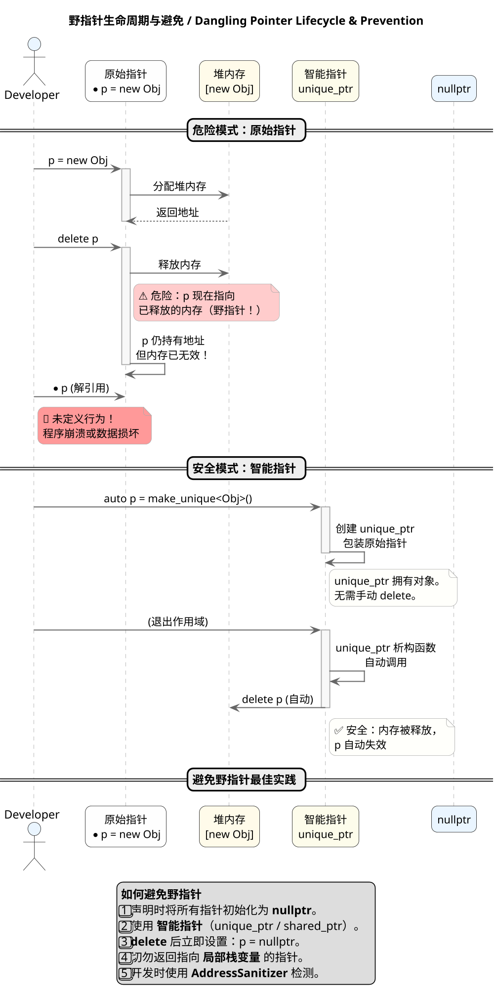
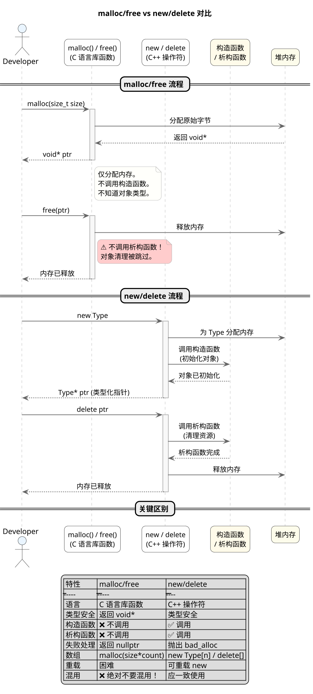
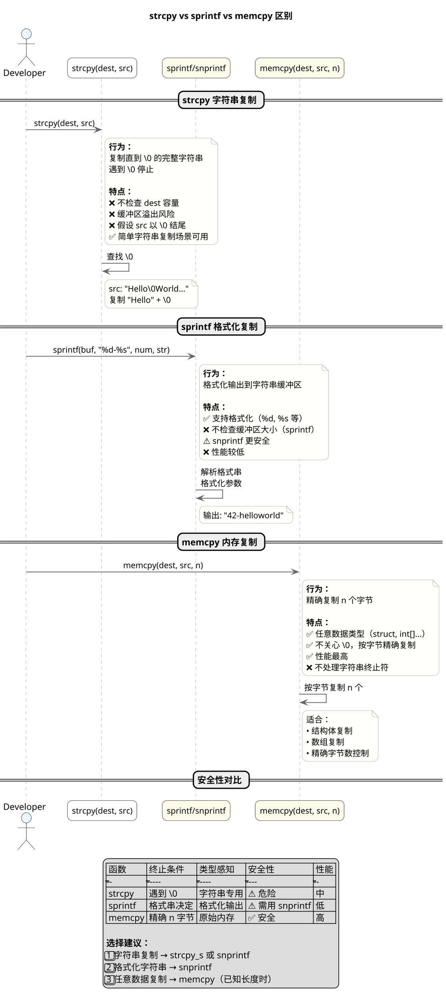
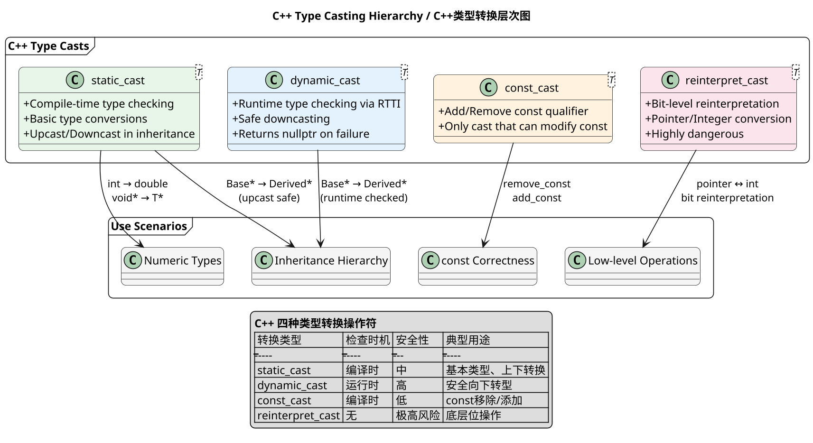
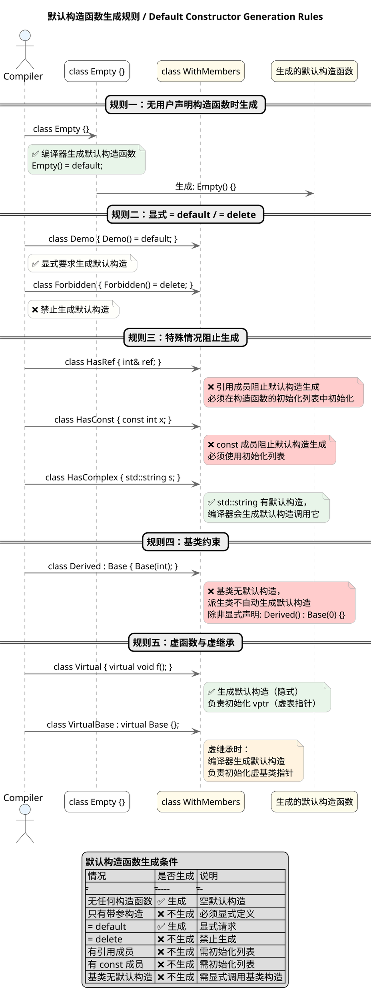
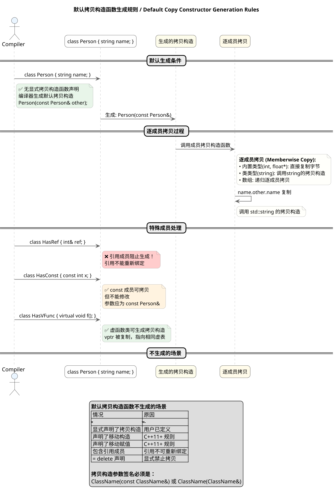
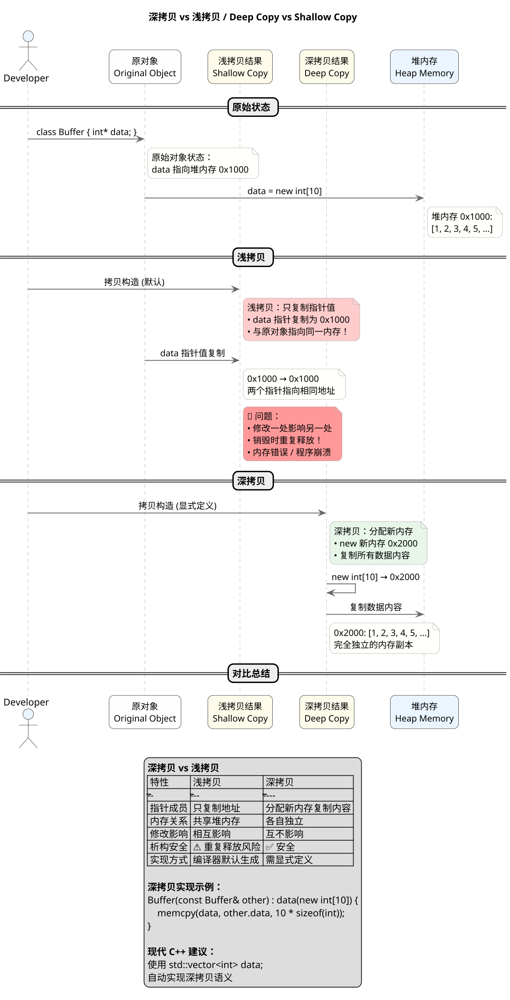

---

### How to Avoid Dangling Pointers

**Principle:**
A dangling pointer is a pointer that references memory that has been freed or is otherwise invalid. Its dangers cannot be underestimated—in C++, dangling pointers are one of the primary causes of program crashes, data corruption, and security vulnerabilities. Common scenarios that produce dangling pointers include: pointers not set to `nullptr` after `delete`, returning addresses of local stack variables, pointers not updated after memory migration, etc. Since pointers only store addresses without the ability to sense memory validity, accessing a dangling pointer leads to undefined behavior.

Core strategies to prevent dangling pointers: First, initialize pointers to `nullptr` immediately upon declaration to establish a clear "empty" state. Second, prefer using smart pointers (`std::unique_ptr`, `std::shared_ptr`) for dynamic memory management—they automatically release resources through RAII. Third, immediately set pointers to `nullptr` after deleting objects, making subsequent dereferences predictably crash rather than access garbage data. Fourth, strictly prohibit returning addresses of local stack variables. Fifth, use AddressSanitizer (ASan) and similar tools during development to detect memory issues.

Best practice in modern C++ is to replace raw pointers with **value semantics** and **smart pointers**, making memory ownership explicit and fundamentally eliminating dangling pointer problems.

**PlantUML Diagram:**



---

### Difference Between malloc/free and new/delete

**Principle:**
In C++, `malloc`/`free` and `new`/`delete` represent two fundamentally different memory management paradigms. `malloc` is a C standard library function that only allocates raw bytes of a specified size without involving object construction; while `new` is a C++ expression that not only allocates memory but also calls the constructor to complete object initialization. Similarly, `delete` calls the destructor before releasing memory, while `free` only returns the raw memory block. This essential difference causes their behaviors in object-oriented programming to be completely different.

From technical details: `malloc(size)` returns `void*`, requiring manual byte calculation and being type-unsafe; `new Type` automatically calculates size and returns a typed pointer (`Type*`), being type-safe. If you construct C++ objects with `malloc`, constructors are not called and objects remain uninitialized. Upon allocation failure, `malloc` returns `nullptr`, while `new` throws `std::bad_alloc` exception by default (can be changed via `nothrow`). Additionally, `new` can be overloaded to implement custom memory allocation strategies, while `malloc`/`free` cannot be replaced.

Core principle: **Never mix C and C++ memory management APIs**. C++ objects use `new`/`delete`, C-style memory uses `malloc`/`free`. Modern C++ prefers smart pointers and containers to completely avoid raw memory operations.

**PlantUML Diagram:**



---

### extern Keyword的作用

**Principle:**
The `extern` keyword in C/C++ is used to declare external linkage and modify linkage behavior. It does not allocate storage space itself but tells the compiler that this variable or function exists elsewhere. There are three main application scenarios for `extern`: First, declaring global variables or functions to share them across multiple source files; Second, restoring external linkage for `const` global variables (otherwise `const` variables have internal linkage by default); Third, declaring functions written in other languages (such as C functions) in C++ or functions to be called by other languages.

When calling C language functions from C++ files, since C++ supports function overloading while C does not, their symbol naming rules differ. At this point, `extern "C"` needs to be used to tell the compiler to handle function names in C style, avoiding linking errors. Conversely, if you want C++ functions to be called by C code, you also need to declare them with `extern "C"` on the C++ side. The `extern` keyword enables programs to establish correct symbol reference relationships between compilation units, forming the foundation for modular programming and mixed-language programming.

**PlantUML Diagram:**

```plantuml
@startuml
' =================== 全局样式 ===================
skinparam dpi 160
skinparam shadowing false
skinparam roundcorner 15
skinparam sequenceArrowThickness 1.3
skinparam sequenceMessageAlign center
skinparam ParticipantPadding 15
skinparam BoxPadding 15
skinparam ArrowColor #666
skinparam ArrowThickness 1.2
skinparam SequenceLifeLineBorderColor #AAAAAA
skinparam SequenceLifeLineBackgroundColor #F8F8F8
skinparam NoteBackgroundColor #FFFFFB
skinparam NoteBorderColor #AAA
skinparam ParticipantFontSize 13
skinparam ActorFontSize 14
skinparam SequenceDividerFontSize 14

title **extern 关键字作用 / extern Keyword Mechanism**

package "多文件共享 / Multi-file Sharing" <<Frame>> {
  file "file1.cpp" as F1 #FEFEFE
  file "file2.cpp" as F2 #FEFEFE
  
  F1 -> F2 : extern int global_var;
  note right of F1
    extern 声明：
    "global_var 定义在别处"
    不分配空间，只声明存在
  end note
  
  F1 -> F2 : extern void func();
  note right of F1
    声明函数存在于其他文件
  end note
}

package "extern const 链接性 / extern const Linkage" <<Frame>> {
  file "module.cpp" as M #E8F5E9
  file "main.cpp" as MAIN #E3F2FD
  
  M -> MAIN : extern const int BUFFER_SIZE;
  note right of M
    const 默认内部链接性
    extern 恢复外部链接性
    使其可被其他文件访问
  end note
}

package "C/C++ 混合编程 / C/C++ Interop" <<Frame>> {
  class "C++ 代码" as CPP #FEFEFE
  class "C 函数库" as CLIB #FFFBEA
  
  CPP -> CLIB : extern "C" void c_func();
  note bottom of CPP
    extern "C" 告诉编译器：
    • 按 C 风格命名（无名字修饰）
    • 不进行函数重载处理
    • 产生纯 C 符号
  end note
  
  note bottom of CLIB
    常见场景：
    • 调用 C 标准库
    • 调用第三方 C 库
    • 被 C 代码调用
  end note
}

legend center
**extern 核心用法**
| 用法 | 作用 |
|-----|------|
| extern int x; | 声明外部全局变量 |
| extern void f(); | 声明外部函数 |
| extern const int y; | 恢复 const 外部链接性 |
| extern "C" f(); | C 风格链接声明 |

**注意：** extern 仅是声明，不定义，不分配空间
endlegend
@enduml
```

---

### Difference Between strcpy, sprintf and memcpy

**Principle:**
`strcpy`, `sprintf`, and `memcpy` are three commonly used memory/string manipulation functions in C/C++, but despite their similar names, they differ significantly in functionality, usage, and safety. Understanding these differences is crucial for writing secure and efficient code.

`strcpy(dest, src)` is a string copy function that copies the complete string from `src` until encountering the null character `\0` to `dest`. This function assumes `dest` has sufficient space and `src` is a valid `\0`-terminated string. The major problem with `strcpy` is that it **does not check destination buffer size**—if the `src` string length exceeds `dest` capacity, buffer overflow occurs, which is a major source of security vulnerabilities. `strcpy_s` is its safe version that checks size and returns an error code.

`sprintf`/`snprintf` are formatted output functions that write formatted data to strings. `sprintf(formatted_str, "value is %d, name is %s", num, str)` is similar to `printf` but outputs to a buffer instead of the terminal. `snprintf` is the safe version, specifying the maximum number of characters to write to avoid buffer overflow. `sprintf` conveniently performs type conversion and formatting but has lower performance and security issues.

`memcpy(dest, src, n)` is a raw memory copy function that copies exactly `n` bytes from `src` to `dest`, **not caring whether the data content is a string or checking for `\0`**. It copies byte-by-byte, suitable for copying arbitrary data types including structures and arrays. `memcpy` is the highest performance among the three, especially in scenarios requiring precise control over copied bytes.

**PlantUML Diagram:**



---

### c/c++ 中强制类型转换使用场景 / Type Casting Scenarios in C/C++

**Principle:**
In C/C++, type casting is an essential part of program design. C++ provides four type casting operators: `static_cast`, `dynamic_cast`, `const_cast`, and `reinterpret_cast`, each with specific use cases and behavioral characteristics. Understanding the underlying principles of these casts is crucial for writing safe and efficient code.

`static_cast` is primarily used for conversions between basic types and for up/down casting in class hierarchies with inheritance relationships. It performs type checking at compile time and is suitable for scenarios with clearly defined conversion rules, such as `int` to `double` conversions or base class pointer to derived class pointer conversions. `dynamic_cast` is mainly used for safe downcasting, performing type checking at runtime through RTTI (Run-Time Type Information). If the conversion is unsafe, it returns `nullptr` (for pointers) or throws a `bad_cast` exception (for references). `const_cast` is used to remove or add `const` qualifiers, and it is the only cast that can modify the value of a `const` variable. `reinterpret_cast` is the most dangerous cast, reinterpreting the bit pattern of one type as another type, typically used for low-level operations such as conversions between pointers and integers.

**PlantUML Diagram:**



---

### When Default Constructor is Generated

**Principle:**
A default constructor is a constructor automatically generated by the C++ compiler when a class does not explicitly declare any constructors. More precisely, the compiler generates a default constructor **when the class has no user-declared constructors**. This auto-generated default constructor performs default initialization on fundamental type members (built-in types are not initialized, class types call their default constructors).

Five important situations to note: First, if a class contains reference members, `const` members, or class members with parameterized constructors, the compiler will not generate a default constructor. Second, classes with virtual functions generate vtable pointers, and classes with virtual inheritance generate virtual base class pointers. Third, the generation of default constructors is also affected by `= default` and `= delete`—explicitly declaring `= default` generates a default implementation, while explicitly declaring `= delete` prohibits generation. Fourth, if a class is derived from a base class without a default constructor, and the derived class needs to initialize the base class, the default constructor will not be auto-generated. Fifth, template classes also do not auto-generate default constructors in certain situations.

**PlantUML Diagram:**



---

### When Default Copy Constructor is Generated

**Principle:**
A default copy constructor is a copy constructor automatically generated by the compiler to create a new object following copy semantics. **When a class does not explicitly declare a copy constructor**, the compiler generates a default copy constructor. This auto-generated copy constructor performs memberwise copy on data members: for built-in types, bytes are directly copied; for class types, their copy constructors are recursively called.

Five important situations to note: First, if a class contains reference members, because references must be bound at initialization and cannot be rebound, the compiler will not generate a default copy constructor. Second, if a class contains `const` members or types with `const` qualification, the generated copy constructor cannot directly modify these members and needs to use `const` qualification in parameters. Third, classes with virtual functions involve copying vtable pointers, which is safe—the new object's vptr will point to the same vtable as the original object. Fourth, if a class declares move constructors or move assignment operators, the copy constructor may not be automatically generated (depending on context). Fifth, when a class involves virtual inheritance, copy constructor generation is more complex and requires proper handling of virtual base subobjects.

**PlantUML Diagram:**



---

### Deep Copy vs Shallow Copy

**Principle:**
Deep copy and shallow copy are two different strategies for handling object copying in object-oriented programming. Their core difference lies in how they treat pointer-type data members. In shallow copy, when performing memberwise copy, pointer-type members only copy the address value—that is, both objects' pointer members point to the same heap memory. In deep copy, new memory is allocated for the new object, and data content is copied over, ensuring the new object and original object are completely independent.

Suppose a class contains a pointer member `int* p`. After shallow copy, both objects share the same memory; modifying one object's data affects the other, which leads to potential memory management issues (such as double-free). Deep copy creates an independent copy; modifying one object does not affect the other at all. In C++, if a class contains pointer members and requires correct copy semantics, you should explicitly define copy constructors and copy assignment operators to implement deep copy. If not explicitly defined, the compiler-generated default copy constructor and default copy assignment operator only perform shallow copy.

For modern C++, the better approach is to avoid using raw pointers and instead use RAII containers like `std::vector`, `std::string`, or smart pointers to manage memory. These containers themselves implement correct copy semantics (deep copy) without manual management.

**PlantUML Diagram:**



---

