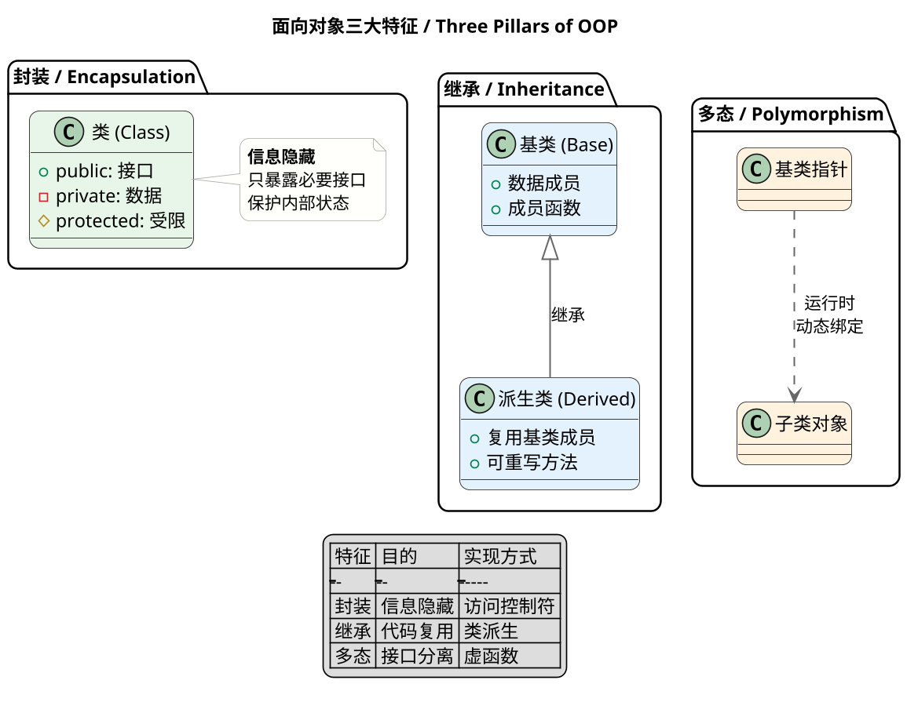
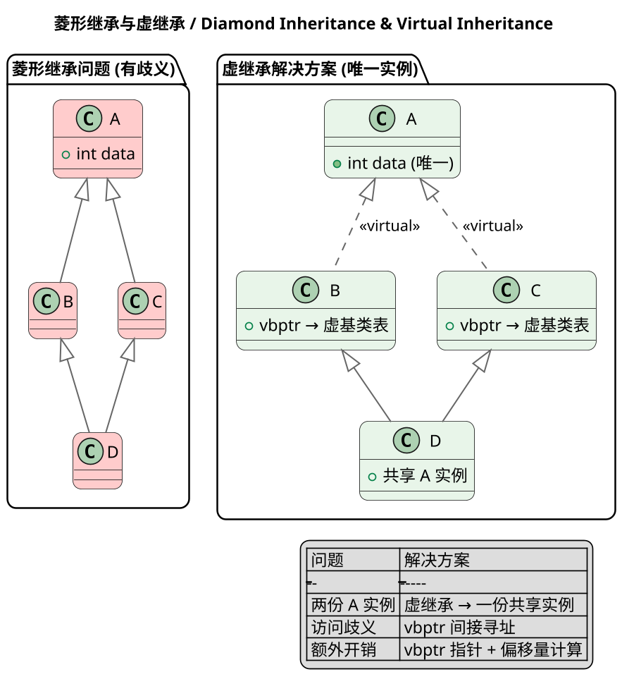
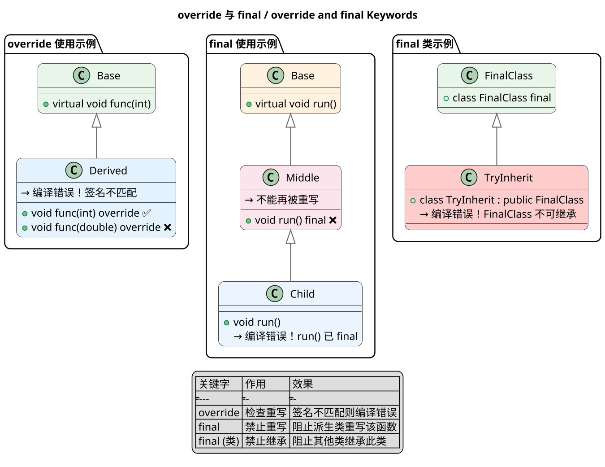
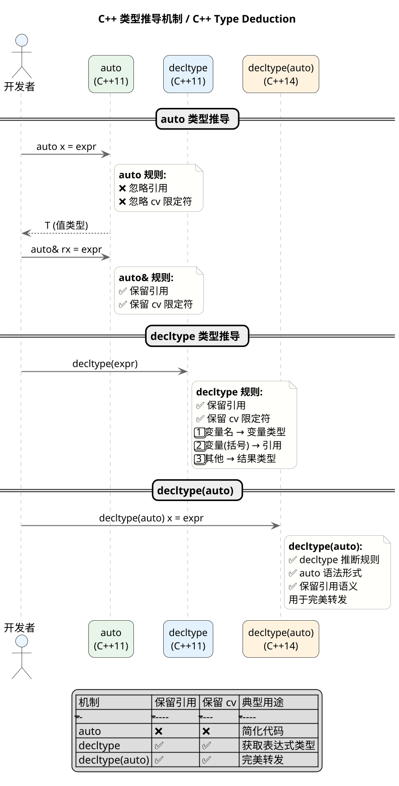
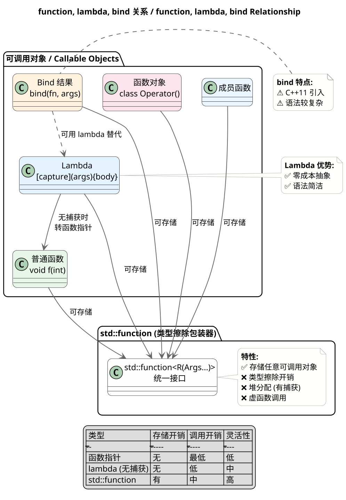
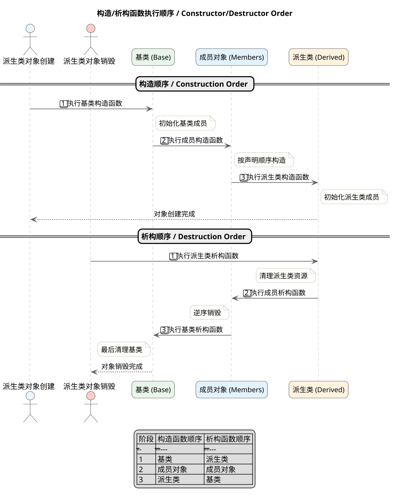
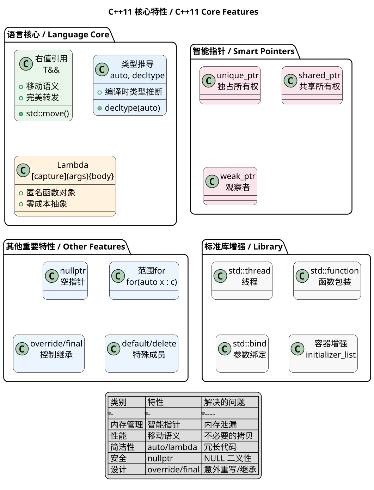
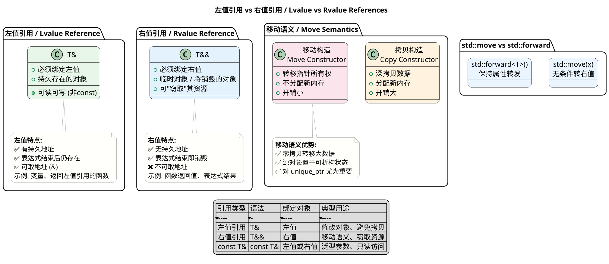

## C++ Object-Oriented Programming, Common Interview Questions

---

### Three Pillars of OOP

**Principle:**
Encapsulation organizes data and operations into an independent unit (class) and uses access specifiers to restrict direct access to internal members. Inheritance creates hierarchical class relationships, allowing subclasses to reuse data and behavior from parent classes. Polymorphism allows the same operation to produce different results on different objects through static or dynamic binding.

**PlantUML Diagram:**



---

### Polymorphism Implementation Principle

**Principle:**
C++ polymorphism relies on **vtables (virtual function tables)** and **vptrs (virtual function table pointers)**. When a class contains at least one virtual function, the compiler creates a vtable for that class. Each object contains a hidden vptr at the start of its memory layout, pointing to the class's vtable.

**PlantUML Diagram:**

```plantuml
@startuml
skinparam dpi 160
skinparam shadowing false
skinparam roundcorner 15
skinparam sequenceArrowThickness 1.3
skinparam sequenceMessageAlign center
skinparam ParticipantPadding 15
skinparam BoxPadding 15
skinparam ArrowColor #666
skinparam ArrowThickness 1.2
skinparam SequenceLifeLineBorderColor #AAAAAA
skinparam SequenceLifeLineBackgroundColor #F8F8F8
skinparam NoteBackgroundColor #FFFFFB
skinparam NoteBorderColor #AAA
skinparam ParticipantFontSize 13
skinparam ActorFontSize 14
skinparam SequenceDividerFontSize 14

title **多态实现原理 / Polymorphism Implementation**

package "对象内存布局 / Object Memory Layout" {
  object "对象 obj" as OBJ #E8F5E9 {
    {field} vptr (隐藏) → 指向 vtable
    {field} 成员变量1
    {field} 成员变量2
  }
}

package "虚函数表 / vtable" {
  class "Base vtable" as BASE_VTBL #E3F2FD {
    + slot[0]: Base::func1()
    + slot[1]: Base::func2()
  }
  
  class "Derived vtable" as DERIVED_VTBL #E3F2FD {
    + slot[0]: Derived::func1() ← 重写
    + slot[1]: Base::func2()
  }
}

package "动态绑定过程 / Dynamic Binding" {
  actor "调用者" as CALLER #FFF3E0
  participant "Base* ptr" as PTR #FCE4EC
  participant "vptr 查找" as VLOOKUP #EAF5FF
  participant "vtable 派发" as VDISPATCH #EAF5FF
  participant "实际函数" as FUNC #F8F8F8
}

== 动态绑定流程 ==

CALLER -> PTR : ptr->virtualFunc()
PTR -> VLOOKUP : 通过 vptr 找到 vtable
VLOOKUP -> VDISPATCH : 查找 slot[index]
VDISPATCH -> FUNC : 跳转到函数地址
FUNC --> CALLER : 执行实际函数

legend center
| 概念 | 说明 |
|------|------|
| vptr | 对象中的隐藏指针，指向 vtable |
| vtable | 类级别的函数指针数组 |
| slot | vtable 中每个虚函数的索引 |
| 动态绑定 | 运行时通过 vptr 查找实际函数 |
endlegend

@enduml
```

---

### Diamond Inheritance Problem

**Principle:**
Diamond inheritance occurs when class A is base, B and C inherit from A, and D inherits from both B and C, creating two copies of A's members. **Virtual inheritance** using the `virtual` keyword ensures the common base class has only **one shared instance**.

**PlantUML Diagram:**



---

### override and final Keywords

**Principle:**
**override** (C++11) explicitly marks a derived class function as overriding a base class virtual function. The compiler checks if the function actually overrides; if not, it produces an error. **final** (C++11) restricts inheritance or overriding.

**PlantUML Diagram:**



---

### C++ Type Deduction

**Principle:**
**auto** (C++11) deduces variable type from initializer, ignoring references and cv-qualifiers. **decltype** (C++11) deduces type from expressions, preserving references and cv-qualifiers. **decltype(auto)** (C++14) combines both.

**PlantUML Diagram:**



---

### Relationship Between function, lambda, bind

**Principle:**
**std::function** is a type-erased wrapper storing any callable matching a signature. **Lambda** (C++11) creates anonymous callables at compile time with zero-cost abstraction for uncaptured lambdas. **std::bind** (C++11) creates function objects with pre-bound arguments.

**PlantUML Diagram:**



---

### Constructor and Destructor Execution Order

**Principle:**
**Constructor order**: Base → Member objects → Derived. **Destructor order**: Derived → Member objects → Base (reverse of construction). During base construction, virtual function calls don't reach derived overrides.

**PlantUML Diagram:**



---

### vtable and vptr Creation Timing

**Principle:**
**vtable creation**: At **compile time**, per-class, storing virtual function addresses. **vptr initialization**: During **object construction**, set to point to current class's vtable. In multiple inheritance, multiple vptrs exist—one per direct base class.

**PlantUML Diagram:**

```plantuml
@startuml
skinparam dpi 160
skinparam shadowing false
skinparam roundcorner 15
skinparam sequenceArrowThickness 1.3
skinparam sequenceMessageAlign center
skinparam ParticipantPadding 15
skinparam BoxPadding 15
skinparam ArrowColor #666
skinparam ArrowThickness 1.2
skinparam SequenceLifeLineBorderColor #AAAAAA
skinparam SequenceLifeLineBackgroundColor #F8F8F8
skinparam NoteBackgroundColor #FFFFFB
skinparam NoteBorderColor #AAA
skinparam ParticipantFontSize 13
skinparam ActorFontSize 14
skinparam SequenceDividerFontSize 14

title **vtable 与 vptr 创建时机 / vtable & vptr Creation Timing**

package "编译时 / Compile Time" {
  class "Base 类" as BASE_CLASS #E8F5E9 {
    + virtual void func1()
    + virtual void func2()
  }
  
  class "Derived 类" as DERIVED_CLASS #E3F2FD {
    + virtual void func1() ← 重写
    + virtual void func2()
    + virtual void func3() ← 新增
  }
  
  note right of BASE_CLASS
    **Base vtable:**
    slot[0] → Base::func1
    slot[1] → Base::func2
  end note
  
  note right of DERIVED_CLASS
    **Derived vtable:**
    slot[0] → Derived::func1
    slot[1] → Base::func2
    slot[2] → Derived::func3
  end note
}

package "运行时 - 构造过程中 / Runtime - During Construction" {
  actor "派生类对象构造" as CTOR #FFF3E0
  participant "vptr (初始)" as VPTR1 #FCE4EC
  participant "vptr (更新后)" as VPTR2 #FCE4EC
  
  CTOR -> VPTR1 : 基类构造阶段
  note left of VPTR1
    vptr → Base vtable
    调用虚函数 → Base 版本
  end note
  
  CTOR -> VPTR2 : 派生类构造阶段
  note left of VPTR2
    vptr → Derived vtable
    调用虚函数 → Derived 版本
  end note
}

package "多重继承情况" {
  class "Derived 多继承" as MULTI #EAF5FF {
    + vptr_A → A vtable
    + vptr_B → B vtable
  }
  
  note bottom of MULTI
    **每个直接基类一个 vptr**
    指向各自的 vtable
  end note
}

legend center
| 阶段 | vptr 状态 | 虚函数调用目标 |
|------|----------|--------------|
| 编译时 | 不存在 | vtable 生成 |
| 基类构造 | → Base vtable | Base 版本 |
| 派生类构造 | → Derived vtable | Derived 版本 |
| 析构函数 | → 当前类 vtable | 当前类版本 |
endlegend

@enduml
```

---

### Virtual Destructor Purpose

**Principle:**
**Virtual destructors** ensure proper cleanup when deleting derived objects through base pointers. If ~Base() is non-virtual, only ~Base() executes, leaking derived resources. Making the destructor virtual enables the full destruction chain through vtable dispatch.

**PlantUML Diagram:**

```plantuml
@startuml
skinparam dpi 160
skinparam shadowing false
skinparam roundcorner 15
skinparam sequenceArrowThickness 1.3
skinparam sequenceMessageAlign center
skinparam ParticipantPadding 15
skinparam BoxPadding 15
skinparam ArrowColor #666
skinparam ArrowThickness 1.2
skinparam SequenceLifeLineBorderColor #AAAAAA
skinparam SequenceLifeLineBackgroundColor #F8F8F8
skinparam NoteBackgroundColor #FFFFFB
skinparam NoteBorderColor #AAA
skinparam ParticipantFontSize 13
skinparam ActorFontSize 14
skinparam SequenceDividerFontSize 14

title **虚析构函数作用 / Virtual Destructor Purpose**

package "非虚析构函数问题" {
  class "Base (非虚析构)" as BASE_NONVIRT #FFCCCC {
    + ~Base() ❌ 非虚
  }
  
  class "Derived" as DERIVED_NONVIRT #FFCCCC {
    + ~Derived()
    + 分配了资源
  }
  
  note bottom of BASE_NONVIRT
    **问题:**
    Base* p = new Derived();
    delete p; // 只调用 ~Base()
    // ~Derived() 不会被调用！
    // 内存泄漏
  end note
}

package "虚析构函数解决方案" {
  class "Base (虚析构)" as BASE_VIRT #E8F5E9 {
    + virtual ~Base() ✅
  }
  
  class "Derived" as DERIVED_VIRT #E8F5E9 {
    + ~Derived()
    + 释放资源
  }
  
  note bottom of BASE_VIRT
    **解决方案:**
    Base* p = new Derived();
    delete p; // 通过 vptr 调用
    // ~Derived() → ~Base()
    // 完整析构链！
  end note
}

package "删除对象时" {
  actor "delete p" as DELETE #FFF3E0
  participant "~Derived()" as DTOR_D #FCE4EC
  participant "~Base()" as DTOR_B #FCE4EC
  
  DELETE -> DTOR_D : 通过 vptr 找到
  DTOR_D -> DTOR_B : 自动调用
  DTOR_B --> DELETE : 资源全部释放
}

legend center
| 析构函数类型 | delete 基类指针 | 析构链 |
|-------------|-----------------|-------|
| 非虚 | 只调用基类析构 | ❌ 不完整 |
| 虚 | 先派生后基类 | ✅ 完整 |
endlegend

@enduml
```

---

### Smart Pointer Types and Use Cases

**Principle:**
**std::unique_ptr** - exclusive ownership, auto-deletes on destruction, non-copyable but movable. **std::shared_ptr** - shared ownership via reference counting. **std::weak_ptr** - non-owning observer of shared_ptr, solves circular reference problems.

**PlantUML Diagram:**

```plantuml
@startuml
skinparam dpi 160
skinparam shadowing false
skinparam roundcorner 15
skinparam sequenceArrowThickness 1.3
skinparam sequenceMessageAlign center
skinparam ParticipantPadding 15
skinparam BoxPadding 15
skinparam ArrowColor #666
skinparam ArrowThickness 1.2
skinparam SequenceLifeLineBorderColor #AAAAAA
skinparam SequenceLifeLineBackgroundColor #F8F8F8
skinparam NoteBackgroundColor #FFFFFB
skinparam NoteBorderColor #AAA
skinparam ParticipantFontSize 13
skinparam ActorFontSize 14
skinparam SequenceDividerFontSize 14

title **智能指针种类 / Smart Pointer Types**

package "unique_ptr (独占所有权)" {
  class "unique_ptr<T>" as UNIQUE #E8F5E9 {
    + T* ptr
    + 独占对象
  }
  
  note bottom of UNIQUE
    **特点:**
    ✅ 独占所有权
    ✅ 自动释放
    ✅ 无引用计数开销
    ❌ 不可复制
    ✅ 可移动
  end note
  
  UNIQUE -> [T] : 拥有
}

package "shared_ptr (共享所有权)" {
  class "shared_ptr<T>" as SHARED1 #E3F2FD {
    + T* ptr
    + 控制块 (ref count)
  }
  
  class "shared_ptr<T>" as SHARED2 #E3F2FD {
    + T* ptr
    + 控制块 (ref count)
  }
  
  class "T 对象" as TOK #FFF3E0
  
  SHARED1 -> TOK : 共享所有权
  SHARED2 -> TOK : 共享所有权
  
  note bottom of SHARED1
    **特点:**
    ✅ 共享所有权
    ✅ 引用计数
    ❌ 引用计数开销
    ✅ 可复制
  end note
}

package "weak_ptr (观察者)" {
  class "weak_ptr<T>" as WEAK #FCE4EC {
    + 不参与引用计数
    + 观察 shared_ptr
  }
  
  class "shared_ptr<T>" as SHARED3 #E3F2FD
  class "T 对象" as TOBJ #FFF3E0
  
  WEAK --> SHARED3 : 观察
  SHARED3 --> TOBJ : 拥有
  
  note bottom of WEAK
    **特点:**
    ✅ 不参与引用计数
    ✅ 打破循环引用
    ⚠️ 需 lock() 转换为 shared_ptr
  end note
}

package "使用场景" {
  object "单独拥有对象" as USE1 #F8F8F8
  object "多个所有者" as USE2 #F8F8F8
  object "打破循环引用" as USE3 #F8F8F8
  
  USE1 ..> UNIQUE : unique_ptr
  USE2 ..> SHARED1 : shared_ptr
  USE3 ..> WEAK : weak_ptr
}

legend center
| 类型 | 所有权 | 复制 | 移动 | 引用计数 | 典型场景 |
|------|-------|------|------|---------|---------|
| unique_ptr | 独占 | ❌ | ✅ | 无 | 单所有者 |
| shared_ptr | 共享 | ✅ | ✅ | 有 | 多所有者 |
| weak_ptr | 无 | ✅ | ✅ | 无 | 观察者 |
endlegend

@enduml
```

---

### C++11 Features

**Principle:**
**Key C++11 features**: Rvalue references and move semantics enable resource stealing from temporaries. auto and decltype provide type deduction. Lambda expressions create anonymous function objects. Smart pointers automate memory management. nullptr solves NULL ambiguity.

**PlantUML Diagram:**



---

### Dynamic vs Static Libraries

**Principle:**
**Static libraries** are linked at compile time—object code is copied into the executable. **Dynamic libraries** are loaded at runtime—only references are stored. Static libraries offer simpler deployment but less flexibility; dynamic libraries save memory through sharing.

**PlantUML Diagram:**

```plantuml
@startuml
skinparam dpi 160
skinparam shadowing false
skinparam roundcorner 15
skinparam sequenceArrowThickness 1.3
skinparam sequenceMessageAlign center
skinparam ParticipantPadding 15
skinparam BoxPadding 15
skinparam ArrowColor #666
skinparam ArrowThickness 1.2
skinparam SequenceLifeLineBorderColor #AAAAAA
skinparam SequenceLifeLineBackgroundColor #F8F8F8
skinparam NoteBackgroundColor #FFFFFB
skinparam NoteBorderColor #AAA
skinparam ParticipantFontSize 13
skinparam ActorFontSize 14
skinparam SequenceDividerFontSize 14

title **静态库 vs 动态库 / Static vs Dynamic Libraries**

package "静态链接 / Static Linking" {
  file "libxxx.a" as STATIC_LIB #E8F5E9
  file "main.o" as OBJ #E8F5E9
  file "program (可执行文件)" as EXEC_STATIC #E8F5E9
  
  STATIC_LIB --> EXEC_STATIC : 链接器复制
  OBJ --> EXEC_STATIC : 链接器合并
}

package "动态链接 / Dynamic Linking" {
  file "libxxx.so" as DYN_LIB #E3F2FD
  file "main.o" as OBJ_DYN #E3F2FD
  file "program" as EXEC_DYN #E3F2FD
  
  DYN_LIB ..> EXEC_DYN : 运行时加载\n(引用关系)
  OBJ_DYN --> EXEC_DYN : 链接器记录
}

package "运行时对比" {
  object "程序A" as PROG_A #FFF3E0
  object "程序B" as PROG_B #FFF3E0
  object "libxxx.so (共享)" as SHARED_LIB #FCE4EC
  
  PROG_A --> SHARED_LIB : 共享
  PROG_B --> SHARED_LIB : 共享
  
  note bottom of SHARED_LIB
    **动态库优点:**
    ✅ 内存共享
    ✅ 独立更新
    ❌ 需部署 .so 文件
  end note
}

legend center
| 特性 | 静态库 | 动态库 |
|------|-------|-------|
| 链接时机 | 编译时 | 运行时 |
| 代码存储 | 复制到可执行文件 | 独立文件 |
| 内存占用 | 多程序多副本 | 共享一份 |
| 更新维护 | 需重新编译 | 可独立更新 |
| 部署 | 简单 (自包含) | 需带库文件 |
endlegend

@enduml
```

---

### Lvalue vs Rvalue References

**Principle:**
**Lvalue references** (`T&`) bind to persistent objects. **Rvalue references** (`T&&`, C++11) bind to temporaries, enabling move semantics—transferring resources instead of copying, significantly improving performance.

**PlantUML Diagram:**



---

