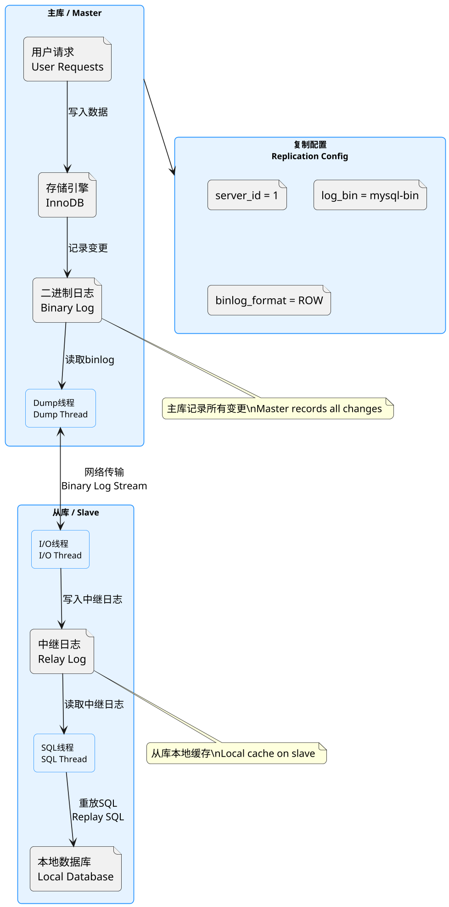
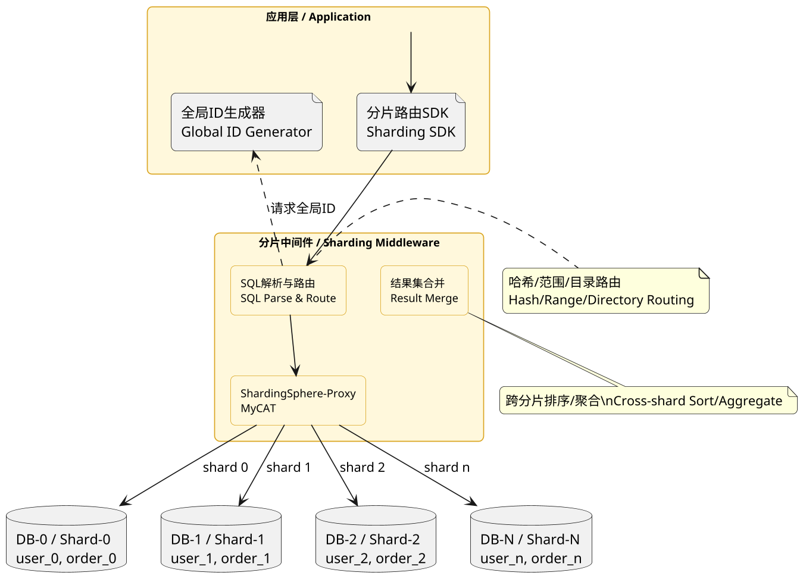
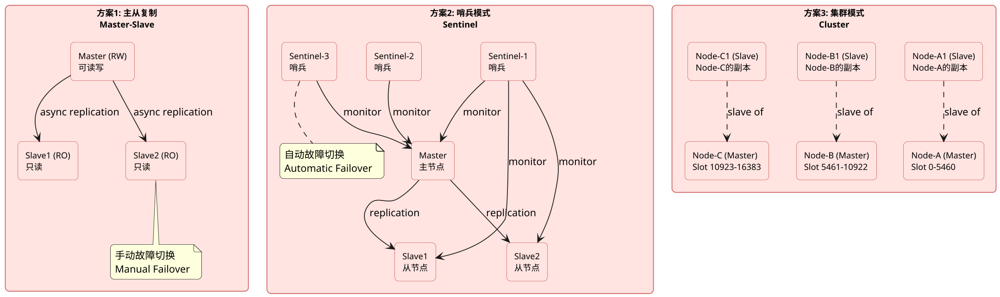
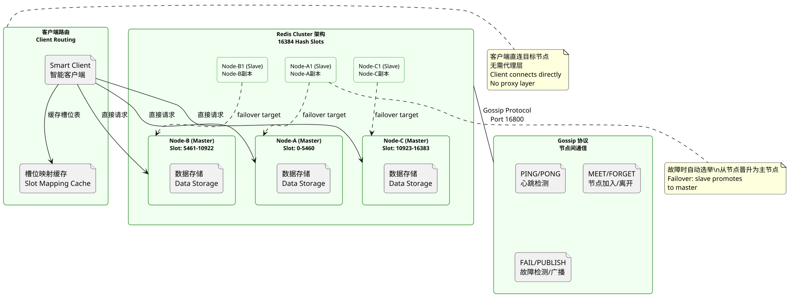

## Database Clustering, Common Interview Questions

### MySQL Master-Slave Replication Principle

**Principle:**
MySQL Master-Slave Replication is MySQL's built-in data synchronization mechanism, asynchronously replicating DDL and DML operations from a master database to one or more slaves for redundancy, read/write splitting, and load balancing. The core principle: the master writes all data changes to Binary Log; the slave's I/O thread connects to master, fetches binary log content into local Relay Log; the slave's SQL thread reads Relay Log and replays SQL statements locally, achieving data synchronization with the master.

Key technical points include: binary log format (STATEMENT, ROW, MIXED — affects data volume and precision), replication filtering rules (`replicate-do-db`, `replicate-wild-do-table`), causes of replication lag and monitoring (`Seconds_Behind_Master` in `Show Slave Status\G`), and GTID (Global Transaction Identifier) replication mode (uses unique transaction identifiers, no need to specify log file names/positions, simplifies failover). Production Master-Slave typically works with connection pools and read/write splitting middleware (MySQL Proxy, Atlas, ShardingSphere) for automatic query distribution.

**PlantUML Diagram:**

---

### MySQL Database and Table Sharding

**Principle:**
MySQL sharding (horizontal partitioning) addresses explosive data growth by splitting data across multiple tables/databases based on rules (hash, modulo, range), breaking through single-table/database performance bottlenecks. Database sharding distributes data across separate database instances, each with independent connections and storage. Table sharding splits one large table into multiple structurally identical tables. Sharding solves write bottlenecks, storage limits, and connection bottlenecks, but introduces complexity: cross-shard queries, distributed transactions, and routing.

Core concepts: Sharding Key — the critical field determining data distribution, typically high-frequency and evenly distributed in query conditions. Sharding algorithms: hash sharding (hash modulo, good for uniform distribution), range sharding (by time/ID range, good for ordered access), and directory sharding (mapping table, high flexibility but query overhead). Implementation approaches: middleware layer (ShardingSphere, MyCAT, Cobar) and application layer (client SDKs like Hibernate Shards, MyBatis Sharding). Production also needs global ID generation (Snowflake, UUID), cross-shard JOINs (denormalization, multiple queries), and distributed transactions (2PC, TCC, Saga).

**PlantUML Diagram:**

---

### Redis High Availability Solutions

**Principle:**
Three main Redis HA solutions: Master-Slave Replication, Sentinel, and Cluster. Master-Slave Replication is the basic approach — data asynchronously replicates from master to slaves for redundancy and read/write splitting. Master is read/write, slaves are read-only (default). When master fails, manual failover is needed. This solves backup and read scaling but not automatic failover.

Sentinel (Redis 2.8+) adds automatic failure detection and failover on top of Master-Slave. Sentinel processes monitor master/slave health (PING commands), notify applications of failures, and perform automatic failover (Raft-based election of new master, slaves redirect). A Sentinel cluster can monitor multiple Redis master-slave instances. Sentinel solves automatic failover but may have data loss during failover (async replication).

Cluster mode (Redis 3.0+) is a distributed solution using data sharding (16384 slots) across nodes with master-slave replicas per shard. Cluster provides both sharding and HA — when a slave detects master failure, it votes/elects a new master to continue serving. Cluster also supports online rescaling and automatic failover.

**PlantUML Diagram:**

---

### Redis-Cluster Cluster Principle

**Principle:**
Redis Cluster (Redis 3.0+) distributes data across nodes using hash slots (16384 total), computed as `CRC16(key) mod 16384`. Each node is responsible for a subset of slots. For a 6-node cluster (3 masters, 3 slaves), slots are roughly distributed: Node A 0-5460, Node B 5461-10922, Node C 10923-16383. When a client connects to any node, it receives full slot mapping (propagated via Gossip protocol), so clients can directly target the correct node without a proxy.

Redis Cluster HA uses master-slave replication and automatic failover. Each master can have one or more slaves. When a master fails, its slave initiates an election: slave requests votes from reachable nodes; if it receives a majority (> N/2 + 1), it promotes to master and starts accepting requests. Cluster also supports online resharding via `redis-trib` or `redis-cli --cluster` for horizontal scaling. Nodes communicate via Gossip protocol (port 16800) to propagate node liveness and topology changes.

**PlantUML Diagram:**

---

