## Design Patterns, Common Interview Questions
**English Translation**: The five SOLID principles are: Single Responsibility (one class, one purpose), Open/Closed (open for extension, closed for modification), Liskov Substitution (subclasses replaceable for base classes), Interface Segregation (many specific interfaces vs one general), and Dependency Inversion (depend on abstractions, not concretions).

**PlantUML Diagram:**

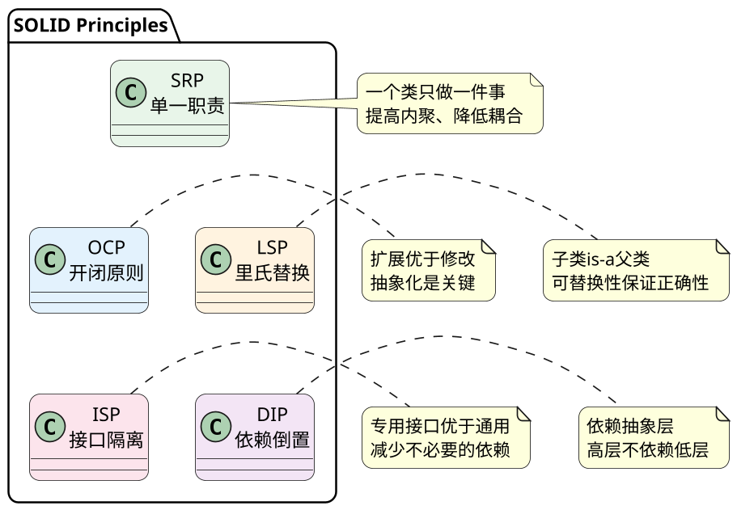
**English Translation**: Open/Closed Principle states that software entities should be open for extension but closed for modification. OCP is the ultimate goal of OO design. LSP enables OCP by ensuring proper inheritance hierarchies. ISP supports OCP by providing fine-grained interfaces. DIP is the key means to achieve OCP by depending on abstractions.

**PlantUML Diagram:**

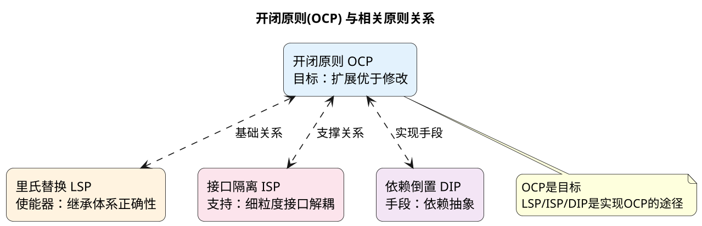
**English Translation**: Liskov Substitution Principle states that objects of a superclass should be replaceable with objects of its subclasses without breaking the application. Subtypes must be substitutable for their base types. The key is proper "is-a" relationship.

**PlantUML Diagram:**

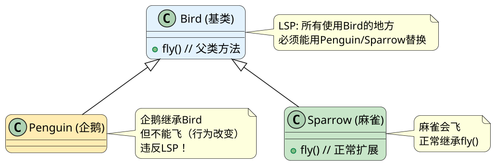
**English Translation**: Law of Demeter (Principle of Least Knowledge) states that an object should only interact with its direct friends - objects that are members, parameters, or created locally. It reduces coupling between components.

**PlantUML Diagram:**

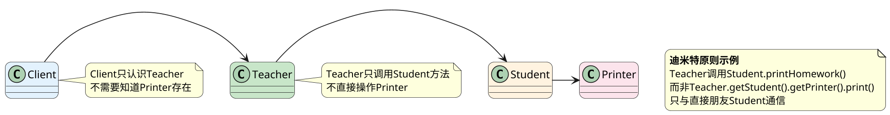
**English Translation**: Dependency Inversion Principle states that high-level modules should not depend on low-level modules; both should depend on abstractions. Abstractions should not depend on details; details should depend on abstractions.

**PlantUML Diagram:**

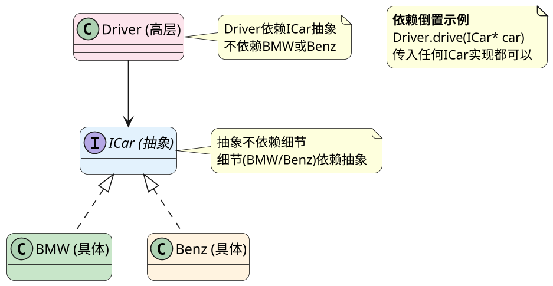
    static Singleton* getInstance() {
        if (instance == nullptr) {  // 第一次检查
            lock();
            if (instance == nullptr) {  // 第二次检查
                instance = new Singleton();
            }
            unlock();
        }
        return instance;
    }
private:
    static volatile Singleton* instance;
};

// Meyers单例（最推荐）
class Singleton {
public:
    static Singleton& getInstance() {
        static Singleton instance;  // C++11线程安全
        return instance;
    }
};
```

**English Translation**: Singleton pattern ensures a class has only one instance with global access. Thread safety is critical. Double-checked locking uses volatile and double checking. Meyers singleton leverages static local variable thread safety (C++11+).

**PlantUML Diagram:**

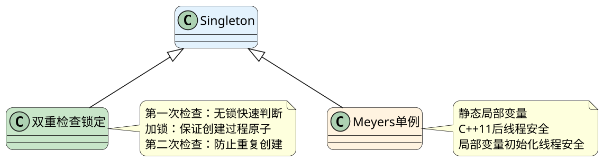
**English Translation**: Factory Method defines an interface for creating objects, letting subclasses decide. Abstract Factory provides an interface for creating families of related objects without specifying concrete classes.

**PlantUML Diagram:**

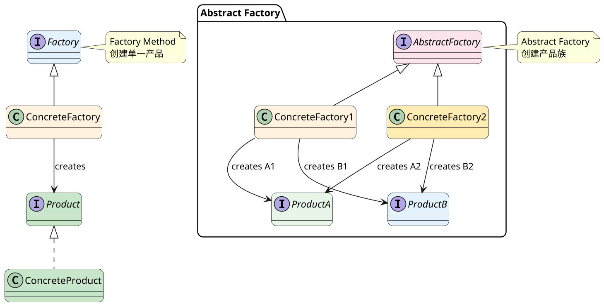
**English Translation**: Proxy pattern provides a surrogate to control access to another object. Types include static, dynamic (JDK/CGLib), virtual (lazy loading), protection (access control), and remote proxy.

**PlantUML Diagram:**

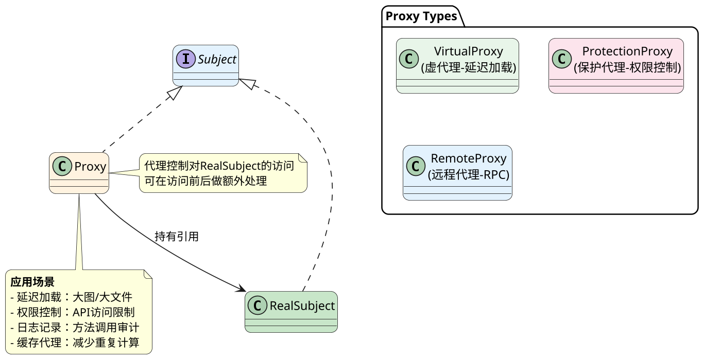
**English Translation**: Decorator pattern dynamically adds responsibilities to objects. Decorators implement the same interface as the wrapped object, providing flexible runtime composition instead of inheritance.

**PlantUML Diagram:**

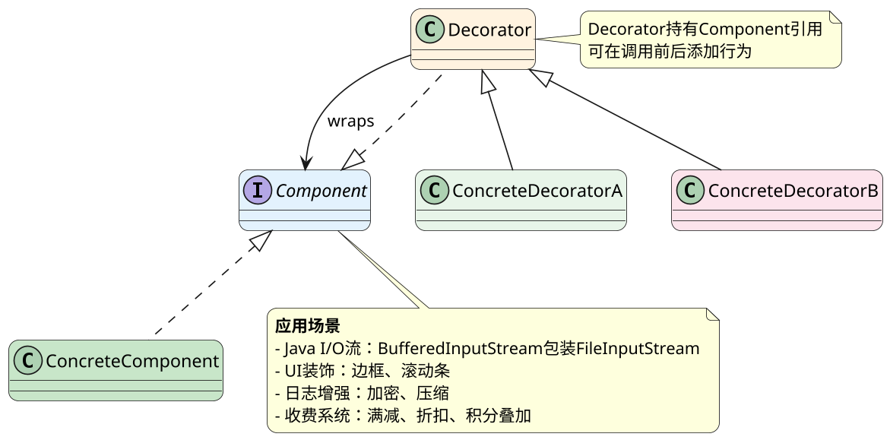
**English Translation**: Composite pattern composes objects into tree structures to represent part-whole hierarchies. Clients can treat individual objects and compositions uniformly.

**PlantUML Diagram:**

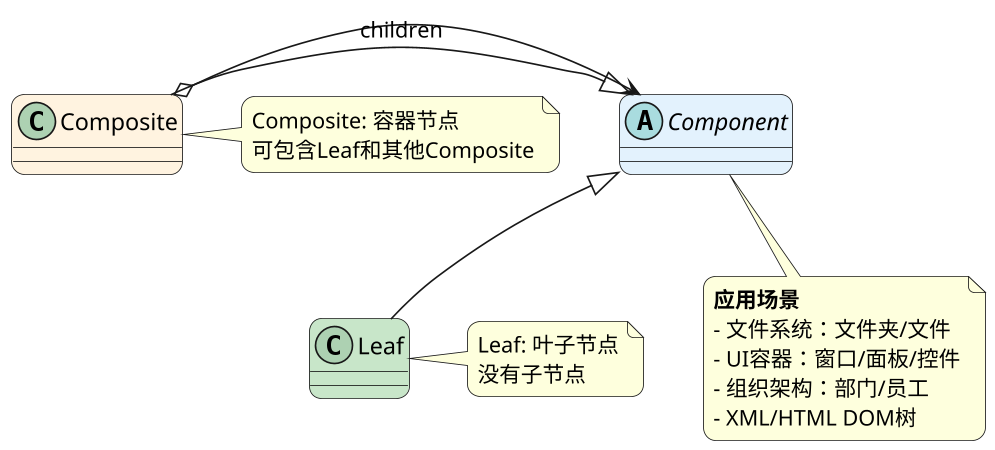
**English Translation**: Chain of Responsibility passes requests along a chain of handlers. Each handler decides to process the request or pass it to the next handler, decoupling sender and receiver.

**PlantUML Diagram:**

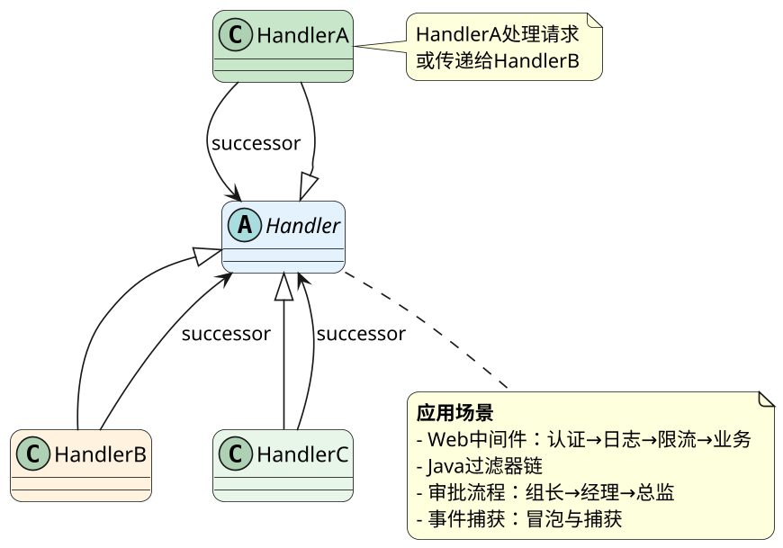
**English Translation**: Template Method defines the skeleton of an algorithm, deferring some steps to subclasses. The base class provides the algorithm structure, subclasses provide specific implementations.

**PlantUML Diagram:**

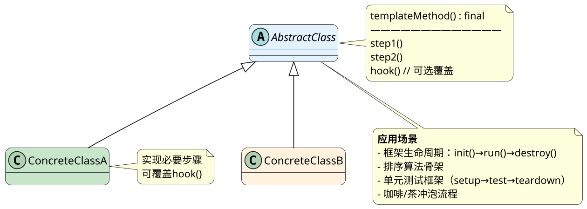
**English Translation**: Strategy pattern defines a family of algorithms, encapsulates each one, and makes them interchangeable. Strategies are independent; clients can select different algorithms.

**PlantUML Diagram:**

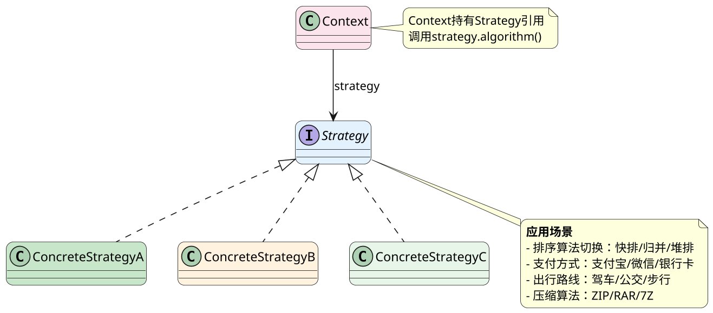
**English Translation**: Observer pattern defines a one-to-many dependency between objects. When the subject's state changes, all its observers are notified automatically.

**PlantUML Diagram:**

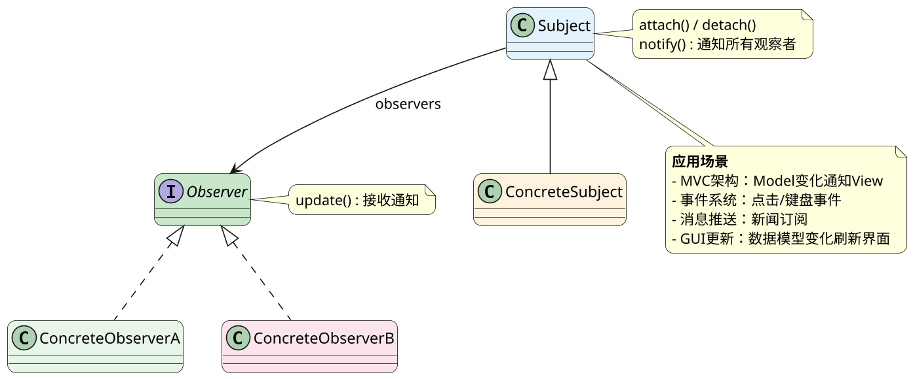

- MVC/MVVM架构（Model变化更新View）
- GUI事件系统（按钮点击监听）
- 消息订阅发布系统
- 股票行情推送
- 邮件/消息订阅通知

