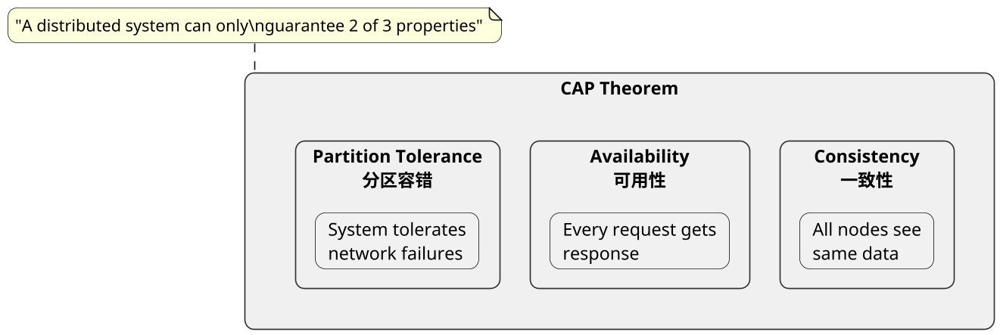
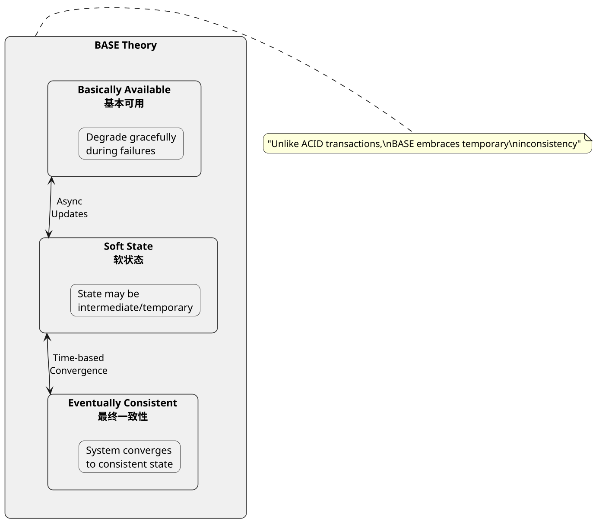
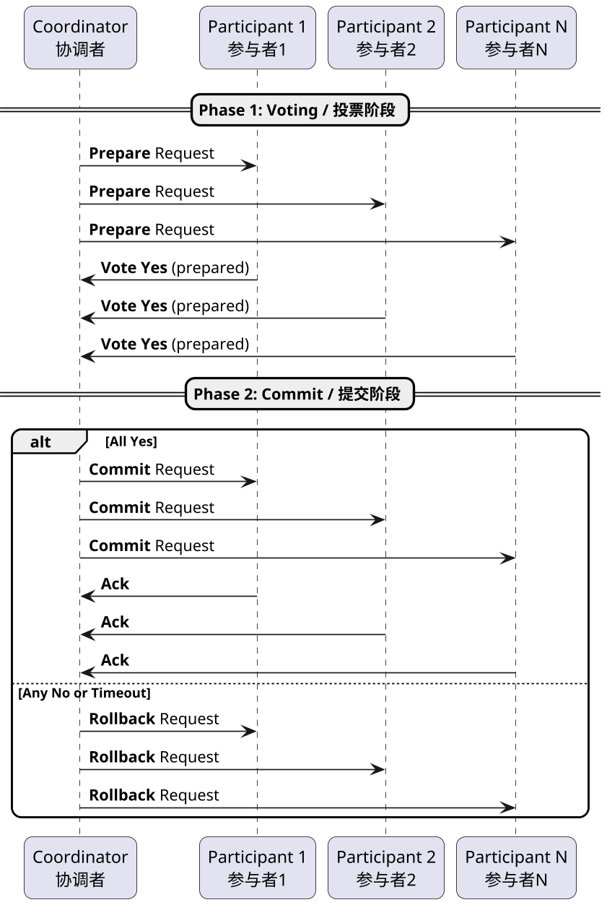
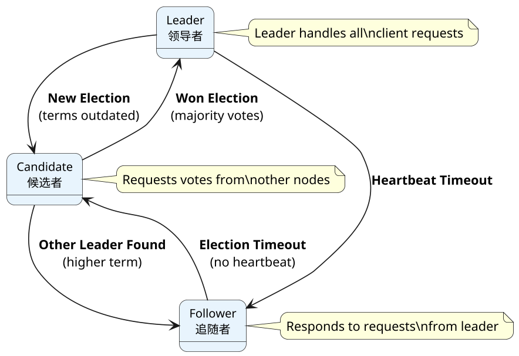

## Distributed Systems Theory, Common Interview Questions

### 什么是 CAP 理论

**Principle:**
CAP theorem states that a distributed system can only provide at most two of the three guarantees: Consistency, Availability, and Partition tolerance. Since network partitions are unavoidable in distributed systems, designers must choose between strong consistency (CP) or high availability (AP). ZooKeeper prioritizes consistency, while Eureka prioritizes availability.

**PlantUML Diagram:**

---

### 什么是 Base 理论

**Principle:**
Base theory is a practical approach to distributed systems that sacrifices strong consistency for availability and scalability. It stands for Basically Available, Soft state, and Eventually consistent. The key insight is that systems don't need to be consistent all the time - they just need to become consistent eventually, usually through asynchronous repair mechanisms.

**PlantUML Diagram:**

---

### 什么是2PC

**Principle:**
2PC (Two-Phase Commit) ensures atomicity in distributed transactions across multiple nodes. Phase 1 (Voting): coordinator asks participants to prepare; Phase 2 (Commit): if all vote Yes, coordinator sends Commit, otherwise Rollback. Drawbacks include synchronous blocking, single point of failure, and data inconsistency risk if coordinator crashes after sending Commit.

**PlantUML Diagram:**

---

### 什么是Raft协议，解决了什么问题

**Principle:**
Raft is a distributed consensus algorithm designed to be more understandable than Paxos. It solves leader election, log replication, and safety in distributed systems. Nodes start as followers, become candidates to elect a leader, then the leader replicates log entries to followers. Safety is guaranteed through majority voting and log completeness requirements. Used in etcd, Consul, and CockroachDB.

**PlantUML Diagram:**

---

