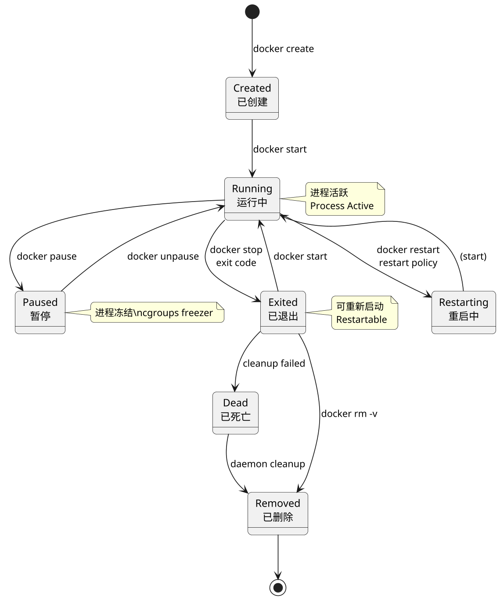
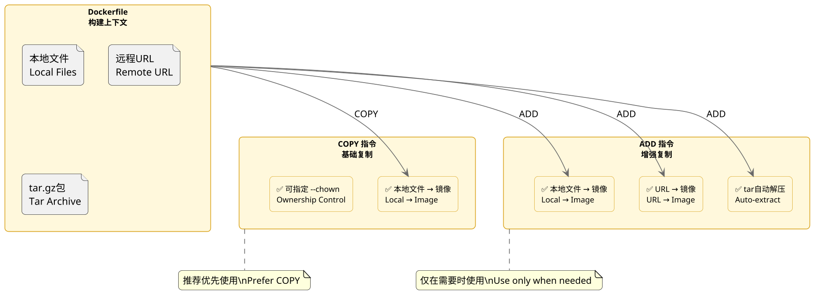
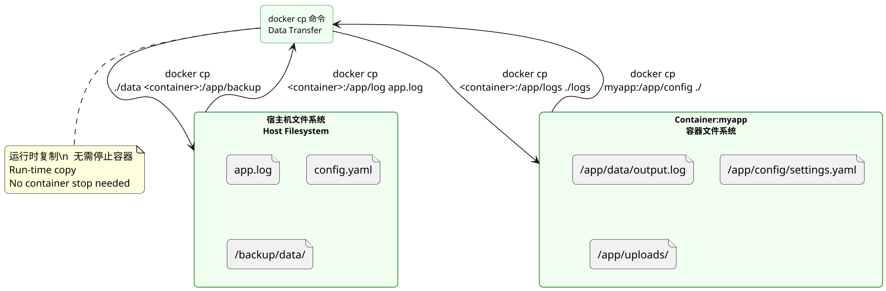
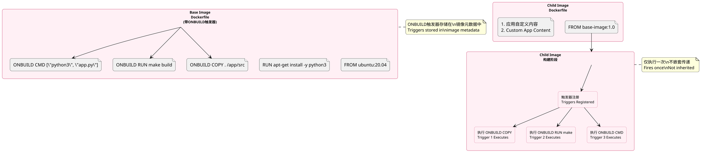
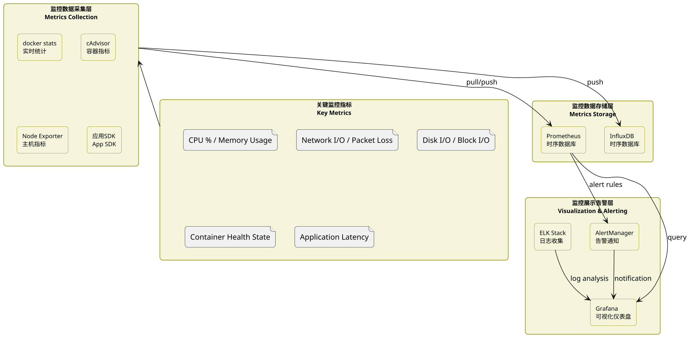
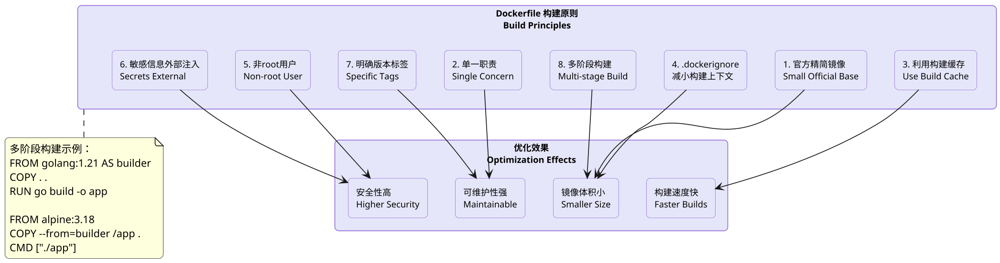
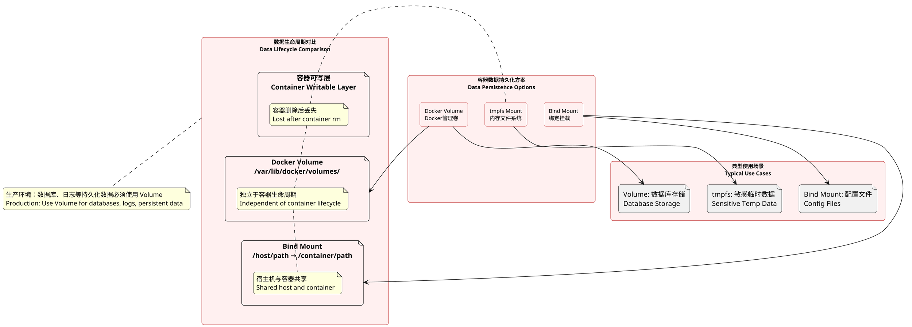

## Docker/K8s, Common Interview Questions

### What is a Docker Image

**Principle:**
A Docker image is a read-only template that contains everything needed to run a container: the application code, runtime environment, libraries, environment variables, and configuration files. Images use a layered storage architecture where each layer is read-only, and multiple images can share underlying layers, saving storage space and speeding up builds. When a container is created from an image, Docker adds a writable layer on top of the image layers; all modifications to the container are written to this layer without changing the underlying image.

Images are built from Dockerfiles, where each instruction creates a new image layer. Common image operations include: `docker pull` to fetch images from a registry, `docker build` to create images from Dockerfiles, and `docker push` to upload images to a registry. Images are identified by repository name, tag, and digest, with typical format `registry/repository:tag` like `nginx:1.25` or `python:3.11-slim`. Use `docker images` and `docker rmi` to manage local images.

**PlantUML Diagram:**

```plantuml
@startuml
skinparam dpi 160
skinparam roundcorner 10
hide stereotype

skinparam rectangle {
    backgroundColor #E6E6FA
    borderColor #9370DB
    fontSize 12
}

skinparam file {
    backgroundColor #FFFACD
    borderColor #DAA520
}

rectangle "Dockerfile" as Dockerfile
file "Base Image Layer
(Ubuntu 20.04)" as Layer1
file "Runtime Layer
(Python 3.11)" as Layer2
file "Dependencies Layer
(Flask 2.3)" as Layer3
file "Application Layer
(App Code)" as Layer4
file "Config Layer
(Config.yaml)" as Layer5
file "EntryPoint Layer
( CMD)" as Layer6

Dockerfile --> Layer1
Dockerfile --> Layer2
Dockerfile --> Layer3
Dockerfile --> Layer4
Dockerfile --> Layer5
Dockerfile --> Layer6

note right of Layer1
  只读镜像层
  Read-only Image Layer
end note

note right of Layer6
  最终镜像
  Final Image
end note

@enduml
```

---

### What is a Docker Container

**Principle:**
A Docker container is a running instance of an image — a lightweight, executable software package that contains everything needed to run an application: code, runtime, system tools, libraries, and settings. Containers run directly on the host machine's kernel, sharing the host kernel resources. Compared to virtual machines, containers don't have a separate Guest OS, so they start faster, use fewer resources, and provide isolation that, while weaker than VMs, is sufficient for most application scenarios.

A container's lifecycle includes five states: Created, Running, Paused, Stopped, and Deleted. A container is essentially one or more processes on the host machine, using Linux Namespace mechanisms for resource isolation (PID, Network, Mount, IPC, etc.), Cgroups for resource limits (CPU, memory, I/O, etc.), and UnionFS (such as overlay2) for layered file systems. The relationship between container and image is like object to class: the image is a static template, the container is a dynamic instance.

**PlantUML Diagram:**

```plantuml
@startuml
skinparam dpi 160
skinparam roundcorner 10
hide stereotype

skinparam rectangle {
    backgroundColor #E0F0FF
    borderColor #4169E1
    fontSize 12
}

rectangle "宿主机 / Host Machine
(Ubuntu 22.04 Kernel)" as Host
rectangle "Docker Engine" as DockerEngine

rectangle "Container A
(Nginx)" as ContainerA {
    rectangle "可写层
Writable Layer" as WriteLayerA
    rectangle "镜像层叠
Image Layers (RO)" as ImageLayersA
}
rectangle "Container B
(Python App)" as ContainerB {
    rectangle "可写层
Writable Layer" as WriteLayerB
    rectangle "镜像层叠
Image Layers (RO)" as ImageLayersB
}

rectangle "Namespaces
(PID/Net/Mount/IPC)" as NS
rectangle "Cgroups
(CPU/Mem/IO)" as CG
rectangle "OverlayFS
(File System)" as FS

Host --> DockerEngine
DockerEngine --> ContainerA
DockerEngine --> ContainerB
ContainerA --> WriteLayerA
ContainerA --> ImageLayersA
ContainerB --> WriteLayerB
ContainerB --> ImageLayersB
DockerEngine --> NS
DockerEngine --> CG
DockerEngine --> FS

note bottom of Host
  共享宿主机内核
  Shared Host Kernel
end note

note right of NS
  资源隔离
  Resource Isolation
end note

note right of CG
  资源限制
  Resource Limitation
end note

@enduml
```

---

### Docker Container States

**Principle:**
Docker containers have 7 core states: Created, Running, Paused, Restarting, Exited, Dead, and Removed. Created means the container was created with `docker create` but hasn't started yet; filesystem and network resources are allocated but the process hasn't started. Running means the container is active with its main process (PID 1) running. Paused, triggered by `docker pause`, freezes all processes in the container using cgroups freezer, useful for temporary freezing for backup or debugging. Restarting indicates the container is executing a restart policy (like `always` or `on-failure`) with processes stopping or starting. Exited means the container exited normally or abnormally and can be restarted with `docker start`. Dead is a special state, usually appearing when the container can't clean up resources (like undeletable volumes or network endpoints), requiring manual intervention. Removed indicates the container has been deleted from the Docker daemon but may not be fully cleaned up.

In production environments, container state transitions to watch: `docker create` → Created → `docker start` → Running → `docker stop` → Exited → `docker rm` → Removed. The `docker run` command performs create + start in one step. Container exit codes are also important: 0 means normal exit, 125 means Docker daemon error, 126 means the container's ENTRYPOINT/CMD couldn't be executed, 127 means the executable wasn't found, and other non-zero codes mean the process exited due to a signal.

**PlantUML Diagram:**



---

### Difference Between COPY and ADD

**Principle:**
`COPY` and `ADD` both copy files from the build context to the image filesystem, but have important differences. `COPY` is the basic copy instruction with syntax `COPY <src> <dest>` — straightforward and clear. `ADD` has all `COPY`'s functionality plus two special abilities: copying from URLs (`ADD http://example.com/file.tar.gz /usr/local/`) and automatically extracting tar files (`ADD app.tar.gz /opt/app/`). Because `ADD`'s behavior is more implicit and can cause unexpected results, official documentation recommends using `COPY` in most cases.

Best practice: prefer `COPY` unless you specifically need `ADD`'s URL download or tar extraction. Benefits of `COPY` include clearer semantics, less ambiguity, and more understandable build logs. For remote URLs, use `RUN curl` or `RUN wget` to download, then `COPY` to the target location — this integrates the download into build cache and is easier to manage. `COPY` supports `--chown` to change file ownership and permissions; `ADD` does not.

**PlantUML Diagram:**



---

### Data Copy Between Container and Host

**Principle:**
`docker cp` copies files/directories between containers and hosts with syntax `docker cp <container>:<src_path> <dest_path>` or the reverse. It works while the container is running, making it ideal for log export, config inspection, and backup/restore without stopping the container. `docker cp` supports recursive directory copying and cross-container transfers.

Important notes: paths after the container name (after the colon) are relative to the container. Copying behavior is like standard `cp` — creates if non-existent, overwrites if exists. Docker also provides `docker export`/`docker import` for filesystem snapshots (tar archives) and `docker save`/`docker load` for images. `docker cp` doesn't copy hidden files (starting with `.`), while `docker export` exports the full filesystem. Production environments prefer data Volumes for persistent storage over `docker cp`.

**PlantUML Diagram:**



---

### ONBUILD Instruction in Dockerfile

**Principle:**
`ONBUILD` is a special Dockerfile instruction that adds a trigger to an image. When this image is used as a base image (in `FROM`), the trigger executes during the child image's build process. Typical use cases: creating a base image template without application code but with predefined build steps; when users build their app image from this base, triggers automatically execute.

How `ONBUILD` works: `ONBUILD <INSTRUCTION>` stores `<INSTRUCTION>` as a trigger in the image metadata. When a new image references this base in `FROM`, Docker registers all triggers before the build begins, then executes them in order. Each `ONBUILD` trigger fires only once — no nesting (child's `ONBUILD` doesn't trigger grandchild). Common patterns: pre-copy source code (`ONBUILD COPY . /app/src`), pre-execute build commands (`ONBUILD RUN make build`), pre-set entry points (`ONBUILD ENV APP_HOME /app`).

**PlantUML Diagram:**



---

### Production Docker Monitoring

**Principle:**
Production Docker monitoring spans three layers: container, host, and application. Container-level metrics include: CPU usage (system vs user), memory usage (Working Set, RSS, Cache), network I/O (in/out traffic, packet loss, connections), disk I/O (speed, IOPS), and container count/state distribution. Common tools: `docker stats` for real-time single-node stats; cAdvisor (Container Advisor) by Google for container-level metrics; Prometheus + Grafana for the most popular monitoring/alerting solution with multi-node support and visualization; Datadog/New Relic for commercial one-click Docker monitoring.

Host-level monitoring covers host CPU/memory/disk/network and Docker daemon status (`docker info`). Application-level monitoring uses sidecar or SDK approaches to expose business metrics (latency, error rates, business logs). Container health checks via `HEALTHCHECK` in Dockerfile let Docker periodically verify and update container health status. Production also needs alert rules (e.g., CPU > 80% for 5 minutes triggers alert) and log collection (ELK/Graylog).

**PlantUML Diagram:**



---

### Docker Image Build Principles

**Principle:**
Production-grade Docker image building follows these principles. First, prefer official images as base (security-audited): `python:3.11-slim`, `node:18-alpine`, `nginx:alpine`. Second, keep images minimal — use Alpine/Slim variants, reduce attack surface and storage, avoid unnecessary tools. Third, single responsibility — one process per container; split related services into separate containers orchestrated via Docker Compose or Kubernetes. Fourth, leverage build cache by placing stable instructions (package managers, system deps) early and frequently-changing ones (code, config) later. Fifth, use `.dockerignore` to exclude irrelevant files, reducing build context. Sixth, never run as root (USER instruction) to reduce security risk. Seventh, inject sensitive info via environment variables or runtime (Kubernetes/Docker Secrets), not hardcoded in images. Eighth, always specify version tags instead of `latest` to avoid unpredictable changes. Ninth, use `EXPOSE` to declare ports and `LABEL` for metadata.

**PlantUML Diagram:**



---

### Is Data Lost After Container Exits

**Principle:**
By default, data is NOT lost when a container exits. The container's writable layer persists after `docker stop` or exit — only `docker rm` deletes the container and its writable layer. The container filesystem has read-only image layers and a writable container layer. All file modifications during runtime go to the writable layer. Stopping or exiting the container doesn't delete this layer; `docker start` recovers the data. Only `docker rm -v` permanently removes data.

However, the container's writable layer is tied to container lifecycle — not suitable for persistent data. Production uses Docker Volumes or Bind Mounts for persistence. Docker Volumes are managed by Docker in `/var/lib/docker/volumes/`, independent of container lifecycle — data survives container deletion. Bind Mounts map host directories into containers for shared file access. Databases (MySQL, PostgreSQL, Redis), file storage, and log collection should all use Volumes for data persistence.

**PlantUML Diagram:**



---

