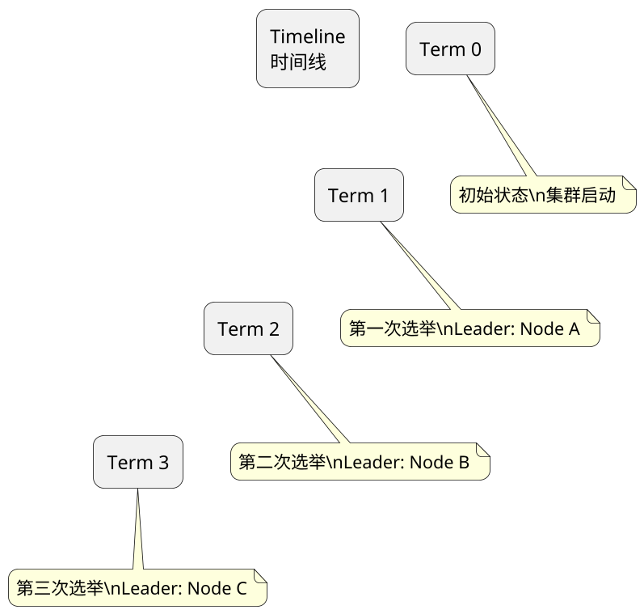
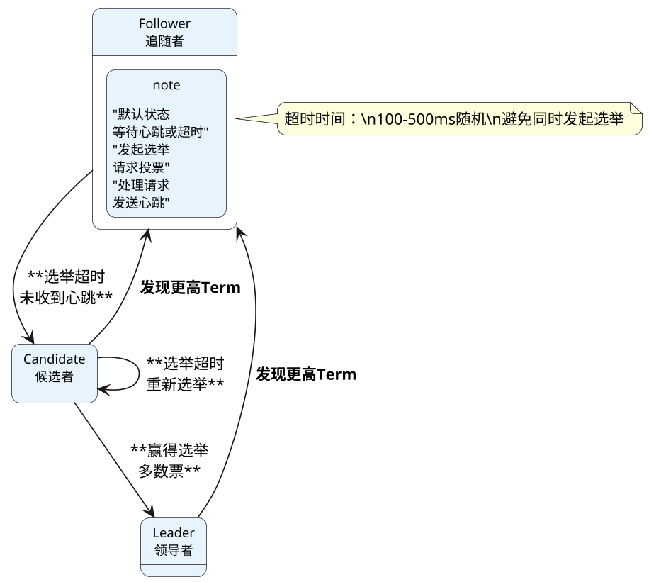
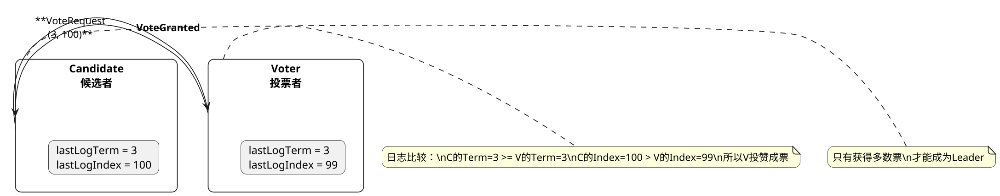
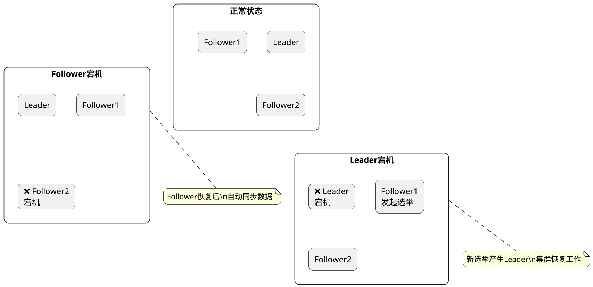
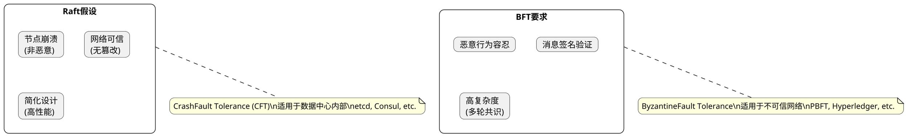
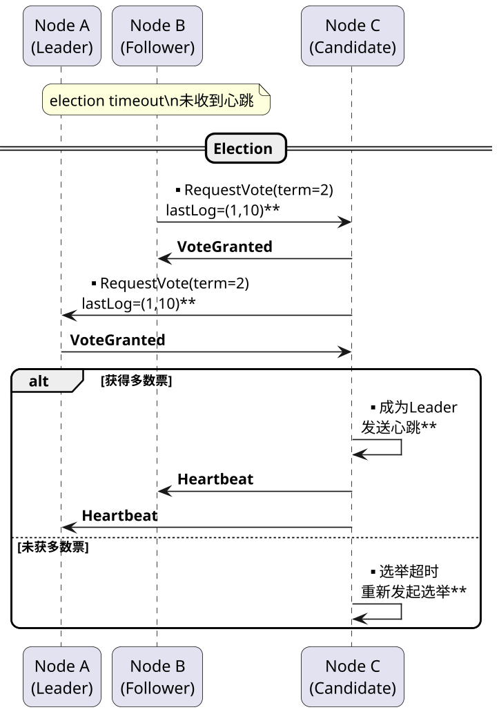
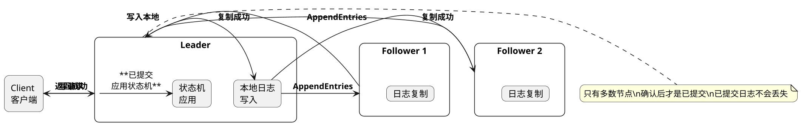

## etcd, Common Interview Questions

### etcd 中一个任期是什么意思

**Principle:**
In etcd's Raft implementation, a Term is a logical clock - a monotonically increasing integer starting from 0. Each election increments the term. Terms help distinguish election cycles, identify stale information, resolve conflicts, and are embedded in log entries. During network partitions, multiple terms may exist, and nodes with lower terms must step down.

**PlantUML Diagram:**



---

### etcd中raft状态机是怎么样切换的

**Principle:**
    if (electionTimeout) -> Candidate;
    if (appendEntries) -> stay Follower;
    if (voteRequest && canVote) -> grant vote;
case Candidate:
    if (wonElection) -> Leader;
    if (electionTimeout) -> restart election;
    if (higherTermFound) -> Follower;
case Leader:
    if (higherTermFound) -> Follower;
    if (heartbeatTimeout) -> sendHeartbeat();
}
```


etcd nodes transition between three states: Follower, Candidate, and Leader. Follower becomes Candidate when election timeout occurs. Candidate becomes Leader on majority votes. Any state transitions to Follower upon discovering higher term. Leader sends heartbeats to maintain authority and steps down if a higher term is discovered.

**PlantUML Diagram:**



---

### 如何防止候选者在遗漏数据的情况下成为总统

**Principle:**
Raft prevents incomplete candidates from becoming leader through vote restriction. Candidates include lastLogTerm and lastLogIndex in vote requests. Voters deny vote if candidate's log is behind theirs. Comparison: higher term wins, or same term with higher index wins. This ensures new leader has all committed entries.

**PlantUML Diagram:**



---

### etcd某个节点宕机后会怎么做

**Principle:**

当etcd集群中某个节点宕机时，集群会根据节点类型和故障情况采取不同措施：

**Follower宕机**：
- Leader检测到Follower心跳超时（通常几秒）
- 将该节点从通信中移除
- 不影响集群的写操作（如果Leader还在）
- Follower恢复后，会自动重新加入并同步数据

**Leader宕机**：
- 其他节点等待心跳超时
- 触发新一轮选举
- 如果原Leader恢复，会发现更高的Term，自动转为Follower
- 选举期间集群不可用（通常几秒）

**Candidate宕机**：
- 选举超时后，其他节点重新发起选举
- 不影响集群的正常Leader工作

- 节点恢复后，从Leader获取缺失的日志条目
- 通过Raft日志重放恢复状态机状态
- 如果日志损坏，需要从快照恢复

- 少数派分区无法选主，自动变为Follower
- 原Leader在多数派分区继续工作
- 分区恢复后，少数派节点同步新Leader数据


When an etcd node fails: Follower failure is detected via heartbeat timeout, removed from communication,不影响写操作. Leader failure triggers new election, cluster unavailable during election. Recovery involves re-syncing from leader via log replay or snapshot restoration. Network partition isolates minority, primary continues working.


**PlantUML Diagram:**



---

### 为什么raft算法不考虑拜占庭将军问题

**Principle:**
Raft doesn't address Byzantine failures because: 1) BFT algorithms have high overhead and complexity; 2) datacenter nodes are assumed trustworthy; 3) simplified design improves performance. For Byzantine tolerance, use specialized BFT implementations like PBFT. etcd assumes crash-only failures in trusted environments.

**PlantUML Diagram:**



---

### etcd 如何选举出leader节点

**Principle:**
etcd leader election: When a follower doesn't receive heartbeat within election timeout (100-500ms random), it becomes Candidate, increments term, and requests votes from all nodes. Votes granted only if candidate's log is newer. Majority votes wins. New leader sends heartbeats, other nodes follow. If election fails, timeout and retry.

**PlantUML Diagram:**



---

### etcd如何保证数据一致性

**Principle:**
etcd ensures consistency via Raft: 1) Log replication - writes go to leader's log, replicated to majority; 2) Leader completeness - only nodes with all committed entries can become leader (vote restriction); 3) Log matching - consistency check ensures no divergence; 4) State machine applies committed entries; 5) Reads served by leader by default for consistency.

**PlantUML Diagram:**



---

