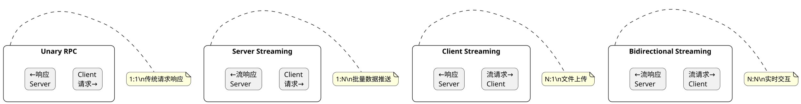
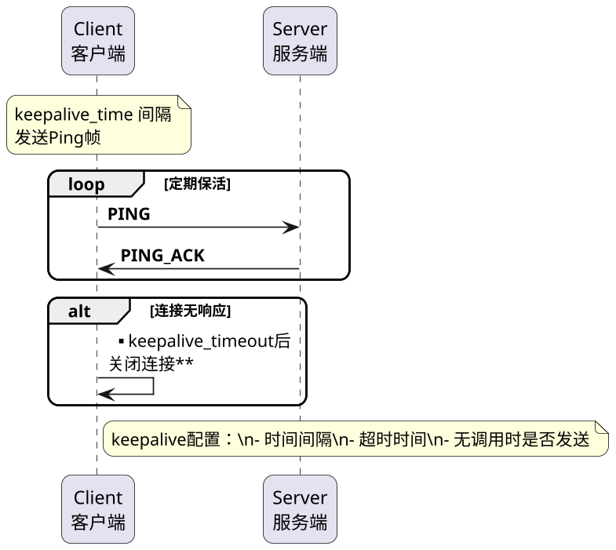
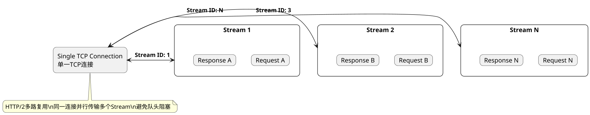
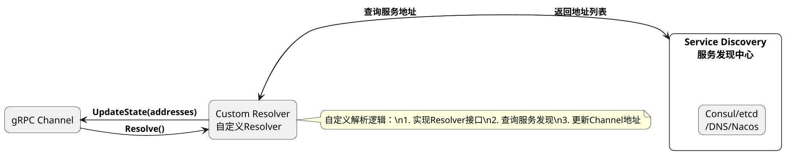
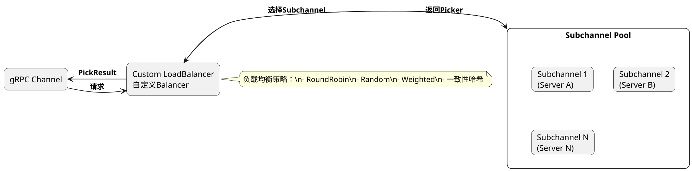
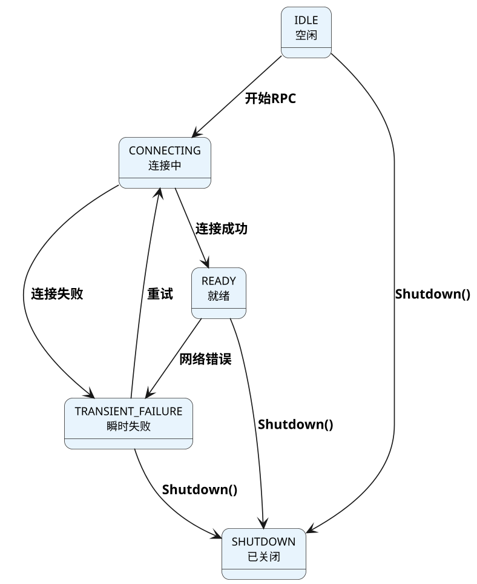
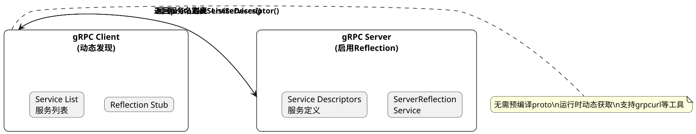
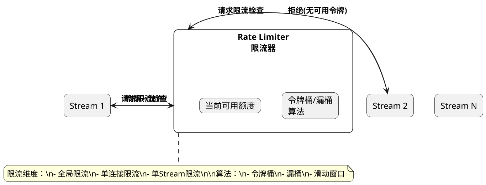

## gRPC, Common Interview Questions

### gRPC 服务端启动流程

**Principle:**
gRPC server startup: 1) Create ServerBuilder; 2) Register service implementations via AddService(); 3) Optionally add interceptors; 4) Bind port with AddListeningPort(); 5) BuildAndStart() to begin accepting connections; 6) Wait() for shutdown or AwaitTermination() for graceful shutdown.

**PlantUML Diagram:**

```plantuml
@startuml
skinparam dpi 160
skinparam shadowing false
skinparam roundcorner 15

|Server|
start
:CreateServerBuilder();
:AddService(serviceImpl);
:AddInterceptor();
:AddListeningPort(address);
:BuildAndStart();
:Wait/Shutdown();

stop

note right of Server
    1. 创建构建器\n2. 注册服务\n3. 配置拦截器\n4. 绑定端口\n5. 启动服务\n6. 等待终止
end note

@enduml
```

---

### gRPC 服务类型有哪些

**Principle:**
gRPC supports 4 RPC types: Unary (single request-response), Server Streaming (one request, stream responses), Client Streaming (stream requests, one response), and Bidirectional Streaming (both sides stream). Each serves different scenarios from simple calls to real-time communication.

**PlantUML Diagram:**



---

### keepalive 是针对连接设置

**Principle:**
gRPC Keepalive is a connection health check mechanism for HTTP/2. It uses ping frames to detect if the connection is alive, prevent idle connections from being closed by intermediaries, and detect failures quickly. Key configs: keepalive_time (default 2h), keepalive_timeout, and keepalive_without_calls.

**PlantUML Diagram:**



---

### gRPC多路复用指的是什么

**Principle:**
gRPC multiplexing uses HTTP/2 streams to multiplex multiple requests/responses over a single TCP connection. Each stream has a unique ID, allowing parallel requests without HOL blocking. Benefits: connection reuse, parallelism, resource efficiency, and lower latency compared to HTTP/1.1.

**PlantUML Diagram:**



---

### gRPC 如何自定义 resolver

**Principle:**
class CustomResolver : public Resolver {
public:
    void Resolve(const resolve_args&) override {
        // 查询服务发现获取地址
        std::vector<Address> addresses = Discover();
        // 更新Channel
        channel_->UpdateState(Connected, addresses);
    }
};
```


gRPC custom resolver lets you implement service discovery by implementing the Resolver interface. Override Resolve() to discover addresses (from Consul, etcd, DNS, etc.) and call UpdateState() to notify the Channel. Register via ResolverFactory. Used for dynamic service discovery and complex load balancing.

**PlantUML Diagram:**



---

### gRPC如何自定义 balancer

**Principle:**
gRPC custom load balancer implements the LoadBalancer interface to choose which subchannel handles each request. Work with Resolver: Resolver discovers addresses, Balancer chooses which address. Implement Pick() to return PickResult. Common strategies: round_robin, random, weighted, consistent hashing.

**PlantUML Diagram:**



---

### 如何实现 gRPC 全链路追踪

**Principle:**
gRPC distributed tracing tracks requests across service boundaries using Trace IDs and Spans. Implement via interceptors that extract/inject trace context from metadata. Use OpenCensus or OpenTracing with exporters like Zipkin/Jaeger. Each RPC creates spans with timing and metadata for end-to-end visibility.

**PlantUML Diagram:**

```plantuml
@startuml
skinparam dpi 160
skinparam shadowing false
skinparam roundcorner 15

actor "Client\n客户端" as C

box "Service A" #LightBlue
rectangle "Interceptor A" as IA
rectangle "Span A1" as SA1
end box

box "Service B" #LightGreen
rectangle "Interceptor B" as IB
rectangle "Span B1" as SB1
end box

box "Service C" #LightYellow
rectangle "Interceptor C" as IC
rectangle "Span C1" as SC1
end box

C -> IA: **RPC请求\n(TraceID=xxx)**
IA -> SA1: **创建Span**
SA1 -> IB: **转发\n(Metadata携带)**
IB -> SB1: **创建Span**
SB1 -> IC: **转发**
IC -> SC1: **创建Span**

note bottom of C
    Trace ID贯穿整个链路\n每个服务创建Span\n形成完整调用链
end note

@enduml
```

---

### 客户端连接状态有哪些

**Principle:**
- READY → TRANSIENT_FAILURE → CONNECTING
- 任意状态 → SHUTDOWN


gRPC channel states: IDLE (initial), CONNECTING (establishing), READY (connected, ready for RPC), TRANSIENT_FAILURE (recoverable error, will retry), SHUTDOWN (closed permanently). Transitions happen based on network conditions and explicit shutdown calls.

**PlantUML Diagram:**



---

### 客户端如何获取服务端的服务函数列表

**Principle:**
auto stub = ServerReflection::NewStub(channel);

// 查询所有服务
ListServicesRequest request;
ListServicesResponse response;
stub->ListServices(&context, request, &response);

// 获取服务名列表
for (auto& svc : response.service_list()) {
    std::string name = svc.name();
    // 查询具体服务定义...
}
```

- 动态客户端：无需预编译proto
- gRPC UI工具： grpcurl、Postman
- 服务治理：发现可用服务
- 契约测试：验证服务端接口


gRPC Server Reflection exposes service definitions at runtime. Enable ServerReflection service on server, then clients can query ListServices() to get service names and GetServiceDescriptor() for full proto definitions. Used by grpcurl, Postman, dynamic clients, and service governance tools.

**PlantUML Diagram:**



---

### 如何为每个stream进行限流

**Principle:**
class RateLimitInterceptor : public grpc::experimental::Interceptor {
    std::shared_ptr<RateLimiter> limiter_;
    
    void Intercept() override {
        if (!limiter_->TryAcquire()) {
            // 拒绝请求
            return Fail(Status::RESOURCE_EXHAUSTED);
        }
        Proceed();
    }
};
```


Rate limiting per stream can be implemented using token bucket or leaky bucket algorithms via Interceptors. Check rate limit before allowing request to proceed. Dimensions: global (shared limiter), per-connection, or per-stream. Use Fail(Status::RESOURCE_EXHAUSTED) to reject requests when limit exceeded.

**PlantUML Diagram:**



---

