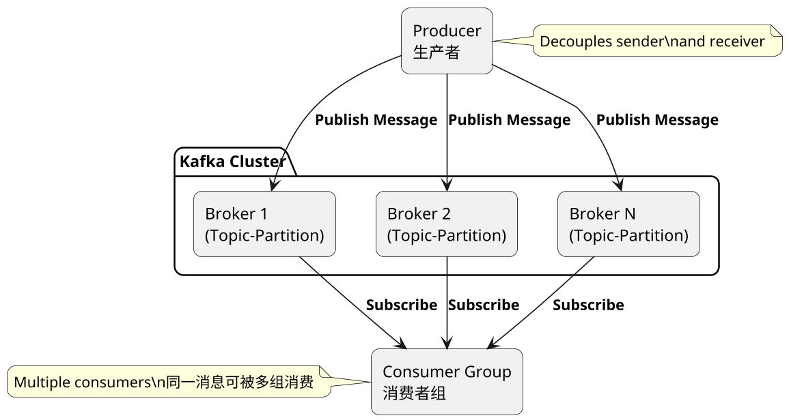
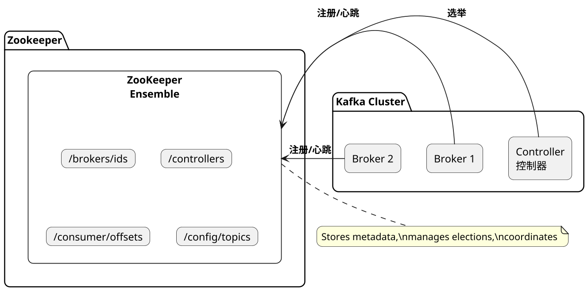
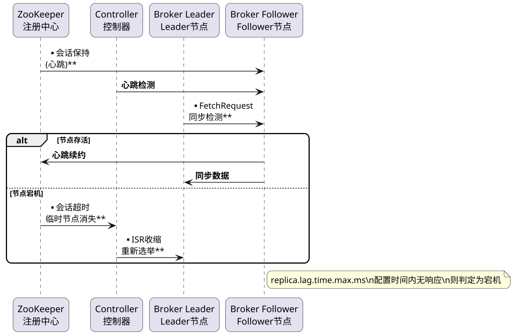
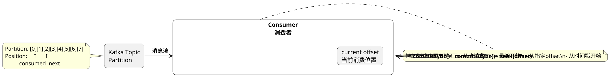
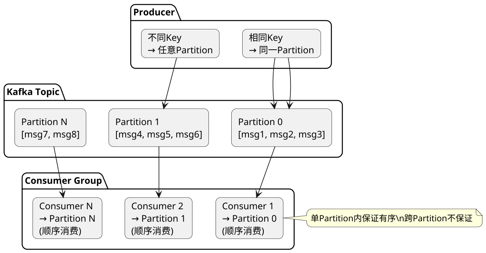
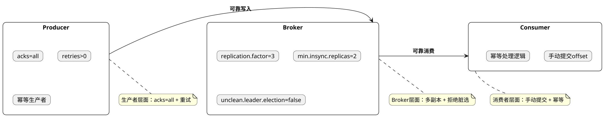
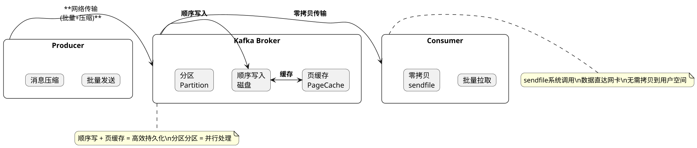

## Kafka, Common Interview Questions

### kafka是什么？解决了什么问题？

**Principle:**
Kafka is a distributed streaming platform developed by Apache, originally at LinkedIn. It provides a high-throughput, persistent, distributed messaging system. Key use cases include asynchronous processing, traffic smoothing, log collection, and event-driven architectures. Kafka uses publish-subscribe model with persistent storage, partitioned topics, and replication for fault tolerance.

**PlantUML Diagram:**



---

### zk对于kafka的作用是什么

**Principle:**
Zookeeper serves several critical roles in Kafka: cluster metadata management (broker list, topic configs), leader election for the Controller node, distributed locking, consumer group tracking, and quota management. Since Kafka 2.8, the optional KRaft mode allows running Kafka without Zookeeper for simplified architecture.

**PlantUML Diagram:**



---

### kafka如何判断一个节点是否还活着

**Principle:**
Kafka determines node liveness through: 1) Zookeeper ephemeral nodes - broker creates temp node under /brokers/ids, session timeout means death; 2) Controller heartbeat - controller sends heartbeats to all brokers; 3) Replica sync detection - follower must send FetchRequest within replica.lag.time.max.ms, otherwise considered dead.

**PlantUML Diagram:**



---

### 简述kafka的ack三种机制

**Principle:**
Kafka's ack mechanism controls message durability: acks=0 (fire-and-forget, highest performance, may lose data), acks=1 (wait for leader only, balanced), acks=all (wait for all ISRs, highest durability but higher latency). The trade-off is between reliability and throughput.

**PlantUML Diagram:**

```plantuml
@startuml
skinparam dpi 160
skinparam shadowing false
skinparam roundcorner 15

rectangle "Producer\n生产者" as P

rectangle "Kafka Cluster" {
    rectangle "Leader\nISR中" as L
    rectangle "Follower 1\nISR中" as F1
    rectangle "Follower 2\nISR中" as F2
}

== acks=0 ==

P -> L: **发送消息\n(不等待确认)**

== acks=1 ==

P -> L: **发送消息**
L -> P: **Leader写入成功**

== acks=all ==

P -> L: **发送消息**
L -> F1: **同步**
L -> F2: **同步**
F1 -> L: **写入成功**
F2 -> L: **写入成功**
L -> P: **所有ISR写入成功**

note bottom of P
    acks配置越高，可靠性越强\n但延迟也越高
end note

@enduml
```

---

### kafka如何控制消费位置

**Principle:**
Kafka allows precise control over consumption position: auto-commit (background, configurable interval), manual sync commit (blocking, exact), manual async commit (non-blocking), and seek() to jump to specific offsets. The __consumer_offsets topic tracks progress. Manual control enables exactly-once semantics and recovery from failures.

**PlantUML Diagram:**



---

### 在分布式场景下如何保证消息的顺序消费

**Principle:**
Kafka guarantees ordering within a partition only. To ensure ordered consumption: 1) send related messages with same key to same partition; 2) one consumer per partition in consumer group; 3) process messages strictly in partition order; 4) handle failures carefully without skipping. Global ordering across partitions is not supported by Kafka's design.

**PlantUML Diagram:**



---

### kafka的高可用机制是什么

**Principle:**
Kafka's HA mechanism includes: replication (multiple copies of data), ISR (in-sync replicas that can become leaders), Controller (manages leader elections via Zookeeper), and fast failover (millisecond recovery). Only ISR members can become new leaders, ensuring data consistency.

**PlantUML Diagram:**

```plantuml
@startuml
skinparam dpi 160
skinparam shadowing false
skinparam roundcorner 15

package "Kafka Cluster" {
    rectangle "Controller" as Ctrl
    
    rectangle "Partition 0 (Topic-A)" as P0 {
        card "Leader\nBroker-1" as L1
        card "Follower\nBroker-2" as F1
        card "Follower\nBroker-3" as F2
    }
}

note bottom of P0
    ISR = {Broker-1, Broker-2, Broker-3}\n(假设全部同步中)
end note

alt Leader宕机
    Ctrl -> F1: **选举为新Leader**
    Ctrl -> F2: **同步通知**
end

note right of Ctrl
    Controller使用\nZookeeper选举\n管理所有分区状态
end note

@enduml
```

---

### kafka如何减少数据丢失

**Principle:**
To minimize data loss in Kafka: 1) Producer: use acks=all, retries>0, idempotent producer; 2) Broker: replication.factor>=3, min.insync.replicas>=2, disable unclean leader election; 3) Consumer: manual offset commit after processing, idempotent processing logic; 4) Monitor ISR changes and replica lag.

**PlantUML Diagram:**



---

### kafka如何确保不消费重复数据

**Principle:**
Kafka cannot guarantee exactly-once delivery by itself. Solutions include: 1) message deduplication using unique IDs stored in Redis/DB; 2) idempotent consumer logic (e.g., INSERT ON DUPLICATE KEY); 3) Kafka transactions with idempotent producer; 4) careful offset management. Best practice: design for at-least-once delivery and handle duplicates idempotently.

**PlantUML Diagram:**

```plantuml
@startuml
skinparam dpi 160
skinparam shadowing false
skinparam roundcorner 15

rectangle "Kafka" as K {
    card "消息\nmsg_id=xxx" as M
}

rectangle "Consumer" as C {
    card "检查Redis\n已处理表" as R
    card "处理业务逻辑\n(幂等)" as B
    card "提交offset" as O
}

M -> R: **查询是否已处理**
R -> B: **未处理**
B -> O: **处理成功**
O -> R: **记录msg_id**

alt 重复消息
    R -> R: **已存在，跳过**
end

note right of C
    消费流程：\n1. 查询去重表\n2. 未处理则执行业务\n3. 成功后记录并提交offset
end note

@enduml
```

---

### kafka为什么性能这么高

**Principle:**

Kafka之所以能达到极高的吞吐量，主要归功于以下几个核心设计：

**1. 顺序写磁盘**：
- Kafka追加写入日志文件，充分利用磁盘顺序I/O
- 顺序写入速度接近内存，远快于随机写入
- 配合OS的预读和写缓存优化

**2. 零拷贝技术**：
- 使用sendfile系统调用，数据从磁盘到网络无需经过应用层
- 避免内核空间和用户空间之间的数据拷贝
- 显著减少CPU开销和上下文切换

**3. 页缓存（Page Cache）**：
- 利用OS内存作为消息缓存
- 热数据保持在内存中
- 读取时优先从缓存获取

**4. 分区并行处理**：
- 消息按Partition分布式存储
- 每个Partition可独立消费
- 消费者组内并行消费不同Partition

**5. 批量处理**：
- 生产者批量发送消息，减少网络往返
- 消费者批量拉取，提高吞吐量
- 消息压缩（批量压缩更高效）

**6. 高效序列化**：
- 使用高效的二进制协议
- 减少网络传输开销


Kafka achieves high throughput through: sequential disk writes (接近内存速度), zero-copy (sendfile eliminates kernel-user space copies), page cache (OS memory caching), partition parallelism (parallel consumption), batch processing (batched send/receive), and efficient binary serialization. These optimizations together enable millions of messages/second throughput.


**PlantUML Diagram:**



---

