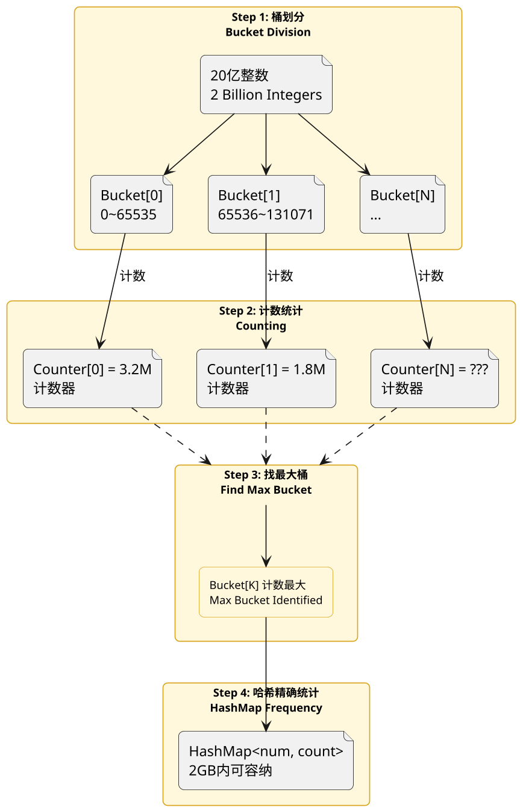
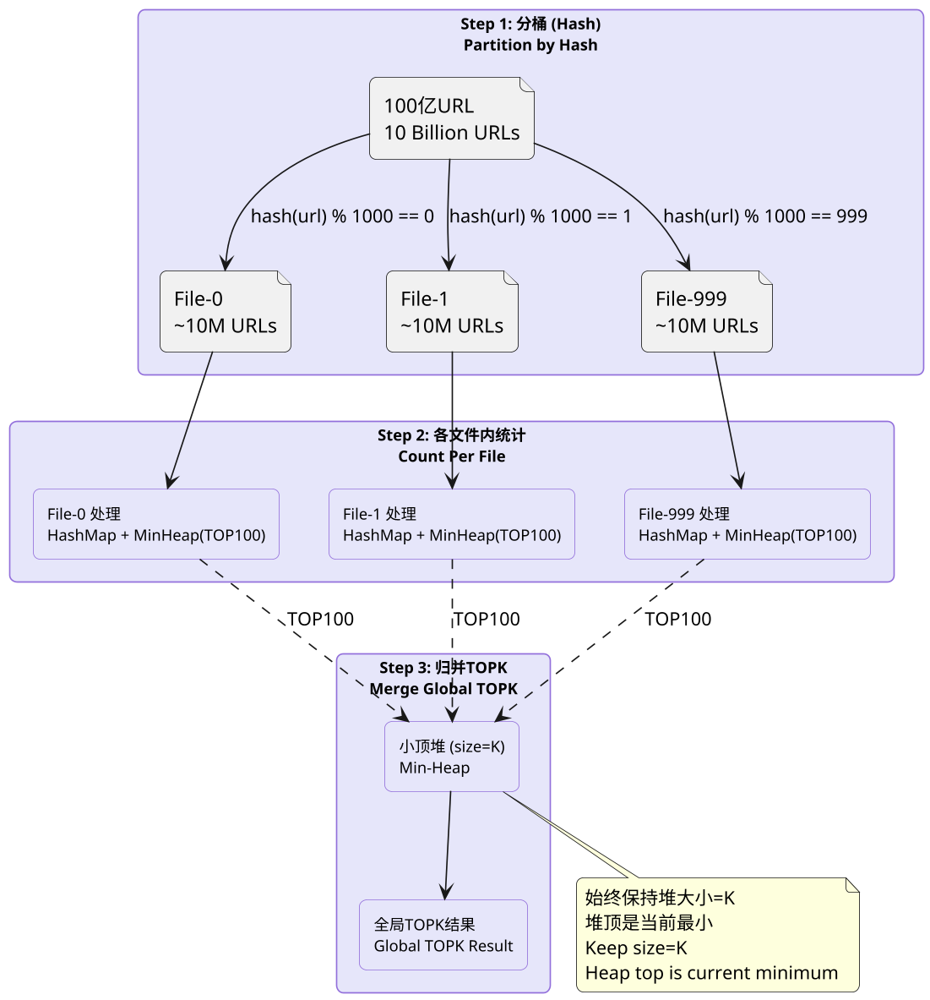
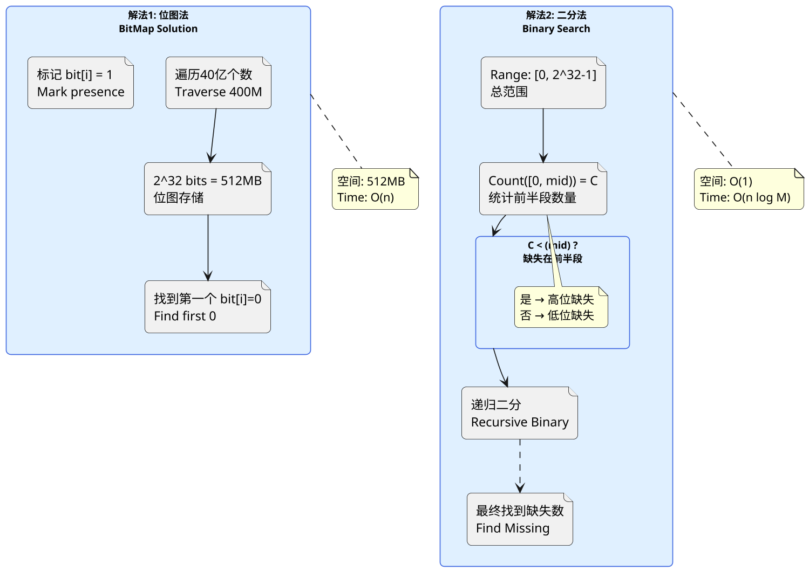
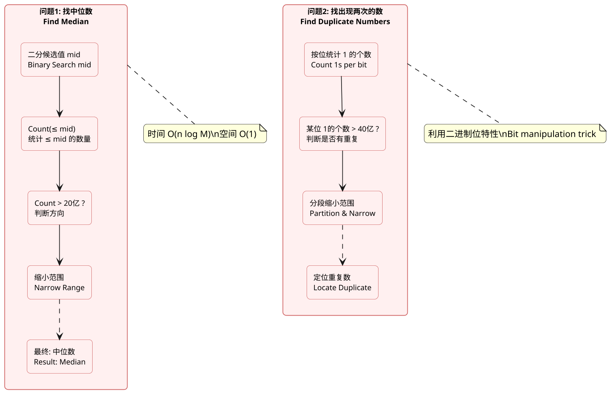
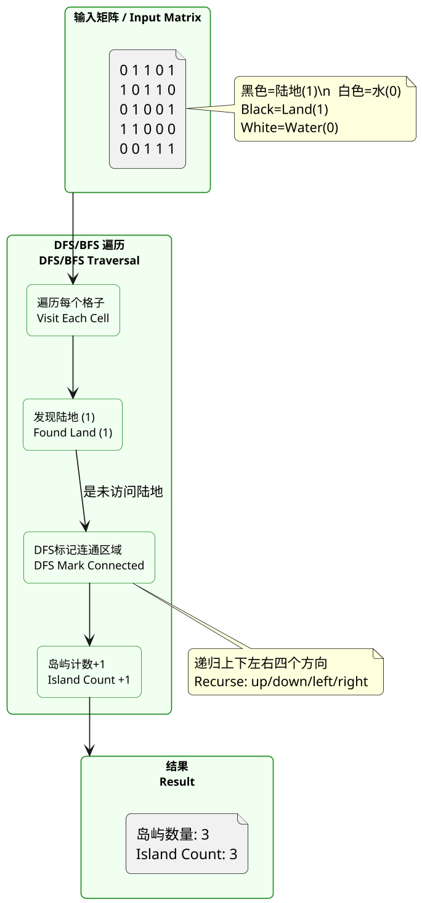
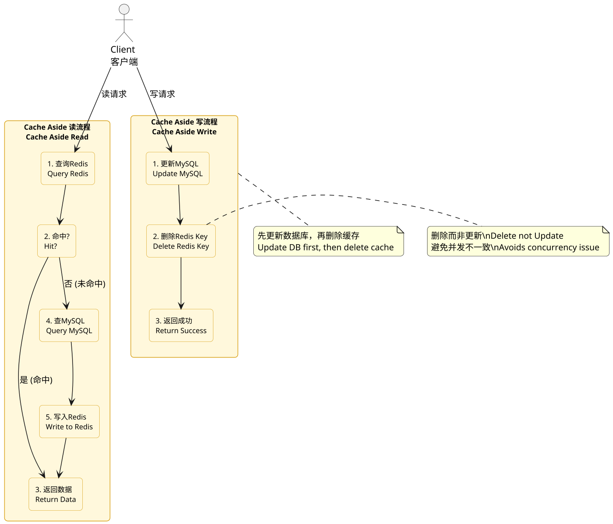
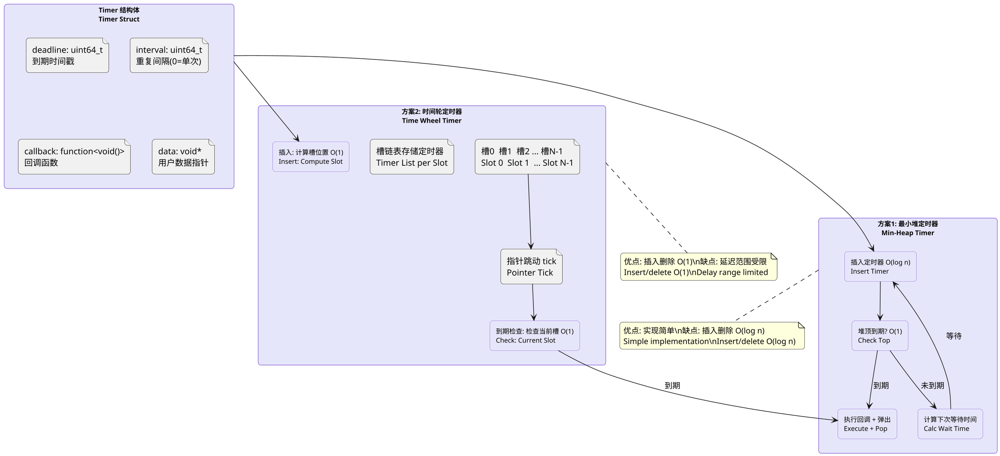

## System Design, Common Interview Questions

### Find the Most Frequent Integer with 2GB Memory Among 2 Billion

**Principle:**
This classic big data problem tests handling massive data with limited memory. The core approach uses HashMap for frequency counting, but 2 billion integers × 4 bytes = 8GB, far exceeding 2GB. Solution: range partitioning (bucket division) into smaller files, or external sorting + merging.

Better approach: BitMap + segmentation. First determine integer range (32-bit unsigned: 0~2^32-1), divide into 65536 buckets (each bucket = 2^16 consecutive integers). First pass: use 65536 counters (8 bytes each ≈ 512KB) to determine which bucket has the highest count. Second pass: for the heaviest bucket (~30K+ numbers), build a HashMap for precise frequency, return the most frequent number.

Alternative: Divide and Conquer + Hash. Split 2 billion numbers into 1000 small files (~2 million each), use HashMap per file to get each file's TOP1, then merge the 1000 TOP1s to get the global TOP1. Time O(n), space O(bucket_count).

**PlantUML Diagram:**

---

### TOPK Problem: Finding Most Frequent Words Among 10 Billion URLs

**Principle:**
TOPK is a frequent interview topic — finding the K most frequent elements in massive data. For 10 billion URLs, directly counting all frequencies requires enormous memory. Standard solution: "Divide and Conquer + Hash + Min-Heap" in 3 steps.

Step 1 (Divide and Conquer): Use a hash function (`hash(url) % 1000`) to distribute 10 billion URLs into 1000 small files. Each file averages ~10 million URLs. Identical URLs must go to the same file (hash property).

Step 2 (Frequency Count per file): Use HashMap for each file (~10M entries). If average URL is 100 bytes, each file is ~1GB — manageable. After processing each file, get its TOP 100 most frequent URLs using a min-heap.

Step 3 (Merge for Global TOPK): Merge TOP100 from all 1000 files. The global TOPK must be within all files' local TOPKs. Use a min-heap of size K to merge, resulting in global TOPK.

Time O(n), space O(file_count × K). K depends on memory: with K=100, min-heap holds just 100 elements ≈ 10KB.

**PlantUML Diagram:**

---

### Find Missing Number Among 400 Million Non-negative Integers

**Principle:**
Classic "missing number" problem testing BitMap and binary search. Key info: 400 million non-negative integers (32-bit unsigned range is 0~2^32-1, about 4.3 billion). 400M given means ~300M are missing.

Solution 1: BitMap. Use a 2^32-bit bit map (~512MB) to mark each number's presence. Traverse 400M numbers, set corresponding bit to 1. After traversal, find first bit that is 0 — that's the missing number. For smaller memory (10MB), segment the 2^32 range into buckets and process bucket by bucket.

Solution 2: Binary search (requires data can be fully loaded or read multiple times). If 400M numbers can be read into an array, use binary search: count numbers in range [0, 2^31-1]. If count < 2^31, the missing number is in the high bits; otherwise low bits. Recursively binary search until found. Time O(n log M), space O(1), where M is range size. No extra storage but needs multiple data reads.

**PlantUML Diagram:**

---

### Find Median and Numbers Appearing Twice in 400 Million Non-negative Integers

**Principle:**
Two sub-problems: median and finding numbers appearing twice.

Part 1: Find median — the 2 billionth largest number (or average of 2Bth and 2Bth+1th for even count). Can't load all 40B into memory. Use binary search + counting: for 32-bit unsigned, range 0~2^32-1. For median m, at least 2B numbers ≤ m and at least 2B ≥ m. For each candidate mid, count numbers ≤ mid (count). If count > 2B, median ≤ mid; otherwise median > mid. Binary search until found. Time O(n log M), where M = 2^32.

Part 2: Find numbers appearing twice. Use BitMap (2^32 bits) or binary bit manipulation. The clever binary approach: for each bit position (0~31), count total 1s across all numbers. If 1s count > 4B (total numbers), some bit was set by a duplicate number (since identical numbers have identical bits). Use this property with range partitioning to narrow down and locate specific duplicates.

**PlantUML Diagram:**

---

### Island Problem

**Principle:**
The Island Problem is a classic 2D matrix search problem. Given a 2D array (M×N grid) with values 0 (water) or 1 (land), count all connected land regions ("islands"). Islands are defined as land cells (1) connected via up/down/left/right.

Direct solution: DFS or BFS. Traverse each cell; if an unvisited land cell (1) is found, do DFS/BFS to mark all connected land as visited (set to 0 or use visited array). Increment island count per DFS/BFS. Time O(M×N), space O(M×N) for visited or O(M+N) for recursion stack (worst O(M×N)).

Advanced: Union-Find. Treat each cell as a node, union adjacent land cells. Count independent sets (root nodes) = island count. Union-Find excels in dynamic scenarios (matrix updates), supporting near O(α(n)) merge and query.

Advanced variant: Divide and Conquer. Split matrix by row/column, process sub-regions in parallel, handle boundary merging. Particularly important for distributed computing scenarios.

**PlantUML Diagram:**

---

### Redis-MySQL Cache Consistency

**Principle:**
When Redis serves as MySQL's cache, the core challenge is maintaining consistency between Redis cached data and MySQL source data. Three common patterns: Cache Aside, Read Through, and Write Through, each with pros and cons.

Cache Aside (most common): Read — check cache first, return if hit; on miss, query DB, then write to cache. Write — update DB first, then delete cache key (not update). Delete is lighter than update and avoids the "double write" inconsistency problem under concurrency.

Read Through: Application only interacts with cache; cache service loads from DB on miss. Write Through: Writes update both cache and DB synchronously before returning success.

In distributed/high-concurrency scenarios, Cache Aside faces additional issues: cache penetration (大量请求查询不存在的数据 → use Bloom Filter), cache breakdown (热点 key 过期瞬间大量请求 → use mutex or never-expire strategy), cache avalanche (大量 key 同时过期 → use random TTL or eternal TTL for hot data).

**PlantUML Diagram:**

---

### Implement a Timer (Live Coding)

**Principle:**
Timer is a core component in backend development, executing tasks at specified times or periodically. Live coding a timer tests understanding of Time Wheel, Min-Heap, or Time Chain data structures and high-performance I/O models (epoll/select).

Solution 1: Min-Heap. Timer node contains deadline and callback function. Store all timer nodes in min-heap; check heap top for expiration each tick. If expired, execute callback and pop; if not, calculate wait time. Insert/delete O(log n), expiry check O(1).

Solution 2: Time Wheel (used in Linux kernel). Ring array where each slot holds a timer linked list. A tick pointer advances periodically; each slot check triggers expired timers. Insert by computing slot from delay. Ordinary time wheel insert/delete O(1); multi-level time wheels (Linux kernel) handle larger delay ranges.

Solution 3: epoll + Min-Heap hybrid. epoll listens on a pipe/eventfd read end; timer writes to pipe on expiry, epoll triggers handler. Ideal for combining with network I/O frameworks — common pattern in high-performance servers like Nginx.

Key points for timer implementation: struct design (deadline + callback + extra data), expiration check logic, time complexity analysis, and thread safety.

**PlantUML Diagram:**

(End of file)
