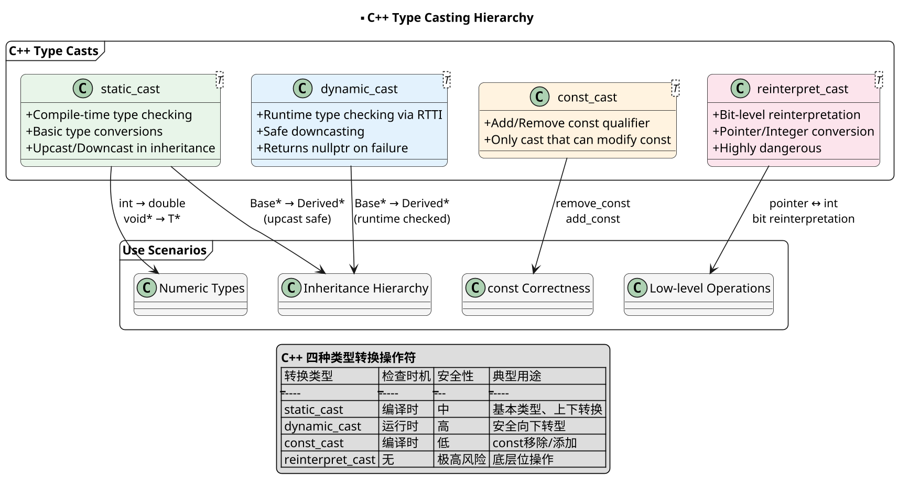
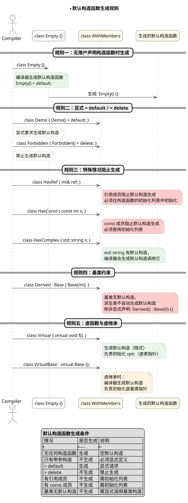
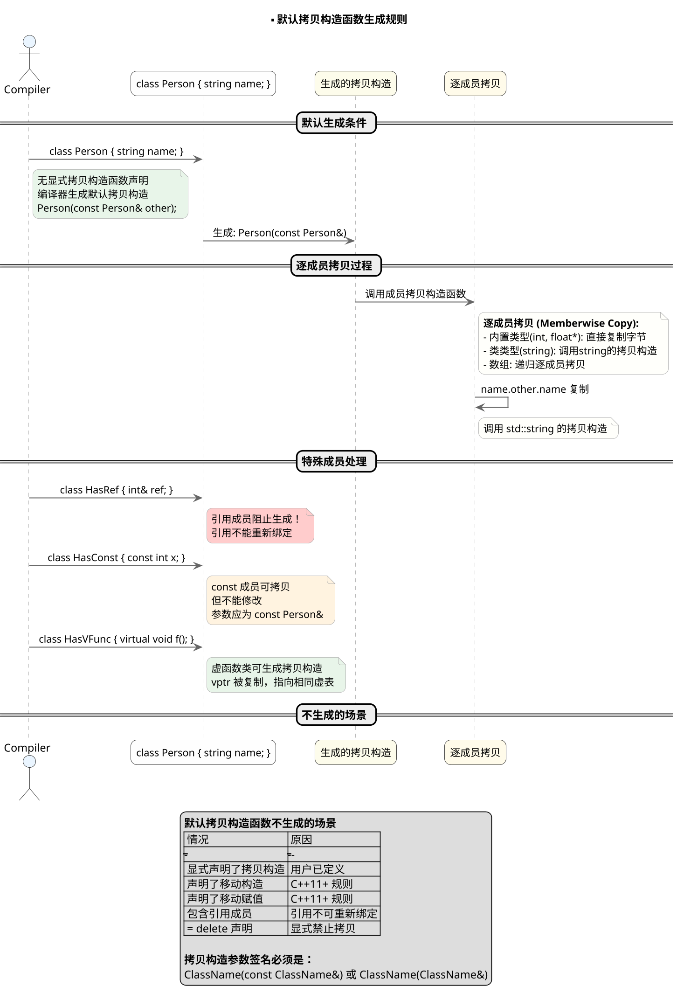
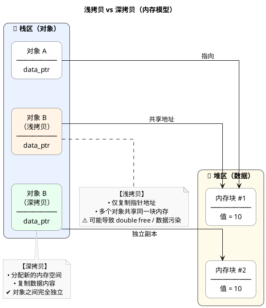
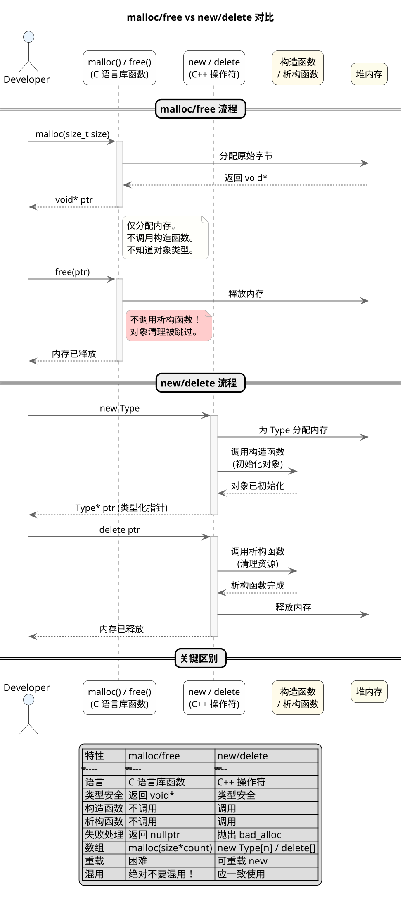
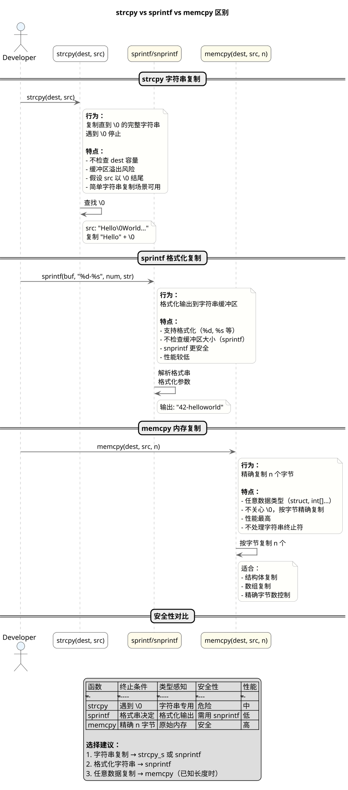
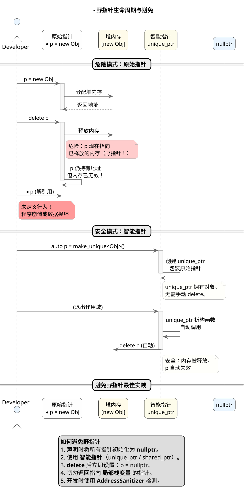

## 1. c/c++ 中强制类型转换使用场景

C++ 四种类型转换操作符，各有不同的使用场景和安全性：

- **static_cast**
  - 编译时类型检查
  - 用于基本类型转换（int→double）、上下转型（Base*→Derived*）

- **dynamic_cast**
  - 运行时类型检查（RTTI）
  - 用于安全向下转型，失败返回 nullptr

- **const_cast**
  - 唯一可修改 const 值的转换
  - 用于移除或添加 const 限定符

- **reinterpret_cast**
  - 位级重解释，最危险的转换
  - 仅限底层操作（指针↔整数）

四种 cast 的核心差异对比如下：

| 转换类型 | 检查时机 | 安全性 | 典型用途 |
|---------|---------|-------|---------|
| static_cast | 编译时 | 中 | 基本类型、上下转换 |
| dynamic_cast | 运行时 | 高 | 安全向下转型 |
| const_cast | 编译时 | 低 | const移除/添加 |
| reinterpret_cast | 无 | 极高风险 | 底层位操作 |

通过图示理解类型转换的层次关系和适用场景：



---

## 2. c++ 什么时候生成默认构造函数

当类没有任何用户声明的构造函数时，编译器自动生成默认构造函数。生成后会调用成员类的默认构造，但**不初始化内置类型**。

以下情况**阻止生成**：

- 包含引用成员（必须在初始化列表初始化）
- 包含 const 成员（需初始化列表）
- 基类无默认构造且未在派生类初始化列表显式调用
- `= delete` 声明

显式 `= default` 可要求生成。

是否生成默认构造函数的判断条件：

| 情况 | 是否生成 |
|-----|---------|
| 无任何构造函数 | 生成 |
| = default | 生成 |
| = delete | 禁止 |
| 有引用/const 成员 | 需初始化列表 |
| 基类无默认构造 | 需显式调用 |

用图示理解编译器生成默认构造的完整规则：



---

## 3. c++ 什么时候生成默认拷贝构造函数

当类没有显式声明拷贝构造函数时，编译器生成默认拷贝构造函数，执行**逐成员拷贝**（memberwise copy）：内置类型直接复制字节，类类型递归调用其拷贝构造。

以下情况**阻止生成**：

- 包含引用成员（引用不可重新绑定）
- `= delete` 声明
- C++11 声明了移动构造或移动赋值

拷贝构造参数签名必须是 `ClassName(const ClassName&)` 或 `ClassName(ClassName&)`。

不生成拷贝构造的典型场景：

| 情况 | 原因 |
|-----|------|
| 显式声明了拷贝构造 | 用户已定义 |
| 声明了移动构造/赋值 | C++11+ 规则 |
| 包含引用成员 | 引用不可重新绑定 |
| = delete 声明 | 显式禁止拷贝 |

通过图示理解逐成员拷贝的执行过程：



---

## 4. c++ 什么是深拷贝，什么是浅拷贝

浅拷贝只复制指针地址值，两个对象共享同一块堆内存；深拷贝为新对象重新分配内存并复制内容，各对象完全独立。

两者的核心区别：

- **浅拷贝**：只复制指针地址，修改一方会影响另一方，析构时可能导致重复释放
- **深拷贝**：分配新内存复制内容，各对象独立，互不影响

指针成员类需**显式定义**拷贝构造和拷贝赋值运算符实现深拷贝。编译器默认生成的是浅拷贝。现代 C++ 推荐用 `vector`/`string` 等 RAII 容器替代原始指针。

深拷贝与浅拷贝的全面对比：

| 特性 | 浅拷贝 | 深拷贝 |
|------|-------|--------|
| 指针成员 | 只复制地址 | 分配新内存 |
| 内存关系 | 共享堆内存 | 各自独立 |
| 析构安全 | 重复释放风险 | 安全 |

用图示理解深浅拷贝的内存模型差异：



---

## 5. extern 关键字作用

`extern` 用于声明外部链接性（不分配存储空间），使变量/函数可跨文件共享。

三个核心用法：

- **声明全局变量/函数**
  - 告诉编译器这个变量/函数存在于其他编译单元

- **extern const**
  - const 变量默认内部链接性
  - extern 恢复外部链接性，使其可被其他文件访问

- **extern "C"**
  - 告诉 C++ 按 C 风格处理函数名（无名字修饰、无重载）
  - 用于调用 C 库或被 C 代码调用

extern 的典型用法汇总：

| 用法 | 作用 |
|-----|------|
| extern int x; | 声明外部全局变量 |
| extern const int y; | 恢复 const 外部链接性 |
| extern "C" f(); | C 风格链接声明 |

通过图示理解 extern 在多文件场景和混合编程中的作用：

```plantuml
@startuml
' =================== 全局样式 ===================
skinparam dpi 160
skinparam shadowing false
skinparam roundcorner 15
skinparam sequenceArrowThickness 1.3
skinparam sequenceMessageAlign center
skinparam ParticipantPadding 15
skinparam BoxPadding 15
skinparam ArrowColor #666
skinparam ArrowThickness 1.2
skinparam SequenceLifeLineBorderColor #AAAAAA
skinparam SequenceLifeLineBackgroundColor #F8F8F8
skinparam NoteBackgroundColor #FFFFFB
skinparam NoteBorderColor #AAA
skinparam ParticipantFontSize 13
skinparam ActorFontSize 14
skinparam SequenceDividerFontSize 14

title **extern 关键字作用 / extern Keyword Mechanism

package "多文件共享
  file "file1.cpp" as F1 #FEFEFE
  file "file2.cpp" as F2 #FEFEFE

  F1 -> F2 : extern int global_var;
  note right of F1
    extern 声明：
    "global_var 定义在别处"
    不分配空间，只声明存在
  end note

  F1 -> F2 : extern void func();
  note right of F1
    声明函数存在于其他文件
  end note
}

package "extern const 链接性 / extern const Linkage" <<Frame>> {
  file "module.cpp" as M #E8F5E9
  file "main.cpp" as MAIN #E3F2FD

  M -> MAIN : extern const int BUFFER_SIZE;
  note right of M
    const 默认内部链接性
    extern 恢复外部链接性
    使其可被其他文件访问
  end note
}

package "C/C++ 混合编程
  class "C++ 代码" as CPP #FEFEFE
  class "C 函数库" as CLIB #FFFBEA

  CPP -> CLIB : extern "C" void c_func();
  note bottom of CPP
    extern "C" 告诉编译器：
    - 按 C 风格命名（无名字修饰）
    - 不进行函数重载处理
    - 产生纯 C 符号
  end note

  note bottom of CLIB
    常见场景：
    - 调用 C 标准库
    - 调用第三方 C 库
    - 被 C 代码调用
  end note
}

legend center
**extern 核心用法**
| 用法 | 作用 |
|-----|------|
| extern int x; | 声明外部全局变量 |
| extern void f(); | 声明外部函数 |
| extern const int y; | 恢复 const 外部链接性 |
| extern "C" f(); | C 风格链接声明 |

**注意：** extern 仅是声明，不定义，不分配空间
endlegend
@enduml
```

---

## 6. malloc free和new delete的区别

两者代表两种截然不同的内存管理范式：

- **malloc / free**
  - C 语言标准库函数
  - 仅分配指定大小原始字节，返回 `void*`
  - 不调用构造/析构函数
  - 失败返回 `nullptr`

- **new / delete**
  - C++ 操作符
  - 分配内存并调用构造函数，返回类型化指针
  - delete 先调用析构函数再释放内存
  - 失败抛出 `std::bad_alloc`

**核心原则：绝不混用 C 与 C++ 的内存管理 API。**

两者的核心差异对比：

| 特性 | malloc/free | new/delete |
|---------|-------------|------------|
| 语言 | C 语言库函数 | C++ 操作符 |
| 构造/析构 | 不调用 | 调用 |
| 失败处理 | 返回 nullptr | 抛出 bad_alloc |
| 类型安全 | void* | 类型化指针 |

通过图示理解 malloc/free 与 new/delete 的执行流程差异：



---

## 7. 简述 strcpy、sprintf 与 memcpy 的区别

三者虽名称相似，但用途和安全性截然不同：

- **strcpy(dest, src)**
  - 字符串复制，遇 `\0` 停止
  - 不检查目标缓冲区大小，有溢出风险
  - 替代：`strcpy_s`

- **sprintf / snprintf**
  - 格式化输出到字符串
  - 不检查缓冲区大小（sprintf）
  - 替代：`snprintf`

- **memcpy(dest, src, n)**
  - 按精确字节数复制，不关心数据内容
  - 适合任意类型（结构体、数组等）
  - 性能最高

日常开发中的选择建议：首选 `strcpy_s`/`snprintf`，已知长度的内存复制用 `memcpy`。

三者安全性与性能对比：

| 函数 | 终止条件 | 安全性 | 性能 |
|------|---------|--------|------|
| strcpy | 遇到 \0 | 危险 | 中 |
| sprintf | 格式串决定 | 需snprintf | 低 |
| memcpy | 精确 n 字节 | 安全 | 高 |

通过图示理解三种函数的工作机制和应用场景：



---

## 8. 如何避免野指针

野指针是指向已释放或无效内存的指针，访问会导致未定义行为（崩溃、数据损坏）。

**野指针的常见成因：**

- `delete` 后指针未置空
- 返回栈上局部变量地址
- 指针指向内存迁移后未更新

**防治野指针的核心策略：**

- 声明时初始化为 `nullptr`
- 优先使用智能指针（`unique_ptr`/`shared_ptr`）
- `delete` 后立即置空，使后续解引用可预测崩溃
- 严禁返回栈变量地址
- 开发用 AddressSanitizer（ASan）检测

最佳实践一览：

| 策略 | 说明 |
|-----|------|
| 初始化为 nullptr | 使野指针可预测崩溃 |
| 使用智能指针 | RAII 自动释放 |
| delete 后置空 | 防止重复访问 |
| 禁用返回栈地址 | 从源头杜绝 |

通过图示理解野指针的危险模式与安全模式：


