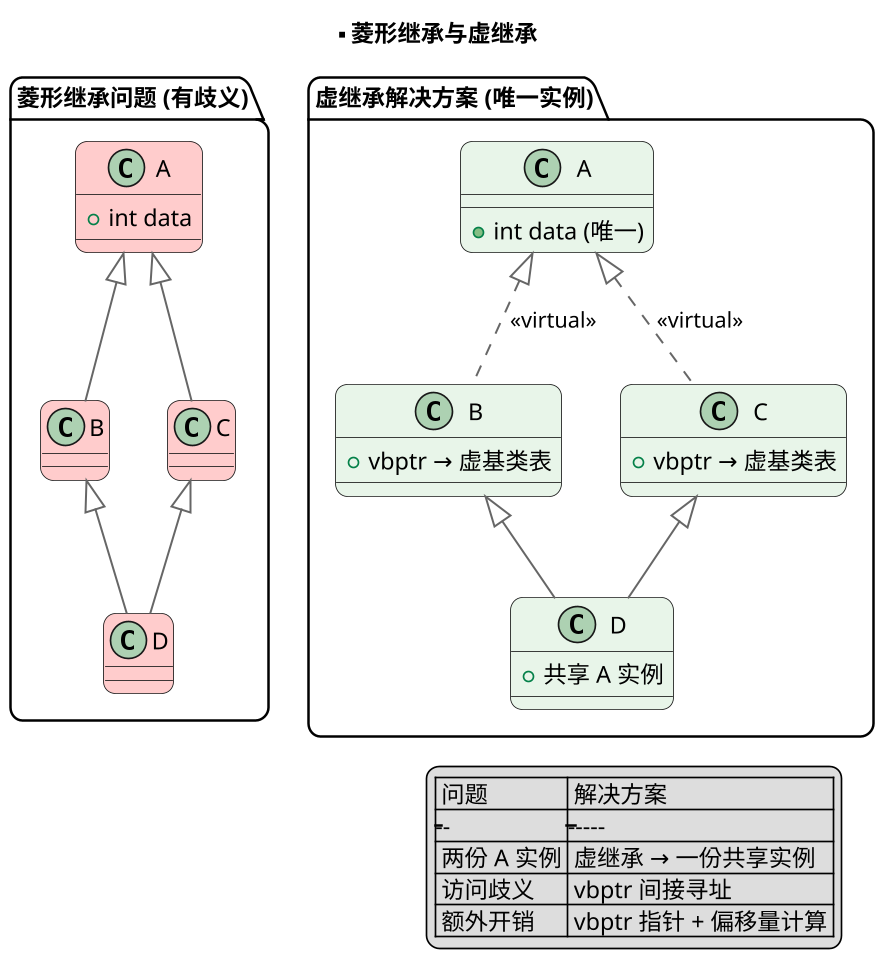
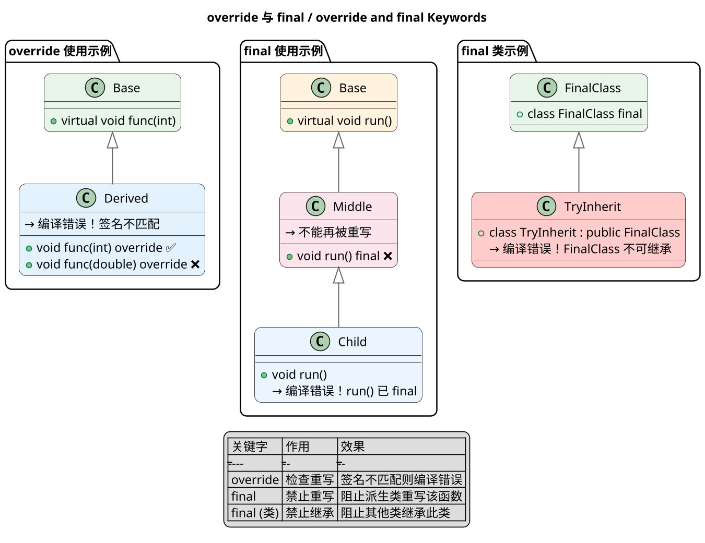
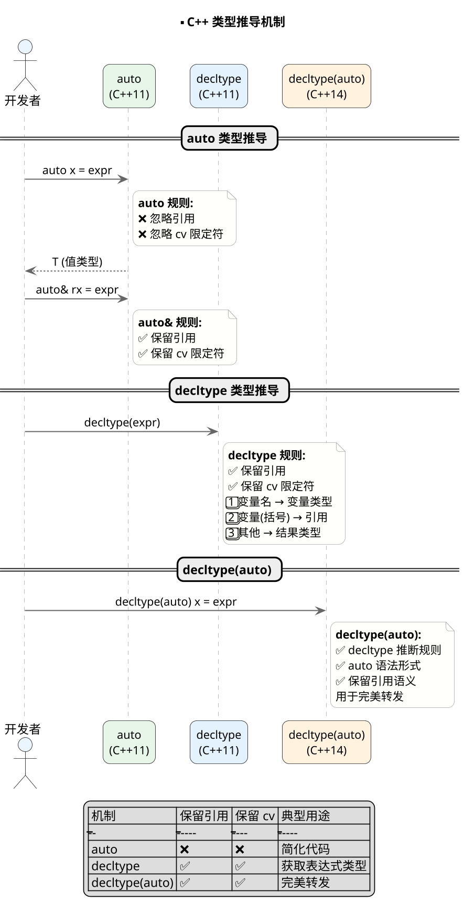

# 面对对象的三大特征

**原理:**

**封装（Encapsulation）** 是将数据和操作数据的methods组织成一个独立的单元（类），并通过访问控制符（public、protected、private）来限制外部对内部成员的直接访问。封装的目的是**信息隐藏**，只暴露必要的接口给外部使用。合理的封装可以保护对象内部状态的完整性和一致性，同时降低代码耦合度，提高代码的可维护性和可复用性。

**继承（Inheritance）** 是面向对象最核心的特征之一，它允许创建分层次的类关系。通过继承，子类可以复用父类的数据和行为（成员变量和函数），无需重新编写。继承体现了"is-a"的关系。C++支持单继承、多继承以及虚继承。继承大大提高了代码的复用性和可扩展性。

**多态（Polymorphism）** 是指同一操作作用于不同对象可以产生不同的行为结果。多态分为**编译时多态（静态多态）**和**运行时多态（动态多态）**。编译时多态通过函数重载和模板实现；运行时多态通过虚函数和继承关系实现。C++的多态性使得我们可以使用基类指针或引用来操作子类对象，实现了接口与实现分离的设计原则。


```plantuml
@startuml
skinparam dpi 160
skinparam shadowing false
skinparam roundcorner 15
skinparam sequenceArrowThickness 1.3
skinparam sequenceMessageAlign center
skinparam ParticipantPadding 15
skinparam BoxPadding 15
skinparam ArrowColor #666
skinparam ArrowThickness 1.2
skinparam SequenceLifeLineBorderColor #AAAAAA
skinparam SequenceLifeLineBackgroundColor #F8F8F8
skinparam NoteBackgroundColor #FFFFFB
skinparam NoteBorderColor #AAA
skinparam ParticipantFontSize 13
skinparam ActorFontSize 14
skinparam SequenceDividerFontSize 14

title **面向对象三大特征

package "封装
  class "类 (Class)" as CLASS #E8F5E9 {
    + public: 接口
    - private: 数据
    # protected: 受限
  }

  note right of CLASS
    **信息隐藏**
    只暴露必要接口
    保护内部状态
  end note
}

package "继承
  class "基类 (Base)" as BASE #E3F2FD {
    + 数据成员
    + 成员函数
  }

  class "派生类 (Derived)" as DERIVED #E3F2FD {
    + 复用基类成员
    + 可重写方法
  }

  BASE <|-- DERIVED : 继承
}

package "多态
  class "基类指针" as BASEPTR #FFF3E0
  class "子类对象" as DERIVEDOBJ #FFF3E0

  BASEPTR ..> DERIVEDOBJ : 运行时\n动态绑定
}

legend center
| 特征 | 目的 | 实现方式 |
|------|------|---------|
| 封装 | 信息隐藏 | 访问控制符 |
| 继承 | 代码复用 | 类派生 |
| 多态 | 接口分离 | 虚函数 |
endlegend

@enduml
```

---

# 简述多态实现原理

**原理:**

C++ 多态的实现依赖于**虚函数表（vtable）**和**虚函数表指针（vptr）**。当类中包含至少一个虚函数时，编译器会为该类创建一个虚函数表。虚函数表是一个存储函数指针的数组，每个虚函数对应表中一个槽位，指向实际要调用的函数地址。

每个包含虚函数的类的对象都会包含一个隐藏的**虚函数表指针（vptr）**，位于对象内存布局的起始位置。当通过基类指针或引用调用虚函数时，程序首先通过对象头部的vptr找到对应的vtable，然后在vtable中查找函数的实际地址，最后跳转到该地址执行。

**动态绑定的过程**：Base* ptr = new Derived(); ptr->virtualFunc(); 编译器生成的代码大致为：(*(ptr->vptr)[slot])()。这就是C++运行时多态的底层机制。


```plantuml
@startuml
skinparam dpi 160
skinparam shadowing false
skinparam roundcorner 15
skinparam sequenceArrowThickness 1.3
skinparam sequenceMessageAlign center
skinparam ParticipantPadding 15
skinparam BoxPadding 15
skinparam ArrowColor #666
skinparam ArrowThickness 1.2
skinparam SequenceLifeLineBorderColor #AAAAAA
skinparam SequenceLifeLineBackgroundColor #F8F8F8
skinparam NoteBackgroundColor #FFFFFB
skinparam NoteBorderColor #AAA
skinparam ParticipantFontSize 13
skinparam ActorFontSize 14
skinparam SequenceDividerFontSize 14

title **多态实现原理

package "对象内存布局
  object "对象 obj" as OBJ #E8F5E9 {
    {field} vptr (隐藏) → 指向 vtable
    {field} 成员变量1
    {field} 成员变量2
  }
}

package "虚函数表 / vtable" {
  class "Base vtable" as BASE_VTBL #E3F2FD {
    + slot[0]: Base::func1()
    + slot[1]: Base::func2()
  }

  class "Derived vtable" as DERIVED_VTBL #E3F2FD {
    + slot[0]: Derived::func1() ← 重写
    + slot[1]: Base::func2()
  }
}

package "动态绑定过程
  actor "调用者" as CALLER #FFF3E0
  participant "Base* ptr" as PTR #FCE4EC
  participant "vptr 查找" as VLOOKUP #EAF5FF
  participant "vtable 派发" as VDISPATCH #EAF5FF
  participant "实际函数" as FUNC #F8F8F8
}

== 动态绑定流程 ==

CALLER -> PTR : ptr->virtualFunc()
PTR -> VLOOKUP : 通过 vptr 找到 vtable
VLOOKUP -> VDISPATCH : 查找 slot[index]
VDISPATCH -> FUNC : 跳转到函数地址
FUNC --> CALLER : 执行实际函数

legend center
| 概念 | 说明 |
|------|------|
| vptr | 对象中的隐藏指针，指向 vtable |
| vtable | 类级别的函数指针数组 |
| slot | vtable 中每个虚函数的索引 |
| 动态绑定 | 运行时通过 vptr 查找实际函数 |
endlegend

@enduml
```

---

### 怎么解决菱形继承

**原理:**

**菱形继承**是多继承时出现的一种结构问题。假设类A是基类，B和C都继承自A，D同时继承自B和C。这种继承结构会导致D对象中存在**两份A的成员**，造成数据冗余和二义性问题。

**虚继承**是C++解决菱形继承问题的标准方案。通过在继承时使用`virtual`关键字，可以确保公共基类A在派生类D中只有**一份共享的实例**。虚继承的语法是`class B : virtual public A`。

虚继承的原理是：编译器为虚继承的类创建**虚基类表（vbptr）**，每个虚继承的子类对象包含一个指向虚基类表的指针。虚基类表记录了从当前子类到虚基类的偏移量。




---

### 关键字 override, final 的作用 / override and final Keywords

**原理:**

**override** 是C++11引入的关键字，用于显式标识派生类的成员函数是对基类虚函数的重写。当在派生类函数后添加`override`说明符时，编译器会检查该函数是否确实重写了基类中的某个虚函数。如果没有匹配的重写，编译器会报错。这大大提高了代码的安全性和可读性。

**final** 是C++11引入的另一个关键字，它可以用于限制类或虚函数的重写/继承。如果将final用于类，则该类不能被继承；如果将final用于虚函数，则该函数不能在派生类中被重写。final提供了更强的设计控制，帮助程序员明确表达设计意图。

**override** (C++11) explicitly marks a derived class function as overriding a base class virtual function. The compiler checks if the function actually overrides; if not, it produces an error. **final** (C++11) restricts inheritance or overriding.



---

### C++ 类型推导用法

**原理:**

C++ 提供了三种主要的类型推导机制：**auto**、**decltype** 和模板类型推导。

**auto** 是C++11引入的自动类型推导关键字。编译器根据初始化表达式推断变量类型。重要规则：auto会**忽略引用和cv限定符**（const/volatile）。例如`auto&`才能推导为引用类型。auto不能用于函数参数声明，不能用于非静态成员变量。

**decltype** 是C++11引入的表达式类型推导机制。它根据表达式推断类型，但**不会执行表达式**（编译时完成）。关键区别于auto的是，decltype会**完整保留引用和cv限定符**。

**decltype(auto)** 是C++14引入的语法，结合两者优点——用decltype规则推断类型，但保持auto的语法形式。最重要的特性是**保留表达式的引用语义**，在完美转发场景中非常有用。

**auto** (C++11) deduces variable type from initializer, ignoring references and cv-qualifiers. **decltype** (C++11) deduces type from expressions, preserving references and cv-qualifiers. **decltype(auto)** (C++14) combines both.



---

### function, lambda, bind 之间的关系

**原理:**

`std::function`、`lambda`表达式和`std::bind`是C++中三种重要的可调用对象机制。

**std::function** 是**类型擦除的包装器**，可以存储、复制和调用任何符合指定函数签名的可调用对象。类型擦除意味着它隐藏了具体类型，只保留统一接口。但类型擦除有代价：对于有捕获的lambda需要堆分配，以及虚函数调用的运行时开销。

**lambda** 是C++11引入的**匿名可调用对象**创建语法。编译时生成闭包类，实例化闭包对象。其优势是**零成本抽象**——无捕获时（`[]`）可转为函数指针，无额外开销。

**std::bind** 是C++11的**函数适配器**，创建预绑定部分参数的函数对象。主要用于将成员函数转为可调用对象，或绑定自由函数的部分参数。

**std::function** is a type-erased wrapper storing any callable matching a signature. **Lambda** (C++11) creates anonymous callables at compile time with zero-cost abstraction for uncaptured lambdas. **std::bind** (C++11) creates function objects with pre-bound arguments.

```plantuml
@startuml
skinparam dpi 160
skinparam shadowing false
skinparam roundcorner 15
skinparam sequenceArrowThickness 1.3
skinparam sequenceMessageAlign center
skinparam ParticipantPadding 15
skinparam BoxPadding 15
skinparam ArrowColor #666
skinparam ArrowThickness 1.2
skinparam SequenceLifeLineBorderColor #AAAAAA
skinparam SequenceLifeLineBackgroundColor #F8F8F8
skinparam NoteBackgroundColor #FFFFFB
skinparam NoteBorderColor #AAA
skinparam ParticipantFontSize 13
skinparam ActorFontSize 14
skinparam SequenceDividerFontSize 14

title **function, lambda, bind 关系 / function, lambda, bind Relationship**

package "可调用对象
  class "普通函数\nvoid f(int)" as FUNC #E8F5E9
  class "Lambda\n[capture](args){body}" as LAMBDA #E3F2FD
  class "Bind 结果\nbind(fn, args)" as BIND #FFF3E0
  class "函数对象\nclass Operator()" as FUNCTOR #FCE4EC
  class "成员函数" as MEMFUNC #EAF5FF
}

package "std::function (类型擦除包装器)" {
  class "std::function<R(Args...)>\n统一接口" as FUNCTION #FEFEFE

  note right of FUNCTION
    **特性:**
    ✅ 存储任意可调用对象
    ❌ 类型擦除开销
    ❌ 堆分配 (有捕获)
    ❌ 虚函数调用
  end note
}

FUNC --> FUNCTION : 可存储
LAMBDA --> FUNCTION : 可存储
BIND --> FUNCTION : 可存储
FUNCTOR --> FUNCTION : 可存储
MEMFUNC --> FUNCTION : 可存储

LAMBDA --> FUNC : 无捕获时\n转函数指针
note right of LAMBDA
  **Lambda 优势:**
  ✅ 零成本抽象
  ✅ 语法简洁
end note

BIND ..> LAMBDA : 可用 lambda 替代
note left of BIND
  **bind 特点:**
  ⚠️ C++11 引入
  ⚠️ 语法较复杂
end note

legend center
| 类型 | 存储开销 | 调用开销 | 灵活性 |
|------|---------|---------|--------|
| 函数指针 | 无 | 最低 | 低 |
| lambda (无捕获) | 无 | 低 | 中 |
| std::function | 有 | 中 | 高 |
endlegend

@enduml
```

---

### 继承下的构造函数和析构函数执行顺序

**原理:**

**构造函数的执行顺序**：当创建派生类对象时，构造顺序是**基类→成员对象→派生类**。首先执行基类的构造函数，然后执行成员对象的构造函数，最后执行派生类自己的构造函数。

**析构函数的执行顺序**：与构造顺序**完全相反**——**派生类→成员对象→基类**。这个逆序确保了派生类的资源在其基类之前被释放。

**虚函数调用问题**：在构造函数和析构函数中调用虚函数不会实现运行时多态。因为在基类构造期间，派生类部分还未初始化，此时对象实际是基类类型。

**Constructor order**: Base → Member objects → Derived. **Destructor order**: Derived → Member objects → Base (reverse of construction). During base construction, virtual function calls don't reach derived overrides.

```plantuml
@startuml
skinparam dpi 160
skinparam shadowing false
skinparam roundcorner 15
skinparam sequenceArrowThickness 1.3
skinparam sequenceMessageAlign center
skinparam ParticipantPadding 15
skinparam BoxPadding 15
skinparam ArrowColor #666
skinparam ArrowThickness 1.2
skinparam SequenceLifeLineBorderColor #AAAAAA
skinparam SequenceLifeLineBackgroundColor #F8F8F8
skinparam NoteBackgroundColor #FFFFFB
skinparam NoteBorderColor #AAA
skinparam ParticipantFontSize 13
skinparam ActorFontSize 14
skinparam SequenceDividerFontSize 14

title **构造/析构函数执行顺序

actor "派生类对象创建" as CREATE #EAF5FF
actor "派生类对象销毁" as DESTROY #FFCCCC

participant "基类 (Base)" as BASE #E8F5E9
participant "成员对象 (Members)" as MEMBER #E3F2FD
participant "派生类 (Derived)" as DERIVED #FFF3E0

== 构造顺序

CREATE -> BASE : 1️⃣ 执行基类构造函数
note right of BASE
  初始化基类成员
end note

BASE -> MEMBER : 2️⃣ 执行成员构造函数
note right of MEMBER
  按声明顺序构造
end note

MEMBER -> DERIVED : 3️⃣ 执行派生类构造函数
note right of DERIVED
  初始化派生类成员
end note

DERIVED --> CREATE : 对象创建完成

== 析构顺序

DESTROY -> DERIVED : 1️⃣ 执行派生类析构函数
note left of DERIVED
  清理派生类资源
end note

DERIVED -> MEMBER : 2️⃣ 执行成员析构函数
note left of MEMBER
  逆序销毁
end note

MEMBER -> BASE : 3️⃣ 执行基类析构函数
note left of BASE
  最后清理基类
end note

BASE --> DESTROY : 对象销毁完成

legend center
| 阶段 | 构造函数顺序 | 析构函数顺序 |
|------|-------------|-------------|
| 1 | 基类 | 派生类 |
| 2 | 成员对象 | 成员对象 |
| 3 | 派生类 | 基类 |
endlegend

@enduml
```

---

### 虚函数表和虚函数表指针的创建时机 / vtable and vptr Creation Timing

**原理:**

**vtable的创建时机**：虚函数表在**编译时**创建，属于类而不是对象。每个包含虚函数的类在编译阶段都会生成一个唯一的vtable，存储该类所有虚函数的地址。

**vptr的创建时机**：虚函数表指针在**对象构造过程中**初始化。在基类的构造函数中，vptr被设置为指向基类的vtable；在派生类的构造函数开始执行前，vptr被更新为指向派生类的vtable。

**多重继承与多个vptr**：在多重继承情况下，每个直接基类都可能有自己独立的vptr。派生类对象会包含多个vptr，指向各自的vtable。

**vtable creation**: At **compile time**, per-class, storing virtual function addresses. **vptr initialization**: During **object construction**, set to point to current class's vtable. In multiple inheritance, multiple vptrs exist—one per direct base class.

```plantuml
@startuml
skinparam dpi 160
skinparam shadowing false
skinparam roundcorner 15
skinparam sequenceArrowThickness 1.3
skinparam sequenceMessageAlign center
skinparam ParticipantPadding 15
skinparam BoxPadding 15
skinparam ArrowColor #666
skinparam ArrowThickness 1.2
skinparam SequenceLifeLineBorderColor #AAAAAA
skinparam SequenceLifeLineBackgroundColor #F8F8F8
skinparam NoteBackgroundColor #FFFFFB
skinparam NoteBorderColor #AAA
skinparam ParticipantFontSize 13
skinparam ActorFontSize 14
skinparam SequenceDividerFontSize 14

title **vtable 与 vptr 创建时机 / vtable & vptr Creation Timing**

package "编译时
  class "Base 类" as BASE_CLASS #E8F5E9 {
    + virtual void func1()
    + virtual void func2()
  }

  class "Derived 类" as DERIVED_CLASS #E3F2FD {
    + virtual void func1() ← 重写
    + virtual void func2()
    + virtual void func3() ← 新增
  }

  note right of BASE_CLASS
    **Base vtable:**
    slot[0] → Base::func1
    slot[1] → Base::func2
  end note

  note right of DERIVED_CLASS
    **Derived vtable:**
    slot[0] → Derived::func1
    slot[1] → Base::func2
    slot[2] → Derived::func3
  end note
}

package "运行时 - 构造过程中
  actor "派生类对象构造" as CTOR #FFF3E0
  participant "vptr (初始)" as VPTR1 #FCE4EC
  participant "vptr (更新后)" as VPTR2 #FCE4EC

  CTOR -> VPTR1 : 基类构造阶段
  note left of VPTR1
    vptr → Base vtable
    调用虚函数 → Base 版本
  end note

  CTOR -> VPTR2 : 派生类构造阶段
  note left of VPTR2
    vptr → Derived vtable
    调用虚函数 → Derived 版本
  end note
}

package "多重继承情况" {
  class "Derived 多继承" as MULTI #EAF5FF {
    + vptr_A → A vtable
    + vptr_B → B vtable
  }

  note bottom of MULTI
    **每个直接基类一个 vptr**
    指向各自的 vtable
  end note
}

legend center
| 阶段 | vptr 状态 | 虚函数调用目标 |
|------|----------|--------------|
| 编译时 | 不存在 | vtable 生成 |
| 基类构造 | → Base vtable | Base 版本 |
| 派生类构造 | → Derived vtable | Derived 版本 |
| 析构函数 | → 当前类 vtable | 当前类版本 |
endlegend

@enduml
```

---

### 虚析构函数的作用

**原理:**

虚析构函数是C++面向对象编程中确保资源正确释放的关键机制。

**问题场景**：当通过基类指针删除派生类对象时，如果基类的析构函数不是虚函数，只会调用基类的析构函数，派生类特有的资源将不会被释放，导致**内存泄漏**。例如，`Base* p = new Derived(); delete p;` 如果Base的析构函数非虚，则只会调用~Base()而不会调用~Derived()。

**虚析构函数原理**：将基类的析构函数声明为虚函数后，析构函数就进入了类的虚函数表。通过基类指针删除对象时，运行时通过vptr找到实际对象的vtable，调用派生类的析构函数。派生类的析构函数执行完后，会自动调用基类的析构函数，形成完整的析构链。

**Virtual destructors** ensure proper cleanup when deleting derived objects through base pointers. If ~Base() is non-virtual, only ~Base() executes, leaking derived resources. Making the destructor virtual enables the full destruction chain through vtable dispatch.

```plantuml
@startuml
skinparam dpi 160
skinparam shadowing false
skinparam roundcorner 15
skinparam sequenceArrowThickness 1.3
skinparam sequenceMessageAlign center
skinparam ParticipantPadding 15
skinparam BoxPadding 15
skinparam ArrowColor #666
skinparam ArrowThickness 1.2
skinparam SequenceLifeLineBorderColor #AAAAAA
skinparam SequenceLifeLineBackgroundColor #F8F8F8
skinparam NoteBackgroundColor #FFFFFB
skinparam NoteBorderColor #AAA
skinparam ParticipantFontSize 13
skinparam ActorFontSize 14
skinparam SequenceDividerFontSize 14

title **虚析构函数作用

package "非虚析构函数问题" {
  class "Base (非虚析构)" as BASE_NONVIRT #FFCCCC {
    + ~Base() ❌ 非虚
  }

  class "Derived" as DERIVED_NONVIRT #FFCCCC {
    + ~Derived()
    + 分配了资源
  }

  note bottom of BASE_NONVIRT
    **问题:**
    Base* p = new Derived();
    delete p; // 只调用 ~Base()
    // ~Derived() 不会被调用！
    // 内存泄漏
  end note
}

package "虚析构函数解决方案" {
  class "Base (虚析构)" as BASE_VIRT #E8F5E9 {
    + virtual ~Base() ✅
  }

  class "Derived" as DERIVED_VIRT #E8F5E9 {
    + ~Derived()
    + 释放资源
  }

  note bottom of BASE_VIRT
    **解决方案:**
    Base* p = new Derived();
    delete p; // 通过 vptr 调用
    // ~Derived() → ~Base()
    // 完整析构链！
  end note
}

package "删除对象时" {
  actor "delete p" as DELETE #FFF3E0
  participant "~Derived()" as DTOR_D #FCE4EC
  participant "~Base()" as DTOR_B #FCE4EC

  DELETE -> DTOR_D : 通过 vptr 找到
  DTOR_D -> DTOR_B : 自动调用
  DTOR_B --> DELETE : 资源全部释放
}

legend center
| 析构函数类型 | delete 基类指针 | 析构链 |
|-------------|-----------------|-------|
| 非虚 | 只调用基类析构 | ❌ 不完整 |
| 虚 | 先派生后基类 | ✅ 完整 |
endlegend

@enduml
```

---

### 智能指针种类以及使用场景

**原理:**

C++11 引入了三种智能指针来自动管理动态内存：`std::unique_ptr`、`std::shared_ptr` 和 `std::weak_ptr`。

**std::unique_ptr** 是独占所有权的智能指针，同一时刻只能有一个 unique_ptr 拥有对象。当 unique_ptr 被销毁时，它所管理的对象也会被自动删除。unique_ptr 不能复制但可以移动。适用于单独拥有对象、不需要共享的场景。

**std::shared_ptr** 是共享所有权的智能指针，通过引用计数来管理对象。多个 shared_ptr 可以共享同一个对象的所有权，当最后一个 shared_ptr 被销毁时，对象才会被删除。适用于需要多个所有者共享对象的场景。

**std::weak_ptr** 是 shared_ptr 的观察者，不参与引用计数。它主要用于解决 shared_ptr 的循环引用问题。适用于观察 shared_ptr 的对象但不拥有它。

**std::unique_ptr** - exclusive ownership, auto-deletes on destruction, non-copyable but movable. **std::shared_ptr** - shared ownership via reference counting. **std::weak_ptr** - non-owning observer of shared_ptr, solves circular reference problems.

```plantuml
@startuml
skinparam dpi 160
skinparam shadowing false
skinparam roundcorner 15
skinparam sequenceArrowThickness 1.3
skinparam sequenceMessageAlign center
skinparam ParticipantPadding 15
skinparam BoxPadding 15
skinparam ArrowColor #666
skinparam ArrowThickness 1.2
skinparam SequenceLifeLineBorderColor #AAAAAA
skinparam SequenceLifeLineBackgroundColor #F8F8F8
skinparam NoteBackgroundColor #FFFFFB
skinparam NoteBorderColor #AAA
skinparam ParticipantFontSize 13
skinparam ActorFontSize 14
skinparam SequenceDividerFontSize 14

title **智能指针种类

package "unique_ptr (独占所有权)" {
  class "unique_ptr<T>" as UNIQUE #E8F5E9 {
    + T* ptr
    + 独占对象
  }

  note bottom of UNIQUE
    **特点:**
    ✅ 独占所有权
    ✅ 自动释放
    ✅ 无引用计数开销
    ❌ 不可复制
    ✅ 可移动
  end note

  UNIQUE -> [T] : 拥有
}

package "shared_ptr (共享所有权)" {
  class "shared_ptr<T>" as SHARED1 #E3F2FD {
    + T* ptr
    + 控制块 (ref count)
  }

  class "shared_ptr<T>" as SHARED2 #E3F2FD {
    + T* ptr
    + 控制块 (ref count)
  }

  class "T 对象" as TOK #FFF3E0

  SHARED1 -> TOK : 共享所有权
  SHARED2 -> TOK : 共享所有权

  note bottom of SHARED1
    **特点:**
    ✅ 共享所有权
    ✅ 引用计数
    ❌ 引用计数开销
    ✅ 可复制
  end note
}

package "weak_ptr (观察者)" {
  class "weak_ptr<T>" as WEAK #FCE4EC {
    + 不参与引用计数
    + 观察 shared_ptr
  }

  class "shared_ptr<T>" as SHARED3 #E3F2FD
  class "T 对象" as TOBJ #FFF3E0

  WEAK --> SHARED3 : 观察
  SHARED3 --> TOBJ : 拥有

  note bottom of WEAK
    **特点:**
    ✅ 不参与引用计数
    ✅ 打破循环引用
    ⚠️ 需 lock() 转换为 shared_ptr
  end note
}

package "使用场景" {
  object "单独拥有对象" as USE1 #F8F8F8
  object "多个所有者" as USE2 #F8F8F8
  object "打破循环引用" as USE3 #F8F8F8

  USE1 ..> UNIQUE : unique_ptr
  USE2 ..> SHARED1 : shared_ptr
  USE3 ..> WEAK : weak_ptr
}

legend center
| 类型 | 所有权 | 复制 | 移动 | 引用计数 | 典型场景 |
|------|-------|------|------|---------|---------|
| unique_ptr | 独占 | ❌ | ✅ | 无 | 单所有者 |
| shared_ptr | 共享 | ✅ | ✅ | 有 | 多所有者 |
| weak_ptr | 无 | ✅ | ✅ | 无 | 观察者 |
endlegend

@enduml
```

---

### C++11 用过哪些特性

**原理:**

C++11 是 C++ 语言的一次重大革新，引入了大量新特性。

**右值引用与移动语义**：C++11 引入了右值引用（`T&&`）和移动构造函数、移动赋值运算符。移动语义允许"窃取"临时对象的资源，避免不必要的拷贝。`std::move()` 用于将左值转换为右值引用。

**auto 和 decltype**：`auto` 自动推导变量类型，`decltype` 推导表达式类型。`decltype(auto)` (C++14) 结合两者优点，用于完美转发返回值。

**lambda 表达式**：lambda 允许在需要的地方直接定义匿名函数对象。语法：`[capture](params) -> ret { body }`。lambda 实现了零成本抽象，无捕获时可转为函数指针。

**智能指针**：`std::unique_ptr`、`std::shared_ptr`、`std::weak_ptr`。

**其他重要特性**：范围 for 循环、`nullptr`、委托构造函数、override 和 final 关键字、`static_assert`、`std::thread` 等。

**Key C++11 features**: Rvalue references and move semantics enable resource stealing from temporaries. auto and decltype provide type deduction. Lambda expressions create anonymous function objects. Smart pointers automate memory management. nullptr solves NULL ambiguity.

```plantuml
@startuml
skinparam dpi 160
skinparam shadowing false
skinparam roundcorner 15
skinparam sequenceArrowThickness 1.3
skinparam sequenceMessageAlign center
skinparam ParticipantPadding 15
skinparam BoxPadding 15
skinparam ArrowColor #666
skinparam ArrowThickness 1.2
skinparam SequenceLifeLineBorderColor #AAAAAA
skinparam SequenceLifeLineBackgroundColor #F8F8F8
skinparam NoteBackgroundColor #FFFFFB
skinparam NoteBorderColor #AAA
skinparam ParticipantFontSize 13
skinparam ActorFontSize 14
skinparam SequenceDividerFontSize 14

title **C++11 核心特性

package "语言核心
  class "右值引用\nT&&" as RREF #E8F5E9 {
    + 移动语义
    + 完美转发
    + std::move()
  }

  class "类型推导\nauto, decltype" as TYPE #E3F2FD {
    + 编译时类型推断
    + decltype(auto)
  }

  class "Lambda\n[capture](args){body}" as LAMBDA #FFF3E0 {
    + 匿名函数对象
    + 零成本抽象
  }
}

package "智能指针
  class "unique_ptr\n独占所有权" as UNIQUE #FCE4EC
  class "shared_ptr\n共享所有权" as SHARED #FCE4EC
  class "weak_ptr\n观察者" as WEAK #FCE4EC
}

package "其他重要特性
  class "nullptr\n空指针" as NULLPTR #EAF5FF
  class "范围for\nfor(auto x : c)" as RANGEFOR #EAF5FF
  class "override/final\n控制继承" as OVERRIDE #EAF5FF
  class "default/delete\n特殊成员" as SPECMEM #EAF5FF
}

package "标准库增强
  class "std::thread\n线程" as THREAD #F8F8F8
  class "std::function\n函数包装" as FUNCTION #F8F8F8
  class "std::bind\n参数绑定" as BIND #F8F8F8
  class "容器增强\ninitializer_list" as CONTAINER #F8F8F8
}

legend center
| 类别 | 特性 | 解决的问题 |
|------|------|---------|
| 内存管理 | 智能指针 | 内存泄漏 |
| 性能 | 移动语义 | 不必要的拷贝 |
| 简洁性 | auto/lambda | 冗长代码 |
| 安全 | nullptr | NULL 二义性 |
| 设计 | override/final | 意外重写/继承 |
endlegend

@enduml
```

---

### 动态库与静态库的区别

**原理:**

**静态库（Static Library）**：在编译链接阶段，链接器将静态库中的目标代码直接复制到最终可执行文件中。文件扩展名为`.a`（Linux）或`.lib`（Windows）。优点：运行时无需额外依赖，部署简单。缺点：多个程序使用同一静态库会存在多份代码副本，更新库需要重新编译链接。

**动态库（Dynamic Library）**：在程序运行时加载，链接器仅在可执行文件中存储对动态库的引用。文件扩展名为`.so`（Linux）或`.dll`（Windows）。优点：多个程序共享同一份代码，可以独立更新库而无需重新编译主程序。缺点：运行时需要库文件存在。

**Static libraries** are linked at compile time—object code is copied into the executable. **Dynamic libraries** are loaded at runtime—only references are stored. Static libraries offer simpler deployment but less flexibility; dynamic libraries save memory through sharing.

```plantuml
@startuml
skinparam dpi 160
skinparam shadowing false
skinparam roundcorner 15
skinparam sequenceArrowThickness 1.3
skinparam sequenceMessageAlign center
skinparam ParticipantPadding 15
skinparam BoxPadding 15
skinparam ArrowColor #666
skinparam ArrowThickness 1.2
skinparam SequenceLifeLineBorderColor #AAAAAA
skinparam SequenceLifeLineBackgroundColor #F8F8F8
skinparam NoteBackgroundColor #FFFFFB
skinparam NoteBorderColor #AAA
skinparam ParticipantFontSize 13
skinparam ActorFontSize 14
skinparam SequenceDividerFontSize 14

title **静态库 vs 动态库

package "静态链接
  file "libxxx.a" as STATIC_LIB #E8F5E9
  file "main.o" as OBJ #E8F5E9
  file "program (可执行文件)" as EXEC_STATIC #E8F5E9

  STATIC_LIB --> EXEC_STATIC : 链接器复制
  OBJ --> EXEC_STATIC : 链接器合并
}

package "动态链接
  file "libxxx.so" as DYN_LIB #E3F2FD
  file "main.o" as OBJ_DYN #E3F2FD
  file "program" as EXEC_DYN #E3F2FD

  DYN_LIB ..> EXEC_DYN : 运行时加载\n(引用关系)
  OBJ_DYN --> EXEC_DYN : 链接器记录
}

package "运行时对比" {
  object "程序A" as PROG_A #FFF3E0
  object "程序B" as PROG_B #FFF3E0
  object "libxxx.so (共享)" as SHARED_LIB #FCE4EC

  PROG_A --> SHARED_LIB : 共享
  PROG_B --> SHARED_LIB : 共享

  note bottom of SHARED_LIB
    **动态库优点:**
    ✅ 内存共享
    ✅ 独立更新
    ❌ 需部署 .so 文件
  end note
}

legend center
| 特性 | 静态库 | 动态库 |
|------|-------|-------|
| 链接时机 | 编译时 | 运行时 |
| 代码存储 | 复制到可执行文件 | 独立文件 |
| 内存占用 | 多程序多副本 | 共享一份 |
| 更新维护 | 需重新编译 | 可独立更新 |
| 部署 | 简单 (自包含) | 需带库文件 |
endlegend

@enduml
```

---

### 左值引用与右值引用的区别

**原理:**

**左值引用（Lvalue Reference）**：使用单个 `&` 声明，必须绑定到一个有持久地址的对象。左值引用是 C++98 就有的语法，常见的如 `T&`、`const T&`。左值引用不能绑定到右值。

**右值引用（Rvalue Reference）**：使用双 `&&` 声明，C++11 引入。右值引用只能绑定到临时对象（即将被销毁的对象、没有名字的对象）。右值引用使得我们可以利用临时对象的资源，避免不必要的拷贝。

**移动语义**：传统的拷贝构造需要复制数据，而移动构造"窃取"源对象的资源，将源对象置于有效但可析构的状态。这就是移动语义提升性能的核心原因。

**完美转发**：`std::forward<T>()` 可以保持参数的左值/右值属性。`std::move()` 则无条件地将参数转换为右值引用。

**Lvalue references** (`T&`) bind to persistent objects. **Rvalue references** (`T&&`, C++11) bind to temporaries, enabling move semantics—transferring resources instead of copying, significantly improving performance.

```plantuml
@startuml
skinparam dpi 160
skinparam shadowing false
skinparam roundcorner 15
skinparam sequenceArrowThickness 1.3
skinparam sequenceMessageAlign center
skinparam ParticipantPadding 15
skinparam BoxPadding 15
skinparam ArrowColor #666
skinparam ArrowThickness 1.2
skinparam SequenceLifeLineBorderColor #AAAAAA
skinparam SequenceLifeLineBackgroundColor #F8F8F8
skinparam NoteBackgroundColor #FFFFFB
skinparam NoteBorderColor #AAA
skinparam ParticipantFontSize 13
skinparam ActorFontSize 14
skinparam SequenceDividerFontSize 14

title **左值引用 vs 右值引用

package "左值引用
  class "T&" as LREF #E8F5E9 {
    + 必须绑定左值
    + 持久存在的对象
    + 可读可写 (非const)
  }

  note bottom of LREF
    **左值特点:**
    ✅ 有持久地址
    ✅ 表达式结束后仍存在
    ✅ 可取地址 (&)
    示例: 变量、返回左值引用的函数
  end note
}

package "右值引用
  class "T&&" as RREF #E3F2FD {
    + 必须绑定右值
    + 临时对象 / 将销毁的对象
    + 可"窃取"其资源
  }

  note bottom of RREF
    **右值特点:**
    ✅ 无持久地址
    ✅ 表达式结束即销毁
    ❌ 不可取地址
    示例: 函数返回值、表达式结果
  end note
}

package "移动语义
  class "拷贝构造\nCopy Constructor" as COPY #FFF3E0 {
    + 深拷贝数据
    + 分配新内存
    + 开销大
  }

  class "移动构造\nMove Constructor" as MOVE #FCE4EC {
    + 转移指针所有权
    + 不分配新内存
    + 开销小
  }

  note bottom of MOVE
    **移动语义优势:**
    ✅ 零拷贝转移大数据
    ✅ 源对象置于可析构状态
    ✅ 对 unique_ptr 尤为重要
  end note
}

package "std::move vs std::forward" {
  object "std::move(x)\n无条件转右值" as MOVE_FUNC #EAF5FF
  object "std::forward<T>()\n保持属性转发" as FWD_FUNC #EAF5FF
}

legend center
| 引用类型 | 语法 | 绑定对象 | 典型用途 |
|---------|------|---------|---------|
| 左值引用 | T& | 左值 | 修改对象、避免拷贝 |
| 右值引用 | T&& | 右值 | 移动语义、窃取资源 |
| const T& | const T& | 左值或右值 | 泛型参数、只读访问 |
endlegend

@enduml
```

---
