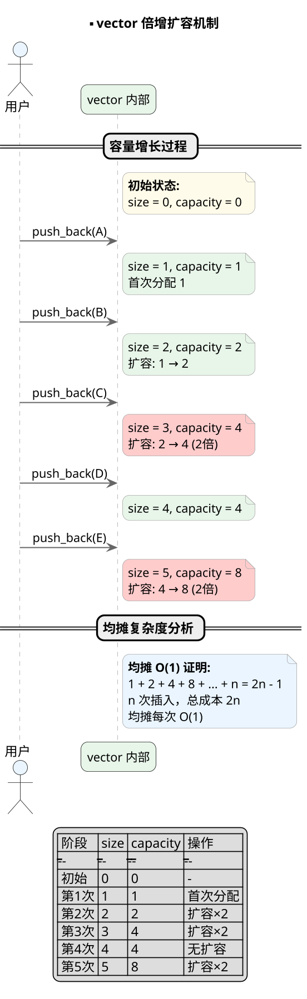
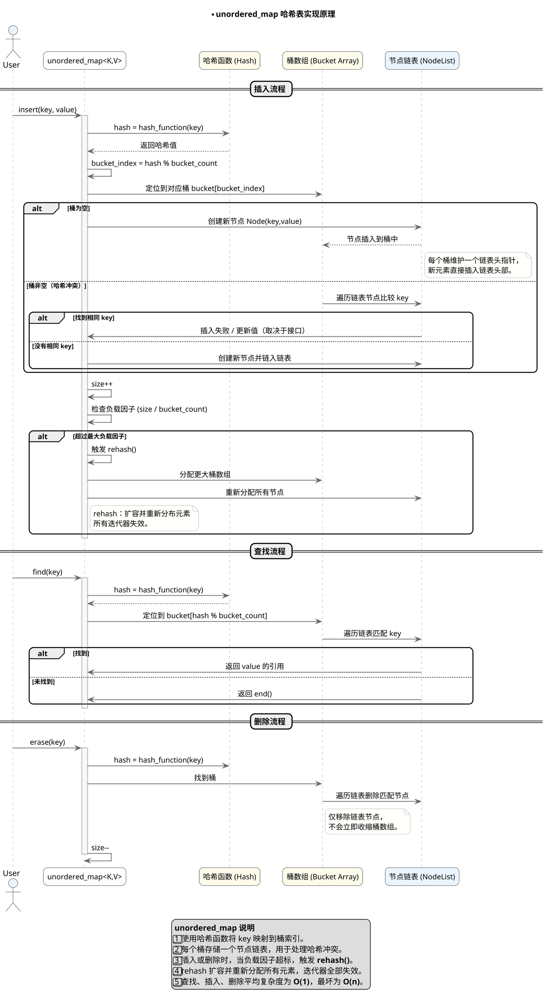

## 1. vector 底层实现原理

**原理:**

`std::vector` 内部维护一个指向堆内存的指针 `_data`，以及 `_size`（当前元素数）和 `_capacity`（已分配容量）。所有元素存储在连续内存中，保证随机访问的常数时间复杂度。

当 `push_back()` 插入新元素时：若 `_size < _capacity`，直接在现有内存中构造新元素；若容量不足，则**分配更大内存（通常为 2 倍）**，再将旧元素移动或拷贝过去，最后释放旧内存。扩容会导致迭代器、引用、指针失效。

元素的构造、析构由 `vector` 自动管理。离开作用域时，析构函数会依次销毁所有元素并释放堆内存，符合 RAII 原则。

vector 核心概念对比：

| 操作 | 时间复杂度 | 说明 |
|------|-----------|------|
| random access | O(1) | 连续内存，支持下标访问 |
| push_back | 均摊 O(1) | 扩容时 O(n) |
| insert/erase | O(n) | 需移动后续元素 |
| 扩容 | O(n) | 通常 2 倍容量 |

通过图示理解 vector 的内存模型与扩容机制：

```plantuml
@startuml
' =================== 全局样式 ===================
skinparam dpi 160
skinparam shadowing false
skinparam roundcorner 15
skinparam sequenceArrowThickness 1.3
skinparam sequenceMessageAlign center
skinparam ParticipantPadding 15
skinparam BoxPadding 15
skinparam ArrowColor #666
skinparam ArrowThickness 1.2
skinparam SequenceLifeLineBorderColor #AAAAAA
skinparam SequenceLifeLineBackgroundColor #F8F8F8
skinparam NoteBackgroundColor #FFFFFB
skinparam NoteBorderColor #AAA
skinparam ParticipantFontSize 13
skinparam ActorFontSize 14
skinparam SequenceDividerFontSize 14

title **vector 底层实现原理

package "vector 内部结构
  class "vector<T>" as V #E8F5E9 {
    + _data : T* (指向堆内存)
    + _size : size_t (当前元素数)
    + _capacity : size_t (已分配容量)
  }

  note right of V
    **连续内存模型:**
    元素存储在连续堆内存中
    支持 O(1) 随机访问
  end note
}

package "push_back 流程
  actor "用户" as U #EAF5FF
  participant "_size < _capacity?" as CHECK #FFFBEA
  participant "直接构造" as DIRECT #E8F5E9
  participant "扩容 (2倍)" as EXPAND #FFCCCC

  U -> CHECK : push_back(element)
  CHECK -> DIRECT : 容量充足
  CHECK -> EXPAND : 容量不足
  EXPAND -> EXPAND : 分配新内存 (2倍)
  EXPAND -> EXPAND : 移动/拷贝旧元素
  EXPAND -> EXPAND : 释放旧内存
  DIRECT -> DIRECT : 在现有内存构造
end

package "内存与迭代器失效
  object "扩容前" as BEFORE #F8F8F8
  object "扩容后" as AFTER #F8F8F8

  note bottom of BEFORE
    扩容后:
    - 所有迭代器失效
    - 所有引用失效
    - 所有指针失效
  end note

legend center
| 操作 | 时间复杂度 | 说明 |
|------|-----------|------|
| random access | O(1) | 连续内存，支持下标访问 |
| push_back | 均摊 O(1) | 扩容时 O(n) |
| insert/erase | O(n) | 需移动后续元素 |
| 扩容 | O(n) | 通常 2 倍容量 |
endlegend

@enduml
```

---

## 2. vector 内存增长机制

**原理:**

vector 的容量增长策略是**倍增（doubling）**策略。当容量不足时，通常分配当前容量的 2 倍新内存。这种策略确保了均摊后每次插入的时间复杂度为 O(1)。

**倍增策略的优势**：频繁的小幅扩容会导致频繁的内存分配和元素拷贝，代价高昂。2 倍扩容将扩容次数降低到对数级别，均摊成本最小化。

**容量与大小**：`size()` 返回当前元素数量，`capacity()` 返回已分配内存可容纳的元素数量。`reserve(n)` 仅预分配容量不改变大小，`resize(n)` 会改变大小并构造/析构元素。

**缩容**：`shrink_to_fit()` 请求释放未使用的容量，但具体实现不确定。`clear()` 只析构所有元素但不释放内存。

容量增长策略对比：

| 操作 | 效果 |
|------|------|
| reserve(n) | 预分配容量，不改变 size |
| resize(n) | 改变 size，大于原 size 则构造新元素 |
| shrink_to_fit() | 请求收缩容量（不保证） |
| clear() | 析构所有元素，不释放内存 |

通过图示理解 vector 的倍增扩容机制：



---

## 3. vector 中 reserve 和 resize 的区别

**原理:**

`reserve(n)` 仅预分配足够的内存容量，使 capacity >= n，但不改变 vector 的 size（元素数量）。调用后插入 n 个元素不会触发扩容。

`resize(n)` 显式改变 vector 的元素数量：若 n > size，则构造 (n - size) 个默认/指定值的元素；若 n < size，则析构 (size - n) 个元素。resize 会改变 size 和 capacity（通常增大）。

**关键区别**：reserve 只影响 capacity，不影响 size；resize 同时影响 size 和 capacity（可能）。

| 操作 | size 变化 | capacity 变化 | 元素构造 |
|------|-----------|---------------|---------|
| reserve(n) | 不变 | 增大至 >= n | 不构造 |
| resize(n) | 变为 n | 通常增大 | 大于原 size 则构造 |

通过图示理解 reserve 与 resize 的行为差异：

```plantuml
@startuml
' =================== 全局样式 ===================
skinparam dpi 160
skinparam shadowing false
skinparam roundcorner 15
skinparam sequenceArrowThickness 1.3
skinparam sequenceMessageAlign center
skinparam ParticipantPadding 15
skinparam BoxPadding 15
skinparam ArrowColor #666
skinparam ArrowThickness 1.2
skinparam SequenceLifeLineBorderColor #AAAAAA
skinparam SequenceLifeLineBackgroundColor #F8F8F8
skinparam NoteBackgroundColor #FFFFFB
skinparam NoteBorderColor #AAA
skinparam ParticipantFontSize 13
skinparam ActorFontSize 14
skinparam SequenceDividerFontSize 14

title **reserve vs resize

package "初始状态
  class "vector<int> v{1,2,3}" as INIT #E8F5E9 {
    + size = 3
    + capacity = 3
    + [1, 2, 3]
  }
}

package "reserve(10)
  class "v.reserve(10)" as RESERVE #E3F2FD {
    + size = 3 (不变!)
    + capacity = 10 (增大)
    + [1, 2, 3, -, -, -, -, -, -, -]
    (10 个空间，但只有 3 个元素)
  }

  note bottom of RESERVE
    **reserve 只分配空间:**
    - size 不变
    - capacity 增大
    - 不构造新元素
  end note
}

package "resize(10)
  class "v.resize(10)" as RESIZE #FFF3E0 {
    + size = 10 (改变!)
    + capacity = 10 (增大)
    + [1, 2, 3, 0, 0, 0, 0, 0, 0, 0]
    (10 个元素，填充默认值)
  }

  note bottom of RESIZE
    **resize 改变元素数量:**
    - size 变为 10
    - capacity 增大
    - 构造 7 个新元素(值为0)
  end note
}

INIT --> RESERVE : reserve(10)
INIT --> RESIZE : resize(10)

legend center
| 操作 | size | capacity | 元素 |
|------|------|----------|------|
| 初始 | 3 | 3 | [1,2,3] |
| reserve(10) | 3 | 10 | [1,2,3] + 7 未构造 |
| resize(10) | 10 | 10 | [1,2,3] + 7×0 |
endlegend

@enduml
```

---

## 4. vector 的元素类型为什么不能是引用

**原理:**

C++ 不允许 `vector<reference>`，原因是引用的内部实现与 vector 的内存管理机制存在根本冲突。

**引用的本质**：引用是一个绑定了特定对象的别名，本质上是一个指针（通常实现为常量指针）。引用必须绑定到有效的对象，且不可重新绑定。

**vector 的内存管理需求**：vector 需要能够拷贝构造、移动构造、拷贝赋值、移动赋值元素，以及在扩容时移动/拷贝所有元素。引用作为成员会带来以下问题：

1. **不可拷贝赋值**：两个引用无法相互赋值（改变绑定对象）
2. **不可移动**：引用已经绑定，无法"移动"到另一个对象
3. **析构问题**：vector 析构时无法正确"析构"引用（引用只是别名）

| 问题 | 原因 |
|------|------|
| 不可拷贝 | 引用是别名，不能改变绑定对象 |
| 不可移动 | 引用必须始终绑定某对象 |
| 析构无效 | 引用只是别名，析构无意义 |

通过图示理解引用无法作为 vector 元素的原因：

```plantuml
@startuml
' =================== 全局样式 ===================
skinparam dpi 160
skinparam shadowing false
skinparam roundcorner 15
skinparam sequenceArrowThickness 1.3
skinparam sequenceMessageAlign center
skinparam ParticipantPadding 15
skinparam BoxPadding 15
skinparam ArrowColor #666
skinparam ArrowThickness 1.2
skinparam SequenceLifeLineBorderColor #AAAAAA
skinparam SequenceLifeLineBackgroundColor #F8F8F8
skinparam NoteBackgroundColor #FFFFFB
skinparam NoteBorderColor #AAA
skinparam ParticipantFontSize 13
skinparam ActorFontSize 14
skinparam SequenceDividerFontSize 14

title **vector 不能存储引用的原因

package "引用的本质
  class "int a = 1, b = 2" as VARS #E8F5E9
  class "int& ref = a" as REF #E3F2FD {
    + ref 绑定到 a
    + 本质: 常量指针 (int* const)
  }

  note right of REF
    **引用实现:**
    引用通常实现为常量指针
    ref 的地址就是 a 的地址
  end note
}

package "vector 的内存管理需求
  class "vector<T>" as VEC #E3F2FD {
    + 需要拷贝构造: T(other)
    + 需要移动构造: T(std::move(other))
    + 需要拷贝赋值: operator=(other)
    + 需要移动赋值: operator=(std::move(other))
  }
}

package "引用无法满足的需求" {
  class "拷贝构造" as COPY #FFCCCC {
    ❌ int& ref 不可拷贝
    引用是别名，不能"复制"绑定关系
  }

  class "移动构造" as MOVE #FFCCCC {
    ❌ int& ref 不可移动
    引用必须始终绑定某对象
  }

  class "扩容时移动" as EXPAND #FFCCCC {
    ❌ vector 扩容需要移动元素
    引用无法被移动
  }
}

VEC --> COPY : 需要
VEC --> MOVE : 需要
VEC --> EXPAND : 需要扩容时

legend center
**为什么 vector 不能存储引用**

| 问题 | 原因 | 结果 |
|------|------|------|
| 拷贝构造 | 引用不可重新绑定 | ❌ 不支持 |
| 移动构造 | 引用必须绑定有效对象 | ❌ 不支持 |
| 拷贝赋值 | 改变绑定对象无意义 | ❌ 不支持 |
| 扩容移动 | 引用无法被移动 | ❌ 不支持 |

**替代方案**: 使用指针 (std::vector<int*>) 或智能指针 (std::vector<std::unique_ptr<int>>)
endlegend

@enduml
```

---

## 5. list 底层实现原理

**原理:**

`std::list` 是双向链表容器，内部由一系列节点（node）组成，每个节点存储一个元素以及指向前后节点的指针。list 不提供随机访问，时间复杂度为 O(n)。

**节点结构**：通常为 `Node { T data; Node* prev; Node* next; }`。sentinel 节点（头结点）简化边界处理。

**插入与删除**：O(1)，只需调整相邻节点的指针，不移动任何元素。迭代器不会因其他元素的插入/删除而失效（指向特定元素的迭代器在删除该元素时失效）。

**特性**：支持常数时间的 splice 操作，可在两个 list 间移动元素段。

| 操作 | 时间复杂度 | 说明 |
|------|-----------|------|
| random access | O(n) | 不支持，需遍历 |
| insert/erase | O(1) | 已知位置，常数时间 |
| splice | O(1) | 移动元素段，不拷贝 |
| 迭代器失效 | 仅被删元素 | 其他元素不受影响 |

通过图示理解 list 的双向链表结构：

```plantuml
@startuml
' =================== 全局样式 ===================
skinparam dpi 160
skinparam shadowing false
skinparam roundcorner 15
skinparam sequenceArrowThickness 1.3
skinparam sequenceMessageAlign center
skinparam ParticipantPadding 15
skinparam BoxPadding 15
skinparam ArrowColor #666
skinparam ArrowThickness 1.2
skinparam SequenceLifeLineBorderColor #AAAAAA
skinparam SequenceLifeLineBackgroundColor #F8F8F8
skinparam NoteBackgroundColor #FFFFFB
skinparam NoteBorderColor #AAA
skinparam ParticipantFontSize 13
skinparam ActorFontSize 14
skinparam SequenceDividerFontSize 14

title **list 双向链表实现原理

package "list 内部结构
  class "list<T>" as LIST #E8F5E9 {
    + Node* head (sentinel 头结点)
    + Node* tail (sentinel 尾结点)
    + size_t sz (元素数量)
  }

  note right of LIST
    **sentinel 节点:**
    简化边界处理
    不存储有效数据
  end note
}

package "节点结构
  class "Node" as NODE #E3F2FD {
    + T data (元素值)
    + Node* prev (前驱指针)
    + Node* next (后继指针)
  }
}

package "链表结构
  node "sentinel\nhead" as SENTINEL_H #F8F8F8
  node "A" as A #E8F5E9
  node "B" as B #E8F5E9
  node "C" as C #E8F5E9
  node "sentinel\ntail" as SENTINEL_T #F8F8F8

  SENTINEL_H --> A : prev=null
  A --> B : next
  B --> C : next
  C --> SENTINEL_T : next

  SENTINEL_T --> C : prev
  C --> B : prev
  B --> A : prev
  A --> SENTINEL_H : prev
}

package "插入操作 O(1)
  actor "用户" as U #EAF5FF

  note right of LIST #E8F5E9
    insert(it, value):
    1. 创建新节点
    2. 调整相邻节点指针
    3. 无需移动任何元素
  end note
}

legend center
| 操作 | 时间复杂度 | 说明 |
|------|-----------|------|
| random access | O(n) | 不支持，需遍历 |
| insert/erase | O(1) | 已知位置，常数时间 |
| splice | O(1) | 移动元素段，不拷贝 |
| 迭代器失效 | 仅被删元素 | 其他元素不受影响 |
endlegend

@enduml
```

---

## 6. deque 底层实现原理

**原理:**

`std::deque`（double-ended queue，双端队列）是一种分段连续的数据结构，结合了 vector 和 list 的优点：支持常数时间的两端操作，同时提供高效的下标访问。

**分段连续原理**：deque 内部维护一个**中控器（map）**——一个存储每段缓冲区首地址的指针数组。每段缓冲区可存储多个元素（通常为固定大小，如 512 字节）。

**下标访问**：计算元素所在段索引和段内偏移量，通过两次指针解引用实现 O(1) 访问。

**两端操作**：两端插入/删除均为 O(1)。头部插入时，若前段有空间则直接插入，否则分配新段；尾部类似。

| 特性 | vector | deque | list |
|------|--------|-------|------|
| random access | O(1) | O(1) | O(n) |
| push_front | O(n) | O(1) | O(1) |
| push_back | 均摊 O(1) | O(1) | O(1) |
| 中间插入 | O(n) | O(n) | O(1) |

通过图示理解 deque 的分段连续结构：

```plantuml
@startuml
' =================== 全局样式 ===================
skinparam dpi 160
skinparam shadowing false
skinparam roundcorner 15
skinparam sequenceArrowThickness 1.3
skinparam sequenceMessageAlign center
skinparam ParticipantPadding 15
skinparam BoxPadding 15
skinparam ArrowColor #666
skinparam ArrowThickness 1.2
skinparam SequenceLifeLineBorderColor #AAAAAA
skinparam SequenceLifeLineBackgroundColor #F8F8F8
skinparam NoteBackgroundColor #FFFFFB
skinparam NoteBorderColor #AAA
skinparam ParticipantFontSize 13
skinparam ActorFontSize 14
skinparam SequenceDividerFontSize 14

title **deque 分段连续结构

package "deque 内部结构
  class "deque<T>" as DEQUE #E8F5E9 {
    + map : T** (中控器指针数组)
    + map_size : size_t (指针数组大小)
    + head : size_t (首元素逻辑索引)
    + tail : size_t (尾元素逻辑索引)
  }

  note right of DEQUE
    **中控器 (map):**
    存储各段缓冲区的首地址
    动态扩展，可前后增长
  end note
}

package "分段缓冲区模型
  file "map[0]\nnullptr" as M0 #F8F8F8
  file "map[1]\n→ Buffer A" as M1 #E8F5E9
  file "map[2]\n→ Buffer B" as M2 #E8F5E9
  file "map[3]\n→ Buffer C" as M3 #E8F5E9
  file "map[4]\nnullptr" as M4 #F8F8F8

  package "Buffer A (8 elements)" as BA {
    rectangle "A0" as a0
    rectangle "A1" as a1
    rectangle "..." as dots1
    rectangle "A7" as a7
  }

  package "Buffer B (8 elements)" as BB {
    rectangle "B0" as b0
    rectangle "B1" as b1
    rectangle "..." as dots2
    rectangle "B7" as b7
  }

  package "Buffer C (8 elements)" as BC {
    rectangle "C0" as c0
    rectangle "C1" as c1
    rectangle "..." as dots3
    rectangle "C7" as c7
  }

  M1 --> BA
  M2 --> BB
  M3 --> BC
}

package "下标访问 [i]
  actor "用户" as U #EAF5FF

  note right of DEQUE #E3F2FD
    **下标访问过程:**
    1. 计算段索引: block = (head + i) / BLOCK_SIZE
    2. 计算段内偏移: offset = (head + i) % BLOCK_SIZE
    3. 访问: *(map[block] + offset)
    复杂度: O(1)
  end note
}

legend center
| 特性 | vector | deque | list |
|------|--------|-------|------|
| random access | O(1) | O(1) | O(n) |
| push_front | O(n) | O(1) | O(1) |
| push_back | 均摊 O(1) | O(1) | O(1) |
| 中间插入 | O(n) | O(n) | O(1) |
endlegend

@enduml
```

---

## 7. 什么时候使用 vector list deque

**原理:**

选择容器需要根据操作特性权衡。vector 适合需要高效随机访问和尾部操作的场景；list 适合需要频繁插入/删除中间元素的场景；deque 是两者的折中。

**vector 适用场景**：需要下标访问、主要是尾部添加/删除、元素是简单类型（如 int、double）、不需要中间插入删除。

**list 适用场景**：需要频繁在任意位置插入删除、迭代器不能因其他操作失效、存储大对象（避免移动成本）、需要 splice 操作。

**deque 适用场景**：需要两端高效操作、需要下标访问、中间插入删除较少。

| 操作类型 | vector | list | deque |
|---------|--------|------|-------|
| 随机访问 | O(1) | O(n) | O(1) |
| 头部插入 | O(n) | O(1) | O(1) |
| 尾部插入 | O(1) | O(1) | O(1) |
| 中间插入 | O(n) | O(1) | O(n) |

通过图示理解三种容器的选择决策树：

```plantuml
@startuml
' =================== 全局样式 ===================
skinparam dpi 160
skinparam shadowing false
skinparam roundcorner 15
skinparam sequenceArrowThickness 1.3
skinparam sequenceMessageAlign center
skinparam ParticipantPadding 15
skinparam BoxPadding 15
skinparam ArrowColor #666
skinparam ArrowThickness 1.2
skinparam SequenceLifeLineBorderColor #AAAAAA
skinparam SequenceLifeLineBackgroundColor #F8F8F8
skinparam NoteBackgroundColor #FFFFFB
skinparam NoteBorderColor #AAA
skinparam ParticipantFontSize 13
skinparam ActorFontSize 14
skinparam SequenceDividerFontSize 14

title **vector / list / deque 选择决策

package "需要随机访问?
  class "是" as RANDOM_Y #E8F5E9
  class "否" as RANDOM_N #FFCCCC
}

package "需要两端操作?
  class "是" as DEQUE_Y #E3F2FD
  class "否" as DEQUE_N #FFCCCC
}

package "需要频繁中间插入?
  class "是" as LIST_Y #FFF3E0
  class "否" as VEC #E8F5E9
}

RANDOM_Y --> DEQUE_Y : 需要两端
RANDOM_Y --> VEC : 不需要两端

RANDOM_N --> DEQUE_Y : 需要两端
RANDOM_N --> DEQUE_N : 不需要两端

DEQUE_Y --> DEQUE : **deque** ✅
DEQUE_N --> LIST_Y : 频繁中间插入
DEQUE_N --> LIST : **list** ✅

VEC --> VECTOR : **vector** ✅

package "选择结论" {
  class "vector\n高效随机访问\n尾部操作" as VECTOR #E8F5E9
  class "deque\n两端高效\n支持随机访问" as DEQUE #E3F2FD
  class "list\n频繁中间插入\nsplice 操作" as LIST #FFF3E0
}

legend center
| 场景 | 推荐容器 | 原因 |
|------|---------|------|
| 下标访问为主 | vector | O(1) 随机访问 |
| 头尾操作为主 | deque | 两端 O(1) |
| 中间插入删除 | list | O(1) 插入删除 |
| 大对象存储 | list | 避免移动成本 |
endlegend

@enduml
```

---

## 8. priority_queue 的底层实现原理

**原理:**

`std::priority_queue` 是基于**堆（heap）**数据结构实现的容器适配器。默认情况下使用**最大堆**（max-heap），保证队头元素始终是最大（或最高优先级）的元素。

**堆的性质**：完全二叉树，除了最后一层外，所有层都是满的，且所有节点都大于等于其子节点。堆可以用数组实现，通过下标计算父节点和子节点的位置。

**堆的数组实现**：
- 父节点索引：`parent = (i - 1) / 2`
- 左子节点：`left = 2 * i + 1`
- 右子节点：`right = 2 * i + 2`

**时间复杂度**：push 和 pop 都是 O(log n)，top 是 O(1)。

| 操作 | 时间复杂度 | 说明 |
|------|-----------|------|
| top | O(1) | 查看堆顶元素 |
| push | O(log n) | 插入元素并调整堆 |
| pop | O(log n) | 移除堆顶并调整堆 |

通过图示理解 priority_queue 的堆结构：

```plantuml
@startuml
' =================== 全局样式 ===================
skinparam dpi 160
skinparam shadowing false
skinparam roundcorner 15
skinparam sequenceArrowThickness 1.3
skinparam sequenceMessageAlign center
skinparam ParticipantPadding 15
skinparam BoxPadding 15
skinparam ArrowColor #666
skinparam ArrowThickness 1.2
skinparam SequenceLifeLineBorderColor #AAAAAA
skinparam SequenceLifeLineBackgroundColor #F8F8F8
skinparam NoteBackgroundColor #FFFFFB
skinparam NoteBorderColor #AAA
skinparam ParticipantFontSize 13
skinparam ActorFontSize 14
skinparam SequenceDividerFontSize 14

title **priority_queue 堆实现原理

package "堆的完全二叉树结构
  class "最大堆示例" as HEAP_TREE #E8F5E9 {
    +     99
    +    /  \
    +  85    73
    +  / \   / \
    + 50 60 70 10
  }

  note right of HEAP_TREE
    **堆的性质:**
    - 完全二叉树
    - 每个节点 >= 子节点
    - 根节点是最大元素
  end note
}

package "数组表示
  class "数组索引" as ARR #E3F2FD {
    + [0]  [1]  [2]  [3]  [4]  [5]
    + 99   85   73   50   60   70
  }

  note right of ARR
    **索引关系:**
    parent = (i-1) / 2
    left = 2*i + 1
    right = 2*i + 2
  end note
}

package "push 操作 (上浮)
  actor "push(80)" as PUSH #EAF5FF

  note right of PUSH #FFF3E0
    **push 流程:**
    1. 添加到数组末尾
    2. 与父节点比较
    3. 若大于父节点，交换
    4. 重复直到满足堆性质
    时间复杂度: O(log n)
  end note
}

package "pop 操作 (下沉)
  actor "pop()" as POP #FFCCCC

  note right of POP #FFF3E0
    **pop 流程:**
    1. 保存堆顶 (最大值)
    2. 移动最后一个元素到堆顶
    3. 与较大子节点比较
    4. 若小于子节点，交换
    5. 重复直到满足堆性质
    时间复杂度: O(log n)
  end note
}

legend center
| 操作 | 时间复杂度 | 说明 |
|------|-----------|------|
| top | O(1) | 查看堆顶元素 |
| push | O(log n) | 插入元素并调整堆 |
| pop | O(log n) | 移除堆顶并调整堆 |
endlegend

@enduml
```

---

## 9. multiset 的底层实现原理

**原理:**

`std::multiset` 是基于**红黑树（Red-Black Tree）**实现的有序关联容器，允许存储重复的元素，并自动按照键值排序。

**红黑树的性质**：一种自平衡二叉搜索树，通过节点着色和旋转操作保持近似平衡，确保查找、插入、删除操作的时间复杂度为 O(log n)。

**红黑树的五个性质**：
1. 每个节点非红即黑
2. 根节点是黑色
3. 所有叶子节点（NIL）是黑色
4. 红节点的子节点必须是黑色
5. 从任一节点到其每个叶子的路径上黑色节点数量相同

**multiset vs set**：set 不允许重复元素，multiset 允许。两者都保证有序。

| 操作 | 时间复杂度 | 说明 |
|------|-----------|------|
| find | O(log n) | 查找元素 |
| insert | O(log n) | 插入元素 |
| erase | O(log n) | 删除元素 |
| 遍历 | O(n) | 中序遍历有序 |

通过图示理解 multiset 的红黑树结构：

```plantuml
@startuml
' =================== 全局样式 ===================
skinparam dpi 160
skinparam shadowing false
skinparam roundcorner 15
skinparam sequenceArrowThickness 1.3
skinparam sequenceMessageAlign center
skinparam ParticipantPadding 15
skinparam BoxPadding 15
skinparam ArrowColor #666
skinparam ArrowThickness 1.2
skinparam SequenceLifeLineBorderColor #AAAAAA
skinparam SequenceLifeLineBackgroundColor #F8F8F8
skinparam NoteBackgroundColor #FFFFFB
skinparam NoteBorderColor #AAA
skinparam ParticipantFontSize 13
skinparam ActorFontSize 14
skinparam SequenceDividerFontSize 14

title **multiset 红黑树实现原理

package "multiset 内部结构
  class "multiset<T>" as MS #E8F5E9 {
    + 红黑树根节点指针
    + size_t 元素数量
  }

  note right of MS
    **multiset 特性:**
    - 允许重复元素
    - 自动排序 (中序遍历有序)
    - O(log n) 查找/插入/删除
  end note
}

package "multiset vs set
  class "set<T>\n不允许重复" as SET #E3F2FD
  class "multiset<T>\n允许重复" as MULTISET #E3F2FD

  note right of MULTISET
    multiset 允许相同键值的节点
    在二叉搜索树中处于不同位置
  end note
}

package "红黑树性质
  class "RB Tree" as RB #FFF3E0 {
    + 1️⃣ 每个节点非红即黑
    + 2️⃣ 根节点是黑色
    + 3️⃣ 所有叶子(NIL)是黑色
    + 4️⃣ 红节点的子节点是黑色
    + 5️⃣ 每条路径黑色节点数相同
  }

  note bottom of RB
    **平衡保证:**
    最长路径不超过最短路径的2倍
    近似平衡，O(log n) 时间复杂度
  end note
}

package "插入操作
  actor "insert(50)" as INSERT #EAF5FF

  note right of INSERT #E8F5E9
    **insert 流程:**
    1. 按 BST 规则找到插入位置
    2. 插入红色节点
    3. 检查并修复红黑树性质
    4. 可能需要旋转和重新着色
    时间复杂度: O(log n)
  end note
}

legend center
| 操作 | 时间复杂度 | 说明 |
|------|-----------|------|
| find | O(log n) | 查找元素 |
| insert | O(log n) | 插入元素 |
| erase | O(log n) | 删除元素 |
| 遍历 | O(n) | 中序遍历有序 |
endlegend

@enduml
```

---

## 10. unordered_map 的底层实现原理

**原理:**

`std::unordered_map` 是基于**哈希表（Hash Table）**实现的无序关联容器，提供常数时间平均复杂度的查找、插入和删除操作。

**哈希表原理**：通过哈希函数（hash function）将键（key）映射到桶数组的索引。理想情况下，每个键映射到唯一的桶，但由于桶数量有限，哈希冲突（collision）是不可避免的。

**解决哈希冲突的方法**：通常使用**链地址法（separate chaining）**——每个桶存储一个链表（或更优化的数据结构），所有映射到同一桶的元素组成链表。

**负载因子（load factor）**：衡量哈希表填满程度的指标，`load_factor = size / bucket_count`。当负载因子超过阈值（通常为 1.0）时，触发 **rehash**，分配更大的桶数组并重新分布所有元素。

| 操作 | 平均复杂度 | 最坏复杂度 |
|------|-----------|-----------|
| find | O(1) | O(n) |
| insert | O(1) | O(n) |
| erase | O(1) | O(n) |

通过图示理解 unordered_map 的哈希表实现：



---
