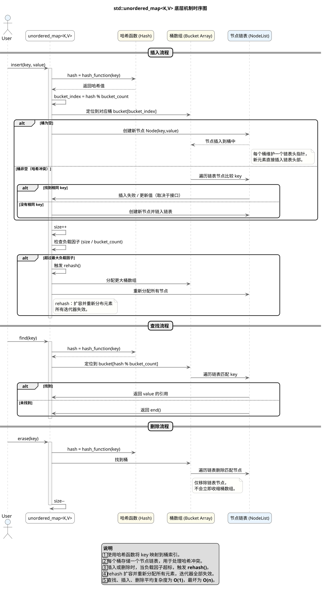

# 一.vector 底层实现原理
1. **连续内存模型**
   `std::vector` 内部维护一个指向堆内存的指针 `_data`，以及 `_size`（当前元素数）和 `_capacity`（已分配容量）。所有元素存储在连续内存中，保证随机访问的常数时间复杂度。

2. **动态扩容机制**
   当 `push_back()` 插入新元素时：

   * 若 `_size < _capacity`，直接在现有内存中构造新元素；
   * 若容量不足，则**分配更大内存（通常为 2 倍）**，再将旧元素移动或拷贝过去，最后释放旧内存。
     扩容会导致迭代器、引用、指针失效。

3. **内存管理与 RAII**
   元素的构造、析构由 `vector` 自动管理。离开作用域时，析构函数会依次销毁所有元素并释放堆内存，符合 RAII 原则。

4. **容量与大小控制**

   * `reserve(n)`：仅修改容量，预留空间以避免频繁扩容。
   * `resize(n)`：调整逻辑大小，大于当前 size 则构造新元素，小于则析构多余部分。
   * `shrink_to_fit()`：尝试收缩容量以减少内存占用。

5. **元素访问与边界检查**

   * `operator[]` 直接访问元素，**无边界检查**；
   * `at()` 提供检查，越界时抛出 `std::out_of_range` 异常。

6. **清空与回收策略**

   * `clear()` / `pop_back()` 仅析构元素但不释放内存。
   * 再次插入时可直接复用已分配的空间。

