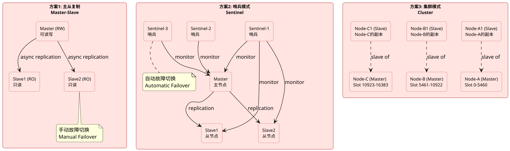
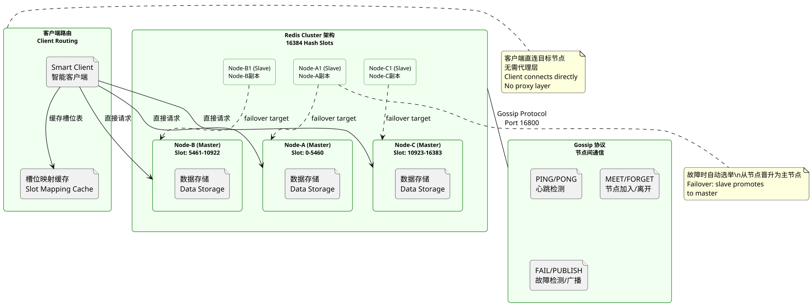

## 数据库集群，常见题型

### MySQL主从复制原理

**原理:**

MySQL 主从复制（Master-Slave Replication）是 MySQL 内置的数据同步机制，通过将主库（Master）的数据变更操作（DDL、DML）异步复制到一个或多个从库（Slave），实现数据冗余备份、读写分离和负载均衡。主从复制的核心原理是：主库将所有数据变更记录到二进制日志（Binary Log）中，从库通过 I/O 线程连接主库，请求并拉取主库的二进制日志内容，写入到本地中继日志（Relay Log）；从库再通过 SQL 线程读取中继日志，在本地重放（Replay）这些 SQL 语句，从而实现与主库的数据同步。

主从复制的关键技术点包括：二进制日志格式（STATEMENT、ROW、MIXED三种模式，影响复制的数据量和精度）、主从复制的过滤规则（`replicate-do-db`、`replicate-wild-do-table` 等）、主从延迟的成因与监控（`Show Slave Status\G` 中的 `Seconds_Behind_Master`）、GTID（Global Transaction Identifier）复制模式（基于事务唯一标识符，无需指定日志文件名和位置，简化了故障切换）。主从复制架构在生产环境中通常配合连接池、读写分离中间件（如 MySQL Proxy、Atlas、ShardingSphere）一起使用，实现查询负载的自动分发。


**PlantUML Diagram:**

```plantuml
@startuml
skinparam dpi 160
skinparam roundcorner 10
hide stereotype

skinparam rectangle {
    backgroundColor #E6F3FF
    borderColor #1E90FF
    fontSize 11
}

rectangle "主库
    file "用户请求\nUser Requests" as UserReq
    file "存储引擎\nInnoDB" as Engine
    file "二进制日志\nBinary Log" as BinLog
    rectangle "Dump线程\nDump Thread" as DumpThread
}

rectangle "从库
    rectangle "I/O线程\nI/O Thread" as IOThread
    file "中继日志\nRelay Log" as RelayLog
    rectangle "SQL线程\nSQL Thread" as SQLThread
    file "本地数据库\nLocal Database" as LocalDB
}

UserReq --> Engine : 写入数据
Engine --> BinLog : 记录变更
BinLog --> DumpThread : 读取binlog
DumpThread <--> IOThread : 网络传输\nBinary Log Stream
IOThread --> RelayLog : 写入中继日志
RelayLog --> SQLThread : 读取中继日志
SQLThread --> LocalDB : 重放SQL\nReplay SQL

rectangle "复制配置\nReplication Config" as Config {
    file "server_id = 1" as SID1
    file "log_bin = mysql-bin" as LB1
    file "binlog_format = ROW" as BF1
}

Master --> Config

note bottom of BinLog
  主库记录所有变更\nMaster records all changes
end note

note bottom of RelayLog
  从库本地缓存\nLocal cache on slave
end note

@enduml
```

---

### MySQL分库分表

**原理:**

MySQL 分库分表是应对数据量爆发式增长的一种水平扩展策略，核心思想是将一张大表的数据按照某种规则（如哈希、取模、范围）拆分到多张子表甚至多个数据库实例中，从而突破单表或单库的性能瓶颈。分库（Database Sharding）将数据分散到多个数据库实例，每个实例有独立的连接和存储；分表（Table Sharding

分库分表的核心概念包括：分片键（Sharding Key）——决定数据分配到哪个分片的关键字段，通常选择查询条件中频率高且分布均匀的字段；分片算法——常见的包括哈希分片（Sharding Key 的哈希值取模，适合均匀分布的场景）、范围分片（按时间或ID范围划分，适合有序访问模式）和目录分片（维护映射表，灵活性高但增加查询开销）；分片方案——中间件层（ShardingSphere、MyCAT、Cobar）和应用层（客户端SDK如 Hibernate Shards、MyBatis Sharding）两种主流实现方式。生产环境中还需要考虑分片后的全局ID生成（雪花算法、UUID）、跨分片JOIN（宽表冗余、多次查询）、分布式事务（两阶段提交、TCC、Saga）等挑战。


**PlantUML Diagram:**

```plantuml
@startuml
skinparam dpi 160
skinparam roundcorner 10
hide stereotype

skinparam rectangle {
    backgroundColor #FFF8DC
    borderColor #DAA520
    fontSize 11
}

rectangle "应用层
    file "分片路由SDK\nSharding SDK" as SDK
    file "全局ID生成器\nGlobal ID Generator" as GID
}

rectangle "分片中间件
    rectangle "ShardingSphere-Proxy\nMyCAT" as Proxy
    rectangle "SQL解析与路由\nSQL Parse & Route" as Router
    rectangle "结果集合并\nResult Merge" as Merger
}

database "DB-0
database "DB-1
database "DB-2
database "DB-N

App --> SDK
SDK --> Router
Router --> Proxy
Proxy --> DB0 : shard 0
Proxy --> DB1 : shard 1
Proxy --> DB2 : shard 2
Proxy --> DBN : shard n

Router -[dashed]-> GID : 请求全局ID

note right of Router
  哈希/范围/目录路由
  Hash/Range/Directory Routing
end note

note bottom of Merger
  跨分片排序/聚合\nCross-shard Sort/Aggregate
end note

@enduml
```

---

### 简述redis高可用的方案

**原理:**

Redis 高可用方案主要有三种：主从复制（Master-Slave Replication）、哨兵模式（Sentinel）和集群模式（Cluster）。主从复制是最基础的高可用方案，通过将数据从主节点（Master）异步复制到从节点（Slave），实现数据冗余和读写分离。主节点可读可写，从节点只读（默认），当主节点故障时，需要手动进行主从切换（Failover）。主从复制解决了数据备份和读负载分担的问题，但不提供自动故障切换能力。

哨兵模式（Sentinel）在主从复制基础上增加了自动故障检测和故障切换能力，是 Redis 2.8+ 引入的高可用解决方案。哨兵是一个独立的进程，负责监控主从节点的存活状态（通过定期发送 PING 命令）、通知（当节点下线时通知应用方）和自动故障转移（当主节点下线时，通过 Raft 协议选举出新的主节点，并更新配置使从节点指向新主节点）。一个哨兵集群可以监控多个 Redis 主从实例。哨兵模式解决了自动 Failover 的问题，但在故障切换期间可能存在数据丢失（异步复制导致）。

集群模式（Cluster）是 Redis 3.0+ 引入的分布式解决方案，通过数据分片（Slot，16384个槽）将数据分布到多个节点上，每个分片可设置主从副本。集群模式同时实现了数据分片和高可用——当某个节点的从节点发现主节点下线时，会发起投票选举（通过PFAIL/FAIL消息），获得多数票的从节点会晋升为主节点，继续提供服务。集群模式还支持在线扩容（重新分片）和自动故障转移。


**PlantUML Diagram:**



---

### 简述redis-cluster集群的原理

**原理:**

Redis Cluster 是 Redis 3.0 引入的分布式数据库集群方案，核心原理是通过哈希槽（Hash Slot）机制将数据自动分布到多个节点上，同时通过主从副本机制实现高可用。Redis Cluster 将整个数据库分为 16384（2^14）个槽（Slot），每个键通过公式 `CRC16(key) mod 16384` 计算其所属的槽编号，然后将这条数据存储在负责该槽的节点上。例如，对于一个 6 节点的集群（3主3从），槽的分配大致为：节点A负责 0-5460，节点B负责 5461-10922，节点C负责 10923-16383。当客户端连接集群中的任意一个节点时，该节点会告知客户端完整的槽分布信息（集群节点信息通过 Gossip 协议在节点间传播），客户端可以直接连接目标节点进行操作，无需经过代理层。

Redis Cluster 的高可用机制基于主从副本和自动故障转移。每个主节点可以有一个或多个从节点，当某个主节点故障时，其对应的从节点会发起选举流程：从节点向集群中所有可达节点发送请求，希望成为新的主节点；如果在投票周期内从节点获得了多数派（> N/2 + 1）节点的投票认可，则晋升为主节点，并开始接收客户端请求。Redis Cluster 还支持在线迁移槽和数据（resharding），通过 `redis-trib` 或 `redis-cli --cluster` 命令可以在线调整槽的分布，实现集群的横向扩容。集群节点间通过 Gossip 协议（基于端口 16800）进行通信，传播节点存活状态、槽分布信息和集群拓扑变化。


**PlantUML Diagram:**



---

