## 设计模式，常见题型
*   **面对对象中有哪些设计原则**
1. **单一职责原则（SRP）**：一个类只负责一项职责，避免职责混杂导致耦合度过高。

2. **开闭原则（OCP）**：对扩展开放，对修改关闭。通过抽象化实现，依赖抽象而非具体实现。

3. **里氏替换原则（LSP）**：子类必须能够替换其基类，is-a关系成立，保证继承的正确性。

4. **接口隔离原则（ISP）**：使用多个专门的接口，而不是单一臃肿接口，降低耦合度。

5. **依赖倒置原则（DIP）**：高层模块不应依赖低层模块，两者都应依赖抽象。

**English Translation**: The five SOLID principles are: Single Responsibility (one class, one purpose), Open/Closed (open for extension, closed for modification), Liskov Substitution (subclasses replaceable for base classes), Interface Segregation (many specific interfaces vs one general), and Dependency Inversion (depend on abstractions, not concretions).

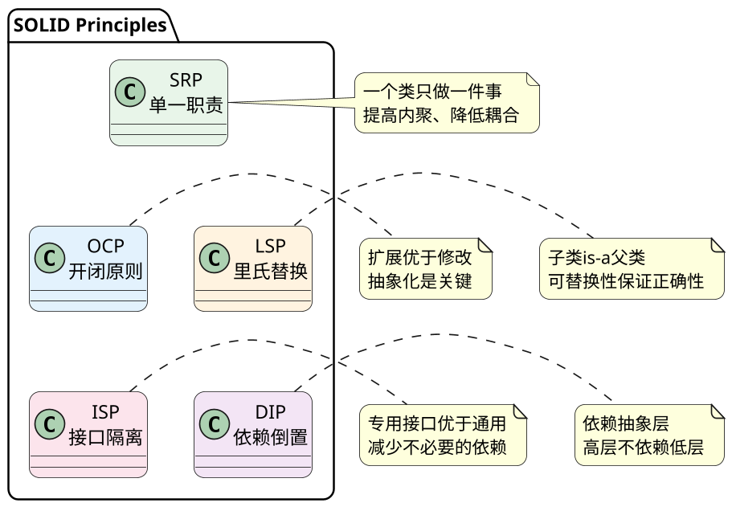

---

*   **简述开闭原则，哪些原则与它相关，分别是什么关系？**

**开闭原则（OCP）**：对扩展开放，对修改关闭。软件实体应通过扩展实现变化，而不是修改已有代码。这是最核心的面向对象设计原则，是所有模式的最终目标。

**与开闭原则相关的原则**：
1. **里氏替换原则（LSP）** 是开闭原则的基础：只有当子类可以替换基类且不影响程序运行时，才能通过继承扩展功能。LSP保证继承体系的正确性，是OCP的**使能器**。

2. **接口隔离原则（ISP）** 帮助实现OCP：通过细粒度接口，解耦不必要的依赖，使得扩展时修改范围最小化。

3. **依赖倒置原则（DIP）** 是OCP的关键手段：依赖抽象而非具体，当需求变化时，只需实现新的抽象具体类，无需修改高层逻辑。

**English Translation**: Open/Closed Principle states that software entities should be open for extension but closed for modification. OCP is the ultimate goal of OO design. LSP enables OCP by ensuring proper inheritance hierarchies. ISP supports OCP by providing fine-grained interfaces. DIP is the key means to achieve OCP by depending on abstractions.

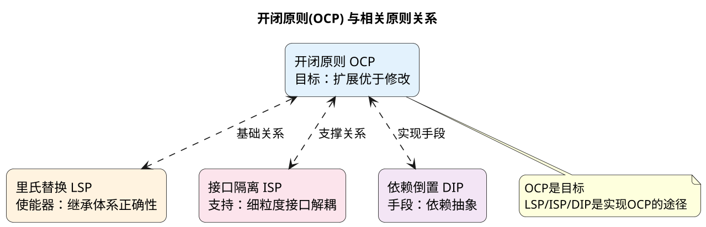

---

*   **什么是里氏替换原则**

**里氏替换原则（LSP）**：子类型必须能够替换其基类型，而不改变程序的正确性。简言之，所有使用基类的地方，必然能透明地使用子类对象。核心是"is-a"关系的正确性：子类不是父类的子集，就是父类的扩展。

**违反LSP的典型场景**：
- 子类重写方法后行为与父类期望不一致
- 子类方法前置条件比父类更宽松，后置条件更严格
- 子类新增方法导致父类使用者产生困惑

**English Translation**: Liskov Substitution Principle states that objects of a superclass should be replaceable with objects of its subclasses without breaking the application. Subtypes must be substitutable for their base types. The key is proper "is-a" relationship.

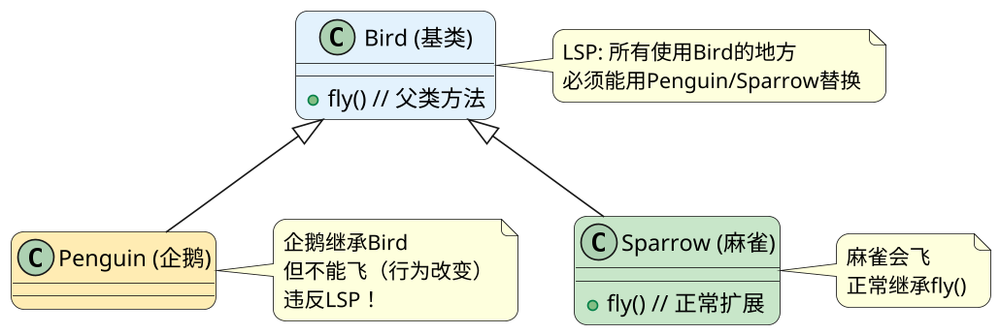

---

*   **什么是迪米特原则**

**迪米特原则（LoD）/ 最少知识原则**：一个对象应当对其他对象有尽可能少的了解，只与直接的朋友通信。"朋友"指当前对象的成员变量、输入参数、返回值中出现的对象。降低类之间的耦合，提高模块独立性。

**核心要求**：
- 只调用当前对象的成员
- 只调用传入方法参数的对象
- 不在方法内部创建陌生类实例
- 不暴露其他对象的内部结构

**English Translation**: Law of Demeter (Principle of Least Knowledge) states that an object should only interact with its direct friends - objects that are members, parameters, or created locally. It reduces coupling between components.

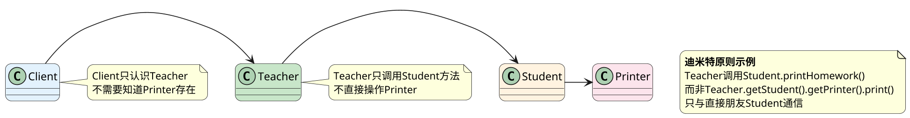

---

*   **什么是依赖倒置原则**

**依赖倒置原则（DIP）**：高层模块不应依赖低层模块，两者都应依赖抽象。抽象不应依赖细节，细节应依赖抽象。核心是"面向接口编程"，通过抽象解耦具体实现。

**实现方式**：
- 模块间通过抽象接口交互
- 变量声明使用抽象类型（接口或抽象类）
- 构造函数注入依赖（Dependency Injection）
- 使用工厂模式或IoC容器管理依赖

**English Translation**: Dependency Inversion Principle states that high-level modules should not depend on low-level modules; both should depend on abstractions. Abstractions should not depend on details; details should depend on abstractions.

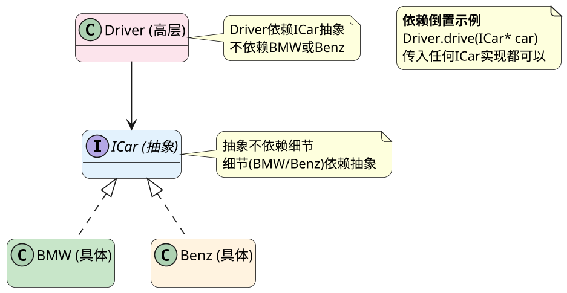

---

*   **单例模式多线程？**

**单例模式**：保证一个类仅有一个实例，并提供一个全局访问点。线程安全问题至关重要——多线程环境下可能创建多个实例。

**饿汉式（线程安全）**：类加载时直接创建实例，缺点是可能造成资源浪费。

**懒汉式（线程不安全）**：延迟加载，但多线程下会创建多个实例。

**双重检查锁定（线程安全）**：在加锁前后都检查实例是否为空，兼顾性能和线程安全。volatile关键词防止指令重排。

**Meyers单例（推荐）**：利用静态局部变量特性（C++11后线程安全），代码最简洁。

// 双重检查锁定
        if (instance == nullptr) {  // 第一次检查
            if (instance == nullptr) {  // 第二次检查

// Meyers单例（最推荐）
        static Singleton instance;  // C++11线程安全

**English Translation**: Singleton pattern ensures a class has only one instance with global access. Thread safety is critical. Double-checked locking uses volatile and double checking. Meyers singleton leverages static local variable thread safety (C++11+).

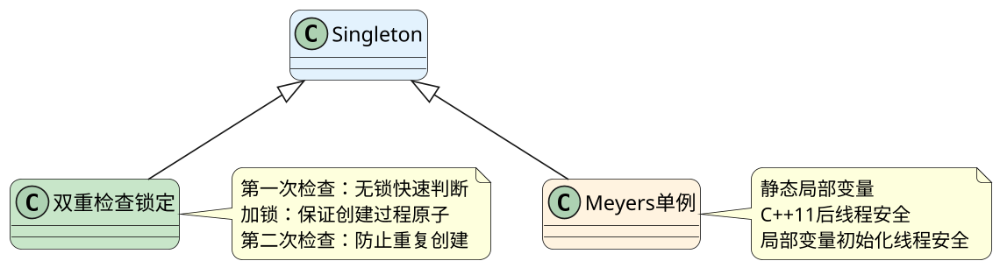

**应用场景**：配置管理类、日志类、数据库连接池、线程池等全局唯一资源。

---

*   **什么是工厂模式？什么是抽象工厂？应用场景是什么？**

**工厂模式（Factory Method）**：定义创建对象的接口，让子类决定实例化哪个类。将对象创建与使用解耦。

**抽象工厂（Abstract Factory）**：提供一个创建一系列相关对象的接口，而无需指定具体类。适用于产品族场景。

**核心区别**：
| 工厂方法 | 抽象工厂 |
|---------|---------|
| 一个产品等级 | 多个产品等级 |
| 一个工厂创建一种产品 | 一个工厂创建一族产品 |
| 扩展产品 | 扩展产品族 |

**English Translation**: Factory Method defines an interface for creating objects, letting subclasses decide. Abstract Factory provides an interface for creating families of related objects without specifying concrete classes.

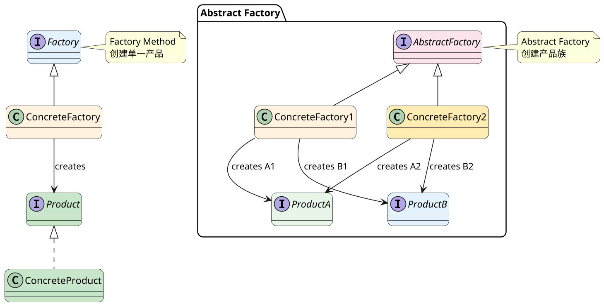

**应用场景**：
- 工厂方法：数据库Driver创建、日志器创建
- 抽象工厂：跨平台UI组件（Windows/Mac按钮+文本框+菜单）、游戏皮肤系统

---

*   **什么是代理模式？应用场景是什么？**

**代理模式（Proxy）**：为其他对象提供一种代理以控制对这个对象的访问。代理与原对象实现相同接口，客户端无感知。

**类型**：
- **静态代理**：编译时生成代理类，代码冗余
- **动态代理**：运行时生成（JDK Proxy/CGLib），更灵活
- **虚代理**：延迟加载大对象
- **保护代理**：权限控制
- **远程代理**：分布式对象访问

**English Translation**: Proxy pattern provides a surrogate to control access to another object. Types include static, dynamic (JDK/CGLib), virtual (lazy loading), protection (access control), and remote proxy.

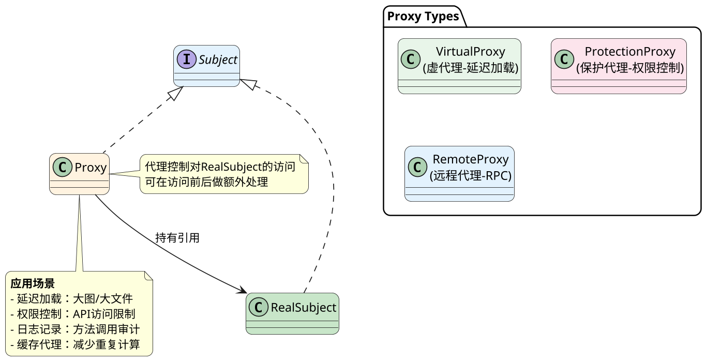

**应用场景**：延迟加载（图片懒加载）、远程调用（RPC）、安全代理（接口鉴权）、缓存代理。

---

*   **什么是装饰器模式？应用场景是什么？**

**装饰器模式（Decorator）**：动态地给对象添加额外职责，比继承更灵活。将功能组合替代继承，实现运行时装饰。

**核心思想**：装饰器与被装饰对象实现相同接口，装饰器持有被装饰对象引用，可在调用前后添加行为。

**English Translation**: Decorator pattern dynamically adds responsibilities to objects. Decorators implement the same interface as the wrapped object, providing flexible runtime composition instead of inheritance.

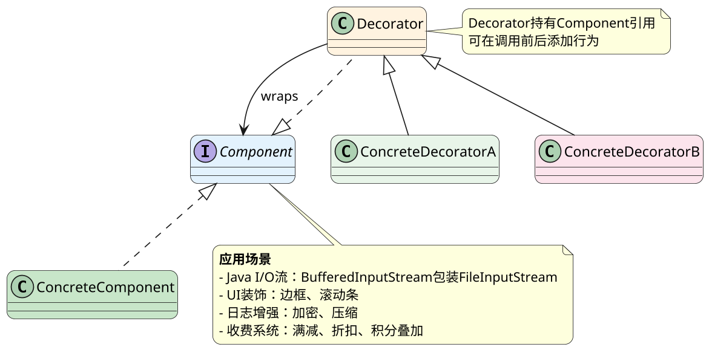

**应用场景**：
- Java I/O类库（Bufferedxxx包装原生流）
- UI组件装饰（窗口+边框+滚动条）
- Web请求/响应拦截器
- 电商促销叠加计算

---

*   **什么是组合模式，应用场景是什么？**

**组合模式（Composite）**：将对象组合成树形结构以表示"部分-整体"层次。客户端可以统一处理单个对象和组合对象。

**核心**：抽象组件声明通用操作，叶子节点和容器节点都实现它。容器节点可包含叶子或其他容器。

**English Translation**: Composite pattern composes objects into tree structures to represent part-whole hierarchies. Clients can treat individual objects and compositions uniformly.

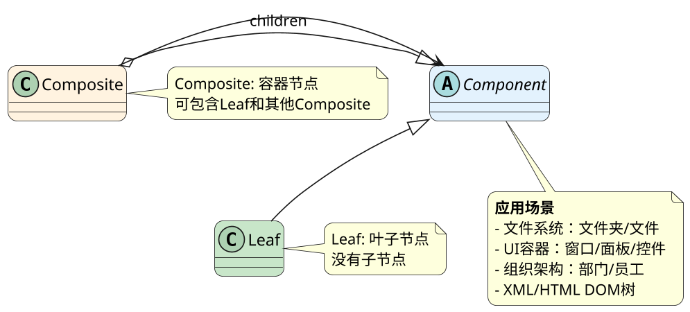

**应用场景**：
- 文件系统（Folder与File统一操作）
- GUI容器（Window包含Panel，Panel包含Button）
- 组织架构系统（Company包含Department）
- 命令菜单（MenuItem和Menu组合）

---

*   **什么是责任链模式？应用场景是什么？**

**责任链模式（Chain of Responsibility）**：将请求沿着处理者链传递，直到有一个处理者处理它。发送者和接收者解耦。

**组成**：
- Handler（抽象处理者）：定义处理接口，持有后继者引用
- ConcreteHandler（具体处理者）：处理请求或传递给下家

**English Translation**: Chain of Responsibility passes requests along a chain of handlers. Each handler decides to process the request or pass it to the next handler, decoupling sender and receiver.

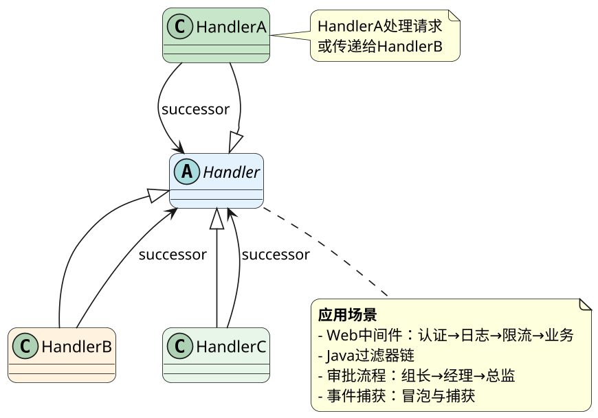

**应用场景**：
- Web框架中间件（Express/Koa洋葱模型）
- Java Servlet Filter
- 审批流程系统
- 异常处理链

---

*   **什么是模板方法？应用场景是什么？**

**模板方法（Template Method）**：定义算法骨架，将某些步骤延迟到子类。基类负责算法结构，子类负责具体实现。

**核心**：在抽象类中定义final的模板方法，内调用的抽象方法由子类实现。

**Hook方法**：子类可覆盖的钩子方法，不强制但提供扩展点。

**English Translation**: Template Method defines the skeleton of an algorithm, deferring some steps to subclasses. The base class provides the algorithm structure, subclasses provide specific implementations.

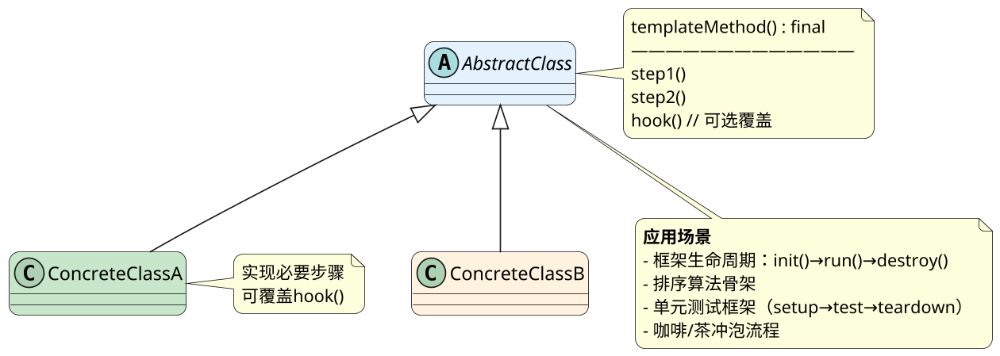

**应用场景**：
- Spring框架模板（JdbcTemplate、HibernateTemplate）
- JUnit测试框架（setUp→test→tearDown）
- 支付流程（验证→下单→支付→回调）
- 数据加工流程（读取→解析→处理→输出）

---

*   **什么是策略模式？应用场景是什么？**

**策略模式（Strategy）**：定义一系列算法，将每个算法封装起来，使它们可以互换。策略是独立的，客户端可选择不同算法。

**核心**：策略接口、具体策略实现、Context持有策略引用。

**与状态模式区别**：策略模式算法之间相互独立；状态模式状态之间相互关联。

**English Translation**: Strategy pattern defines a family of algorithms, encapsulates each one, and makes them interchangeable. Strategies are independent; clients can select different algorithms.

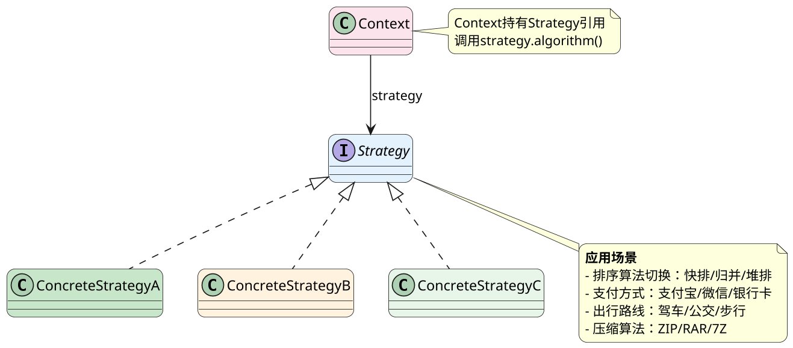

**应用场景**：
- 排序策略选择（根据数据量自动切换）
- 支付系统（支付宝/微信/信用卡）
- 出行规划（自驾/公交/骑行）
- 图像压缩算法选择

---

*   **什么是观察者模式？应用场景是什么？**

**观察者模式（Observer）**：定义对象间一对多依赖，当一个对象状态变化，所有依赖它的对象都会收到通知。

**组成**：
- Subject（主题/被观察者）：维护观察者列表，状态变化通知
- Observer（观察者）：定义更新接口

**推模型 vs 拉模型**：推模型主动推送数据；拉模型被动拉取数据。

**English Translation**: Observer pattern defines a one-to-many dependency between objects. When the subject's state changes, all its observers are notified automatically.

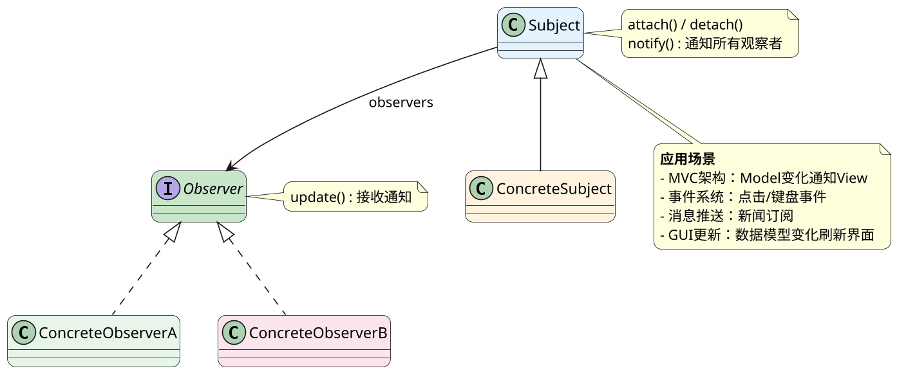

**应用场景**：
- MVC/MVVM架构（Model变化更新View）
- GUI事件系统（按钮点击监听）
- 消息订阅发布系统
- 股票行情推送
- 邮件/消息订阅通知

