## 1. SOLID设计原则概述

SOLID是面向对象设计的五个基本原则，帮助开发者创建易维护、可扩展的软件系统。

**五大原则详解**：

- **单一职责原则（SRP）**
  - 一个类只负责一项职责
  - 避免职责混杂导致耦合度过高
  - 提高类的内聚性和可复用性

- **开闭原则（OCP）**
  - 对扩展开放，对修改关闭
  - 通过抽象化实现，依赖抽象而非具体实现
  - 是所有设计模式的最终目标

- **里氏替换原则（LSP）**
  - 子类必须能够替换其基类
  - 保证is-a关系成立
  - 是继承体系正确性的基础

- **接口隔离原则（ISP）**
  - 使用多个专门的接口，而不是单一臃肿接口
  - 降低耦合度，减少不必要的依赖
  - 专用接口优于通用接口

- **依赖倒置原则（DIP）**
  - 高层模块不应依赖低层模块，两者都应依赖抽象
  - 抽象不应依赖细节，细节应依赖抽象
  - 核心是"面向接口编程"


SOLID原则核心对比：

| 原则 | 缩写 | 核心目标 | 典型问题 |
|-----|------|---------|---------|
| 单一职责原则 | SRP | 单一职责，高内聚 | 类过大，职责过多 |
| 开闭原则 | OCP | 扩展优于修改 | 修改影响已有功能 |
| 里氏替换原则 | LSP | 继承体系正确 | 子类破坏父类契约 |
| 接口隔离原则 | ISP | 接口专用化 | 臃肿接口，过度依赖 |
| 依赖倒置原则 | DIP | 依赖抽象 | 高层依赖低层实现 |

通过图示理解SOLID五大原则的关系与层次：

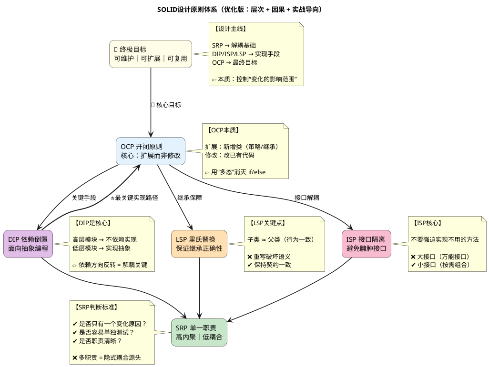

---

## 2. 开闭原则（OCP）及相关原则关系

开闭原则是面向对象设计中最核心的原则，是所有设计模式追求的最终目标。

**开闭原则（OCP）定义**：
- 对扩展开放：软件实体应该允许通过继承、组合等方式扩展新行为
- 对修改关闭：已有的代码不应被修改，以保持稳定性

**与开闭原则相关的三大原则**：

| 相关原则 | 与OCP的关系 | 作用机制 |
|---------|------------|---------|
| 里氏替换原则（LSP） | 使能器（Enabler） | 保证继承体系正确，子类可透明替换父类 |
| 接口隔离原则（ISP） | 支持者（Supporter） | 细粒度接口减少不必要的依赖，扩展时修改范围最小化 |
| 依赖倒置原则（DIP） | 实现手段（Implementation） | 依赖抽象而非具体，需求变化时只需实现新抽象类 |


通过图示理解OCP与相关原则的逻辑关系：

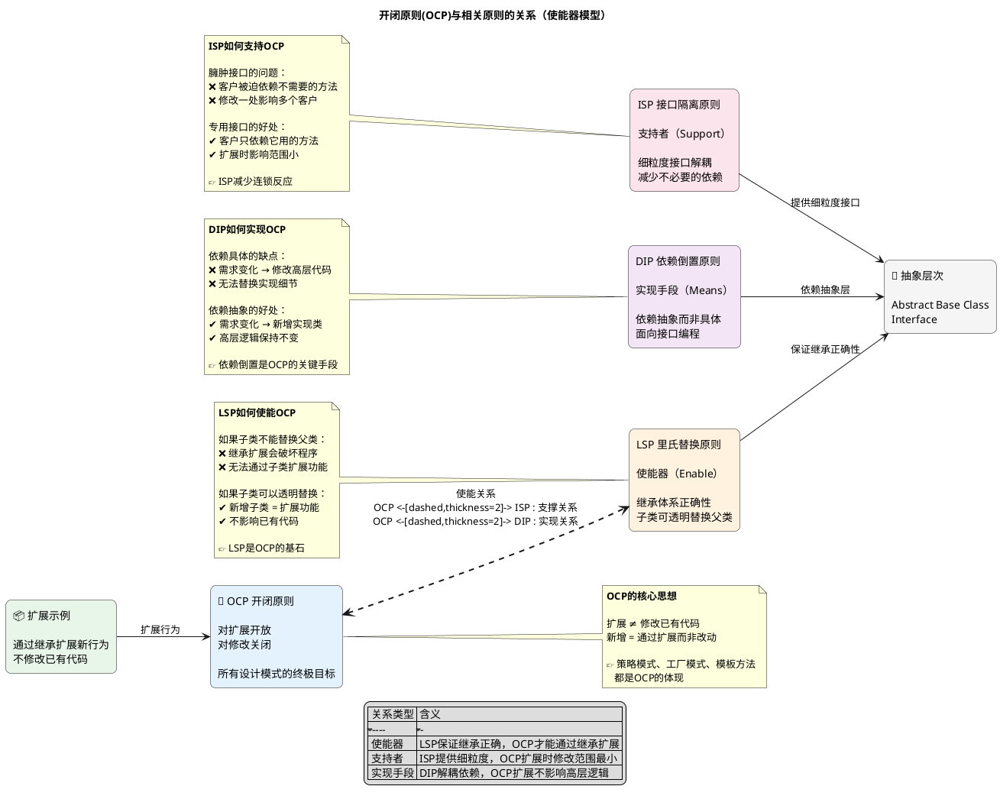

---

## 3. 里氏替换原则（LSP）

里氏替换原则是继承体系正确性的基石，保证子类可以透明替换父类而不影响程序正确性。

**里氏替换原则（LSP）定义**：
- 子类型必须能够替换其基类型，而不改变程序的正确性
- 所有使用基类的地方，必然能透明地使用子类对象
- 核心是"is-a"关系的正确性：子类不是父类的子集，就是父类的扩展

**违反LSP的典型场景**：

| 违反类型 | 具体表现 | 后果 |
|---------|---------|------|
| 方法行为改变 | 子类重写方法后行为与父类期望不一致 | 调用者预期被破坏 |
| 前置条件违反 | 子类方法前置条件比父类更宽松 | 父类契约被打破 |
| 后置条件违反 | 子类方法后置条件比父类更严格 | 调用者无法正常工作 |
| 类型能力丧失 | 子类失去父类的某种能力（如企鹅不会飞） | is-a关系不成立 |


通过图示理解LSP的正确的继承与违反LSP的反面教材：

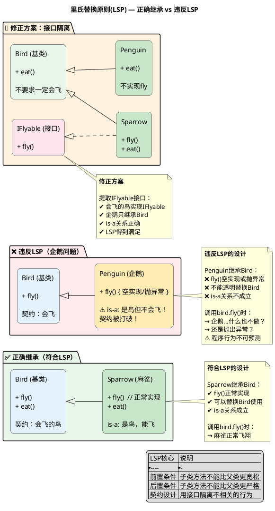

---

## 4. 迪米特原则（LoD）/ 最少知识原则

迪米特原则强调对象只应与直接的朋友通信，降低类之间的耦合，提高模块独立性。

**迪米特原则（LoD）定义**：
- 一个对象应当对其他对象有尽可能少的了解
- 只与直接的朋友通信，不与陌生人说话
- "朋友"指：成员变量、输入参数、返回值中出现的对象

**核心要求详解**：

| 通信对象 | 是否可以直接调用 | 说明 |
|---------|----------------|------|
| 自身成员 | ✅ 可以 | 调用自己的方法、字段 |
| 创建的局部对象 | ✅ 可以 | 在方法内部创建的对象 |
| 传入的参数对象 | ✅ 可以 | 方法参数 |
| 成员的成员 | ❌ 不可以 | 通过引用间接访问 |
| 返回的对象 | ✅ 可以 | 方法返回值 |


通过图示理解迪米特原则的正确实现与违反示例：

```plantuml
@startuml
title 迪米特原则(Law of Demeter) — 直接朋友 vs 链式调用

left to right direction
skinparam rectangle {
    RoundCorner 15
    Padding 10
}
skinparam shadowing false

' ===== 正确示例 =====
package "✅ 符合迪米特原则" #E8F5E9 {
    rectangle "Client (客户)\n\n只认识Teacher\n不需要知道Student/Printer" as Client #E3F2FD

    rectangle "Teacher (老师)\n\nstudent: Student\n\n📌 只与直接朋友通信" as Teacher #C8E6C9

    rectangle "Student (学生)\n\n📌 只调用自己的方法" as Student #FFF3E0

    rectangle "Printer (打印机)\n\n📌 是Student的成员" as Printer #FCE4EC

    Client --> Teacher : 调用
    Teacher --> Student : 调用
    Student --> Printer : 调用
}

note right of Teacher
  **正确的调用链**

  Client调用Teacher
  Teacher调用Student
  Student调用Printer

  ✅ 每一步都是直接朋友
  ✅ 不跨越多层访问
end note

' ===== 错误示例 =====
package "❌ 违反迪米特原则" #FFEBEE {
    rectangle "Client (客户)\n\n⚠️ 知道太多细节" as Client2 #E3F2FD

    rectangle "Teacher (老师)" as Teacher2 #C8E6C9

    rectangle "Student" as Student2 #FFF3E0

    rectangle "Printer" as Printer2 #FCE4EC

    Client2 --> Teacher2 : 调用
}

note right of Client2
  **链式调用的问题**

  Client.getTeacher()
    .getStudent()
    .getPrinter()
    .print()

  ❌ Client需要知道
     Teacher/Student/Printer
  ❌ Printer是"陌生人"
  ❌ Teacher内部结构暴露
  ❌ 耦合度极高
end note

Teacher2 --> Student2 :
Student2 --> Printer2 :

' ===== 后果说明 =====
note bottom of Client2
  **违反迪米特原则的后果**

  ❌ Student类变化 → 必须通知Client
  ❌ Printer接口变化 → Client也要改
  ❌ 无法单元测试Teacher
  ❌ 代码脆弱，难以维护
end note

' ===== 正确模式总结 =====
legend right
  | 调用类型 | 是否符合 |
  |---------|---------|
  | this.成员() | ✅ |
  | param.方法() | ✅ |
  | new对象.方法() | ✅ |
  | returnObj.方法() | ✅ |
  | this.getX().getY().do() | ❌ |
endlegend

@enduml
```

---

## 5. 依赖倒置原则（DIP）

依赖倒置原则是实现开闭原则的关键手段，通过依赖抽象而非具体来实现解耦。

**依赖倒置原则（DIP）定义**：
- 高层模块不应依赖低层模块，两者都应依赖抽象
- 抽象不应依赖细节，细节应依赖抽象
- 核心是"面向接口编程"，通过抽象解耦具体实现

**实现方式对比**：

| 实现方式 | 描述 | 优点 | 缺点 |
|---------|------|------|------|
| 构造函数注入 | 通过构造函数传入依赖 | 依赖明确，强制注入 | 构造函数参数多时复杂 |
| Setter注入 | 通过setter方法传入依赖 | 灵活，可更换实现 | 依赖可选，可能为null |
| 接口注入 | 依赖实现注入接口 | 最灵活 | 需要额外接口 |
| 工厂模式 | 通过工厂创建依赖 | 可延迟创建 | 增加工厂类 |


通过图示理解依赖倒置的解耦模型：


---

## 6. 单例模式（Singleton）

单例模式保证一个类仅有一个实例，并提供一个全局访问点。线程安全是多线程环境下的核心问题。

**单例模式核心概念**：
- 保证一个类只有一个实例
- 提供全局访问点
- 线程安全问题至关重要

**三种实现方式对比**：

| 方式 | 线程安全 | 延迟加载 | 性能 | 推荐场景 |
|-----|---------|---------|------|---------|
| 饿汉式 | ✅ 安全 | ❌ 立即加载 | 高 | 确定需要实例时 |
| 懒汉式 | ❌ 不安全 | ✅ 延迟加载 | 低 | 单线程环境 |
| 双重检查锁定 | ✅ 安全 | ✅ 延迟加载 | 中高 | 多线程慎选 |
| Meyers单例 | ✅ 安全(C++11+) | ✅ 延迟加载 | 高 | **推荐方式** |


通过图示理解单例模式的多种实现与内存模型：

- **饿汉式（Eager Loading）**

类加载时直接创建实例，利用类加载机制保证线程安全。

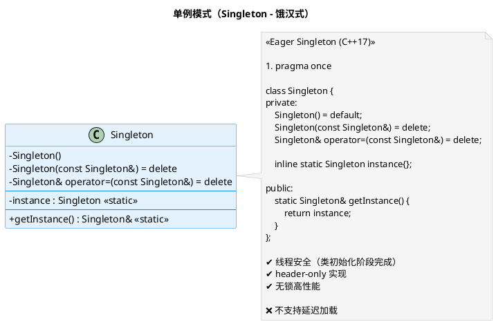

- **懒汉式（Lazy Loading）- 线程不安全**

延迟加载实例，但多线程环境下存在严重安全问题。

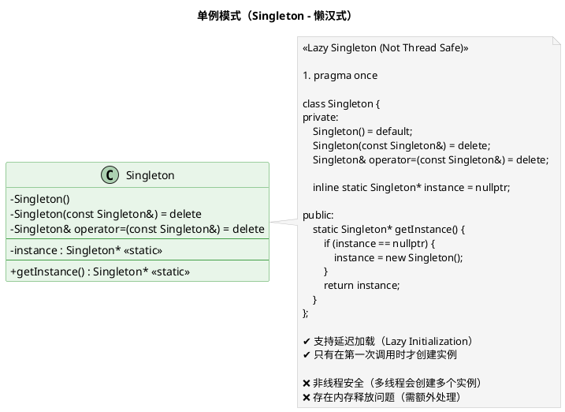

- **双重检查锁定（Double-Checked Locking）**

在懒加载基础上加锁，但普通实现仍有指令重排问题，需配合volatile。

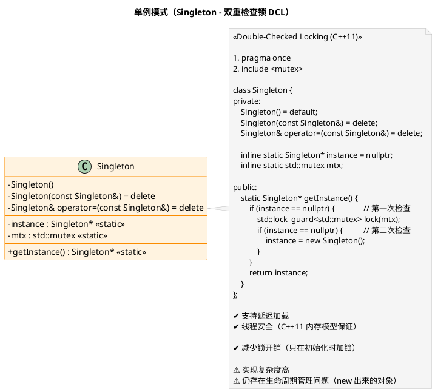

- **Meyers单例**

利用C++11静态局部变量线程安全特性，最简洁、最安全的实现方式。

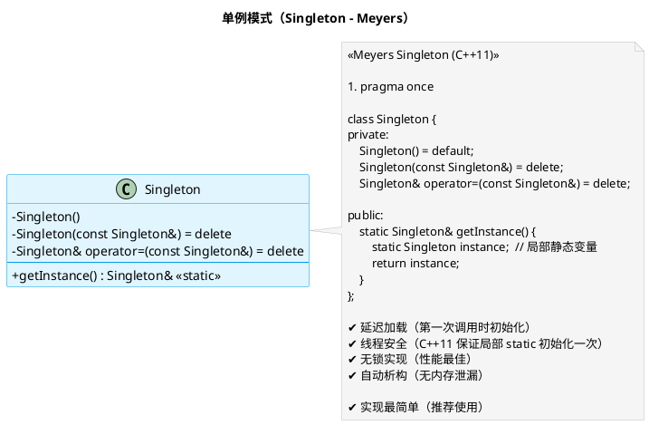

## 7. 工厂方法与抽象工厂

工厂模式用于创建对象，核心是将对象的创建与使用分离。抽象工厂是工厂方法的扩展，处理产品族的创建。

**工厂模式核心概念**：

| 模式类型 | 核心思想 | 适用场景 | 复杂度 |
|---------|---------|---------|-------|
| 简单工厂 | 根据参数创建对象 | 对象种类少，稳定 | 低 |
| 工厂方法 | 子类决定创建哪个对象 | 需要扩展，适合OCP | 中 |
| 抽象工厂 | 创建产品族 | 多个产品线，需要产品一致性 | 高 |

**工厂方法 vs 抽象工厂对比**：

| 对比维度 | 工厂方法 | 抽象工厂 |
|---------|---------|---------|
| 产品维度 | 单个产品 | 多个相关产品（产品族） |
| 实现方式 | 继承 | 对象组合 |
| 扩展方式 | 新增产品子类 | 新增工厂子类 |
| 典型应用 | 数据库连接 | UI主题、跨平台组件 |

**工厂方法结构图**：

定义创建对象的接口，让子类决定实例化哪个类。

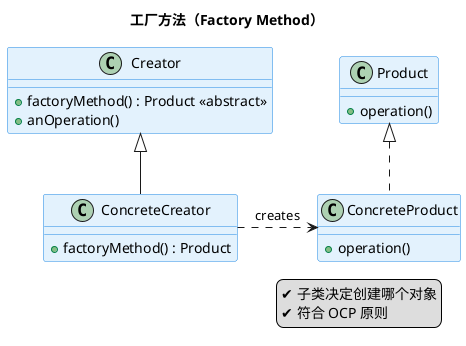

**抽象工厂结构图**：

提供一个创建一系列相关或互相依赖对象的接口，而无需指定它们具体的类。

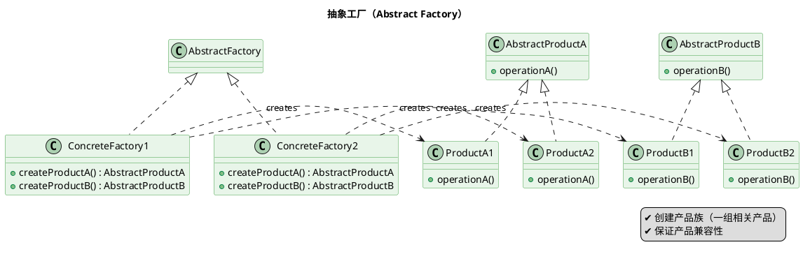

**工厂方法 vs 抽象工厂**：

| 特征 | 工厂方法 | 抽象工厂 |
|-----|---------|---------|
| 产品维度 | 单个产品 | 多个相关产品（产品族） |
| 实现方式 | 继承 | 对象组合 |
| 扩展方式 | 新增产品子类 | 新增工厂子类 |
| 典型应用 | 数据库连接 | UI主题、跨平台组件 |
| 核心目标 | 将创建延迟到子类 | 保证产品兼容性 |

## 8. 代理模式（Proxy）

代理模式为其他对象提供一种代理以控制对这个对象的访问，代理与原对象实现相同接口，客户端无感知。

**代理模式核心概念**：

| 代理类型 | 作用 | 典型应用 |
|---------|------|---------|
| 虚代理（Virtual Proxy） | 延迟加载大对象 | 图片懒加载 |
| 保护代理（Protection Proxy） | 权限控制 | API访问限制 |
| 远程代理（Remote Proxy） | 访问远程对象 | RPC分布式调用 |
| 智能引用（Smart Reference） | 访问时额外处理 | 引用计数、缓存 |
| 日志代理（Logging Proxy） | 方法调用审计 | 调试追踪 |

**代理模式 vs 装饰器模式对比**：

| 对比维度 | 代理模式 | 装饰器模式 |
|---------|---------|-----------|
| 目的 | 控制访问 | 添加职责 |
| 接口 | 与原对象相同 | 与原对象相同 |
| 关系 | 持有原对象引用 | 持有原对象引用 |
| 编译时 | 静态代理/动态代理 | 通常静态 |
| 透明性 | 对客户端透明 | 对客户端透明 |


通过图示理解代理模式的多种类型与执行流程：

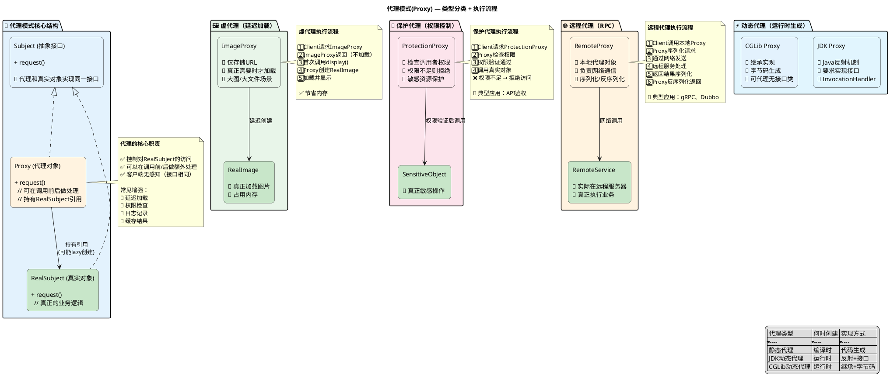

---

## 9. 装饰器模式（Decorator）

装饰器模式动态地给对象添加额外职责，比继承更灵活。将功能组合替代继承，实现运行时装饰。

**装饰器模式核心概念**：

| 组成元素 | 职责 | 说明 |
|---------|------|------|
| Component（抽象组件） | 定义接口 | 核心功能 |
| ConcreteComponent | 具体组件 | 被装饰的对象 |
| Decorator（装饰器） | 持有组件引用 | 转发请求，可添加行为 |
| ConcreteDecorator | 具体装饰器 | 添加具体职责 |

**装饰器模式 vs 代理模式 vs 继承对比**：

| 对比维度 | 装饰器模式 | 代理模式 | 继承 |
|---------|-----------|---------|------|
| 目的 | 添加职责 | 控制访问 | 扩展功能 |
| 灵活性 | 运行时可叠加 | 编译时确定 | 编译时确定 |
| 类数量 | O(n)装饰器 | O(n)代理 | O(n)子类 |
| 组合 | 可无限叠加 | 通常一对一 | 单一继承 |


通过图示理解装饰器模式的叠加效果与执行流程：

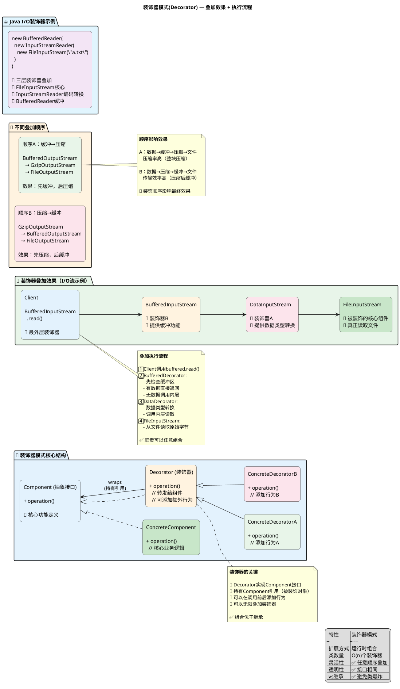

---

## 10. 组合模式（Composite）

组合模式将对象组合成树形结构以表示"部分-整体"层次，客户端可以统一处理单个对象和组合对象。

**组合模式核心概念**：

| 组成元素 | 职责 | 说明 |
|---------|------|------|
| Component（抽象组件） | 声明通用操作 | Leaf和Composite的公共接口 |
| Leaf（叶子节点） | 树的端点 | 没有子节点 |
| Composite（组合节点） | 容器节点 | 可包含Leaf或其他Composite |

**组合模式 vs 装饰器模式对比**：

| 对比维度 | 组合模式 | 装饰器模式 |
|---------|---------|-----------|
| 目的 | 统一处理单个/组合对象 | 添加额外职责 |
| 结构 | 树形层次 | 链式包装 |
| 子节点 | 管理子组件 | 无子节点概念 |
| 典型应用 | 文件系统、组织架构 | I/O流、日志增强 |


通过图示理解组合模式的树形结构与统一处理流程：

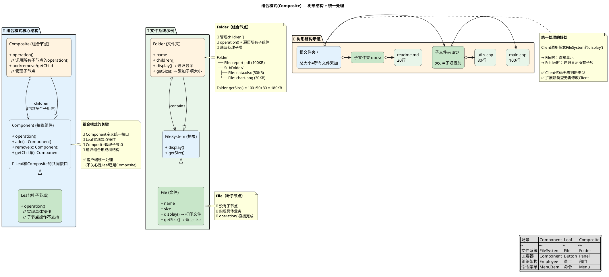

---

## 11. 责任链模式（Chain of Responsibility）

责任链模式将请求沿着处理者链传递，直到有一个处理者处理它。发送者和接收者解耦。

**责任链模式核心概念**：

| 组成元素 | 职责 | 说明 |
|---------|------|------|
| Handler（抽象处理者） | 定义处理接口，持有后继者 | 公共抽象 |
| ConcreteHandler | 处理请求或传递下家 | 具体处理逻辑 |

**责任链模式 vs 命令模式对比**：

| 对比维度 | 责任链模式 | 命令模式 |
|---------|-----------|---------|
| 目的 | 请求传递 | 请求封装 |
| 发送者 | 不知道谁处理 | 明确指定接收者 |
| 处理 | 链上任一处理者处理 | 单一命令对象 |
| 扩展 | 添加新处理器 | 添加新命令 |


通过图示理解责任链模式的执行流程与变体：

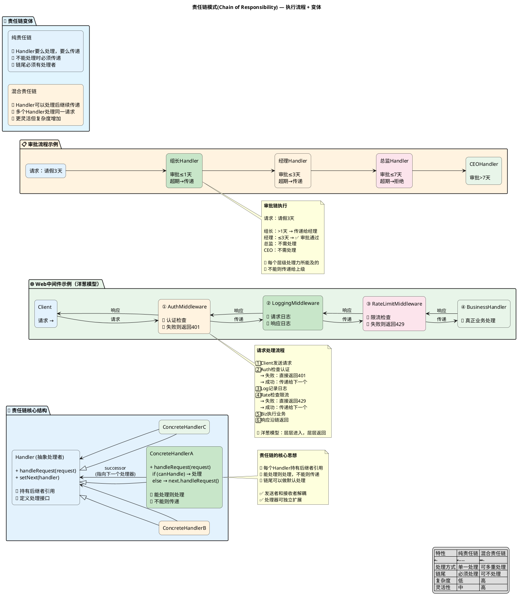

---

## 12. 模板方法模式（Template Method）

模板方法定义算法骨架，将某些步骤延迟到子类。基类负责算法结构，子类负责具体实现。

**模板方法模式核心概念**：

| 组成元素 | 职责 | 说明 |
|---------|------|------|
| AbstractClass | 定义模板方法(final)，声明抽象方法 | 算法骨架 |
| ConcreteClass | 实现抽象方法 | 具体步骤 |

**模板方法 vs 策略模式对比**：

| 对比维度 | 模板方法 | 策略模式 |
|---------|---------|---------|
| 复用方式 | 继承 | 组合 |
| 算法结构 | 父类控制 | 子类控制 |
| 扩展点 | 抽象方法/Hook | 整个算法 |
| 运行时刻 | 编译时确定 | 运行时可切换 |


通过图示理解模板方法的骨架结构与执行流程：

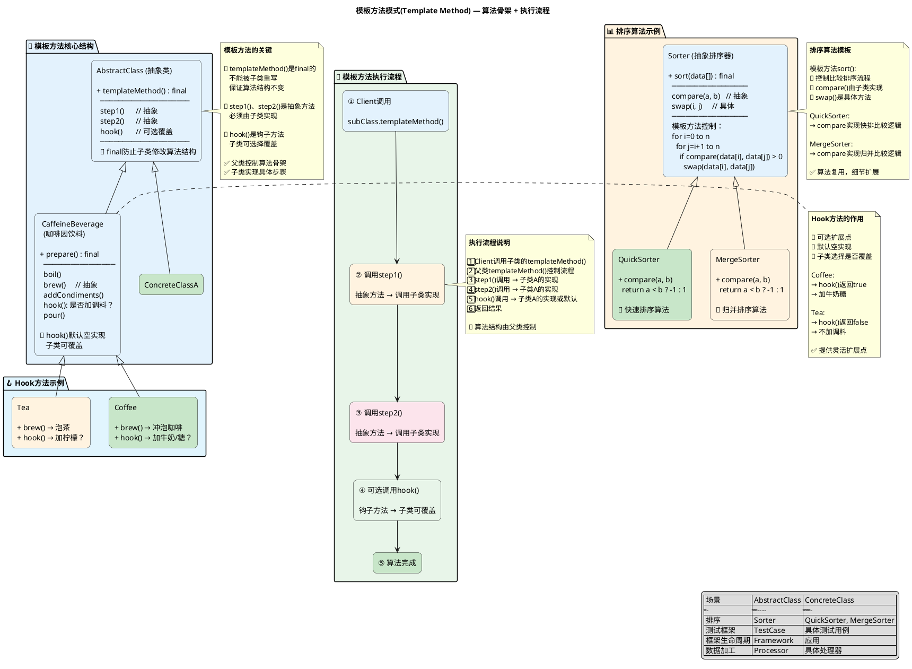

---

## 13. 策略模式（Strategy）

策略模式定义一系列算法，将每个算法封装起来，使它们可以互换。策略是独立的，客户端可选择不同算法。

**策略模式核心概念**：

| 组成元素 | 职责 | 说明 |
|---------|------|------|
| Strategy（抽象策略） | 定义算法接口 | 公共抽象 |
| ConcreteStrategy | 具体算法实现 | 封装具体算法 |
| Context（上下文） | 持有策略引用，执行算法 | 不关心算法细节 |

**策略模式 vs 状态模式对比**：

| 对比维度 | 策略模式 | 状态模式 |
|---------|---------|---------|
| 目的 | 算法互换 | 状态切换 |
| 算法关系 | 相互独立，可互换 | 状态相互关联 |
| 上下文影响 | 不影响策略 | 策略可能改变上下文 |
| 扩展方式 | 新增策略类 | 新增状态类 |
| 使用场景 | 算法选择 | 状态机 |


通过图示理解策略模式的结构与执行流程：

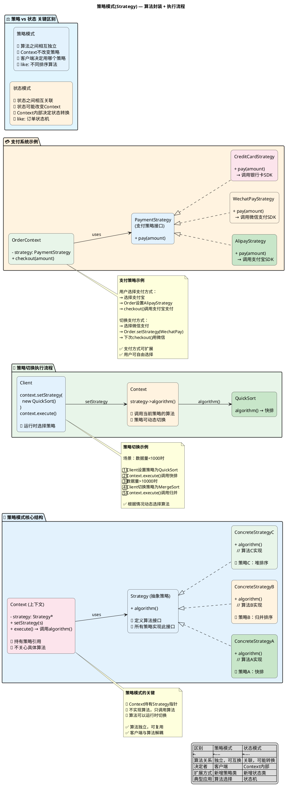

---

## 14. 观察者模式（Observer）

观察者模式定义对象间一对多依赖，当一个对象状态变化，所有依赖它的对象都会收到通知。

**观察者模式核心概念**：

| 组成元素 | 职责 | 说明 |
|---------|------|------|
| Subject（主题/被观察者） | 维护观察者列表，状态变化通知 | 管理观察者 |
| Observer（观察者） | 定义更新接口 | 接收通知 |

**推模型 vs 拉模型对比**：

| 模型 | 通知方式 | 数据传递 | 优点 | 缺点 |
|-----|---------|---------|------|------|
| 推模型 | 主动推送 | 完整数据 | 高效，减少请求 | 可能传递不需要的数据 |
| 拉模型 | 被动拉取 | 仅通知 | 按需获取 | 需要额外请求 |


通过图示理解观察者模式的发布-订阅流程与内存模型：

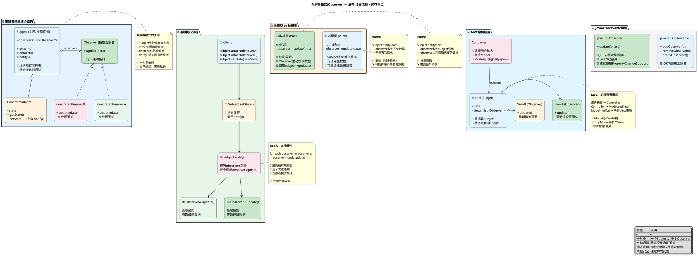

---

## 总结：设计模式分类与对比

三大类设计模式的核心对比：

| 分类 | 目的 | 核心思想 | 典型模式 |
|-----|------|---------|---------|
| **创建型** | 对象创建 | 封装创建细节，解耦构造 | 单例、工厂、抽象工厂 |
| **结构型** | 对象组合 | 组合优于继承 | 代理、装饰器、组合 |
| **行为型** | 交互分离 | 关注对象职责 | 责任链、模板方法、策略、观察者 |

**模式选择指南**：

| 场景 | 推荐模式 |
|------|---------|
| 全局唯一实例 | 单例模式 |
| 对象创建解耦 | 工厂模式 |
| 多产品族创建 | 抽象工厂 |
| 控制访问权限 | 代理模式 |
| 动态添加职责 | 装饰器模式 |
| 树形结构处理 | 组合模式 |
| 请求传递处理 | 责任链模式 |
| 算法骨架复用 | 模板方法模式 |
| 算法灵活切换 | 策略模式 |
| 状态变化通知 | 观察者模式 |
