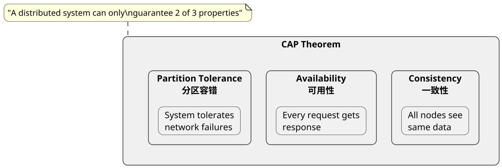
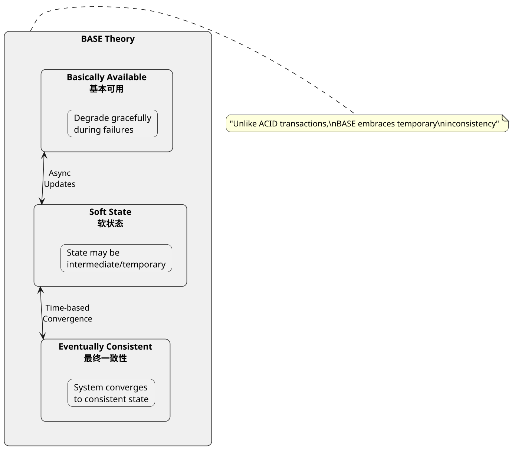
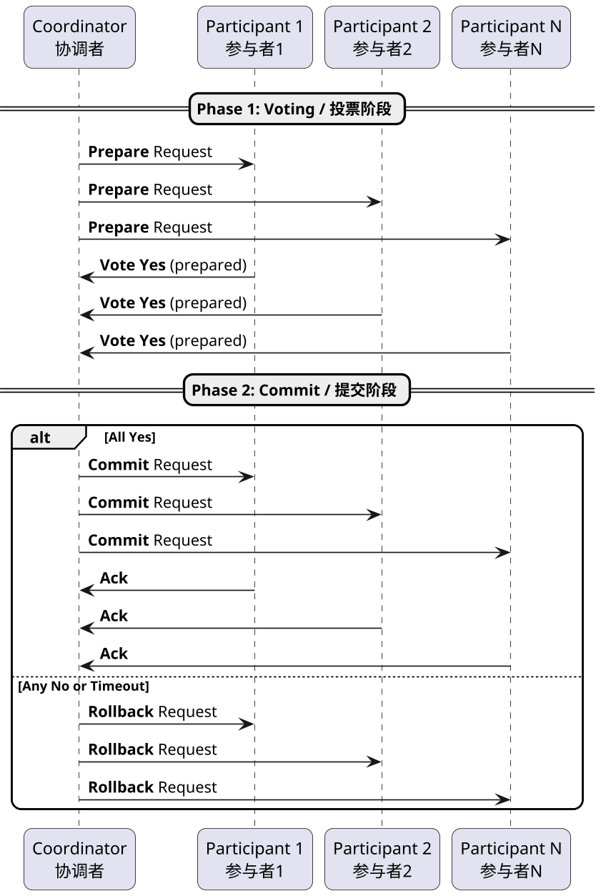
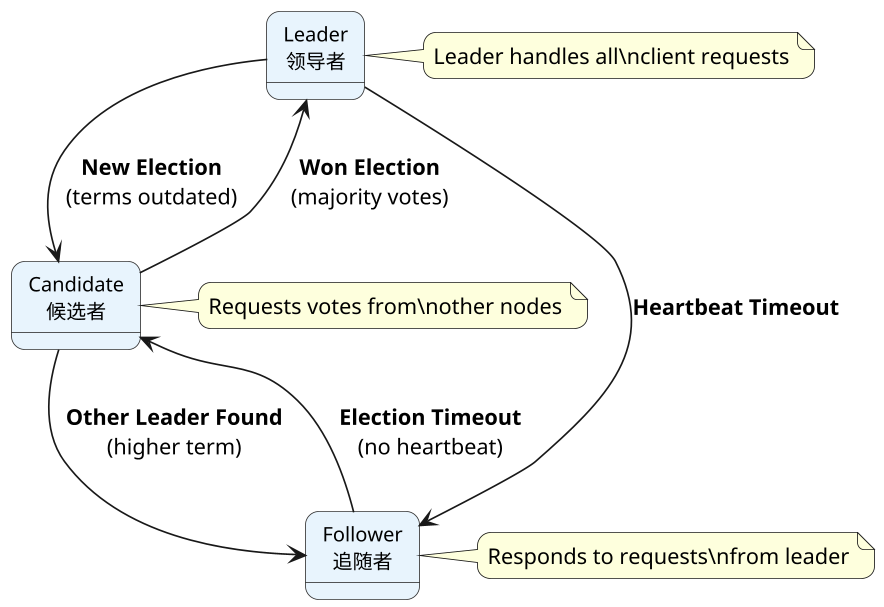

## 分布式理论，常见题型

### 什么是 CAP 理论

**原理:**

CAP理论是分布式系统领域的核心理论，由加州大学伯克利分校的Eric Brewer教授在2000年提出。该理论指出：一个分布式系统最多只能同时满足一致性（Consistency）、可用性（Availability）和分区容错性（Partition tolerance）这三个特性中的两个。

- **一致性（Consistency）**：所有节点在同一时刻看到的数据完全一致
- **可用性（Availability）**：每个请求都能在合理时间内获得响应
- **分区容错性（Partition tolerance）**：系统能够容忍网络分区故障

由于在分布式系统中网络分区不可避免，因此实际上需要在C和A之间做出权衡：要么选择强一致性和分区容错（CP），要么选择可用性和分区容错（AP）。

CAP理论广泛应用于分布式数据库、分布式存储系统、分布式锁服务等场景。例如：Zookeeper采用CP模型，Eureka采用AP模型。

**English Explanation:**

**PlantUML Diagram:**

---

### 什么是 Base 理论

**原理:**

Base理论是对CAP定理中一致性和可用性权衡的实践总结，由eBay架构师Dan Pritchett在2008年提出。Base是"Basically Available, Soft state, Eventually consistent"三个短语的缩写。

- **基本可用（Basically Available）**：系统在大部分时间可用，允许在故障时降级服务
- **软状态（Soft state）**：系统的状态可以是临时的、中间的，不要求实时一致
- **最终一致性（Eventually consistent）**：系统在一段时间后达到一致状态，不需要实时强一致

Base理论的核心思想是：通过牺牲实时一致性，换取系统的高可用性和可扩展性。最终一致性允许数据在短暂的不一致状态后，通过异步修复机制达到一致。典型的应用场景包括：消息队列、分布式缓存、最终一致性的分布式数据库等。

**English Explanation:**

**PlantUML Diagram:**

---

### 什么是2PC

**原理:**

2PC（Two-Phase Commit）是一种分布式事务协议，用于确保在分布式环境中多个节点上的事务要么全部提交成功，要么全部回滚。协议分为两个阶段：

**第一阶段（投票阶段）**：
- 协调者向所有参与者发送Prepare请求
- 参与者执行事务操作，但不会提交
- 参与者返回Yes或No投票

**第二阶段（提交阶段）**：
- 如果所有参与者都投Yes，协调者发送Commit请求，所有参与者提交事务
- 如果有任何参与者投No或超时，协调者发送Rollback请求，所有参与者回滚事务

2PC的优点是实现简单，能保证事务的原子性。缺点是同步阻塞、单点故障和数据不一致风险。当协调者在发送Commit后宕机，部分参与者可能已提交而部分未提交，导致数据不一致。

**English Explanation:**

**PlantUML Diagram:**

---

### 什么是Raft协议，解决了什么问题

**原理:**

Raft是一种分布式一致性算法，由Diego Ongaro和John Ousterhout在2014年提出，旨在解决分布式系统中日志复制和领导者选举问题。Raft通过将问题分解为三个子问题：领导者选举、日志复制和安全性。

**领导者选举**：集群中的节点初始为Follower，如果Follower在一段时间内未收到Leader的心跳，则转为Candidate发起选举。获得多数票的Candidate成为新的Leader。

**日志复制**：Leader接收客户端请求，将日志条目附加到本地日志，然后并行发送给所有Follower。当多数Follower确认接收后，Leader将条目应用到状态机并返回成功。

**安全性**：Raft通过以下机制保证安全：只有拥有最新且完整的日志条目的节点才能成为Leader；Leader永远不会覆盖或删除自己的日志条目。

Raft相对于Paxos更易于理解和实现，被广泛应用于etcd、Consul、CockroachDB等分布式系统。

**English Explanation:**

**PlantUML Diagram:**

---

