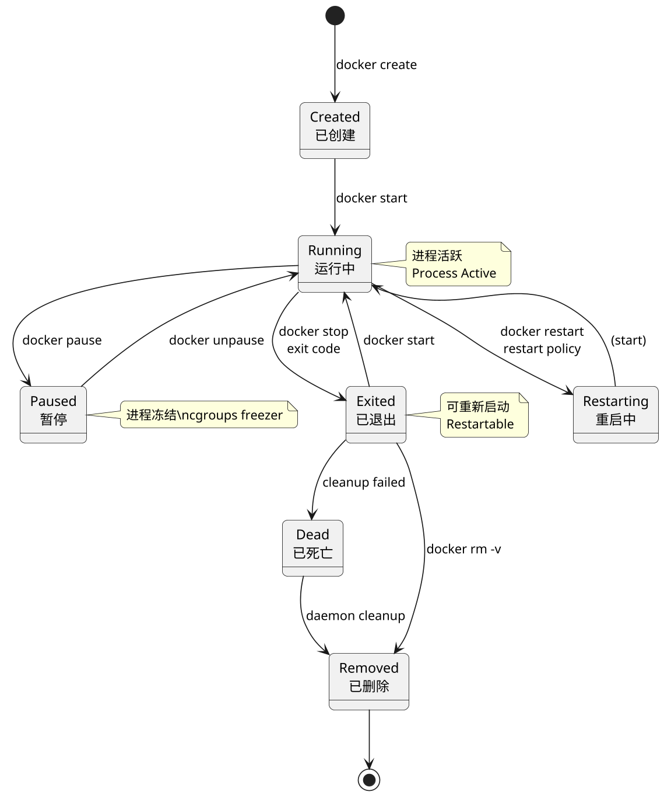
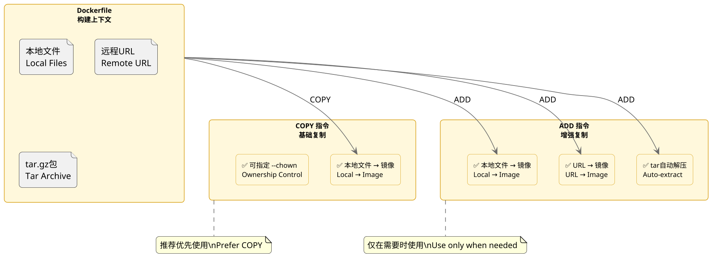
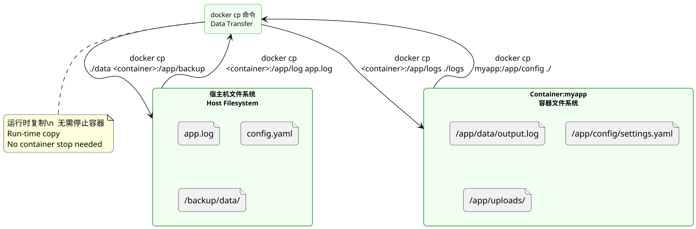
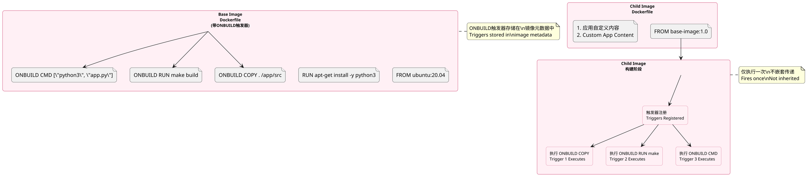
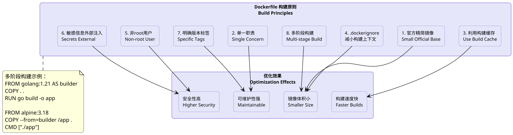
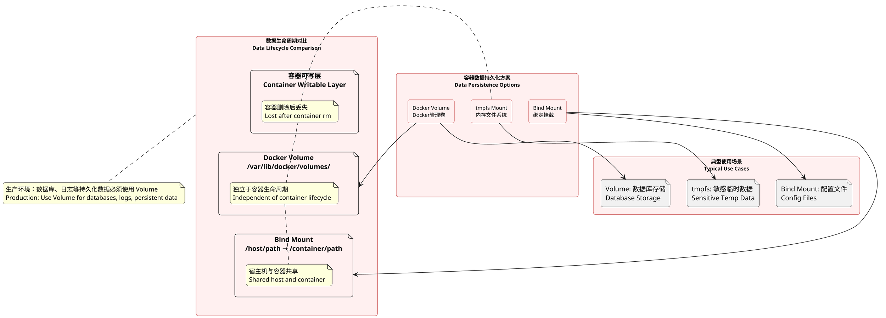

## Docker/K8s，常见题型

### 什么是 docker 镜像

**原理:**

Docker 镜像是一个只读的模板，包含了运行容器所需的文件系统、代码、依赖库、环境变量和配置信息。镜像采用了分层（Layer）的存储结构，每个镜像层都是只读的，多个镜像之间可以共享底层层，从而节省存储空间和加快构建速度。当基于镜像创建容器时，Docker会在镜像层之上添加一个可写层（Container Layer），所有对容器的修改都发生在这个可写层中，而不会影响底层的镜像本身。

Docker 镜像通过 Dockerfile 定义构建流程，每条指令都会创建一个新的镜像层。常见的镜像操作包括：`docker pull` 从仓库拉取镜像，`docker build` 根据 Dockerfile 构建镜像，`docker push` 将镜像推送到仓库。镜像的标识由仓库名、标签和摘要组成，典型的镜像名称格式为 `registry/repository:tag`，如 `nginx:1.25` 或 `python:3.11-slim`。使用 `docker images` 和 `docker rmi` 可以管理本地镜像。


**PlantUML Diagram:**

```plantuml
@startuml
skinparam dpi 160
skinparam roundcorner 10
hide stereotype

skinparam rectangle {
    backgroundColor #E6E6FA
    borderColor #9370DB
    fontSize 12
}

skinparam file {
    backgroundColor #FFFACD
    borderColor #DAA520
}

rectangle "Dockerfile" as Dockerfile
file "Base Image Layer
(Ubuntu 20.04)" as Layer1
file "Runtime Layer
(Python 3.11)" as Layer2
file "Dependencies Layer
(Flask 2.3)" as Layer3
file "Application Layer
(App Code)" as Layer4
file "Config Layer
(Config.yaml)" as Layer5
file "EntryPoint Layer
( CMD)" as Layer6

Dockerfile --> Layer1
Dockerfile --> Layer2
Dockerfile --> Layer3
Dockerfile --> Layer4
Dockerfile --> Layer5
Dockerfile --> Layer6

note right of Layer1
  只读镜像层
  Read-only Image Layer
end note

note right of Layer6
  最终镜像
  Final Image
end note

@enduml
```

---

### 什么是 docker 容器

**原理:**

Docker 容器是镜像的运行实例，是一个轻量级、可执行的独立软件包。容器包含了运行某个应用所需的全部内容：代码、运行时、系统工具、系统库和设置。容器在宿主机的内核上直接运行，共享宿主机的内核资源，与虚拟机相比，容器没有独立的 Guest OS，因此启动更快、资源占用更少、隔离性虽然弱于虚拟机但足以满足大多数应用场景。

容器的生命周期包括：创建（Created）、运行（Running）、暂停（Paused）、停止（Stopped）和删除（Deleted）五种状态。容器的本质是在宿主机上的一个或多个进程，通过 Linux Namespace 机制实现资源隔离（如 PID、Network、Mount、IPC 等），通过 Cgroups 实现资源限制（如 CPU、内存、I/O 等），通过 UnionFS（如 overlay2）实现分层文件系统。容器与镜像的关系就像是对象与类的关系：镜像是静态的模板，容器是动态的实例。


**PlantUML Diagram:**

```plantuml
@startuml
skinparam dpi 160
skinparam roundcorner 10
hide stereotype

skinparam rectangle {
    backgroundColor #E0F0FF
    borderColor #4169E1
    fontSize 12
}

rectangle "宿主机
(Ubuntu 22.04 Kernel)" as Host
rectangle "Docker Engine" as DockerEngine

rectangle "Container A
(Nginx)" as ContainerA {
    rectangle "可写层
Writable Layer" as WriteLayerA
    rectangle "镜像层叠
Image Layers (RO)" as ImageLayersA
}
rectangle "Container B
(Python App)" as ContainerB {
    rectangle "可写层
Writable Layer" as WriteLayerB
    rectangle "镜像层叠
Image Layers (RO)" as ImageLayersB
}

rectangle "Namespaces
(PID/Net/Mount/IPC)" as NS
rectangle "Cgroups
(CPU/Mem/IO)" as CG
rectangle "OverlayFS
(File System)" as FS

Host --> DockerEngine
DockerEngine --> ContainerA
DockerEngine --> ContainerB
ContainerA --> WriteLayerA
ContainerA --> ImageLayersA
ContainerB --> WriteLayerB
ContainerB --> ImageLayersB
DockerEngine --> NS
DockerEngine --> CG
DockerEngine --> FS

note bottom of Host
  共享宿主机内核
  Shared Host Kernel
end note

note right of NS
  资源隔离
  Resource Isolation
end note

note right of CG
  资源限制
  Resource Limitation
end note

@enduml
```

---

### docker 容器有几种状态

**原理:**

Docker 容器有 7 种核心状态，分别是：Created（已创建）、Running（运行中）、Paused（暂停）、Restarting（重启中）、Exited（已退出）、Dead（已死亡）和 Removed（已删除）。Created 状态表示容器已经过 `docker create` 创建但尚未启动，此时容器已分配了文件系统和网络资源但进程尚未启动。Running 状态表示容器正在运行，容器内的主进程（PID 1）处于活跃状态。Paused 状态通过 `docker pause` 命令触发，容器内所有进程被暂停（使用 cgroups freezer），适用于临时冻结容器进行备份或调试。Restarting 状态表示容器正在执行重启策略（如 `always` 或 `on-failure`），进程正在停止或启动过程中。Exited 状态表示容器正常或异常退出，可以通过 `docker start` 重新启动。Dead 状态是一个特殊状态，通常出现在容器无法清理资源时（如无法删除的存储卷或网络端点），需要手动干预。Removed 状态表示容器已从 Docker daemon 中删除但可能尚未完全清理。

在实际生产环境中，容器的状态转换需要关注：`docker create` → Created → `docker start` → Running → `docker stop` → Exited → `docker rm` → Removed。`docker run` 命令会直接完成 create + start 的两步操作。容器的退出码（exit code）也很重要：0 表示正常退出，125 表示 Docker daemon 本身出错，126 表示无法执行容器的 ENTRYPOINT/CMD，127 表示找不到可执行文件，其他非零退出码表示容器内进程因信号退出。


**PlantUML Diagram:**



---

### copy和add命令的区别

**原理:**

`COPY` 和 `ADD` 都是 Dockerfile 中用于将文件从构建上下文复制到镜像文件系统的指令，但两者存在重要区别。`COPY` 是最基础的文件复制指令，语法为 `COPY <src> <dest>`，功能简单明确——将构建上下文中的文件或目录复制到镜像内指定路径。`ADD` 除了具备 `COPY` 的全部功能外，还额外支持两种特殊能力：可以从 URL 复制文件（`ADD http://example.com/file.tar.gz /usr/local/`）和可以自动解压 tar 文件（`ADD app.tar.gz /opt/app/`）。由于 `ADD` 的行为较为隐式且可能导致非预期的结果（如下载的如果是压缩包则不解压而直接复制），官方文档推荐在大多数情况下使用 `COPY`。

选择使用 `COPY` 还是 `ADD` 的最佳实践是：优先使用 `COPY`，除非明确需要 `ADD` 的 URL 下载或 tar 自动解压功能。使用 `COPY` 的好处包括：语义清晰、不容易产生歧义、构建日志更容易理解。对于需要从远程 URL 获取资源的场景，建议先用 `RUN curl` 或 `RUN wget` 下载，再用 `COPY` 复制到目标位置，这样可以将下载过程纳入构建缓存，并且易于理解和管理。`COPY` 指令支持 `--chown` 参数来改变文件的所有权和权限，而 `ADD` 不支持此参数。


**PlantUML Diagram:**



---

### 容器与主机之间的数据拷贝命令

**原理:**

`docker cp` 是 Docker 提供的用于在容器和宿主机之间复制文件或目录的命令，语法为 `docker cp <container>:<src_path> <dest_path>` 或 `docker cp <src_path> <container>:<dest_path>`。这个命令可以在容器运行时动态复制文件，不需要停止容器，因此非常适合用于日志导出、配置文件查看、备份恢复等场景。`docker cp` 支持递归复制目录，并且可以跨容器进行文件传输（从容器A到容器B）。

使用 `docker cp` 时需要注意的是：源路径和目标路径都是相对于宿主机而言的（容器名后的冒号用于指定容器内的路径）。复制的行为类似于标准的 `cp` 命令：如果目标不存在则创建，如果目标存在则覆盖。Docker 还提供了 `docker export` 和 `docker import` 命令用于导出/导入容器的文件系统快照（作为 tar 归档），以及 `docker save` 和 `docker load` 用于保存/加载镜像。虽然 `docker cp` 不会复制隐藏文件（以 `.` 开头的文件），但 `docker export` 可以导出完整的文件系统。生产环境中更推荐使用数据卷（Volume）来持久化容器数据，而不是依赖 `docker cp`。


**PlantUML Diagram:**



---

### dockerfile的onbuild指令

**原理:**

`ONBUILD` 是 Dockerfile 中的一个特殊指令，它为镜像添加一个触发器（trigger），当这个镜像被作为其他镜像的基础镜像（FROM）时，触发器会在子镜像的构建过程中执行。`ONBUILD` 的典型使用场景是创建一个基础镜像模板，这个模板本身不包含应用代码，但定义好了构建应用所需的构建步骤，当使用者基于这个基础镜像构建自己的应用镜像时，触发器会自动执行预定义的构建命令。

`ONBUILD` 的工作原理是：Dockerfile 中的 `ONBUILD <INSTRUCTION>` 会将 `<INSTRUCTION>` 存储为镜像的元数据中的一个触发器。当新的镜像在 `FROM` 指令中引用这个镜像时，Docker 会在开始构建之前将所有触发器注册到新镜像的构建过程中，然后按照注册顺序依次执行。每个 `ONBUILD` 触发器只能使用一次，不支持嵌套（子镜像的 `ONBUILD` 不会自动触发孙镜像）。常见的 `ONBUILD` 使用模式包括：预复制源代码目录（`ONBUILD COPY . /app/src`）、预执行构建命令（`ONBUILD RUN make build`）、预设置入口点（`ONBUILD ENV APP_HOME /app`）。


**PlantUML Diagram:**



---

### 如何在生产中监控 docker

**原理:**

生产环境中 Docker 监控通常从三个层面展开：容器层面、宿主机层面和应用层面。容器层面的监控核心指标包括：CPU 使用率（区分系统 CPU 和用户 CPU）、内存使用量（含 Working Set、RSS、Cache）、网络 I/O（入站/出站流量、丢包率、连接数）、磁盘 I/O（读写速度、IOPS）、容器数量和状态分布。常用的容器监控工具有：`docker stats` 提供实时的单节点容器资源使用情况；cAdvisor（Container Advisor）是 Google 开发的开源容器监控工具，可收集容器级别的资源使用和性能指标；Prometheus + Grafana 组合是目前最流行的监控告警解决方案，支持多节点、长时间序列数据存储和可视化仪表盘；Datadog、New Relic 等商业监控平台也提供一键式的 Docker 监控集成。

宿主机层面的监控需要关注宿主机的 CPU、内存、磁盘和网络资源，以及 Docker daemon 的运行状态（`docker info` 可查看 Docker 系统信息）。应用层面的监控则需要结合业务特点，通常使用带外监控（Sidecar 模式）或库嵌入（SDK 方式）来实现应用级指标的暴露（如请求延迟、错误率、业务日志）。容器健康检查通过 `HEALTHCHECK` 指令在 Dockerfile 中定义，Docker 会定期执行检查命令并根据返回结果更新容器健康状态。生产环境中还应配置告警规则（如 CPU > 80% 持续 5 分钟触发告警）和日志收集（ELK/Graylog 等）。


**PlantUML Diagram:**

```plantuml
@startuml
skinparam dpi 160
skinparam roundcorner 10
hide stereotype

skinparam rectangle {
    backgroundColor #F5F5DC
    borderColor #8B8B00
    fontSize 11
}

rectangle "监控数据采集层\nMetrics Collection" as Collection {
    rectangle "docker stats\n实时统计" as DockerStats
    rectangle "cAdvisor\n容器指标" as Cadvisor
    rectangle "Node Exporter\n主机指标" as NodeExporter
    rectangle "应用SDK\nApp SDK" as AppSDK
}

rectangle "监控数据存储层\nMetrics Storage" as Storage {
    rectangle "Prometheus\n时序数据库" as Prometheus
    rectangle "InfluxDB\n时序数据库" as InfluxDB
}

rectangle "监控展示告警层\nVisualization & Alerting" as Display {
    rectangle "Grafana\n可视化仪表盘" as Grafana
    rectangle "AlertManager\n告警通知" as AlertManager
    rectangle "ELK Stack\n日志收集" as ELK
}

Collection --> Prometheus : pull/push
Collection --> InfluxDB : push
Prometheus --> Grafana : query
Prometheus --> AlertManager : alert rules
AlertManager --> Grafana : notification
ELK --> Grafana : log analysis

rectangle "关键监控指标\nKey Metrics" as Metrics {
    file "CPU %
    file "Network I/O
    file "Disk I/O
    file "Container Health State" as Health
    file "Application Latency" as AppLatency
}

Metrics -up-> Collection

@enduml
```

---

### 构建docker镜像应该遵循哪些原则

**原理:**

构建生产级 Docker 镜像应遵循以下核心原则。第一，优先选用官方镜像作为基础镜像，官方镜像通常经过安全审计和最佳实践验证，如 `python:3.11-slim`、`node:18-alpine`、`nginx:alpine` 等。第二，镜像层级要尽量精简（Use Small Base Images），推荐使用 Alpine 或 Slim 变体，减少攻击面和存储空间，避免安装不必要的工具和调试程序。第三，单一职责原则（One Image One Concern），每个容器只运行一个进程，将关联服务拆分到不同容器中，通过 Docker Compose 或 Kubernetes 进行编排。第四，利用构建缓存（Build Cache），将不常变化的指令（如包管理器安装、系统依赖）放在 Dockerfile 前部，将频繁变化的指令（如代码复制、配置文件）放在后部。第五，使用 `.dockerignore` 文件排除无关文件，减小构建上下文大小。第六，勿使用 root 用户运行容器（USER 指令），以减少安全风险。第七，敏感信息通过环境变量或运行时注入（Kubernetes Secret、Docker Secret），而非硬编码在镜像中。第八，标签（TAG）要明确指定版本号，避免使用 `latest` 标签导致不可预测的版本变更。第九，在 Dockerfile 中使用 `EXPOSE` 声明容器监听端口，使用 `LABEL` 添加元数据。


**PlantUML Diagram:**



---

### 容器退出后数据会丢失么

**原理:**

默认情况下，容器退出（Exited）后数据不会丢失，但容器被删除（`docker rm`）后数据会丢失。容器的文件系统分为多层结构：只读的镜像层（Image Layers）和可写层（Container Layer）。当容器运行时，所有文件修改都写入可写层，包括应用创建的日志、数据库文件、临时数据等。容器停止（`docker stop`）或退出（`docker exit`）时，可写层依然存在，只是容器不再运行。重新启动容器（`docker start`）可以恢复之前的数据，因为可写层没有被删除。只有执行 `docker rm -v` 删除容器时，可写层才会被清理。

然而，容器的可写层是绑定在容器生命周期上的，不适合存储需要持久化的数据。生产环境中的正确做法是使用 Docker Volume 或绑定挂载（Bind Mount）来持久化数据。Docker Volume 由 Docker 管理，存储在宿主机的 `/var/lib/docker/volumes/` 目录下，数据独立于容器生命周期，即使删除容器数据依然保留。绑定挂载则将宿主机上的特定目录映射到容器内部，适用于需要宿主机和容器共享文件的场景。数据库（MySQL、PostgreSQL、Redis）、文件存储、日志收集等场景都应使用 Volume 来持久化数据。


**PlantUML Diagram:**



---

