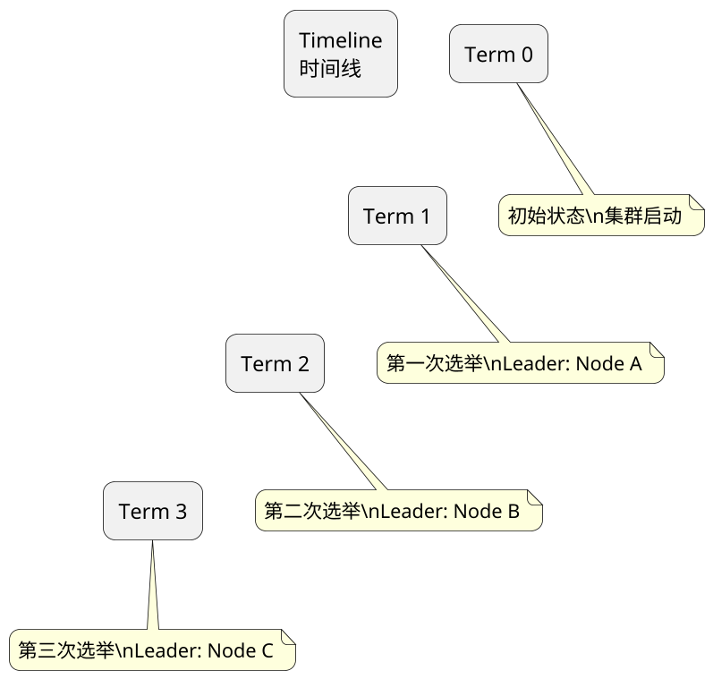
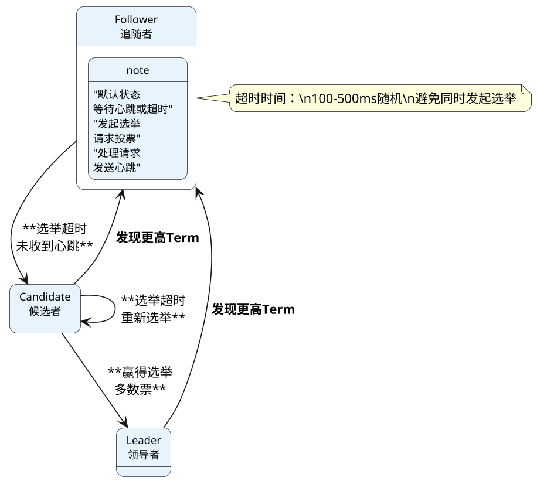
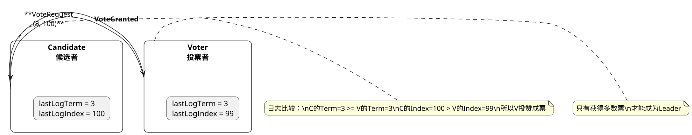
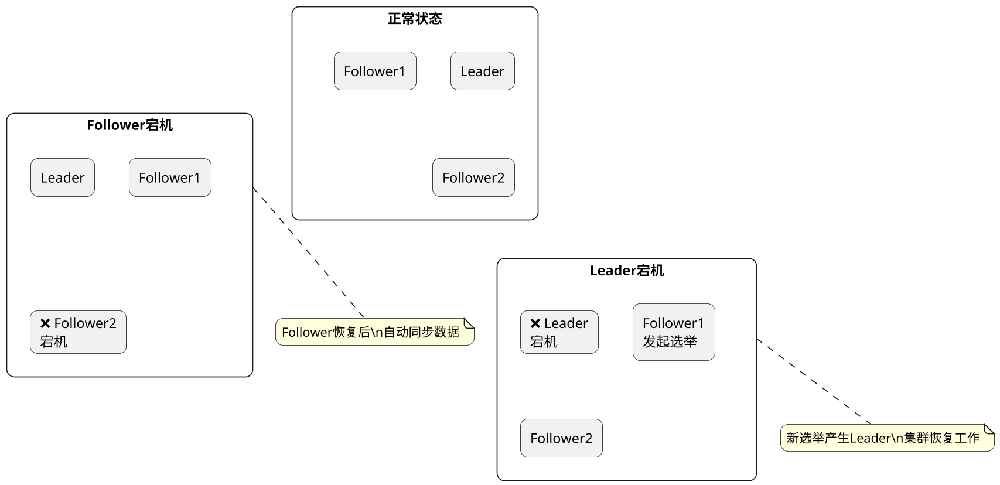
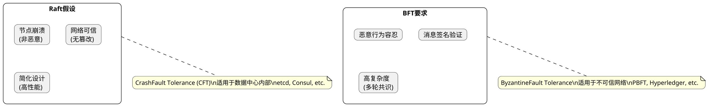
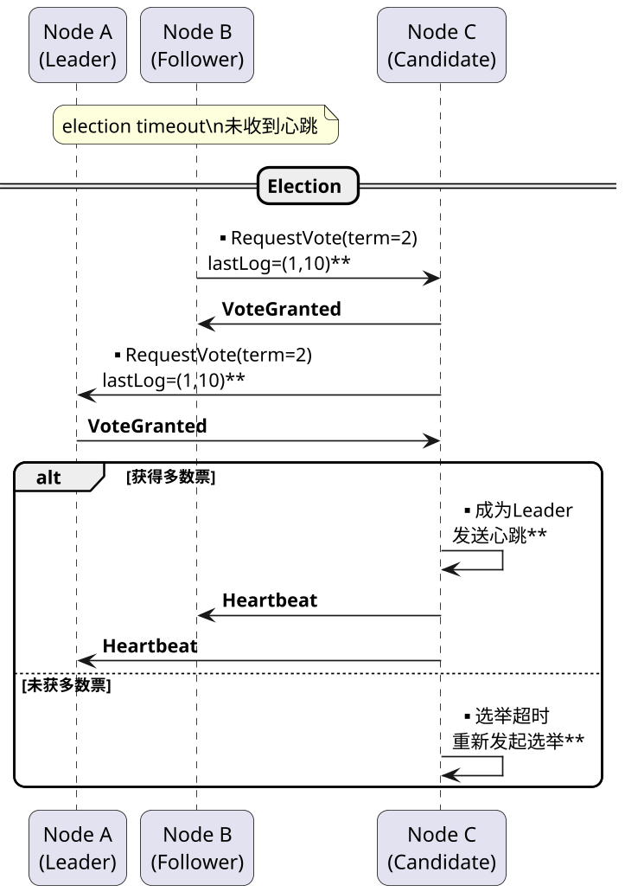
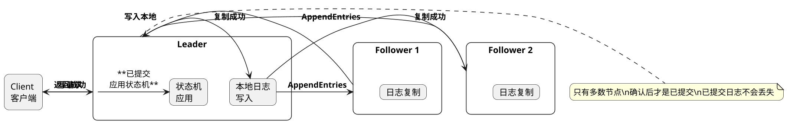

## etcd，常见题型

### etcd 中一个任期是什么意思

**原理:**

在etcd的Raft协议实现中，"任期"（Term）是一个逻辑时钟概念，用于解决分布式系统中的时间问题和识别过期的信息：

**任期的定义**：
- 任期是一个单调递增的整数，从0开始
- 每个新选举开始时，候选者会将自己的Term加1
- 任期贯穿整个选举和正常工作的全周期

**任期的作用**：
1. **区分选举周期**：每个任期最多有一个Leader
2. **识别过期信息**：旧任期的消息会被忽略
3. **解决冲突**：通过Term比较解决冲突
4. **日志条目属性**：每个日志条目都包含其创建时的Term号

**Term的流转**：
- 正常情况下，Term随时间单调递增
- 选举时，候选者将自己的Term加1
- 网络分区时，可能出现多个不同的Term
- 当节点发现更高Term时，自动转为Follower

**English Explanation:**

**PlantUML Diagram:**

---

### etcd中raft状态机是怎么样切换的

**原理:**

etcd基于Raft协议实现，节点在三种状态之间切换：Leader（领导者）、Follower（追随者）、Candidate（候选者）：

**状态转换规则**：

**Follower → Candidate**：
- 条件：选举超时时间内未收到Leader心跳
- 动作：增加Term，转为Candidate，发起选举

**Candidate → Leader**：
- 条件：获得集群多数节点的投票
- 动作：成为新Leader，开始处理请求

**Candidate → Follower**：
- 条件1：选举超时，重新开始新选举
- 条件2：发现新的Leader（更高Term）
- 条件3：发现更高Term的日志

**Leader → Follower**：
- 条件：发现更高Term的节点
- 动作：主动降级为Follower

**状态机核心逻辑**：
// 伪代码

**English Explanation:**

**PlantUML Diagram:**

---

### 如何防止候选者在遗漏数据的情况下成为总统

**原理:**

Raft协议通过投票限制（Vote Restriction）机制，确保只有拥有最新日志的候选者才能赢得选举：

**核心机制：投票前检查**：
- 候选者请求投票时，会携带自己的lastLogTerm和lastLogIndex
- 投票者会比较候选者的日志是否比自己更新
- 如果候选者日志不如自己新，拒绝投票

**日志比较规则**：
- 首先比较lastLogTerm：Term大的日志更新
- 如果Term相同，比较lastLogIndex：索引大的日志更新
- 只有日志"不旧于"投票者的节点才能获得投票

**为什么这样有效**：
- 新Leader必须包含所有已提交的日志条目
- 未同步的候选者无法获得多数投票
- 保证了Leader的数据完整性

**实际实现**：
- Raft论文中的描述：If votesReceived ≥ majority, become leader
- 但实际需要检查：me.lastLog >= peer.lastLog
- etcd/Consul等实现都遵循此规则

**English Explanation:**

**PlantUML Diagram:**

---

### etcd某个节点宕机后会怎么做

**原理:**

当etcd集群中某个节点宕机时，集群会根据节点类型和故障情况采取不同措施：

**Follower宕机**：
- Leader检测到Follower心跳超时（通常几秒）
- 将该节点从通信中移除
- 不影响集群的写操作（如果Leader还在）
- Follower恢复后，会自动重新加入并同步数据

**Leader宕机**：
- 其他节点等待心跳超时
- 触发新一轮选举
- 如果原Leader恢复，会发现更高的Term，自动转为Follower
- 选举期间集群不可用（通常几秒）

**Candidate宕机**：
- 选举超时后，其他节点重新发起选举
- 不影响集群的正常Leader工作

**数据恢复**：
- 节点恢复后，从Leader获取缺失的日志条目
- 通过Raft日志重放恢复状态机状态
- 如果日志损坏，需要从快照恢复

**网络分区**：
- 少数派分区无法选主，自动变为Follower
- 原Leader在多数派分区继续工作
- 分区恢复后，少数派节点同步新Leader数据

**English Explanation:**

When an etcd node fails: Follower failure is detected via heartbeat timeout, removed from communication,不影响写操作. Leader failure triggers new election, cluster unavailable during election. Recovery involves re-syncing from leader via log replay or snapshot restoration. Network partition isolates minority, primary continues working.

**PlantUML Diagram:**

---

### 为什么raft算法不考虑拜占庭将军问题

**原理:**

Raft算法设计时选择不考虑拜占庭将军问题，这是基于实际应用场景和工程权衡的考虑：

**拜占庭将军问题**：
- 拜占庭容错（BFT）要求系统能容忍恶意节点
- 节点可能发送虚假、篡改或伪造的消息
- 需要复杂的签名和多数冗余机制

**Raft的设计假设**：
1. **诚实节点**：节点只会崩溃或停止工作，不会恶意行为
2. **可信网络**：网络中的消息不会被篡改
3. **简化实现**：避免复杂密码学操作，提高性能

**为什么不考虑**：
- **性能开销**：BFT算法（如PBFT）复杂度高，性能差
- **实现复杂**：BFT需要签名、验证、多轮共识
- **场景匹配**：数据中心内部的协调服务通常可信
- **可替代方案**：有专门的BFT库可用于高安全场景

**实际应用**：
- etcd/Consul等用于服务发现的系统采用Raft
- 金融等高安全场景使用专门的BFT实现（如Hyperledger Fabric）
- Kubernetes使用etcd，正是基于数据中心可信假设

**English Explanation:**

**PlantUML Diagram:**

---

### etcd 如何选举出leader节点

**原理:**

etcd使用Raft协议的领导者选举机制，通过投票和超时机制选出Leader：

**选举触发条件**：
- Follower在选举超时（election timeout）内未收到Leader心跳
- 选举超时时间通常是100-500ms的随机值（避免同时发起选举）

**选举流程**：
1. **状态转换**：Follower → Candidate
2. **增加Term**：Candidate将自己的Term加1
3. **投票请求**：向所有节点发送RequestVote RPC
4. **等待响应**：等待多数节点的投票

**投票规则**：
- 节点投出票后，重置自己的选举超时计时器
- 每个Term只能投一票
- 只有日志比自己的新的候选者才能获得投票

**赢得选举**：
- 获得集群多数节点（含自己）的投票
- 成为新Leader，开始发送心跳
- 其他节点收到心跳后转为Follower

**选举失败**：
- 未获得多数票，选举超时后重新发起选举
- 发现更高Term的Leader，自动转为Follower

**English Explanation:**

**PlantUML Diagram:**

---

### etcd如何保证数据一致性

**原理:**

etcd通过Raft共识算法保证分布式数据的一致性，主要机制包括：

**1. 日志复制**：
- 客户端写请求先写入Leader的本地日志
- Leader并行发送给所有Follower（AppendEntries RPC）
- 只有多数节点确认写入后，日志才被视为已提交
- 已提交日志应用到底层状态机

**2. 领导人完整性（Leader Completeness）**：
- 只有包含所有已提交日志的节点才能成为Leader
- 通过投票限制机制保证
- 新Leader包含最新的数据

**3. 日志匹配（Log Matching）**：
- 如果两个节点的日志在某一索引相同，则之前的所有日志也相同
- 通过AppendEntries一致性检查实现
- 确保数据不丢失、不重复

**4. 状态机匹配**：
- 已提交的操作最终会应用到所有状态机
- 使用预写日志（WAL）和快照机制
- 崩溃恢复后通过重放日志恢复

**5. 读请求处理**：
- 默认情况下读请求由Leader处理，保证最新数据
- 可配置线性读取（Linearizable Read）
- 使用ReadIndex机制确保读取最新已提交数据

**English Explanation:**

**PlantUML Diagram:**

---

