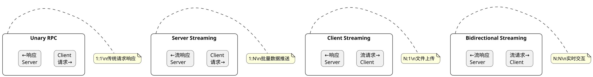
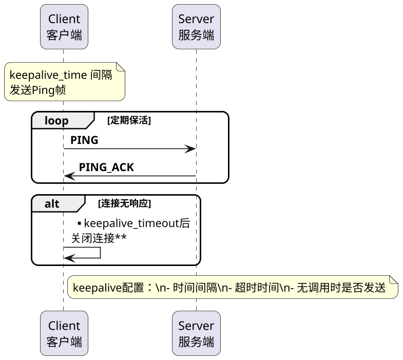
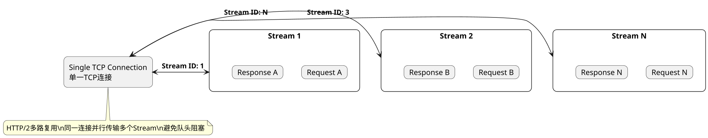
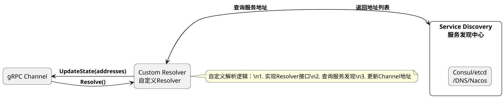
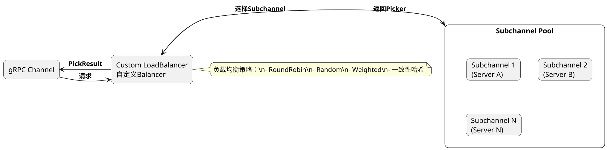
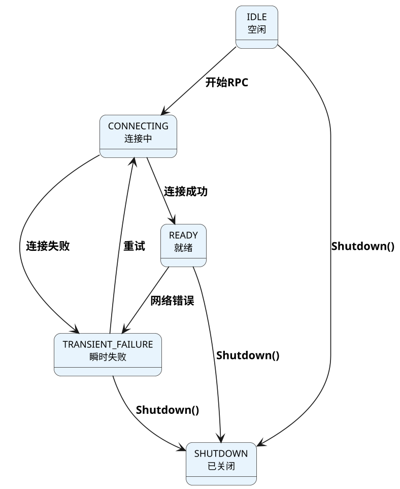
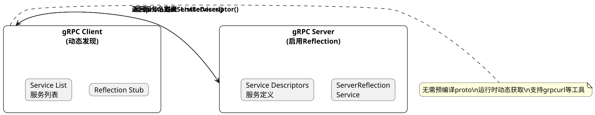
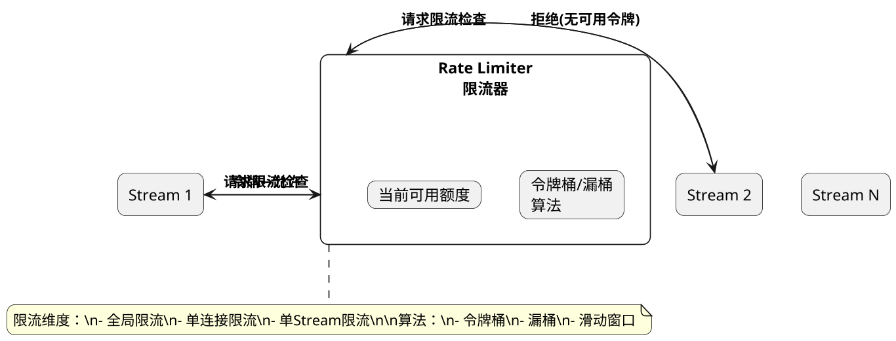

## gRPC，常见题型

### gRPC 服务端启动流程

**原理:**

gRPC服务端启动流程主要分为以下几个步骤：

**1. 创建Server实例**：
- 调用gRPC::CreateServerBuilder()创建Server构建器
- 配置监听端口和线程池参数

**2. 注册服务**：
- 将实现的服务类注册到ServerBuilder
- 通过AddService()方法添加proto生成的服务
- 支持添加多个服务到同一Server

**3. 配置拦截器**：
- 添加ServerInterceptor实现认证、日志等功能
- 可为所有方法或特定方法添加拦截器

**4. 绑定端口**：
- 调用builder.AddListeningPort()绑定监听地址
- 支持Unix Domain Socket

**5. 启动Server**：
- 调用builder.BuildAndStart()创建并启动Server
- Server开始接收客户端连接

**6. 等待终止**：
- 调用Server->Wait()阻塞等待
- 或使用Shutdown()和AwaitTermination()优雅关闭

**English Explanation:**


**PlantUML Diagram:**

```plantuml
@startuml
skinparam dpi 160
skinparam shadowing false
skinparam roundcorner 15

|Server|
start
:CreateServerBuilder();
:AddService(serviceImpl);
:AddInterceptor();
:AddListeningPort(address);
:BuildAndStart();
:Wait/Shutdown();

stop

note right of Server
    1. 创建构建器\n2. 注册服务\n3. 配置拦截器\n4. 绑定端口\n5. 启动服务\n6. 等待终止
end note

@enduml
```

---

### gRPC 服务类型有哪些

**原理:**

gRPC支持四种服务类型，也称为RPC风格：

**1. Unary RPC（单项RPC）**：
- 客户端发送单个请求，服务端返回单个响应
- 最常用的模式，类似传统函数调用
- 例如：GetUser(UserRequest) -> UserResponse

**2. Server Streaming RPC（服务端流式RPC）**：
- 客户端发送单个请求，服务端返回多个响应组成的流
- 适用于批量数据返回、实时推送场景
- 例如：GetLogs(LogRequest) -> stream LogResponse

**3. Client Streaming RPC（客户端流式RPC）**：
- 客户端发送多个请求组成的流，服务端返回单个响应
- 适用于文件上传、批量提交场景
- 例如：UploadFile(stream FileChunk) -> UploadResult

**4. Bidirectional Streaming RPC（双向流式RPC）**：
- 客户端和服务端都可以发送多个请求/响应组成的流
- 双方可以独立地以任意顺序发送消息
- 适用于实时交互、聊天应用等
- 例如：Chat(stream Message) -> stream Message

**English Explanation:**


**PlantUML Diagram:**



---

### keepalive 是针对连接设置

**原理:**

gRPC的Keepalive是一种保活机制，用于检测连接是否仍然活跃，主要针对HTTP/2连接设置：

**作用**：
1. **检测连接存活**：定期发送ping帧检测对端是否存活
2. **保持连接活跃**：防止空闲连接被中间设备（如负载均衡器、防火墙）关闭
3. **及时发现故障**：快速检测网络故障或对端崩溃

**配置参数**：
- keepalive_time：空闲多长时间后发送ping（默认2小时）
- keepalive_timeout：ping后等待多长时间未响应则关闭连接
- keepalive_without_calls：是否在没有活跃调用时发送ping

**应用场景**：
- 长连接应用需要保持连接活跃
- 客户端需要检测服务端是否存活
- 穿透NAT或防火墙
- 通过代理或负载均衡器的场景

**注意事项**：
- 频繁的Keepalive会影响性能
- 需要根据网络环境合理配置
- 有些云服务商会限制Keepalive行为

**English Explanation:**


**PlantUML Diagram:**



---

### gRPC多路复用指的是什么

**原理:**

gRPC多路复用（Multiplexing）是指在单个HTTP/2连接上同时处理多个独立的Stream（流），是gRPC高性能的核心特性之一：

**技术原理**：
- HTTP/2支持多路复用，通过Stream ID区分不同的请求/响应
- 多个Stream共享同一个TCP连接
- 同一个连接上可以同时存在多个未完成的请求

**优势**：
1. **连接复用**：避免频繁建立TCP连接的开销
2. **并行处理**：多个请求可以并行发送和接收
3. **资源节省**：减少连接数，降低服务器资源消耗
4. **低延迟**：避免等待连接建立

**与HTTP/1.1对比**：
- HTTP/1.1需要Pipeline或多个连接实现并发
- HTTP/1.1存在HOL（队头阻塞）问题
- HTTP/2/gRPC通过Stream ID完全避免HOL

**Unary vs Streaming**：
- Unary：一个请求对应一个响应
- Streaming：多个请求/响应可以交错在同一个连接上

**English Explanation:**


**PlantUML Diagram:**



---

### gRPC 如何自定义 resolver

**原理:**

gRPC自定义Resolver允许开发者实现服务发现逻辑，将服务名解析为具体的地址列表：

**Resolver接口**：
- 实现grpc::Resolver接口
- 主要方法：Resolve(resolve_args)、Shutdown()
- 调用ClientChannel的UpdateState()更新地址

**核心步骤**：
1. **创建Resolver Factory**：注册到全局FactoryMap
2. **实现Resolver类**：实现服务发现逻辑
3. **解析地址**：查询注册中心或DNS
4. **更新地址**：将结果通过Channel返回

**常用场景**：
- **服务注册中心**：从Consul、etcd、Nacos发现服务
- **负载均衡策略**：配合自定义LB实现复杂策略
- **动态配置**：运行时更改服务端点

**代码示例**：
        // 查询服务发现获取地址
        // 更新Channel

**English Explanation:**


**PlantUML Diagram:**



---

### gRPC如何自定义 balancer

**原理:**

gRPC自定义负载均衡器允许开发者实现各种负载均衡策略：

**LoadBalancer接口**：
- 实现grpc::LoadBalancer接口
- 处理客户端请求的服务器选择
- 管理subchannel（子通道）生命周期

**核心组件**：
1. **LoadBalancer**：决定选择哪个Subchannel处理请求
2. **Subchannel**：到某个服务端的物理连接
3. **Picker**：实际选择Subchannel的策略对象

**常用策略实现**：
- **RoundRobin**：轮询选择
- **Random**：随机选择
- **WeightedRoundRobin**：加权轮询
- **一致性哈希**：相同请求路由到相同服务器

**与Resolver配合**：
- Resolver负责"在哪找"（地址发现）
- Balancer负责"选哪个"（负载选择）

**实现步骤**：
1. 实现LoadBalancer类
2. 实现SubchannelPicker的PickResult
3. 注册到全局LoadBalancerRegistry

**English Explanation:**


**PlantUML Diagram:**



---

### 如何实现 gRPC 全链路追踪

**原理:**

gRPC全链路追踪用于监控和调试分布式请求的完整调用链：

**核心概念**：
- **Trace**：一次完整的请求链路
- **Span**：链路中的一个操作单元
- **Trace ID**：串联整个链路的唯一ID

**实现机制**：
1. **拦截器注入**：Client/ServerInterceptor提取或生成TraceContext
2. **上下文传播**：通过Metadata携带Trace信息
3. **Span记录**：记录每个操作的开始、结束时间
4. **上报追踪系统**：将数据发送到Zipkin、Jaeger等

**gRPC追踪支持**：
- 内置OpenCensus和OpenTracing支持
- 支持W3C Trace Context标准
- 可配合gRPC插件实现详细追踪

**实现步骤**：
1. 配置追踪Exporter（如Zipkin、Jaeger）
2. 添加ClientInterceptor和ServerInterceptor
3. 在拦截器中提取/注入Context
4. 为每个RPC创建Span并记录元数据

**English Explanation:**


**PlantUML Diagram:**

```plantuml
@startuml
skinparam dpi 160
skinparam shadowing false
skinparam roundcorner 15

actor "Client\n客户端" as C

box "Service A" #LightBlue
rectangle "Interceptor A" as IA
rectangle "Span A1" as SA1
end box

box "Service B" #LightGreen
rectangle "Interceptor B" as IB
rectangle "Span B1" as SB1
end box

box "Service C" #LightYellow
rectangle "Interceptor C" as IC
rectangle "Span C1" as SC1
end box

C -> IA: **RPC请求\n(TraceID=xxx)**
IA -> SA1: **创建Span**
SA1 -> IB: **转发\n(Metadata携带)**
IB -> SB1: **创建Span**
SB1 -> IC: **转发**
IC -> SC1: **创建Span**

note bottom of C
    Trace ID贯穿整个链路\n每个服务创建Span\n形成完整调用链
end note

@enduml
```

---

### 客户端连接状态有哪些

**原理:**

gRPC客户端连接状态反映了底层HTTP/2连接的健康状况，主要有以下状态：

**1. IDLE（空闲状态）**：
- 初始状态，Channel未建立连接
- 开始发起RPC时将尝试建立连接

**2. CONNECTING（连接中）**：
- 正在与服务器建立TCP连接和HTTP/2握手
- 可能涉及TLS握手

**3. READY（就绪状态）**：
- 连接已建立，可以正常处理RPC
- 收发数据正常

**4. TRANSIENT_FAILURE（瞬时失败）**：
- 连接遇到可恢复的错误（如网络抖动）
- 会自动重试建立连接

**5. SHUTDOWN（已关闭）**：
- Channel被显式关闭
- 不会再进行任何连接尝试

**状态转换**：
- IDLE → CONNECTING → READY
- READY → TRANSIENT_FAILURE → CONNECTING
- 任意状态 → SHUTDOWN

**English Explanation:**


**PlantUML Diagram:**



---

### 客户端如何获取服务端的服务函数列表

**原理:**

gRPC服务端通过gRPC Reflection协议暴露服务定义，客户端可以动态获取服务列表：

**Server Reflection**：
- 需要在服务端启用ServerReflection服务
- 服务名为grpc.reflection.v1alpha.ServerReflection
- 支持查询服务名列表、具体服务定义

**ProtoDescriptor服务**：
- grpc.reflection.v1.ServerReflection：正式版本
- 返回完整的service proto描述

**客户端使用**：
// 创建reflection stub

// 查询所有服务

// 获取服务名列表
    // 查询具体服务定义...

**应用场景**：
- 动态客户端：无需预编译proto
- gRPC UI工具： grpcurl、Postman
- 服务治理：发现可用服务
- 契约测试：验证服务端接口

**English Explanation:**


**PlantUML Diagram:**



---

### 如何为每个stream进行限流

**原理:**

gRPC可以为每个Stream（流）实现限流，控制并发和资源使用：

**限流策略**：
1. **令牌桶算法**：按速率生成令牌，获取令牌才能处理请求
2. **漏桶算法**：按固定速率处理请求，平滑流量
3. **滑动窗口**：基于时间窗口统计请求数

**实现方式**：
- **Client Interceptor**：在发送请求前检查限流
- **Server Interceptor**：在处理请求前检查限流

**限流维度**：
- **全局限流**：整个进程共享限流器
- **单连接限流**：每个连接独立限流
- **单Stream限流**：每个Stream独立限流

**代码示例**：

            // 拒绝请求

**English Explanation:**


**PlantUML Diagram:**



---

