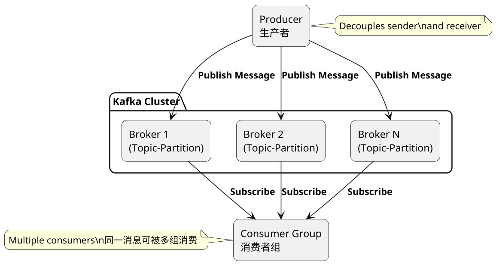
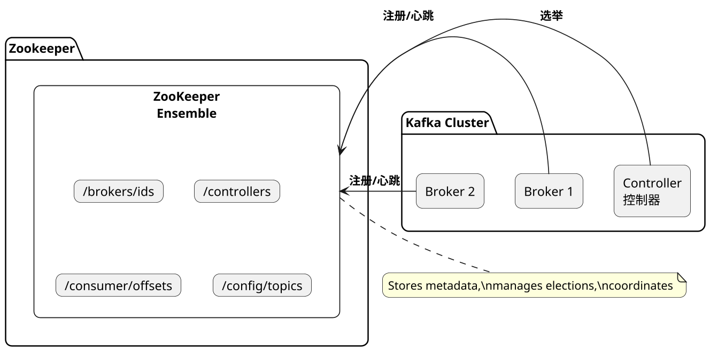
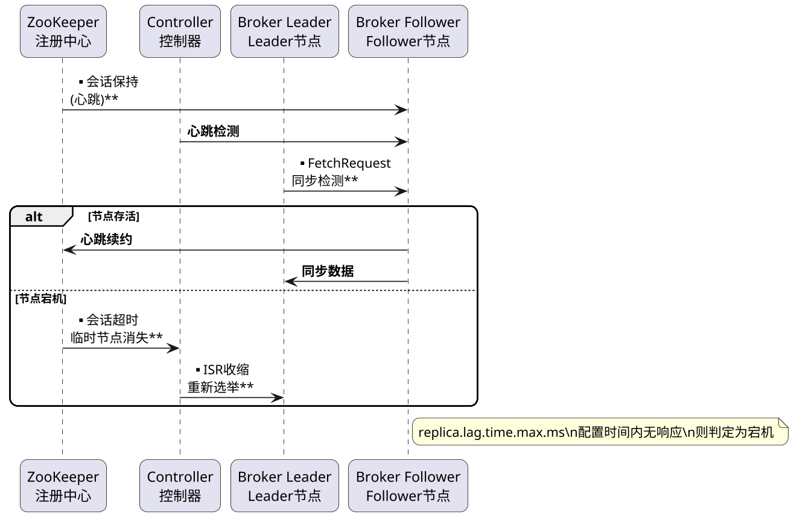
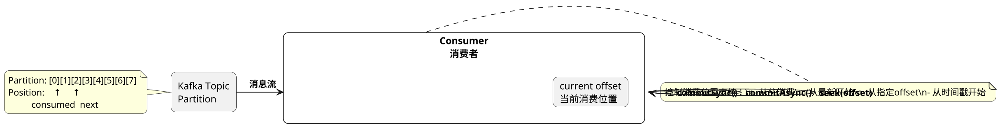
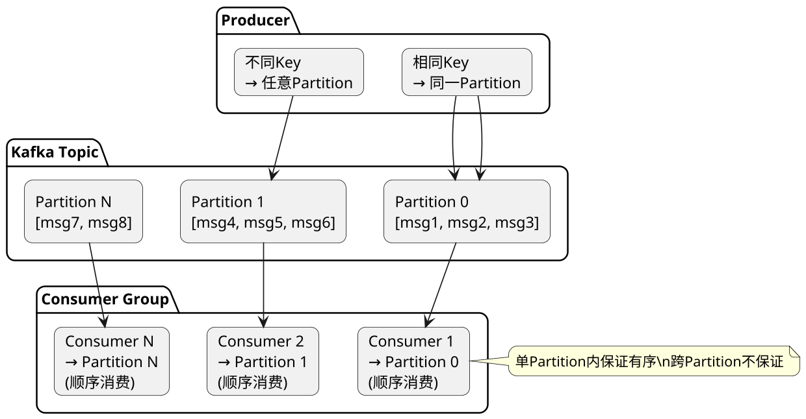
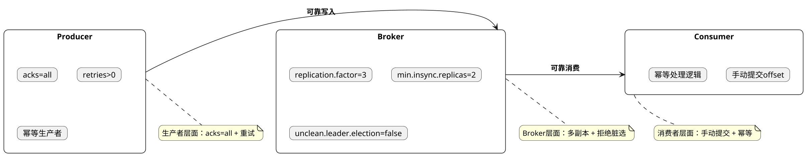
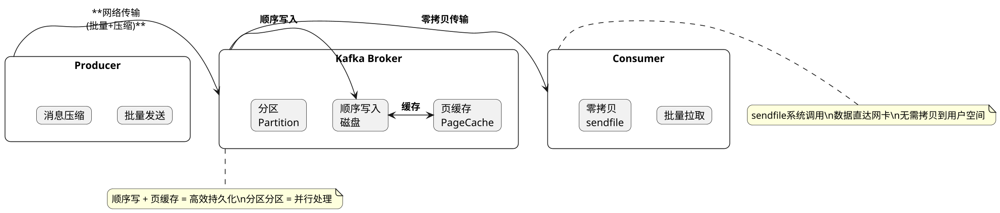

## Kafka，常见题型

### kafka是什么？解决了什么问题？

**原理:**

Kafka是由Apache软件基金会开发的分布式流处理平台，最初由LinkedIn公司开发并开源。它是一个高性能、持久化、分布式的消息队列和流处理系统。Kafka主要用于以下场景：

**解决的核心问题**：
1. **异步处理**：解耦生产者和消费者，提高系统响应速度
2. **削峰填谷**：缓解突发流量压力，平滑系统负载
3. **日志收集**：收集各类日志信息进行实时分析
4. **消息通信**：支持应用间的异步通信
5. **事件源**：作为事件驱动架构的核心组件

Kafka采用发布-订阅模型，支持消息持久化、分区存储、多副本备份，通过顺序写磁盘和零拷贝技术实现高吞吐量，被广泛应用于大数据实时处理、日志采集、监控报警等场景。

**English Explanation:**


**PlantUML Diagram:**



---

### zk对于kafka的作用是什么

**原理:**

Zookeeper在Kafka架构中扮演着非常重要的角色，主要负责以下几个方面：

**1. 集群元数据管理**：保存Kafka集群的Broker列表、Topic配置、Partition分布等元信息

**2. Leader选举**：当Kafka的Controller（控制器）节点宕机时，Zookeeper负责选举新的Controller

**3. 分布式锁服务**：用于Broker注册、Topic注册等分布式协调场景

**4. 消费者组管理**：记录消费者组的offset信息和成员变化

**5. 配额管理**：存储客户端配额配置

不过值得注意的是，从Kafka 2.8版本开始，引入了KRaft模式，可以不依赖Zookeeper实现元数据管理，这是Kafka架构的重要演进方向。

**English Explanation:**


**PlantUML Diagram:**



---

### kafka如何判断一个节点是否还活着

**原理:**

Kafka通过心跳机制来判断节点是否存活，主要依靠Zookeeper和Kafka内置的心跳检测：

**Zookeeper层面**：
- Broker启动时会在Zookeeper创建临时节点（/brokers/ids/{broker_id}）
- Broker与Zookeeper保持会话，通过心跳维持连接
- 会话超时或临时节点消失，Zookeeper认为该Broker宕机

**Kafka内部心跳**：
- Controller定期向所有Broker发送心跳
- Broker通过Zookeeper的临时节点机制报告健康状态
- 如果Broker在配置的时间（replica.lag.time.max.ms）内未响应，被认为是宕机

**副本同步检测**：
- Follower定期向Leader发送FetchRequest请求同步数据
- 如果Follower在指定时间内没有发送请求，Leader认为其宕机
- 只有活跃的ISR（In-Sync Replicas）才能参与Leader选举

**English Explanation:**


**PlantUML Diagram:**



---

### 简述kafka的ack三种机制

**原理:**

Kafka的消息确认机制（acks）是生产者发送消息时的重要配置，直接影响消息的可靠性和性能。Kafka提供三种acks配置：

**1. acks=0（异步发送，不等待确认）**：
- 生产者发送消息后不等待任何确认
- 性能最高但可能丢失数据
- 适用于对数据丢失不敏感的场景（如日志收集）

**2. acks=1（Leader确认）**：
- 生产者等待Leader节点确认写入成功
- 如果Leader宕机且未同步到Follower，数据会丢失
- 平衡了可靠性和性能，是常用配置

**3. acks=all/-1（全部ISR确认）**：
- 生产者等待所有ISR（同步副本）确认写入成功
- 只有Leader和Follower都写入后才确认
- 最高可靠性，但延迟较高
- 适用于对数据一致性要求高的场景

**English Explanation:**


**PlantUML Diagram:**

```plantuml
@startuml
skinparam dpi 160
skinparam shadowing false
skinparam roundcorner 15

rectangle "Producer\n生产者" as P

rectangle "Kafka Cluster" {
    rectangle "Leader\nISR中" as L
    rectangle "Follower 1\nISR中" as F1
    rectangle "Follower 2\nISR中" as F2
}

== acks=0 ==

P -> L: **发送消息\n(不等待确认)**

== acks=1 ==

P -> L: **发送消息**
L -> P: **Leader写入成功**

== acks=all ==

P -> L: **发送消息**
L -> F1: **同步**
L -> F2: **同步**
F1 -> L: **写入成功**
F2 -> L: **写入成功**
L -> P: **所有ISR写入成功**

note bottom of P
    acks配置越高，可靠性越强\n但延迟也越高
end note

@enduml
```

---

### kafka如何控制消费位置

**原理:**

Kafka支持灵活的消费位置控制，消费者可以控制从哪个offset开始消费消息：

**1. 自动提交（默认）**：
- 设置enable.auto.commit=true
- 消费者在后台自动提交offset
- 提交周期由auto.commit.interval.ms控制
- 可能导致重复消费或漏消费

**2. 手动同步提交**：
- 调用consumer.commitSync()手动提交当前最大offset
- 阻塞直到提交成功或失败
- 更精确控制消费位置

**3. 手动异步提交**：
- 调用consumer.commitAsync()异步提交
- 不会阻塞，提高吞吐量
- 但失败不会重试

**4. 指定offset消费**：
- 使用seek()方法指定从特定offset开始
- 可配合消费者拦截器实现精准消费
- 支持从最早、最晚、指定时间等位置消费

**5. 消费进度追踪**：
- __consumer_offsets主题记录消费位置
- 支持重启后从上次位置继续消费

**English Explanation:**


**PlantUML Diagram:**



---

### 在分布式场景下如何保证消息的顺序消费

**原理:**

在分布式场景下保证Kafka消息的顺序消费是一个重要问题，需要从多个层面考虑：

**1. 分区内有序**：
- Kafka的Partition内消息是有序的
- 同一Partition内的消息按append顺序消费
- 通过将相关消息发送到同一Partition实现有序

**2. 单Partition单消费者**：
- 一个Partition只能被消费者组内一个消费者消费
- 确保消息顺序不被破坏
- 通过设置partitions数量控制并发

**3. 生产者端控制**：
- 使用key相同的消息发送到同一Partition
- 相同key的消息保持顺序
- 避免因重试导致的消息乱序

**4. 消费者端处理**：
- 严格按照Partition顺序消费
- 处理失败不要简单跳过，建议暂存后重试
- 使用单线程处理或按Partition分桶

**5. 注意事项**：
- acks设置不当可能导致数据丢失
- Broker故障可能触发Leader选举，影响短暂有序
- 网络乱序可能导致消息乱序

**English Explanation:**


**PlantUML Diagram:**



---

### kafka的高可用机制是什么

**原理:**

Kafka的高可用机制通过多副本冗余和故障转移实现，主要包括：

**1. 副本机制（Replication）**：
- 每个Topic可以配置多个副本（replication.factor）
- 副本分为Leader和Follower角色
- 只有Leader处理读写请求，Follower异步同步

**2. ISR机制（In-Sync Replicas）**：
- ISR是当前与Leader保持同步的副本集合
- 由replica.lag.time.max.ms参数控制同步超时
- 只有ISR中的副本才有资格被选为新Leader

**3. Controller控制器**：
- 集群中选举一个Broker作为Controller
- 负责管理分区的Leader选举和副本状态变化
- 使用Zookeeper的临时节点实现选举

**4. 故障转移（Failover）**：
- 当Leader宕机，Controller从ISR中选举新Leader
- 选举过程快速（毫秒级）
- 通过 unclean.leader.election.enable控制是否允许非ISR选举

**5. 数据持久化**：
- 消息持久化到磁盘
- 多副本冗余保证数据不丢失
- 配置合理清理策略保留数据

**English Explanation:**


**PlantUML Diagram:**

```plantuml
@startuml
skinparam dpi 160
skinparam shadowing false
skinparam roundcorner 15

package "Kafka Cluster" {
    rectangle "Controller" as Ctrl

    rectangle "Partition 0 (Topic-A)" as P0 {
        card "Leader\nBroker-1" as L1
        card "Follower\nBroker-2" as F1
        card "Follower\nBroker-3" as F2
    }
}

note bottom of P0
    ISR = {Broker-1, Broker-2, Broker-3}\n(假设全部同步中)
end note

alt Leader宕机
    Ctrl -> F1: **选举为新Leader**
    Ctrl -> F2: **同步通知**
end

note right of Ctrl
    Controller使用\nZookeeper选举\n管理所有分区状态
end note

@enduml
```

---

### kafka如何减少数据丢失

**原理:**

Kafka通过多个层面的机制来减少数据丢失：

**1. 生产者端配置**：
- 设置acks=all，确保所有ISR确认
- 配置retries大于0，失败自动重试
- 使用幂等性生产者和事务保证精确一次
- 推荐配合max.in.flight.requests.per.connection=1

**2. Broker端配置**：
- 设置replication.factor>=3，增加冗余
- 设置min.insync.replicas>=2，确保最小同步副本
- 合理配置flush策略，不完全依赖OS缓存
- 启用 unclean.leader.election.enable=false

**3. 消费者端配置**：
- 手动提交offset，不使用自动提交
- 确保消息处理完成后再提交
- 消费逻辑采用幂等设计

**4. 监控告警**：
- 监控ISR变化，及时发现异常
- 监控副本 lag，发现同步延迟
- 设置合理的告警阈值

**English Explanation:**


**PlantUML Diagram:**



---

### kafka如何确保不消费重复数据

**原理:**

Kafka无法完全保证消息不重复消费，需要消费者端配合实现幂等消费：

**1. 消息去重策略**：
- 业务方生成唯一消息ID（message key或business key）
- 消费者维护已消费消息ID的记录（如Redis或数据库）
- 消费前检查是否已处理，处理过则跳过

**2. 幂等消费设计**：
- 将消费逻辑设计为幂等操作
- 同一消息处理多次结果一致
- 例如：使用数据库的INSERT ON DUPLICATE KEY UPDATE

**3. 事务支持**：
- 使用Kafka事务保证"生产-消费"原子性
- 配置enable.idempotence=true启用幂等生产者
- 结合消费者事务实现精确一次语义

**4. 消费offset管理**：
- 先提交offset再处理消息（可能漏消费）
- 先处理消息再提交offset（可能重复消费）
- 业务处理成功后手动提交offset

**5. 最佳实践**：
- 优先保证数据不丢失，重复消费靠幂等处理
- 关键业务场景使用分布式唯一ID去重
- 定期清理去重表，避免无限膨胀

**English Explanation:**


**PlantUML Diagram:**

```plantuml
@startuml
skinparam dpi 160
skinparam shadowing false
skinparam roundcorner 15

rectangle "Kafka" as K {
    card "消息\nmsg_id=xxx" as M
}

rectangle "Consumer" as C {
    card "检查Redis\n已处理表" as R
    card "处理业务逻辑\n(幂等)" as B
    card "提交offset" as O
}

M -> R: **查询是否已处理**
R -> B: **未处理**
B -> O: **处理成功**
O -> R: **记录msg_id**

alt 重复消息
    R -> R: **已存在，跳过**
end

note right of C
    消费流程：\n1. 查询去重表\n2. 未处理则执行业务\n3. 成功后记录并提交offset
end note

@enduml
```

---

### kafka为什么性能这么高

**原理:**

Kafka之所以能达到极高的吞吐量，主要归功于以下几个核心设计：

**1. 顺序写磁盘**：
- Kafka追加写入日志文件，充分利用磁盘顺序I/O
- 顺序写入速度接近内存，远快于随机写入
- 配合OS的预读和写缓存优化

**2. 零拷贝技术**：
- 使用sendfile系统调用，数据从磁盘到网络无需经过应用层
- 避免内核空间和用户空间之间的数据拷贝
- 显著减少CPU开销和上下文切换

**3. 页缓存（Page Cache）**：
- 利用OS内存作为消息缓存
- 热数据保持在内存中
- 读取时优先从缓存获取

**4. 分区并行处理**：
- 消息按Partition分布式存储
- 每个Partition可独立消费
- 消费者组内并行消费不同Partition

**5. 批量处理**：
- 生产者批量发送消息，减少网络往返
- 消费者批量拉取，提高吞吐量
- 消息压缩（批量压缩更高效）

**6. 高效序列化**：
- 使用高效的二进制协议
- 减少网络传输开销

**English Explanation:**

Kafka achieves high throughput through: sequential disk writes (接近内存速度), zero-copy (sendfile eliminates kernel-user space copies), page cache (OS memory caching), partition parallelism (parallel consumption), batch processing (batched send/receive), and efficient binary serialization. These optimizations together enable millions of messages/second throughput.

**PlantUML Diagram:**



---

