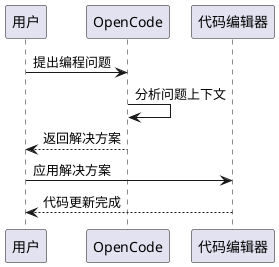

# 学习 OpenCode 教程

## 什么是 OpenCode？

OpenCode 是一个强大的 AI 编程助手，它能够帮助开发者完成代码编写、调试、重构等多种编程任务。

## 核心功能

### 1. 智能代码补全
OpenCode 能够根据上下文自动补全代码，减少手动输入的工作量。

```typescript
const example = "智能补全示例"
```

### 2. 代码解释与重构
无论是阅读他人代码还是优化自己的代码，OpenCode 都能提供清晰的解释和改进建议。

### 3. 多语言支持
支持 Python、JavaScript、TypeScript、Go、Rust、C++ 等多种主流编程语言。

## 使用技巧

1. **清晰描述需求** — 在请求帮助时，尽量详细地描述你的问题
2. **分步骤提问** — 复杂问题拆分成多个小问题效果更好
3. **利用上下文** — 提供足够的代码上下文能获得更准确的帮助

## 实战案例

### 案例一：修复 Bug

当你遇到难以定位的 bug 时，可以将错误信息和相关代码提供给 OpenCode，它会帮助你分析可能的原因。

### 案例二：代码审查

OpenCode 可以帮助你审查代码，发现潜在的问题和优化空间。

### 案例三：学习新框架

通过提问和对话的方式，快速掌握新框架的核心概念和使用方法。

## PlantUML 示例

以下是一个简单的时序图示例：



## 总结

OpenCode 是提升开发效率的利器，熟练使用能让你的编程工作更加高效。
