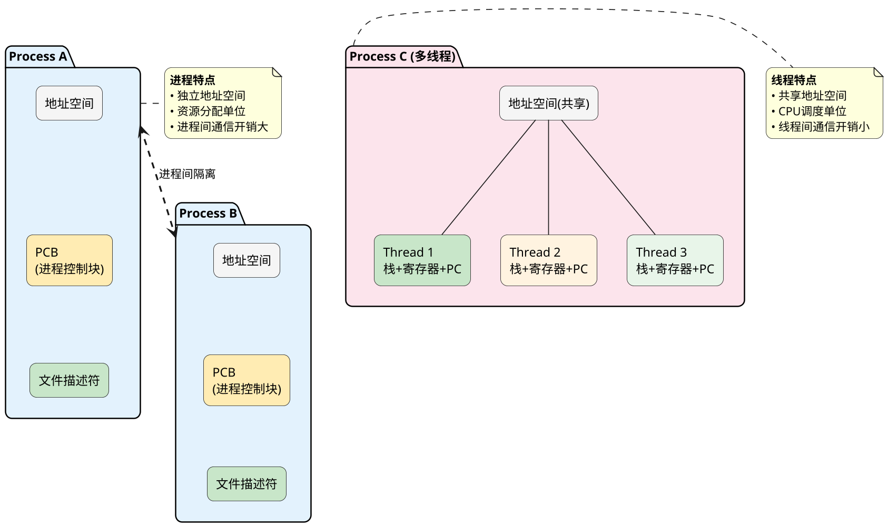
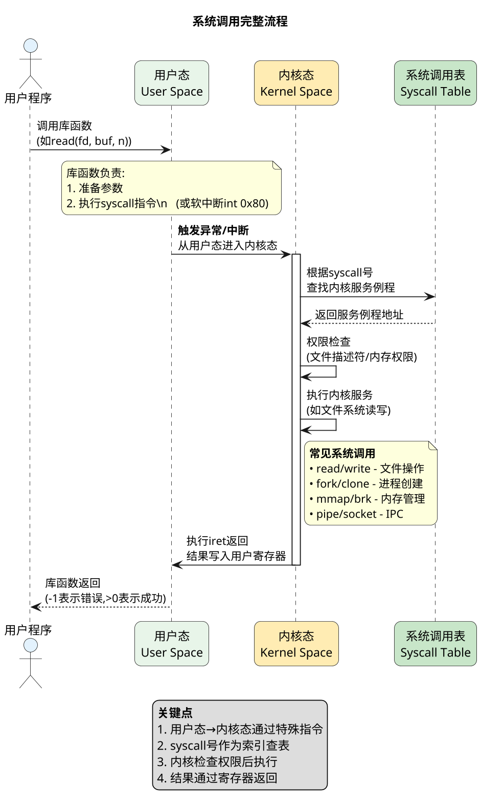
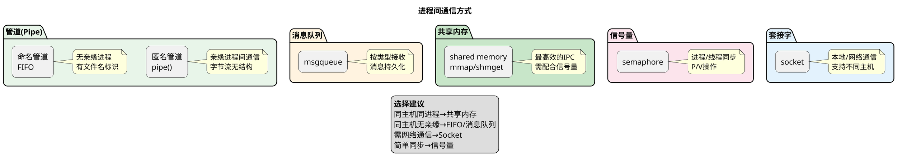
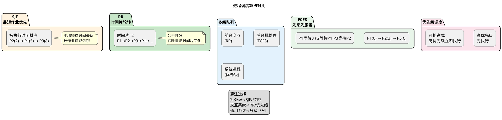

## 操作系统，进程线程，常见题型

### 进程和线程的区别？

**原理:**

进程是资源分配的基本单位，拥有独立的地址空间、文件描述符、内存页表；线程是CPU调度的基本单位，同一进程内的线程共享进程的地址空间和资源，仅有独立的栈、寄存器和程序计数器。进程间隔离，线程间共享。

**English Translation:**




---

### 操作系统中进程与线程的切换过程

**原理:**

进程切换需要保存完整上下文：内核栈、用户栈、地址空间、寄存器、程序计数器等，从用户态陷入内核态，保存当前进程PCB，恢复目标进程上下文，开销数千个CPU周期。线程切换仅保存寄存器、栈和程序计数器，同一进程内线程切换无需切换地址空间，开销仅为进程切换的1/10左右。

**English Translation:**


```plantuml
@startuml
skinparam dpi 160
skinparam shadowing false
skinparam roundcorner 15

title **进程/线程切换流程**

state "用户态" as USR #E8F5E9
state "内核态" as KERN #FFECB3

USR -> KERN : 触发切换\n(时间片到期/系统调用/中断)
activate KERN

KERN -> KERN : 保存当前进程/线程上下文\n(寄存器/PC/栈指针)

note right of KERN
  **进程切换额外操作**
  • 切换内核栈
  • 切换地址空间(page table)
  • 刷新TLB缓存
end note

note right of KERN
  **线程切换额外操作**
  • 仅切换栈和寄存器
  • 无需切换地址空间
end note

KERN -> KERN : 选择目标进程/线程
KERN -> KERN : 恢复目标上下文

KERN -> USR : 切换到目标\n进程/线程执行
deactivate KERN

legend right
  **开销对比**
  进程切换：数千CPU周期
  线程切换：数百CPU周期
endlegend
@enduml
```

---

### 请描述系统调用整个流程

**原理:**

用户程序通过软中断或syscall指令触发从用户态到内核态的切换，CPU从中断向量表获取内核入口，查找syscall号对应的内核服务例程，执行权限检查后调用内核函数，完成后通过iret指令返回用户态，结果写回用户寄存器。

**English Translation:**




---

### 后台进程有什么特点

**原理:**

后台进程又称守护进程，运行于后台，无控制终端，父进程通常为init或systemd。创建方式：fork后父进程退出，子进程调用setsid脱离终端，成为会话leader。特点：长寿命、独立会话、无终端关联、文件描述符继承但可关闭。

**English Translation:**


```plantuml
@startuml
skinparam dpi 160
skinparam shadowing false
skinparam roundcorner 15

title **守护进程创建流程**

|#FFECB3|终端/Shell|
start
:执行后台程序启动命令;
:fork()创建子进程;
|#FFF3E0|子进程|
:父进程exit()退出;
:子进程调用setsid();
note right
  setsid()效果:
  • 成为新会话session leader
  • 脱离控制终端
  • 创建新进程组
end note

|#C8E6C9|守护进程|
:切换工作目录到/\n或指定目录;
:关闭标准输入输出错误\n(STDIN/STDOUT/STDERR);
:忽略SIGHUP信号;\n(可选:重新打开\n/dev/null);
:执行实际服务任务;\n:进入主循环;

stop

note left of终端/Shell
  父进程退出后:
  子进程被init收养
  成为孤儿进程
end note

note right of守护进程
  **守护进程特点**
  • 无控制终端
  • 父进程为init(1)
  • 长寿命运行
  • 输出可重定向到日志
end note
@enduml
```

---

### 进程间通信有哪几种方式

**原理:**

进程间通信方式包括：管道（pipe）用于亲缘进程，字节流无结构；FIFO命名管道可用于无亲缘进程；消息队列（msgqueue）按类型接收；共享内存（shared memory）最高效但需同步；信号量（semaphore）用于同步；套接字（socket）支持不同主机进程通信。

**English Translation:**




---

### 操作系统中进程调度策略有哪几种

**原理:**

常见调度算法：FCFS按到达顺序，先来先服务；SJF最短作业优先，利于平均等待时间但可能导致长作业饥饿；RR时间片轮转，公平但吞吐量依赖时间片大小；优先级调度可抢占或非抢占；多级队列结合多种策略，适用于不同进程类型。

**English Translation:**




---

### 线程同步的方式

**原理:**

线程同步方式：互斥锁（mutex）独占资源，一次只允许一个线程访问；信号量（semaphore）计数，可控制并发数量；条件变量（condition variable）用于线程等待特定条件；屏障（barrier）使线程阻塞直到所有线程到达；自旋锁（spinlock）忙等，适用于短临界区。

**English Translation:**


```plantuml
@startuml
skinparam dpi 160
skinparam shadowing false
skinparam roundcorner 15

title **线程同步方式**

package "互斥锁 Mutex" #E8F5E9 {
  rectangle "lock()\nunlock()" as M1
  note right of M1
    独占访问
    一次只有一个线程
  end note
}

package "信号量 Semaphore" #FFF3E0 {
  rectangle "P()
  note right of S1
    计数信号量
    控制并发数量N
  end note
}

package "条件变量 Condition Variable" #C8E6C9 {
  rectangle "wait() / signal() / broadcast()" as CV1
  note right of CV1
    等待特定条件
    需配合mutex使用
  end note
}

package "屏障 Barrier" #FCE4EC {
  rectangle "pthread_barrier_wait()" as B1
  note right of B1
    所有线程到达\n才继续执行
  end note
}

package "自旋锁 Spinlock" #E3F2FD {
  rectangle "while(flag) ;" as SP1
  note right of SP1
    忙等不睡眠
    适用于短临界区
  end note
}

legend center
  **选择原则**
  独占资源→Mutex
  控制并发数→Semaphore
  等待条件→Condition Variable
  汇合点→Barrier
  极短临界区→Spinlock
endlegend
@enduml
```

---

