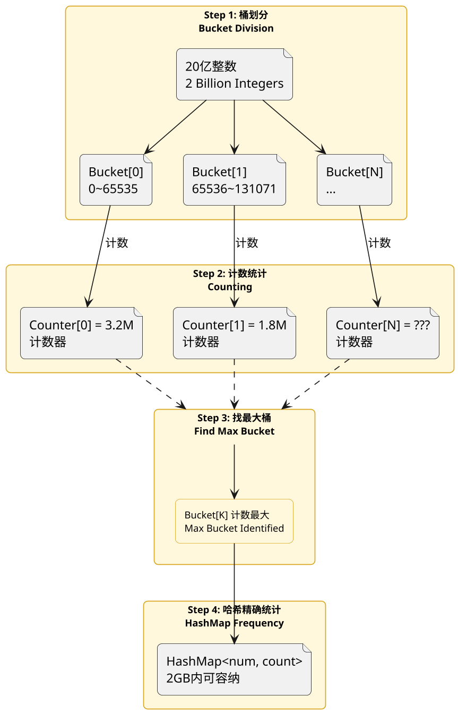
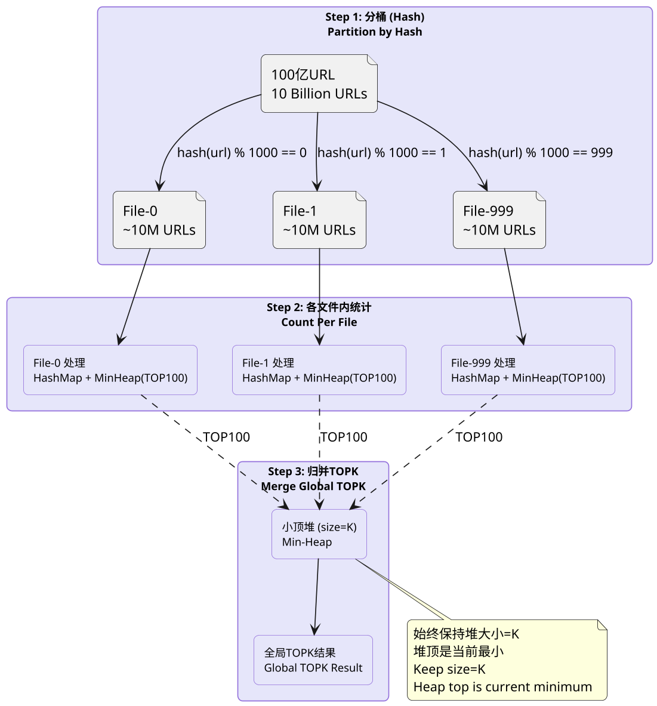
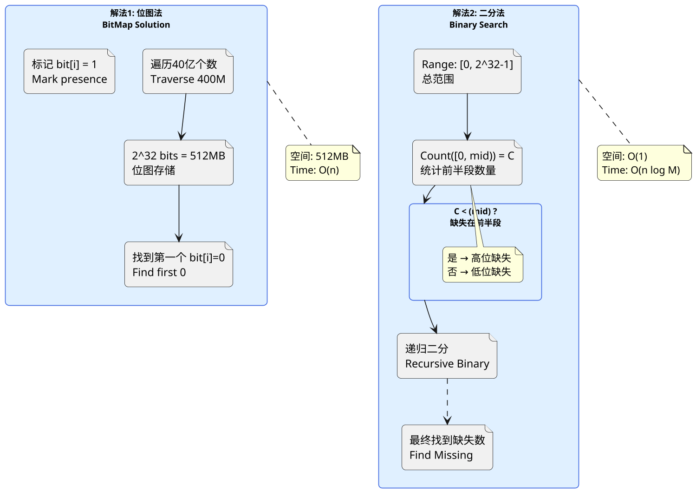
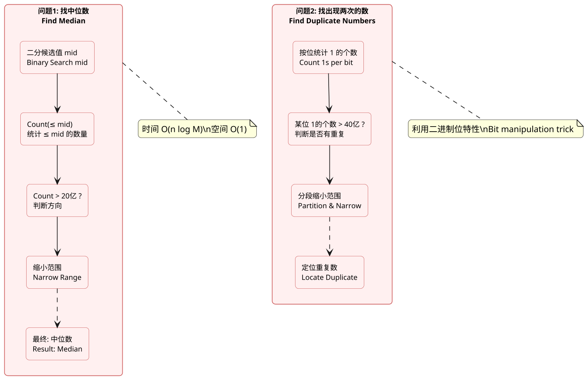
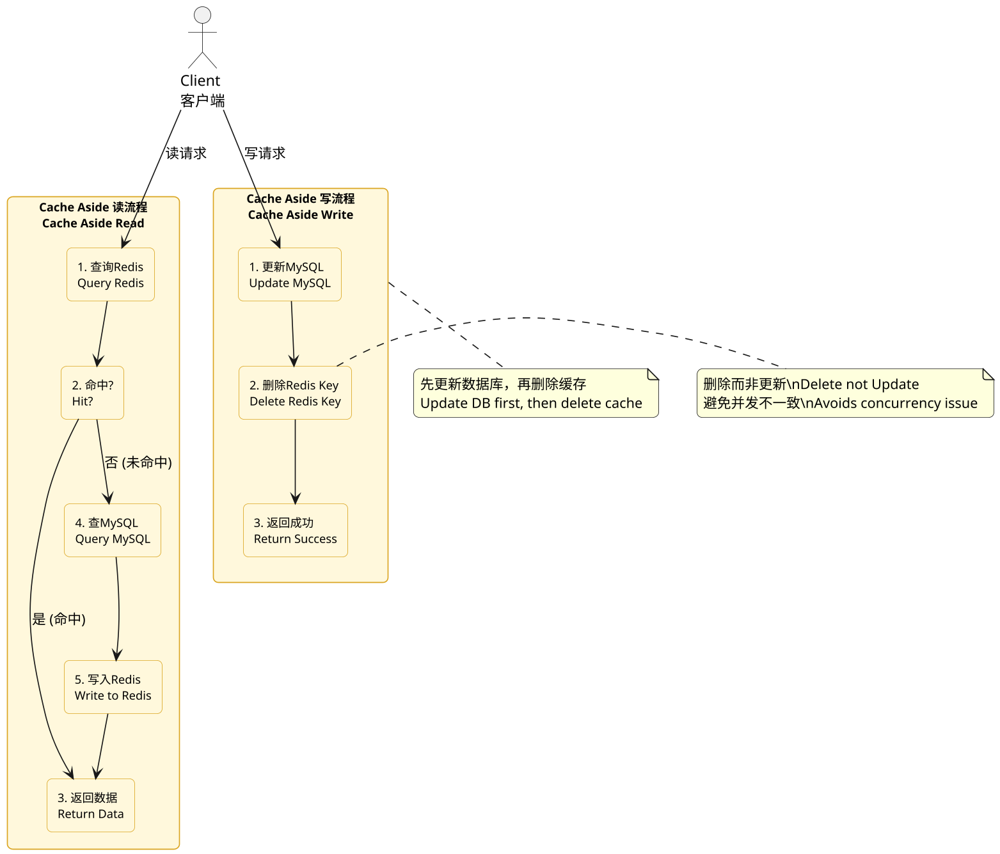
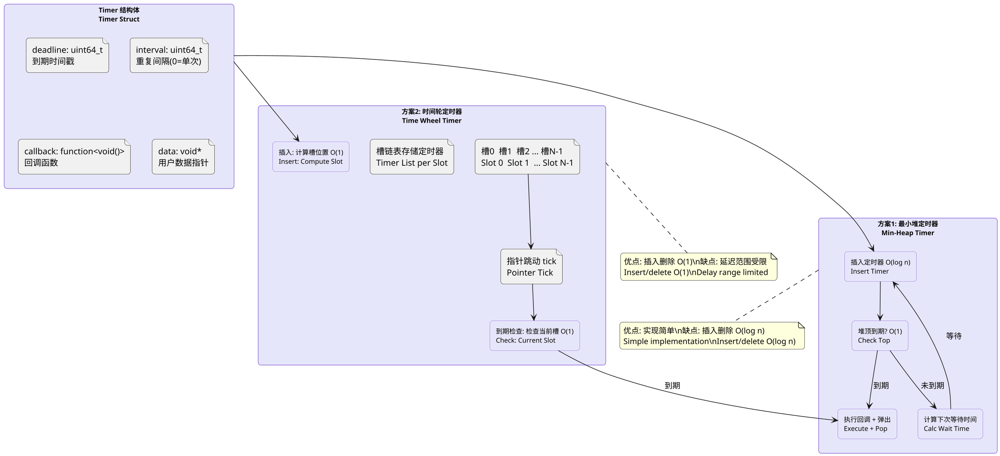

## 设计方案，常见题型

### 2G内存在20亿个整数中找出现次数最多的数

**原理:**

这是一道经典的大数据处理问题，考察的是如何利用有限内存处理海量数据。核心思路是使用哈希表（Hash Table）进行词频统计：将每个整数作为 key 插入哈希表，value 为该整数出现的次数。但 20 亿个整数（假设每个整数 4 字节）直接存入内存需要约 8GB 空间，远超 2GB 限制。解决方案是：先对数据进行范围划分（桶划分），将 20 亿个整数分成多个小文件（桶），使得每个小文件中的数据能够被 2GB 内存处理；或者使用外排序（External Sort）结合归并。

更优的解法是使用 BitMap（位图）结合分段策略：首先确定整数的大致范围（假设为 32 位无符号整数，范围 0~2^32-1），将其划分为多个桶（如 2^16=65536 个桶，每个桶代表 2^16 个连续整数值）。第一次遍历：使用 65536 个计数器（每个计数器 8 字节，约 512KB），确定每个数落在哪个桶中以及该桶的计数。第二次遍历：对于计数最大的桶（如桶内约 3 万多个数），构建一个 HashMap 精确统计频率，返回出现次数最多的数。

另一种经典思路：分而治之 + 哈希。将 20 亿个数划分到 1000 个小文件中（每个文件约 200 万个数），对每个文件用哈希表统计词频，得到每个文件的 TOP1，然后对这 1000 个数进行归并，得到全局 TOP1。时间复杂度 O(n)，空间复杂度 O(bucket_count)。


**PlantUML Diagram:**



---

### 100亿个URL中重复词汇的TOPK问题

**原理:**

TOPK 问题是面试中的高频考点，核心需求是在海量数据中找到出现频率最高的 K 个元素（如 URL、词汇、IP等）。对于 100 亿个 URL 的场景，直接进行全局词频统计需要消耗巨大的内存空间。标准解法是"分而治之 + 哈希 + 小顶堆"的三步走策略。

第一步（分而治之）：将 100 亿个 URL 通过哈希函数（如 `hash(url) % 1000`）分配到 1000 个小文件中。每个小文件平均包含约 1000 万个 URL。此时所有相同的 URL 必定被分到同一个小文件（哈希的性质保证了相同元素必定落在相同桶）。

第二步（词频统计）：对每个小文件（1000万条）使用 HashMap 统计词频。假设平均每个 URL 长度为 100 字节，1000万条 × 100字节 = 1GB，1000 个文件 × 1GB = 1TB，但每个文件本身只有 1GB，可以逐文件处理。每处理完一个小文件，就得到该文件中词频最高的 100 个 URL（用小顶堆/小根堆实现）。

第三步（归并取 TOPK）：将 1000 个小文件各自得到的 TOP100 合并，因为最终的 TOPK 必定在所有文件的局部 TOPK 中。合并时使用一个大小为 K 的小顶堆，遍历所有局部 TOPK 元素，最终得到全局 TOPK。

时间复杂度 O(n)，空间复杂度 O(文件数 × K)。K 的选择根据内存限制：假设 K=100，小顶堆维护 100 个元素，只需约 100 × (URL长度+计数) ≈ 10KB。


**PlantUML Diagram:**



---

### 40亿个非负整数中找到未出现的数

**原理:**

这是一道经典的"缺失数"问题，考察的是位图（BitMap）和二分法的应用。关键信息：40 亿个非负整数，内存限制（假设为 1GB 或更小）。32 位无符号整数的范围是 0 ~ 2^32-1（约 43 亿），而题目中只给出 40 亿个数，意味着有约 3 亿个数字是缺失的。

解法一：位图法（BitMap）。使用一个 2^32 bit 的位图（约 512MB）来标记 0~2^32-1 范围内每个数是否出现。遍历 40 亿个数，将对应的 bit 位置为 1。遍历完成后，从头开始找到第一个 bit 为 0 的位置，即为缺失的数。位图法需要 2^32 bits = 4GB/8 = 512MB。如果内存更小（如 10MB），可以分段处理：将 2^32 范围划分为多个桶，每次只处理一个桶。

解法二：二分法（前提：数据可以全部加载到内存或多次读取）。如果 40 亿个数可以直接读取到数组中，可以利用二分查找的思想：统计出现在范围 [0, 2^31-1] 内的数的个数，如果 count < 2^31，则缺失数在高位桶；否则在低位桶。递归二分，直到找到缺失的位。这种方法时间复杂度 O(n log M)，空间复杂度 O(1)，其中 M 是范围大小。二分法不需要额外的位图存储，但需要能够多次读取原始数据。


**PlantUML Diagram:**



---

### 40亿个非负整数中算中位数和找出现两次的数

**原理:**

这道题有两个子问题：中位数计算和找出出现两次的数。两个问题都可以用类似的分治思想来解决。

第一部分：找中位数。40 亿个数找中位数，即找第 20 亿大的数（或第 20 亿和第 20 亿+1 大的两个数的平均值，如果是偶数个数的话）。由于数据量巨大，无法全部加载到内存中使用排序。解法是使用二分 + 计数的方法：对于 32 位非负整数，范围是 0~2^32-1。对中位数 m，它满足：范围内有至少 20 亿个数 ≤ m，且有至少 20 亿个数 ≥ m。具体做法：对每个候选值 mid，统计小于等于 mid 的数的个数 count。如果 count > 20亿，说明中位数 ≤ mid，否则中位数 > mid。通过二分不断缩小范围，直到找到精确的中位数。时间复杂度 O(n log M)，其中 M 是范围大小（2^32）。

第二部分：找出现两次的数（也称"重复数"）。思路是使用位图或者基于二进制的位操作。如果使用位图，可以用 2^32 bits 的位图来标记每个数是否出现。但更巧妙的方法是利用二进制位本身的特性：对于 0~2^32-1 范围内的每个数，其二进制表示的每一位（0~31 位），如果某一位上 1 的总个数超过 32 亿（因为每个数出现一次），则说明有重复（因为相同的数该位必定相同，多出来的 1 必定来自重复的数）。更进一步，可以用类似的方法分段缩小范围，逐步定位到具体的重复数。


**PlantUML Diagram:**



---

### 岛问题

**原理:**

岛问题（Island Problem）是二维矩阵搜索的经典题目。给定一个二维数组（如 M×N 的网格），每个格子的值为 0（代表水）或 1（代表陆地），找到所有陆地的连通区域数量，即"岛屿"的数量。岛屿的定义为：陆地格子（1）通过上下左右四个方向相连形成的一片区域。

最直接的解法是深度优先搜索（DFS）或广度优先搜索（BFS）：遍历矩阵中的每个格子，如果遇到未访问的陆地（值为1），就以该格子为起点进行 DFS/BFS，将所有与之相连的陆地格子标记为已访问（通常改为0或使用 visited 数组），每完成一次 DFS/BFS 岛屿计数加1。这种方法的时间复杂度 O(M×N)，空间复杂度 O(M×N)（用于 visited 数组）或 O(M+N)（递归栈深度，最坏情况为 O(M×N)）。

进阶解法：并查集（Union-Find）方法。将每个格子视为一个节点，相邻的陆地格子进行 union 操作，最后数有多少个独立的集合（根节点数量）即为岛屿数量。并查集方法在动态场景（矩阵不断变化）中更有优势，支持 O(α(n)) 的近乎常数时间的合并和查询操作。

高级变形：分治法解决岛问题（参考 LeetCode "Number of Islands II"）。将矩阵按行或列进行分割，每个子区域独立计算岛屿数量，然后处理边界相邻情况（需要跨边界合并的格子对）。这种分治方法在分布式计算场景中尤为重要，可以并行处理各个子区域。


**PlantUML Diagram:**

```plantuml
@startuml
skinparam dpi 160
skinparam roundcorner 10
hide stereotype

skinparam rectangle {
    backgroundColor #F0FFF0
    borderColor #228B22
    fontSize 11
}

rectangle "输入矩阵
    file "0 1 1 0 1\n1 0 1 1 0\n0 1 0 0 1\n1 1 0 0 0\n0 0 1 1 1" as GridData
}

rectangle "DFS/BFS 遍历\nDFS/BFS Traversal" as Traversal {
    rectangle "遍历每个格子\nVisit Each Cell" as Visit
    rectangle "发现陆地 (1)\nFound Land (1)" as FoundLand
    rectangle "DFS标记连通区域\nDFS Mark Connected" as DFSMark
    rectangle "岛屿计数+1\nIsland Count +1" as IslandCount
}

rectangle "结果\nResult" as Result {
    file "岛屿数量: 3\nIsland Count: 3" as Island3
}

Matrix --> Visit
Visit --> FoundLand
FoundLand --> DFSMark : 是未访问陆地
DFSMark --> IslandCount
IslandCount --> Result

note right of GridData
  黑色=陆地(1)\n  白色=水(0)
  Black=Land(1)
  White=Water(0)
end note

note bottom of DFSMark
  递归上下左右四个方向
  Recurse: up/down/left/right
end note

@enduml
```

---

### Redis和MySQL缓存一致性

**原理:**

Redis 作为 MySQL 的缓存层时，最核心的问题是如何保证 Redis 缓存数据和 MySQL 原始数据的一致性。常见的方案有三种：Cache Aside、Read Through 和 Write Through，各有优缺点。

Cache Aside（旁路缓存）是最常用的方案。读操作流程：先查缓存（Redis），缓存命中则直接返回；缓存未命中则查数据库（MySQL），并将数据写入缓存。写操作流程：先更新数据库（MySQL），再删除缓存（Delete Key）。注意这里是"删除"而非"更新"，因为删除操作比更新更轻量，且避免了并发场景下缓存更新值与数据库值不一致的问题（双写问题）。

Read Through（读穿透）：应用只与缓存层交互，缓存层负责查询和填充数据（类似代理）。当缓存未命中时，由缓存服务从数据库加载数据并写入缓存。Write Through（写穿透）：写入时同时更新缓存和数据库，两者同步完成后才返回写入成功。

在分布式和高并发场景下，Cache Aside 还可能遇到的问题包括：缓存穿透（大量请求查询不存在的数据）、缓存击穿（热点 key 过期瞬间大量请求击穿到数据库）、缓存雪崩（大量 key 同时过期）。对应的解决方案分别是：布隆过滤器（Bloom Filter）防止缓存穿透、互斥锁或永不过期策略防止缓存击穿、随机 TTL 或热点数据永不过期防止雪崩。


In distributed/high-concurrency scenarios, Cache Aside faces additional issues: cache penetration (大量请求查询不存在的数据 → use Bloom Filter), cache breakdown (热点 key 过期瞬间大量请求 → use mutex or never-expire strategy), cache avalanche (大量 key 同时过期 → use random TTL or eternal TTL for hot data).

**PlantUML Diagram:**



---

### 现场手撕定时器

**原理:**

定时器（Timer）是后台开发中的核心组件，用于在指定时间或周期性地执行任务。面试中手撕定时器通常考察对时间轮（Time Wheel）、最小堆（Min-Heap）或时间链等数据结构的理解，以及对高性能 I/O 模型（epoll/select）的掌握。

方案一：最小堆实现。定时器节点包含 deadline（到期时间）和回调函数，将所有定时器节点存入最小堆，每次取堆顶检查是否到期，若到期则执行回调并弹出，若未到期则计算等待时间。这种实现插入和删除的时间复杂度为 O(log n)，查询到期定时器为 O(1)。

方案二：时间轮实现（Linux 内核级定时器使用）。时间轮是一个环形数组，每个槽（slot）维护一个定时器链表。指针（tick）周期性推进，每推进一个槽就检查该槽的链表是否有到期定时器。插入定时器时，根据延迟时间计算应落在哪个槽。普通时间轮插入/删除为 O(1)，但多级时间轮（Linux 内核使用）可以处理更大的延迟范围。

方案三：epoll + 最小堆结合。epoll 监听一个管道/eventfd 的读端，定时器到期时向管道写入数据，epoll 返回可读事件后处理定时器。这种方式适合与网络 I/O 框架结合，是高性能服务器（如 Nginx）的常用模式。

手撕定时器的核心要点：结构体设计（deadline + callback + 额外数据）、到期检查逻辑、时间复杂度分析和线程安全性。


**PlantUML Diagram:**


